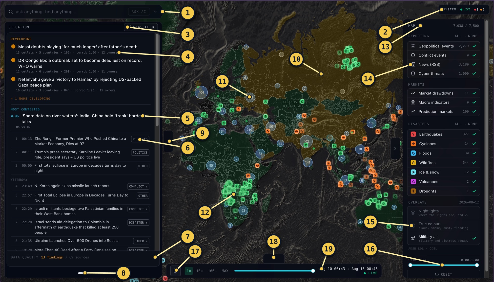
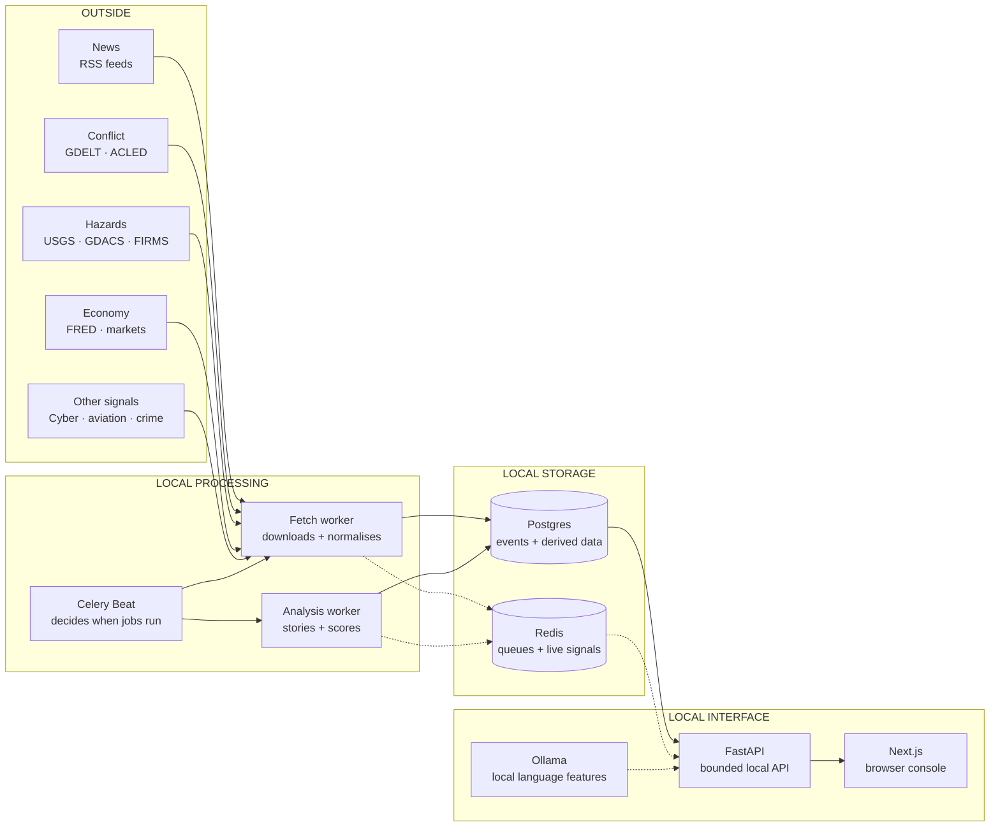
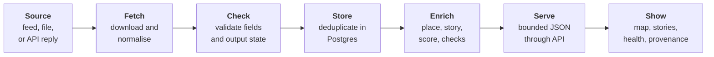
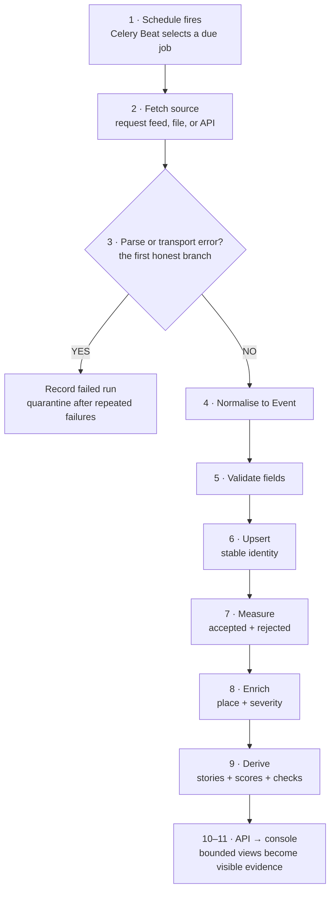
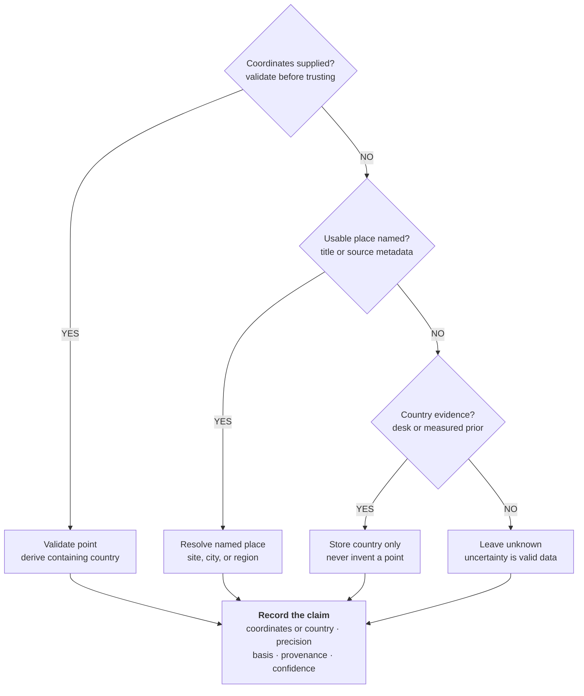
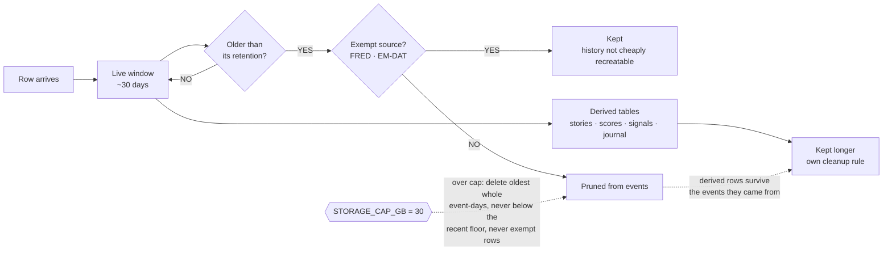
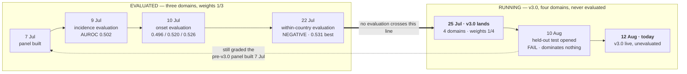

# OSINT World Monitor — technical handbook

**The companion to the [project README](README.md).** That file says what this
system is, what it claims, what it refuses to claim, how to start it, and under
what licence. This file is everything underneath: how to operate it, how every
number is computed, what was tested and what failed, where the data is biased,
and the commands that rebuild all of it.

Written so a technical reader can reproduce the work from this file alone.
References to code are **absolute links** back to the repository, so the
document survives being read as a file, a printout, or a PDF.

**Every measured figure was taken on 12 August 2026** unless a different date is
stated beside it. Numbers are marked as **measured** — with the date and the
command that produced them — or stated as assumptions.

| Looking for | Go to |
| --- | --- |
| Why this exists and what it refuses to claim | [README](README.md#0-what-this-system-is-for-and-what-it-is-not) |
| Licence, security, contributing | [README](README.md#25-licence-security-and-provider-terms) |
| Where any file lives | [README](README.md#26-repository-map) |
| Run it | [§1](#1-start-here-download-install-run-and-stop) |
| Understand the screen | [§2](#2-see-and-understand-the-console) |
| How a number is computed | [§14](#14-methods--every-number-the-system-publishes) |
| What was tested and what failed | [§15](#15-evaluation--what-was-claimed-what-was-tested-what-failed) |
| Judge the data before trusting it | [§16](#16-bias-provenance-and-one-country-traced-end-to-end) |
| Rebuild every number yourself | [§17](#17-reproduce-the-analysis) |

## Contents

- [1. Start here: download, install, run, and stop](#1-start-here-download-install-run-and-stop)
- [2. See and understand the console](#2-see-and-understand-the-console)
- [3. What you need before starting](#3-what-you-need-before-starting)
- [4. Get the code](#4-get-the-code)
- [5. Configure it safely](#5-configure-it-safely)
- [6. Start and verify the system](#6-start-and-verify-the-system)
- [7. Use the console](#7-use-the-console)
- [8. Stop, restart, update, and clean](#8-stop-restart-update-and-clean)
- [9. Data sources](#9-data-sources)
- [10. The end-to-end data pipeline](#10-the-end-to-end-data-pipeline)
- [11. Data storage and retention](#11-data-storage-and-retention)
- [12. Backend guide](#12-backend-guide)
- [13. Frontend guide](#13-frontend-guide)
- [14. Methods — every number the system publishes](#14-methods--every-number-the-system-publishes)
- [15. Evaluation — what was claimed, what was tested, what failed](#15-evaluation--what-was-claimed-what-was-tested-what-failed)
- [16. Bias, provenance, and one country traced end to end](#16-bias-provenance-and-one-country-traced-end-to-end)
- [17. Reproduce the analysis](#17-reproduce-the-analysis)
- [18. Data quality and honest limits](#18-data-quality-and-honest-limits)
- [19. Troubleshooting](#19-troubleshooting)
- [20. How the system reached its current shape](#20-how-the-system-reached-its-current-shape)
- [21. Quick reference](#21-quick-reference)
- [22. Glossary](#22-glossary)
- [23. Code walkthroughs](#23-code-walkthroughs)
- [24. References](#24-references)

---

# 1. Start here: download, install, run, and stop

## 1.1 What will be running

OSINT World Monitor is a self-hosted situational-awareness console. It collects open data, converts unlike feeds into one event shape, keeps a bounded local history, builds stories and indicators, and shows the result on an interactive world map.

The complete local setup has five visible parts:

| Part | Purpose | Must be installed before setup? |
| --- | --- | --- |
| Git | Downloads and updates the code. | Yes |
| Docker with Compose | Runs the database, queue, API, scheduler, and workers. | Yes |
| Node.js and pnpm | Install and run the browser console. | Yes |
| Ollama | Runs the local language model used by the Situation panel and question tools. | Yes for full mode; core mode still starts without it |
| Modern browser | Opens the console. | Yes |

Python is already inside the Docker image. A separate host Python installation is not needed for normal startup.

## 1.2 Download these first

Install each item from its official page, then restart the terminal so newly installed commands are available.

1. [Git](https://git-scm.com/downloads)
2. [Docker Desktop](https://www.docker.com/products/docker-desktop/) on macOS or Windows, or Docker Engine with Compose on Linux
3. [Node.js LTS](https://nodejs.org/)
4. [pnpm](https://pnpm.io/installation)
5. [Ollama](https://ollama.com/download)
6. A current Chrome, Firefox, Safari, or Edge browser

Docker Desktop must be open and show that its engine is ready before `make up`. Ollama should be installed for the complete experience. If Ollama cannot start, ingestion, storage, the API, the map, stories, and non-model analysis continue; language-model summaries and questions remain dormant.

## 1.3 Check the installations

Run these one at a time. Each command must print a version or a Docker status rather than “command not found”.

```bash
git --version
```

```bash
docker --version && docker compose version
```

```bash
node --version && pnpm --version
```

```bash
ollama --version
```

If `pnpm` is missing but Node is installed, run this one line, then repeat the pnpm version check:

```bash
corepack enable && corepack prepare pnpm@latest --activate
```

## 1.4 Get and prepare the code with one command

On the repository page, choose **Code**, copy the HTTPS address, replace `<repository-url>` below with that address, and run the whole line once:

```bash
git clone <repository-url> OSINT && cd OSINT && make env
```

Every segment is joined with `&&`, so the next segment runs only if the previous one succeeds:

| Segment | What it does |
| --- | --- |
| `git clone <repository-url> OSINT` | Downloads a fresh copy into a folder named `OSINT`. |
| `cd OSINT` | Enters the repository root. Every later command runs here. |
| `make env` | Creates your private settings file, `.env`, and fills in what nobody should have to type. If one already exists it is left alone, apart from adding any settings it is missing. |

The browser packages are not on that line. `make up` installs them the first time it runs, from the lockfile, and says so while it happens.

If the code already exists, do not clone it again. Open a terminal in the existing repository root and continue with §1.5.

## 1.5 Check the settings file

There is nothing you have to set before starting. `make env` writes `.env` and fills in the settings nobody should have to think of: the database password, the API token, the copy of that token the console sends, and the addresses this machine answers to. Run it as often as you like — it only ever fills a setting that is empty, and anything you have written stays exactly as you wrote it.

```bash
make env-check
```

That says what is missing or empty without printing a single value, so it is safe to run while somebody is watching your screen. Do not share, print, screenshot, or commit `.env`.

If you want your own database password rather than the generated one, put it after the `=` on the `POSTGRES_PASSWORD` line before the first `make up`, and nothing will overwrite it. Do not put spaces around the `=`.

Optional source keys can stay empty on the first run. Their sources will show an honest `misconfigured` or empty state instead of preventing the core system from starting. Section 5 explains every setting.

## 1.5.1 Aircraft the console follows

Nothing to set up. The live air layer already pulls two kinds of aircraft out of ordinary traffic and draws them in amber: **tankers** and **surveillance aircraft**. Both are worked out from the aircraft type the feed already broadcasts, so they work anywhere in the world, on the first run, with no file and no key.

Tick **Watchlist** in the filter panel to see them. The row says *"tankers and surveillance — the default list"* so you always know the choice was the console's and not yours.

To follow something else instead, put a file at `data/watchlist.json`. Each entry needs a `"label"` — a few words saying what the aircraft is for, which is what the map shows — and one thing to match on:

| Write this | And it follows |
| --- | --- |
| `"role": "fighter"` | everything doing that job — also `tanker`, `isr`, `transport`, `rotorcraft`, `trainer` |
| `"callsign_prefix": "RCH"` | every flight whose callsign starts that way |
| `"type": "H47"` | every aircraft of that model |
| `"hex": "ae0451"` | one airframe, by the address its transponder sends |
| `"registration": "N000EX"` | one airframe, by its tail number |

`app/presence/watchlist.example.json` shows the shape. The file is read again on every refresh, so edits appear without restarting anything, and it is git-ignored — it never leaves your machine.

## 1.5.2 The two commands that look after that file

`.env` is the only file you edit by hand, and two commands keep it in order. Both are safe to run as many times as you like.

```bash
make env          # make the file, or add the settings it is missing
make env-check    # say what is missing, empty, or spelled wrong
```

Forgotten what a command is called? `make help` lists every one in the project with a line saying what it does.

**`make env`** does one of two things:

- **No `.env` yet** — it writes one from the template, with every setting and the notes that explain them.
- **You already have one** — it adds only the settings your file does not have, and **never changes a value you have already filled in**. Your password stays your password.

**`make env-check`** reads your file and tells you four things:

| It says | What it means | What to do |
| --- | --- | --- |
| *missing from .env* | The template has a setting your file does not | Run `make env` |
| *the container stack needs* | Something required is still blank | Open `.env` and fill it in |
| *still holds a placeholder* | A value like `changeme` was never replaced | Open `.env` and put a real value in |
| *not in env.example* | A setting name your file has and the template does not | Usually a spelling mistake — fix the name |
| *a path this machine can see but the containers cannot* | You gave a setting a path like `/Users/you/thing.json`. The part of the system that reads it runs inside a container, where that path does not exist | Put the file under `data/` and write the path as `/data/thing.json`, or leave the setting empty |

That last one is the one worth understanding. Every setting has a working default, so a name spelled wrong does not cause an error — the system starts perfectly happily and quietly ignores the line you wrote. `PRESENCE_WATCHLST_PATH` will never do anything and will never complain. `make env-check` is how you see it.

Neither command ever prints a value from your file, only the names of settings. It is safe to run one while somebody is looking at your screen, or while you are recording it.

**Run `make env` again after every `git pull`.** New settings get added to the template as the project grows. That is how they reach your file. Skip it, and the feature a new setting switches on simply stays off, with nothing to tell you why.

`make up` runs the check for you before it starts anything. If something is wrong it says so and then starts anyway — a warning about a setting you do not use is not a reason to refuse to run.

## 1.6 Start the complete system

Make sure the terminal is in the repository root and Docker is ready. Then run this single command:

```bash
make up
```

`make up` starts or reuses Docker, Postgres, Redis, schema migrations, FastAPI, the fetch worker, the serial analytics worker, Celery Beat, Ollama when installed, and the Next.js console. It then waits for the API and browser page to answer. The first start can take several minutes because images, packages, and the local model may need downloading.

`make up` binds to `127.0.0.1` only. Nothing else on the network can reach the
console or the API — that is the default, and it is not something to switch off
by accident. To let another device on the same network open the console, use
[`make share`](#57-make-share--opening-the-console-to-the-local-network)
instead, and read §5.11 first: share mode adds **no password**.

Success ends with addresses similar to:

```text
App is up. Dashboard: http://localhost:3000 API health: http://localhost:8000/health Logs: make logs
```

## 1.7 Verify before using the map

Check the API in a second terminal with one line:

```bash
curl -fsS http://localhost:8000/health
```

The expected answer is `{"status":"ok"}`. Then open [http://localhost:3000](http://localhost:3000) in the browser. If the startup output chose port 3001, open that printed address instead.

A healthy first run has all of these signs:

- the map and its base tiles appear;
- the system monitor's connection dot is green;
- the system monitor button shows explicit offline, degraded, and stale counts;
- `docker compose ps` lists Postgres, Redis, API, worker, analytics worker, and Beat;
- `http://localhost:8000/console/health` returns source and audit health rather than a connection error.

An individual source can be offline while the system itself is healthy. The monitor distinguishes those two conditions: the connection dot is about this browser, the band counts are about upstreams.

## 1.8 Stop safely

Return to a terminal in the repository root and run one line:

```bash
make down
```

`make down` stops the frontend, backend containers, Postgres, Redis, and any Ollama process started by `make up`. It does not delete persistent data. The next `make up` resumes from the same local database.

Use `make off` only when you also want Docker Desktop to quit on macOS. Never delete the `data/` directory as a substitute for stopping the system.

If the stack was started with `make share`, running `make up` again closes it
back to this machine only. The setting lives in the environment of that one run,
never in a file, so a restart is always closed unless share is asked for again.

## 1.9 What the console helps you answer

1. **What is happening?** Recent events, hazards, news, conflict-coded activity, markets, cyber indicators, and crime data.
2. **Where is it happening?** Country, region, city, exact point, or an honestly unknown location.
3. **Is more than one source describing it?** Articles are grouped into stories and independent owners are counted.
4. **Does physical evidence agree?** Selected story claims can be checked against sensor observations.
5. **Is the system itself healthy?** Fetch state, silence, quarantine, data composition, audit findings, and job activity are visible.

What it can and cannot support as evidence is set out in [§15](#15-evaluation--what-was-claimed-what-was-tested-what-failed) (what has been tested and failed) and [§16](#16-bias-provenance-and-one-country-traced-end-to-end) (where the data comes from and what it structurally cannot see).

## 1.10 What it does not promise

- It does not calculate truth. It shows provenance, agreement, disagreement, and sensor corroboration.
- It does not guarantee complete world coverage. Open feeds are uneven by country, language, publisher, and access policy.
- It is not a safety-critical alerting service. Upstream feeds fail, arrive late, change format, or withdraw access.
- It does not make a composite score trustworthy merely because a number exists. The formula is in [§14.4](#144-the-composite-stress-index--and-why-the-live-one-reads-05), the measured failures in [§15](#15-evaluation--what-was-claimed-what-was-tested-what-failed), and the operational limitation in [§18.4](#184-composite-score-limitation).
- It does not keep every raw observation forever. High-volume rows are pruned by design; smaller derived records are retained longer.

If you only need to operate the software, use §§1–8 and §19. For implementation detail, continue through §§9–16. Stable numbered headings make exact cross-references possible.

---

# 2. See and understand the console

## 2.1 Real interface map



The callouts are grouped by region of the screen: **1–2** the two controls that
span the top, **3–8** the card deck on the left, **9–12** the map and its
handles, **13–16** the right rail, **17–19** the bottom strip. The final column points at the code
that produces each area, listed in §2.7.

There is no status bar. Two detached controls in the top-right corner carry
what one used to: whether the *view* is current, and whether the *sources*
are. Everything else about system health opens from the second of them.

| Number | Area | How to read it | Code |
| ---: | --- | --- | --- |
| 1 | Omnibox — search and ask, one box | Typing searches what is stored; `ASK AI` sends the same words to the local model instead. One control because "find the row" and "ask about the rows" are the same intent arriving in the same words. Answers are built from retrieved stored rows, never the open web, and an offline model says so rather than answering anyway. | §2.7 (1) |
| 2 | System monitor pill | `LIVE` is the time window: the map ends at the present moment. Beside it, a dot and a count per band needing a look — red offline, amber degraded, orange stale. Bands with nothing in them are absent; all-online collapses to a check. The counts are of *source families*, not feeds, and they describe fetching, not truth. Click to open the monitor. | §2.7 (2) |
| — | Inside the monitor | Three tabs. **Sources**: every family grouped under its band, worst first, each showing *feeds that produced usable rows / feeds that ran* and how long since the last one; a row opens in place to show what its last ingest run saw. **Jobs**: the same grouping over the scheduled roster, carrying each failure's reason. **Brain**: whether the local model is working or resting, which model, and its last read. The title row holds the browser's own connection dot — green there with red counts below is a healthy browser looking at a stalled stack — and the footer graphs rows written per day. | §2.7 (2) |
| 3 | News-feed control | Opens the reading page in a new tab, so the console keeps running behind it. Named rather than drawn as an arrow because the deck's other expand control merely grows a card in place, and the two were indistinguishable while both were the same glyph. | §2.7 (3) |
| 4 | Developing stories | Clusters ordered by movement, each with `outlets · countries · age · corroboration · owners`. Read **owners** before outlets: 13 outlets and 12 owners is broad independent coverage; 13 outlets and 2 owners is one wire item repeated. | §2.7 (4) |
| 5 | Most contested | The story whose telling differs most across outlet countries, with its divergence score and the two blocs being compared (`HK vs IN`). A high score is a claim about *coverage*, never about which side is right. | §2.7 (5) |
| 6 | Headline ticker and routing chips | Every stored headline in the window, newest first, with day markers. The chip on the right (`POLITICS`, `CONFLICT ↑`, `DISASTER ↑`) is the row's own category and escalation mark, so a re-graded story is visible without opening it. | §2.7 (6) |
| 7 | Data quality strip | `13 findings / 69 sources` — open audit findings and the number of declared sources measured, with the change since the previous audit when there is one. Open this before quoting any total on screen. | §2.7 (7) |
| 8 | Deck pager | The deck holds more pages than fit; the dots say how many and which is showing. Contextual pages (Selection, Place, Scoreboard) appear here without renumbering the stable pair. | §2.7 (8) |
| 9 | Panel handles | The chevrons collapse the card deck and the filter rail so the map can be read whole. `A` and `D` do the same from the keyboard (§7.13). Collapsing hides a panel; it never changes what is loaded or filtered. | §2.7 (9) |
| 10 | Country shading | A stored score painted over the country polygon, not a measurement of the ground. §18.4 explains why the live composite currently collapses toward neutral, so treat shading as context and click through for evidence. | §2.7 (10) |
| 11 | Cluster bubble | A count of nearby markers at the current zoom, not a count of real-world events. Clicking expands it into its unique member stories **without moving the camera**; zooming in splits it. | §2.7 (11) |
| 12 | Hazard marker and footprint | Shape and colour carry the hazard kind; the shaded area is real upstream geometry where the provider published it. Footprints fade in between zoom 4 and 6, and a selected footprint stays fully visible at any zoom. | §2.7 (12) |
| — | Live aircraft | Presence, not evidence: military and distress squawks, polled every 30 s, drawn and discarded. Never stored, counted or clustered, and gone the moment the scrubber leaves "now" — which is why they carry no callout number here; whether any are on screen depends on what is flying. | §2.7 (13) |
| 13 | Map row budget | `7,038 / 7,500` is how many rows the browser is holding against its configured ceiling — a memory bound, not a world total. At the ceiling the map shows a bounded slice; headline totals come from the server instead. | §2.7 (14) |
| 14 | Source families and counts | Each row toggles one family and shows how many rows of it are in the current window. `ALL · NONE` set the whole group. Counts move with the time window, so a change here is a change of view, not of data. | §2.7 (15) |
| 15 | Overlays | Nightlights, true colour, and military air, with the imagery date on the right. Overlay tiles go publisher → browser: nothing is fetched by the API or stored, and the imagery follows the scrubber rather than pinning to today. | §2.7 (16) |
| 16 | Severity range and reset | Filters on a **source-relative** 0–1 value (§18.9). A `0.8` earthquake and a `0.8` headline are not the same quantity, so narrow one family at a time. `RESET` returns every filter to defaults. | §2.7 (17) |
| 17 | Playback | Play, pause, and 1×/10×/100×/MAX speed. Playback moves the visible window across stored rows; it never re-fetches history and never writes anything. | §2.7 (18) |
| 18 | Scrubber collapse handle | Hides the bottom strip without changing the window it last set. `S` does the same from the keyboard. | §2.7 (19) |
| 19 | Time window and `LIVE` | The start → end of what the map is currently drawing, and whether that end is the present moment. The same state callout 2 summarises, with the actual timestamps; the pill stays visible when this strip is collapsed. | §2.7 (20) |

The screenshot is a guide, not a promise that every number or status stays identical. The console reflects the current time window, stored data, upstream availability, and enabled credentials.

### Pointer and keyboard gestures

The map answers two different questions with two different buttons, and the
difference is deliberate.

| Gesture | What it does | Where it is decided |
| --- | --- | --- |
| **Single click — marker** | Opens that event's detail card. A hazard also takes focus: its neighbours fade so its footprint is readable. | `handleClick` → `handleSelectMarker`, `components/MapPane.tsx` |
| **Single click — cluster** | Expands the cluster into its unique member stories in the panel. Duplicate markers for one story collapse to one row. **The camera does not move.** | `handleClusterClick` (`getClusterLeaves`), `components/MapPane.tsx` |
| **Single click — named ground** | Selects a local area around the most specific map label under the cursor, and lists every positioned event inside that radius. | `handleAreaClick` → `localMapLabel`, `lib/localMapSelection.ts` |
| **Single click — unlabelled ground** | The same local selection, centred on the coordinate and labelled as a coordinate rather than a place. | `handleAreaClick`, `components/MapPane.tsx` |
| **Double click** | Zooms in one level. This is MapLibre's own default handler — the console binds no double-click behaviour of its own, so a double click on a marker also opens that marker twice before the zoom lands. Prefer one click, then the wheel. | MapLibre default (`dragRotate` is disabled here; double-click zoom is not) |
| **Right click** | Opens the Place page: what this place *is*, rather than what happened near it. Registering the handler is also what suppresses the browser's own context menu. | `handleContextMenu` → `usePlaceStore.openPoint` |
| **Drag** | Pans. Rotation is disabled, so the map cannot end up at an angle no one asked for. | `dragRotate={false}` |
| **Wheel / trackpad** | Zooms. The first scroll-up at minimum zoom is swallowed so the page behind the map does not jump when you reach the world view. | `onWheelCapture`, `components/MapPane.tsx` |
| **Zoom past level 8** | The frontend stops relying on the bounded world buffer and pages every positioned row inside the visible bounds. | `COMPLETE_VIEWPORT_ZOOM = 8` |
| `W` `A` `S` `D` | Hides or restores the panel on that edge of the map — top, left, bottom, right. | §7.13 |
| `[` · `]` | The filter rail and the card deck, kept from before WASD. | §7.13 |
| Space | Plays or pauses the scrubber, unless the cursor is in a text field. | §7.13 |
| `Esc` | Closes the temporary detail pop-up and ends hazard focus. It does not clear the selection or the place page. | §7.13 |

Selection and navigation are kept separate throughout: opening something must
never silently move the map out from under the reader.

## 2.2 First five minutes in the interface

1. Read the system pill — `LIVE` and the health counts — before interpreting the map.
2. Drag the map and use the scroll wheel or zoom controls.
3. Click one marker or cluster to open its evidence.
4. Open one coloured button on the right rail to learn which layer it controls.
5. Move the bottom time window and observe which markers enter or leave the view.
6. Open Data Quality before relying on totals or comparisons.

Section 7 is the complete control-by-control guide.

## 2.3 Think of it as a small newsroom with machines

- **Fetchers are correspondents.** Each knows how to speak to one external source.
- **Celery Beat is the timetable.** It decides when every fetcher or analysis job runs.
- **Celery workers are the staff.** One pool handles frequent network work; one serial worker handles memory-heavy work.
- **Postgres is the evidence room.** It stores canonical events and derived records.
- **Redis is the message board.** It carries work queues and live-update signals.
- **FastAPI is the service desk.** It answers bounded requests from the browser.
- **Next.js is the console.** It turns API data into the map, panels, lists, and controls.
- **Ollama is the local language assistant.** Full mode uses it; the core system continues in a reduced mode if it is absent.

## 2.4 System map



The left column is outside the machine. Everything from scheduling onward runs locally. Postgres holds durable evidence and derived tables; Redis carries transient work and live signals. The browser reads bounded views through FastAPI rather than connecting directly to storage.

## 2.5 What happens to one item



## 2.6 Four words to learn first

| Word | Plain meaning |
| --- | --- |
| Event | One normalized row from any source. |
| Story | Several news events believed to describe the same real-world occurrence. |
| Source | The upstream feed or service that supplied a row. |
| Provenance | Why the software believes a value, especially a location, and how precise that value is. |

## 2.7 The code behind each numbered area

One entry per callout in §2.1. Each shows where the behaviour is decided and
what the code is actually protecting against — the reason is usually the
interesting part. Paths are relative to the repository root. Longer end-to-end
traces are in §23.

**(1) Omnibox — one box that searches and asks.** Typing searches the stored
rows; `ASK AI` sends the same words to the local model. One control, because
finding a row and asking about the rows arrive in the same words
([`osint-frontend/components/Omnibox.tsx`](https://github.com/BasilSuhail/OSINT/blob/main/osint-frontend/components/Omnibox.tsx)).

Inference cannot share a page-load budget, so the ask carries its own deadlines
— and a stream is judged on whether anything is still arriving, not on total
elapsed time:

```ts
// osint-frontend/lib/apiClient.ts
export const API_TIMEOUT_MS = 15_000
export const ASK_TIMEOUT_MS = 180_000
export const STREAM_IDLE_TIMEOUT_MS = 45_000
```

Endpoints: `GET /search`, `POST /brain/ask` and `POST /brain/ask/stream`.
Answers are built from retrieved stored rows, never the open web.

Because the box takes plain letters, it is also what makes single-key panel
shortcuts safe: while the cursor is in it, `a` is a query and never a keymap
(§7.13).

**(2) System monitor pill.** The pill carries two different things. `LIVE` is
the time window's own state, classified into three cases, not two, by a pure
function so it can be tested without a DOM:

```ts
// osint-frontend/lib/timeWindow.ts
if (offset >= LIVE_TOLERANCE_MS) return { state: "historical", ... }
if (length > defaultWindowMs)    return { state: "wide", ... }
return { state: "live", ... }
```

> `historical` is the correctness case — the map is showing a moment that has
> passed. `wide` is a weaker warning: the window still ends now, so the newest
> events are real, but it spans more than the default view.

Being in the past wins over being wide when both apply; stacking two warnings
teaches people to ignore both.

Beside it, the health counts — a dot and a number per band that needs
attention, with online deliberately absent:

```ts
// osint-frontend/lib/systemMonitor.ts
export function attentionCounts(datasets: DatasetHealthSummary[]): BandCount[] {
  return BAND_ORDER.filter((band) => band !== "ok")
    .map((band) => ({ band, count: datasets.filter((d) => d.status === band).length }))
    .filter((entry) => entry.count > 0)
}
```

> A count of what is working is not a reason to open anything.

The bands themselves come from `ingest_health`, which records *classified*
outcomes rather than success and failure:

```python
# app/tasks.py — _record_outcome()
if result.state in ("new_data", "unchanged"):
    row.success_n = (row.success_n or 0) + 1
elif result.state == "empty":
    row.empty_n = (row.empty_n or 0) + 1
elif result.state == "misconfigured":
    row.misconfigured_n = (row.misconfigured_n or 0) + 1
elif result.state == "failed":
    row.failure_n = (row.failure_n or 0) + 1
```

The distinction is the whole point: a 200 response that produced no usable row
is not a success. Read the same fields directly:

```bash
curl -fsS http://localhost:8000/console/health | python3 -m json.tool
```

Read `silent` (a source missed its cadence) apart from `rested` (a source is
quarantined after repeated upstream failure). A quarantined source is being
deliberately left alone, not forgotten — see [`app/ingest/quarantine.py`](https://github.com/BasilSuhail/OSINT/blob/main/app/ingest/quarantine.py) and
§12.6.

The monitor's title row carries the browser's own connection state. The browser
holds one event buffer and one server-sent-events connection, and that dot is
that connection, nothing else:

```tsx
// osint-frontend/app/providers.tsx
useEffect(() => {
  if (!isApiConfigured) return
  buffer.connect()
  return () => buffer.disconnect()
}, [buffer])
```

A polling fallback runs beside it every 30 s, so a dropped stream degrades to
slower updates rather than to a frozen map. The stream itself is `GET /stream`;
it carries change notifications, never rows.

The **brain** tab reflects the local model service, which is optional by design.
`make up` starts Ollama best-effort and never aborts on it:

```bash
# scripts/dev-up.sh
if ! command -v ollama >/dev/null 2>&1; then
  echo "  ollama not installed; skipping (brain features stay dormant)"
  return 0
fi
```

Check it directly with `curl -fsS http://localhost:11434/api/tags`. A scheduled
job writes the newest read into `brain_narrative`, and the tab shows the latest
row:

```bash
curl -fsS http://localhost:8000/brain/narrative/latest | python3 -m json.tool
make brain    # run one narrate pass by hand (needs Ollama)
```

Model work is skipped rather than queued when the machine is already busy, so a
heavy analytical job cannot be starved by a summary:

```python
# app/tasks.py
def _skip_optional_heavy() -> dict[str, Any] | None:
    reason = runtime_load.busy_reason()
    if reason is None:
        return None
    return {"skipped": True, "reason": reason}
```

The **jobs** tab derives its roster from `GET /jobs/recent`. The roster is fixed
rather than built from returned rows, because a job that has never run is a
finding and a list built from responses cannot show one
([`osint-frontend/lib/jobStatus.ts`](https://github.com/BasilSuhail/OSINT/blob/main/osint-frontend/lib/jobStatus.ts)). A run claiming to be running with a
heartbeat older than ten minutes is reported as stalled, not as working.

**(3) News-feed control.** Given an href, the deck's expand control opens a page
instead of covering the console:

```tsx
// osint-frontend/components/SplitLayout.tsx
{
  key: "situation",
  title: "situation",
  fill: true,
  expandHref: "/news",
  content: <SituationPanel />,
}
```

> The Situation card's full size is not a bigger card — it is a page you read.
> The map keeps running behind, both surfaces can be open at once, and the page
> is reachable directly by anyone who only wants the news.

**(4) Developing stories.** One shared payload builder serves both the pinned
row and the list, so the two can never drift apart:

```python
# app/api.py — _story_payload()
"member_count": story.member_count,
"outlet_count": story.outlet_count,
"owner_count": story.owner_count,
"corroboration": corro.score if corro else None,
"sensor_checks": checks,
```

`owner_count` exists because syndication makes `outlet_count` flattering.
Endpoints: `GET /stories/developing`, `GET /stories/top`,
`GET /stories/{id}/detail`.

**(5) Most contested.** Divergence is measured between outlet countries, and
the country a story is *about* is deliberately not the country that filed it:

```python
# app/api.py — _story_countries()
# `events.country` is resolved from the story, not from the outlet that filed
# it — an Israeli paper's Colombia earthquake files under CO.
```

Endpoint: `GET /disagreement/top`. Run one pass by hand with
`make disagreement`.

**(6) Headline ticker and routing chips.** Rows come from the same `/events`
buffer the map draws, and the chip is the row's own stored category. A marker
that asserts something happened must be able to say *what*, so rows with no
readable claim are excluded from the default response:

```python
# app/api.py — events()
if readable_only:
    stmt = stmt.where(has_readable_claim())
```

They stay in storage and stay reachable with `readable_only=false`.

**(7) Data quality strip.** Every declared source carries an expectation, and
the nightly audit compares stored rows against it.

```bash
curl -fsS http://localhost:8000/audit/latest | python3 -m json.tool
make data-audit                          # run it now, recorded in run history
.venv/bin/python scripts/data_audit.py   # report-only, always exits 0
```

Expectations live in [`app/audit/expectations.py`](https://github.com/BasilSuhail/OSINT/blob/main/app/audit/expectations.py); results are retained in
`audit_runs` and `audit_findings`, which is what makes `▼4` a real comparison
rather than a mood.

**(8) Deck pager.** The deck keeps a stable pair of pages (Situation, World)
and adds contextual ones. Their state is kept apart on purpose:

> Selection, place, story detail, event detail, and world detail have separate
> state so one action does not destroy another screen. (§13.2)

**(9) Panel handles.** The rail's open state is owned above the map and passed
in, so collapsing chrome cannot disturb what is loaded:

```tsx
// osint-frontend/components/MapPane.tsx
interface MapPaneProps {
  railOpen: boolean
  onRailOpenChange: (open: boolean) => void
  ...
}
```

**(10) Country shading.** Scores are joined to country polygons in the browser
and painted as a fill:

```tsx
// osint-frontend/components/MapPane.tsx
<Source id="countries" type="geojson" data={scoredGeo}>
  <Layer id="country-fill" type="fill" paint={{ "fill-color": ["get", "__fill"] }} />
</Source>
```

`scoredGeo` comes from `lib/geo.ts` over `GET /scores`. §18.4 explains why the
live composite is not yet a decision signal.

**(11) Cluster bubble.** Clicking a cluster reads its leaves and opens them as
unique stories, and pointedly does not fly the camera anywhere:

```tsx
// osint-frontend/components/MapPane.tsx
void source.getClusterLeaves(clusterId, pointCount, 0).then((leaves) => {
  ...
  if (members.length > 0) {
    handleClusterClick(members, Number(coordinates[0]), Number(coordinates[1]))
  }
})
```

> Cluster click exposes every unique story without changing camera state.
> Selection and navigation are separate actions: opening detail must not
> destroy the operator's spatial context (#776).

**(12) Hazard marker and footprint.** Ambient footprints fade in with zoom so
the world view stays legible; the selected one is drawn from its own source so
nothing can cover it:

```tsx
// osint-frontend/components/MapPane.tsx
"fill-opacity": ["interpolate", ["linear"], ["zoom"], 4, 0, 6, ["get", "fillOpacity"]],
```

The geometry itself is enrichment, written after ingestion, which is why a
snapshot refresh must never overwrite it:

```python
# app/persistence.py
ENRICHMENT_PAYLOAD_KEYS: Final = (
    "footprint_geojson",      # real hazard geometry (app/enrichment/footprint.py, #205)
    "footprint_checked_at",   # cooldown for hazards with no upstream geometry (#604)
    ...
)
```

**(13) Live aircraft.** Three conditions must hold before the map asks at all:

```ts
// osint-frontend/lib/presence.ts
export const PRESENCE_POLL_MS = 30_000
const NOW_TOLERANCE_MS = 5 * 60_000

export function shouldPoll(enabled, windowEndOffsetMs, documentVisible) {
  return enabled && documentVisible && windowIsNow(windowEndOffsetMs)
}
```

> A live layer left visible over a map scrubbed back three weeks would be the
> most convincing lie this console could tell — the dots would look like
> history.

Nothing here is stored, counted, or clustered.

**(14) Map row budget.** The ceiling is configuration, clamped so a typo cannot
uncap the browser:

```ts
// osint-frontend/lib/apiClient.ts
export const CLIENT_LIMITS = {
  eventWindow: intEnv(process.env.NEXT_PUBLIC_EVENT_WINDOW_LIMIT, 5000, 500, 10000),
  eventBuffer: intEnv(process.env.NEXT_PUBLIC_EVENT_BUFFER_LIMIT, 7500, 1000, 15000),
  hazardEvents: intEnv(process.env.NEXT_PUBLIC_HAZARD_EVENT_LIMIT, 2500, 250, 10000),
  cyberEvents: intEnv(process.env.NEXT_PUBLIC_CYBER_EVENT_LIMIT, 1000, 250, 5000),
}
```

Headline totals deliberately do not come from this buffer — the header once
reported the cap instead of the data, so `GET /events/stats` counts in Postgres.

**(15) Source families and counts.** One pass filters the window and the map
reads the same set the counts do:

```ts
// osint-frontend/lib/queries.ts — useEventsInWindow()
const sk = sourceKeyForEvent(ev)
if (!sk || !sources[sk]) continue
if (ev.category === "hazard") {
  const kind = hazardKind(ev)
  if (kind !== "other" && hazardTypes[kind as HazardTypeKey] === false) continue
}
```

Unknown hazard kinds always pass, so nothing disappears silently because it was
not recognised.

**(16) Overlays.** Imagery tiles are declared as a raster source keyed by day,
so scrubbing the clock changes the backdrop with it:

```tsx
// osint-frontend/components/MapPane.tsx
<Source id={`imagery-${activeImagery.id}-${imageryDay}`} type="raster"
        tiles={imageryTileUrls} tileSize={256} maxzoom={activeImagery.maxZoom}>
  <Layer id="imagery" type="raster" beforeId={hillshadeBeforeId}
         paint={{ "raster-opacity": activeImagery.opacity }} />
</Source>
```

> A map reading three weeks ago over a backdrop from last night gives the
> reader no way to tell the two timescales apart.

**(17) Severity range.** A plain range test in the same filter pass:

```ts
// osint-frontend/lib/queries.ts
if (ev.severity < severity[0] || ev.severity > severity[1]) continue
```

The value is source-normalised at ingest (`app/severity/`), which is why §18.9
warns against comparing `0.8` across families.

**(18) Playback.** A 250 ms tick advances the window end toward real time while
playing, and re-evaluates marker fades either way:

```ts
// osint-frontend/lib/queries.ts
const id = window.setInterval(() => {
  const now = Date.now()
  const dt = now - lastTickRef.current
  lastTickRef.current = now
  if (playing) {
    const next = Math.max(0, windowEndOffsetMs - dt * speed)
    if (next !== windowEndOffsetMs) setWindowEndOffset(next)
  }
  force((n) => (n + 1) % 1_000_000)
}, 250)
```

**(19) Scrubber collapse handle.** The scrubber is a child of the map pane
(`components/TimeScrubber.tsx`); hiding it leaves `windowLengthMs` and
`windowEndOffsetMs` in the filter store untouched.

**(20) Time window.** Start and end are derived, never stored:

```ts
// osint-frontend/lib/queries.ts
const realNow = Date.now()
const windowEnd = realNow - windowEndOffsetMs
const windowStart = windowEnd - windowLengthMs
```

Active hazards are the deliberate exception — a running cyclone stays drawn
outside the window and is marked `ongoing`, because dropping it at the window
edge would suggest it had ended.

---

# 3. What you need before starting

## 3.1 Required software

| Tool | Why it is needed | Supported baseline |
| --- | --- | --- |
| Git | Downloads and updates the code. | Any current release |
| Docker Desktop or Docker Engine with Compose | Runs Postgres, Redis, migrations, API, scheduler, and workers. | Compose v2+ |
| Node.js | Runs the local web console. | Current LTS or newer |
| pnpm | Installs and runs frontend packages. | Whatever `packageManager` pins — fetched by Corepack, never chosen by hand |
| Ollama | Runs local summaries and evidence-grounded question tools in full mode. | Current stable |
| A modern browser | Opens `http://localhost:3000`. | Current Chrome, Firefox, Safari, or Edge |

The backend image uses Python 3.12 inside Docker. Host Python 3.11 or newer is only needed for the optional analytical commands in §12.8.

Install Ollama for full mode. Without it, map, ingestion, API, stories, audit, and non-model analytics still work, while model-backed summaries and questions remain dormant.

### Getting to that baseline

On Debian, Ubuntu, or Raspberry Pi OS:

```bash
sudo apt update && sudo apt install -y git curl ca-certificates && \
curl -fsSL https://get.docker.com | sudo sh && \
sudo usermod -aG docker "$USER" && \
curl -fsSL https://deb.nodesource.com/setup_22.x | sudo -E bash - && \
sudo apt install -y nodejs && sudo corepack enable
```

Log out and back in afterwards. Group membership is read at login, so `docker` does not work in the shell that added you to the group — and it fails by reporting the daemon unreachable, which reads as "Docker is not installed" rather than "you are not in the group yet".

On macOS, with [Homebrew](https://brew.sh):

```bash
brew install git node && brew install --cask docker && sudo corepack enable && open -a Docker
```

Ollama, optionally, on either:

```bash
curl -fsSL https://ollama.com/install.sh | sh     # Linux
brew install ollama && ollama serve               # macOS
```

`make up` pulls the models itself. There are three, named by three settings, and pulling only the first produced a console where the situation summary worked and every question in the Ask panel answered "The brain is offline right now." — because the request named a model that had never been downloaded (#986):

| Setting | Default | What stops without it |
| --- | --- | --- |
| `brain_model` | `llama3.2:3b` | the written situation summary |
| `qa_model` | `qwen3.5:4b-q4_K_M` | the Ask panel |
| `embed_model` | `nomic-embed-text` | semantic retrieval behind search |

About 5 GB in total, once. Setting `BRAIN_MODEL`, `QA_MODEL` or `EMBED_MODEL` in `.env` changes both the model used and the model pulled. On a small host, pointing `QA_MODEL` at the 3B model already needed for the summary halves the download and the memory, in exchange for weaker answers.

Three models on disk is not three in memory: the Ask path asks for its model to be unloaded once it has answered, so one is resident at a time.

Optional in the sense that everything else works without it, not in the sense that nothing changes. Without Ollama the Ask panel replies `The brain is offline right now.` to every question, and the written situation summaries do not appear. The map, the feed, ingestion, the scores and the audit trail are unaffected.

**On Linux, Ollama also has to listen beyond loopback.** Its service binds `127.0.0.1` by default, and the backend reaches it from inside a container, so the brain fails with `Connection refused` while Ollama sits answering perfectly well on the host:

```bash
sudo systemctl edit ollama
```

Add, save, exit:

```
[Service]
Environment="OLLAMA_HOST=0.0.0.0"
```

```bash
sudo systemctl restart ollama
```

Docker Desktop does not need this, which is why it is easy to miss. If the machine is reachable by anyone you do not trust, pair it with a firewall rule for port 11434 — `0.0.0.0` means every interface, not only the Docker bridge.

On a small host, unload the model between questions so its couple of gigabytes are not held while the workers run. In the same `systemctl edit ollama` file:

```
Environment="OLLAMA_KEEP_ALIVE=0"
Environment="OLLAMA_NUM_PARALLEL=1"
```

The cost is a reload of several seconds on each question, which is the right trade on 8 GB.

`make up` starts Ollama and pulls the model itself when Ollama is installed, so the pull above only moves the download earlier. Adding it later and re-running `make up` needs nothing else redone.

On a machine with 8 GB of memory, the 3B model at Q4 is roughly 2.5 GB resident against a container ceiling of about 4.3 GB. That fits, but not alongside a heavy analytical run — check with `free -h` before starting one.

Three of those lines fail somewhere else entirely when they are wrong, so they are worth a sentence each.

**Docker comes from Docker's own installer.** Packaged versions are often too old for Compose v2, and say so as an unrecognised subcommand rather than as a version.

**Node comes from NodeSource.** Distribution packages lag several majors behind current LTS.

**pnpm is never named.** `corepack enable` reads `packageManager` in `osint-frontend/package.json` and fetches exactly that version. Installing one by hand — `npm install -g pnpm`, or `corepack prepare pnpm@latest --activate` — gets a different pnpm that treats the same lockfile differently, and that lands mid-build as a package problem with nothing pointing back at setup.

On a single-board host, raise the swap before the first build. The frontend build is the memory peak of a first run, and exhausting it presents as a stall with no message:

```bash
sudo dphys-swapfile swapoff
sudo sed -i 's/^CONF_SWAPSIZE=.*/CONF_SWAPSIZE=4096/'   /etc/dphys-swapfile
sudo sed -i 's/^#\?CONF_MAXSWAP=.*/CONF_MAXSWAP=4096/'  /etc/dphys-swapfile
sudo dphys-swapfile setup && sudo dphys-swapfile swapon
free -h
```

`CONF_MAXSWAP` is the one usually missed. It defaults to 2048 and silently truncates any larger `CONF_SWAPSIZE`, so the swap requested is not the swap obtained, and `free -h` is how that becomes visible.

## 3.2 Suggested machine capacity

- **Comfortable local machine:** 8 GB RAM or more, several free CPU cores, and at least 40 GB free disk.
- **Small single-board host:** 8 GB RAM, active cooling, reliable attached storage, and conservative API/front-end row limits.
- **Network:** required for external data pulls and the base map. Stored data remains local, but this is not an air-gapped data source.

The configured container ceilings are 512 MB for the API, 1.5 GB for each worker, and 256 MB for Beat. They are ceilings, not reserved allocations.

## 3.3 Ports used

| Port | Service | Default exposure |
| ---: | --- | --- |
| 3000 | Next.js console | Local machine or configured LAN interface |
| 8000 | FastAPI | Browser-facing local API |
| 5432 | Postgres | Loopback only |
| 6379 | Redis | Loopback only |
| 11434 | Ollama | Local host when installed |

If one is already occupied, read §19.4 before changing anything.

## 3.4 Accounts and keys

The basic stack can start without most external keys, but those sources will be marked misconfigured or produce no data.

| Setting | Needed for | Required to start? |
| --- | --- | --- |
| `POSTGRES_PASSWORD` | Local database | Yes — generated by `make env` |
| `FRED_API_KEY` | Macro-economic series | No |
| `FIRMS_MAP_KEY` | Active-fire detections | No |
| `ACLED_CSV_DIR` or ACLED credentials | Conflict event history | No |
| `EMDAT_CSV_PATH` | Disaster archive import | No |
| `PUSHOVER_TOKEN`, `PUSHOVER_USER` | Optional notifications | No |
| `API_AUTH_TOKEN` | Protecting an API reachable by other devices | No for loopback; recommended beyond it |

## 3.5 Before changing an existing installation

Run:

```bash
git status --short --branch && make data-size
```

Do not discard files you do not recognize. Local data, secrets, exports, and this handbook are intentionally ignored by Git.

---

# 4. Get the code

## 4.1 New copy

Open the repository page, choose **Code**, copy the HTTPS address, then run:

```bash
git clone <repository-url> OSINT && cd OSINT
```

The final `cd` matters: every later command assumes the terminal is at the repository root, the folder containing `Makefile`, `docker-compose.yml`, `app/`, and `osint-frontend/`.

## 4.2 Confirm the right folder

```bash
pwd && ls Makefile docker-compose.yml env.example
```

All three names should appear. If `ls` says a file is missing, move into the correct folder before continuing.

## 4.3 Install frontend packages

Nothing to do. `make up` installs them the first time it runs, from the lockfile, and prints a line while it happens because it is the slow part of a first run.

If `pnpm` is missing and Node includes Corepack:

```bash
corepack enable
```

Do not pick a pnpm version yourself. `osint-frontend/package.json` names the one this project installs with, and Corepack fetches exactly that. Installing a different one is how a lockfile starts behaving differently on two machines.

To install by hand anyway — after changing a dependency, say:

```bash
(cd osint-frontend && pnpm install --frozen-lockfile)
```

## 4.4 What was downloaded

```text
OSINT/
├── app/                 Python backend, fetchers, API, analytics
├── migrations/          Ordered database schema changes
├── osint-frontend/      Next.js console
├── scripts/             Start, stop, cleanup, backfill, and maintenance helpers
├── docs/                Design and method notes
├── docker-compose.yml   Container services and resource limits
├── docker-compose.dev.yml
├── Dockerfile           Shared backend image
├── Makefile             Human-facing commands
├── env.example          Safe configuration template
└── data/                Created locally; ignored; persistent state
```

---

# 5. Configure it safely

## 5.1 Create the local settings file

```bash
make env
```

That writes `.env` if you have not got one, and if you have, it adds any settings your file is missing without touching a single value you already filled in. Run it again whenever you pull new code — that is how settings added later reach your file.

```bash
make env-check
```

That reads your file and says what is missing, what is still blank and needed, what still says `changeme`, and what you have spelled wrong. It prints setting names only, never values, so it is safe to run in front of someone. §1.5.2 explains each line it can print.

Open `.env` in a text editor to fill things in. Never commit it, paste it into a chat, or include it in screenshots. The repository ignores it by design.

## 5.2 Minimum working settings

None. `make env` generates the database password and the API token, copies that token to the setting the console sends, and derives the addresses. Everything else has a working default.

Supply your own password instead if you would rather, before the first `make up`:

```dotenv
POSTGRES_PASSWORD=<choose-a-long-random-password>
```

A value you write is never replaced, by `make env` or by anything else here.

Leave these defaults unless there is a clear reason to change them:

```dotenv
OSINT_DATA_DIR=./data
NEXT_PUBLIC_API_URL=http://localhost:8000
API_CORS_ORIGINS=http://localhost:3000,http://localhost:3001
RETENTION_GDELT_DAYS=30
RETENTION_NEWS_DAYS=30
RETENTION_HAZARD_DAYS=30
STORAGE_CAP_GB=30
STORAGE_CAP_FLOOR_DAYS=7
```

The template currently contains two `API_CORS_ORIGINS` examples. Keep one final line containing every allowed browser origin.

## 5.3 Add optional source access

Fill only settings for services you intend to use. Empty optional values are allowed and should stay empty rather than contain invented placeholders.

ACLED and EM-DAT can use licensed or manually downloaded local files. Put those under `data/private/`, never in tracked folders. The default ACLED drop folder is:

```text
data/private/acled/
```

## 5.4 Protect the API outside one laptop

An empty `API_AUTH_TOKEN` is acceptable only when port 8000 is reachable solely from the same trusted machine. For LAN, VPN, or remote access:

1. Generate a random token without printing it into a shared log.
2. Put it in root `.env` as `API_AUTH_TOKEN`.
3. Put the same value in `osint-frontend/.env.local` (you create this file; it is git-ignored) as `NEXT_PUBLIC_API_TOKEN`.
4. Add the console origin to `API_CORS_ORIGINS`.
5. Restart with `make down && make up`.

`NEXT_PUBLIC_*` values are delivered to the browser. Treat the API token as a shared gate for a private deployment, not as per-user authentication.

This is the *credential* control. It is separate from the *network scope* control
in [§5.7](#57-make-share--opening-the-console-to-the-local-network), and the two
do different jobs. Setting a token does not publish the ports; `make share`
publishes the ports and does not set a token.

## 5.5 Move persistent data to another disk

Use an absolute path:

```dotenv
OSINT_DATA_DIR=/absolute/path/to/osint-data
```

Create the directory with permissions for the user running Docker. On Linux, also set `DOCKER_UID` and `DOCKER_GID` to the host account IDs if mounted files are not writable.

Do not change `OSINT_DATA_DIR` casually after data exists. A new path looks like an empty installation until the old data is moved or the setting is restored.

## 5.6 Configuration safety check

Safe checks:

```bash
git status --short && git check-ignore -v .env data/
```

Both `.env` and `data/` should show an ignore rule. Do not print the contents of `.env` as a check.

---

## 5.7 `make share` — opening the console to the local network

Closed by default, open when asked, and never open by accident.

```bash
make up        # 127.0.0.1 only — nothing on the network can reach it
make share     # reachable from the local network, prints the guest URL
make up        # closes it again
```

`make share` is `LAN_SHARE=1 bash scripts/dev-up.sh` — the same start-up, with
the bind address and everything that depends on it recomputed for a guest.

### Read this before using it

**Share mode adds no password.** Anyone who can reach your network can open the
console, read everything in the local database, and call `POST /brain/ask`,
which spends local model inference on your machine per request. The start-up
output says so in as many words:

```text
Open to this network — anyone on it can use the console, with no password.
Hand over: http://<your-lan-ip>:3000
Close it again with: make up
```

The absence of a credential is deliberate, not an oversight. The guest downloads
the frontend bundle, and `NEXT_PUBLIC_API_TOKEN` travels to them *inside* that
bundle — a secret handed to every visitor is not a secret. Network scope is the
control being offered, and saying that plainly is better than implying a
protection that is not there. If you need a real credential boundary, that is
[§5.4](#54-protect-the-api-outside-one-laptop), and it is a different problem
from this one.

Use it on a home or otherwise trusted network. Do not use it on a café, hotel,
campus, or other network you do not control.

### Why the setting is never written to a file

The failure this design guards against is not "cannot share" — it is "still
sharing somewhere else". Share mode is a run-time environment variable only, so
a stack opened at home and restarted on another network comes back **closed**,
with no file anyone has to remember to change back.

### What it actually changes

A guest device needs four settings to agree. Any one of them wrong produces a
console that looks broken rather than one that says why, so they are derived
together from a single detected address in
[`app/devx/lan_share.py`](https://github.com/BasilSuhail/OSINT/blob/main/app/devx/lan_share.py):

| Setting | If it is wrong |
| --- | --- |
| `API_BIND` | The published bind address. Wrong, and the guest reaches nothing. |
| `API_CORS_ORIGINS` | The origin allow-list. Wrong, and the guest's browser makes the request and then discards the answer at the preflight. |
| `NEXT_PUBLIC_API_URL` | Compiled into the bundle the guest downloads, so it must name an address the *guest* can resolve. The default `http://localhost:8000`, in a guest's browser, means the guest's own machine. |
| `LAN_SHARE_HOST` → `allowedDevOrigins` | `next dev` refuses its own `/_next/*` dev resources to any host that is not localhost. Missing, and the guest gets a page shell, a websocket retrying forever, and a map that never initialises. |

The fourth was missed the first time this was built, which is the argument for
deriving all four from one address rather than configuring them by hand.

Whatever `.env` already configures stays configured — share mode adds the
guest's address, it does not replace your settings.

### Checking what is currently open

```bash
.venv/bin/python -m app.devx.lan_share locked    # the closed settings
.venv/bin/python -m app.devx.lan_share share     # detect the address, then the shared settings
```

Both print shell exports rather than changing anything, so they are safe to run
at any time to see what a mode would do.

---

# 6. Start and verify the system

## 6.1 Start everything

From the repository root:

```bash
make up
```

On the first run, Docker builds the backend image and pnpm may compile the frontend, so this can take several minutes. Later starts are faster.

## 6.2 What `make up` actually does

In order, it:

1. Checks whether a clean checkout can be synchronized with its remote.
2. Starts Docker if possible and waits for its engine.
3. Starts Postgres and Redis using bind mounts under `OSINT_DATA_DIR`.
4. Builds the backend image.
5. Applies Alembic migrations before application services start.
6. Starts FastAPI, the fetcher worker, the serial analytics worker, and Celery Beat.
7. Starts Ollama and downloads the configured light model when Ollama is available.
8. Starts the Next.js console on the host.
9. Waits for API health and for the dashboard page to answer.

Running `make up` twice is safe. Existing healthy services are reused.

## 6.3 Successful final output

Expect the final lines to include:

```text
App is up.
Dashboard: http://localhost:3000
API health: http://localhost:8000/health
Logs: make logs
```

If Next.js chooses port 3001 because 3000 is occupied, use the address printed by the command.

## 6.4 Verify the API

```bash
curl -fsS http://localhost:8000/health
```

Expected answer:

```json
{"status":"ok"}
```

This proves the API process answers. It does not prove every source is healthy; check §6.6 for that.

## 6.5 Verify all containers

```bash
docker compose ps
```

Healthy operation shows these services:

- `postgres`
- `redis`
- `api`
- `worker`
- `worker-analytics`
- `beat`

`migrate` is a one-shot service. It is expected to finish rather than stay running.

## 6.6 Verify data health

Open:

```text
http://localhost:8000/console/health
```

Or format it in a terminal:

```bash
curl -fsS http://localhost:8000/console/health | python3 -m json.tool
```

Read the fields this way:

| Field | Meaning |
| --- | --- |
| `silent` | A scheduled source has not succeeded within its allowed cadence. |
| `rested` | A source is temporarily quarantined after repeated upstream failure. |
| `output_health` | Last run produced new data, unchanged data, no usable rows, bad configuration, or failure. |
| `audit` | Latest semantic checks across sources. |
| `composition` | How much of the retained table comes from each data family. |

An empty source response is visible and is not treated as equivalent to useful output.

## 6.7 Open the console

Open:

```text
http://localhost:3000
```

Wait for the map, the corner controls, and the card deck. A red “Local API unreachable” banner means the frontend is alive but cannot reach FastAPI; go to §19.2.

## 6.8 First-run checklist

- [ ] The API health endpoint returns `ok`.
- [ ] Docker lists the six long-running services.
- [ ] The console opens without the unreachable banner.
- [ ] The map loads its base tiles.
- [ ] The system monitor shows a live connection.
- [ ] If you did not intend to share: the start-up output ends with *Reachable from this machine only*.
- [ ] The World card shows current totals or an explicit empty state.
- [ ] The Trust section explains any degraded sources.
- [ ] `make data-size` shows the local data directory.

---

# 7. Use the console

## 7.1 Read the corner controls first

They are the console's “can I trust this screen right now?” pair. The chip says whether the view is current. The button beside it counts the source families that are offline, degraded, or stale, and opens a monitor holding connection state, per-source freshness, the job roster, and the brain. A green connection only means the browser can reach the API. Source or audit warnings can still be present.

## 7.2 Move around the map

- Drag to pan.
- Use the wheel or trackpad to zoom.
- Marker shapes and colors distinguish source families and hazard types.
- Dense news, crime, and GDELT rows cluster rather than disappear.
- At city-level zoom, the frontend pages all positioned events inside the visible bounds instead of relying only on the bounded world buffer.
- Hazard footprints appear as the map gets closer. A selected footprint remains visible.

The world view intentionally does not draw raw NASA FIRMS points or OpenSky hourly rows. Their volume would crowd out usable map evidence; see §§9.4 and 14.3.

## 7.3 Left-click: ask what happened

Click behavior has a priority order:

1. **A marker:** opens that event.
2. **A cluster:** opens a deduplicated list of its stories or events.
3. **Named ground:** opens a local-area selection around the most specific map label.
4. **Unlabelled ground:** opens a coordinate-centred local selection.

The selection does not automatically move the map. This keeps the visual context stable.

## 7.4 Right-click: ask what this place is

Right-clicking opens a separate Place page. It can show a place name, country facts, a short description, and recent satellite imagery when upstream services answer. Each block can degrade independently; one missing upstream should not blank the whole page.

A country chip inside an event card can open the same Place page without inventing a coordinate for the country.

## 7.5 Use the filter rail

Click the right-edge sliders button or press `[` to open the filter rail. It supports:

- source family toggles;
- hazard-type toggles;
- severity range;
- one or more countries;
- keyword filtering;
- visible counts calculated from the same filtered event set as the map;
- reset to defaults.

Filters affect what the map presents; they do not delete data.

## 7.6 Use time controls

The bottom scrubber changes the visible window and its end time. Press Space to play or pause historical movement when the cursor is not inside a text field.

During playback, the frontend appends newly entered slices and requests revisions rather than repeatedly downloading the entire window. If a local viewport refresh fails, it keeps the last complete snapshot and labels it as stale instead of presenting it as current.

## 7.7 Understand the card deck

The stable pages are:

1. **Situation** — developing and contested stories, the headline ticker, and the data-quality strip. Its `NEWS FEED` control opens the reading page in a new tab. Asking moved out to the omnibox (§7.8), and brain health lives in the system monitor.
2. **World** — search, headline totals, story summary, trust, coverage, briefing, and fuller story lists when expanded.

Context adds pages without renumbering the stable pair:

- **Selection** appears after a map click.
- **Place** appears after a right-click or country navigation.
- **Scoreboard** appears only when forecasts have matured and contain meaningful grades.

Clicking a list row opens a separate detail pop-up beside the deck. `Esc` closes only that pop-up; it does not remove the selection or place page you were reading.

## 7.8 The omnibox — searching and asking

One box spans the top of the screen and does both jobs, because finding a row
and asking about the rows arrive in the same words.

**Typing searches what is stored.** Two characters or more. Results can include:

- countries, regions, and cities from the local gazetteer;
- matching events from Postgres;
- aliases and normalised place names.

Choosing a place moves the map to an appropriate zoom. Choosing an event opens
its detail without replacing an existing map selection page.

**`ASK AI` sends the same words to the local model instead.** The answer is built
from retrieved stored rows, never the open web, and it cites the stories it used.
An unavailable model says so rather than answering anyway.

`W` hides the results dropdown; the bar itself stays. While the cursor is in the
box, letters are part of the query and never trigger the panel shortcuts (§7.13).

## 7.9 Read an event detail safely

Check these fields in order:

1. **Source and time** — who supplied it and when it occurred.
2. **Title or source-specific label** — what the row says it is.
3. **Location precision** — exact point, locality, region, country, or unknown.
4. **Location basis** — coordinates from the source, resolved text, desk prior, country-only inference, and so on.
5. **Severity** — a source-normalized value, not a universal measure shared by all feeds.
6. **Payload and link** — source-specific context and the upstream item when available.

Do not treat a country flag as proof that the country is the story's subject. §18.5 explains the remaining ambiguity.

## 7.10 Read a story

A story groups similar news events. The useful fields are:

- member count: how many article rows are in the cluster;
- outlet count: how many feed identities carried it;
- owner count: how many independent content owners remain after syndication is collapsed;
- first and last seen time;
- corroboration and sensor checks when available;
- disagreement across outlet countries;
- local-model gist, tags, or deep read when available.

One hundred copies of one wire item should not be read as one hundred independent confirmations. Owner count exists to prevent that mistake.

## 7.11 Ask the local assistant

Use the question box on the Situation page. Answers are built from retrieved stored stories rather than unrestricted web browsing. The interface should show evidence or explain that the local model is offline.

Good questions are narrow and time-bounded:

- “What changed in the last six hours around this country?”
- “Which developing stories have independent owners?”
- “What sensor evidence supports this flood story?”

Do not treat fluent wording as additional evidence. The cited stored rows are the evidence.

## 7.12 Mobile layout

Below 900 pixels, the console becomes one column with **map** and **panel** switches. A map selection automatically reveals the panel. Return to the map with the top switch; the selected context remains.

## 7.13 Keyboard controls

Four panels sit on the four edges of the map, and one gesture puts each away:
**the key is where the panel is.**

| Key | Edge | What it hides or restores |
| :---: | --- | --- |
| `W` | top | The omnibox's results dropdown |
| `A` | left | The card deck — situation, world, and the analytical pages |
| `S` | bottom | The time scrubber strip |
| `D` | right | The filter rail, which is also the map's legend |

| Key | Action |
| --- | --- |
| `[` · `]` | The filter rail and the deck, kept from before WASD — they are in muscle memory and cost one line each to honour |
| Space | Play or pause the time scrubber |
| Escape | Close the temporary detail pop-up |

Case does not matter: a held shift is a modifier on the gesture, not a different
gesture. Any *other* modifier is somebody else's shortcut — `⌘S` is save, not
"hide the scrubber" — so those are declined and passed through.

Plain letters are only safe as shortcuts because text fields swallow them first:
while the cursor is in the omnibox, `a` is part of a query and never reaches the
keymap. Space and the bracket keys are ignored while typing for the same reason.

Putting a panel away is always safe. Hiding the scrubber does not pause playback,
and collapsing the omnibox does not clear what was asked — both live in their own
state, so nothing is lost by tidying the screen.

---

# 8. Stop, restart, update, and clean

## 8.1 Normal shutdown

From the repository root:

```bash
make down
```

This stops the frontend, backend containers, Postgres, Redis, and any Ollama process started by `make up`. Persistent data remains under `OSINT_DATA_DIR`.

## 8.2 Confirm shutdown

```bash
docker compose ps && curl -fsS --max-time 2 http://localhost:8000/health
```

No application containers should be running, and the health request should fail to connect. That connection failure is expected after a clean shutdown.

## 8.3 Quit Docker Desktop too

On macOS:

```bash
make off
```

This performs the normal shutdown and then asks Docker Desktop to quit. On other systems, stop the Docker service using the host's normal service controls if desired.

## 8.4 Restart after code or configuration changes

```bash
make down && make up
```

The development API watches backend source changes, but a full restart is the safest choice after `.env`, dependency, migration, worker, or scheduler changes.

## 8.5 Update a clean checkout

```bash
git status --short --branch && git pull --ff-only && make down && make up
```

If Git shows tracked local changes, stop and decide what owns them before pulling. Do not erase work to make an update convenient.

## 8.6 Follow logs

```bash
bash scripts/dev-logs.sh
```

Pressing `Ctrl-C` stops only the log view. It does not stop the application. The script is used directly because the local `logs/` directory can otherwise collide with the Make target of the same name.

## 8.7 Clear regenerable clutter

```bash
make clear
```

This removes frontend build cache, Python caches, old process text logs, stopped containers, dangling images, and Docker build cache. It deliberately preserves:

- `data/`;
- rate-limited backfill cache;
- backups;
- `.env`;
- secrets;
- current database contents.

If the frontend was running, `make clear` stops it before deleting its cache. Run `make up` afterward.

## 8.8 Destructive reset

```bash
make data-reset
```

**This deletes the entire configured local data directory.** It is appropriate only when you intentionally want a blank installation and accept losing Postgres, Redis state, private input drops, exports, and cached history. Make a backup first. A normal shutdown never requires this command.

---

# 9. Data sources

## 9.1 Registry totals

The current registry declares **69 source slots**:

- 14 core fetchers written in Python;
- 55 RSS feed definitions stored in JSON;
- 2 of those RSS feeds are deliberately parked, leaving 67 scheduled source names when every optional core source is configured.

The source of truth is not this count. It is:

- [`app/fetcher_registry.py`](https://github.com/BasilSuhail/OSINT/blob/main/app/fetcher_registry.py) for core names;
- [`app/sources/rss_feeds.json`](https://github.com/BasilSuhail/OSINT/blob/main/app/sources/rss_feeds.json) for news feeds;
- [`app/tasks.py`](https://github.com/BasilSuhail/OSINT/blob/main/app/tasks.py) for schedule times;
- [`app/audit/expectations.py`](https://github.com/BasilSuhail/OSINT/blob/main/app/audit/expectations.py) for what each source is supposed to produce;
- `NOTICE.md` for provider terms and attribution pointers.

List the active registry without running a pull:

```bash
docker compose exec api python -c \
  "from app.fetcher_registry import registered_names; print('\n'.join(sorted(registered_names())))"
```

## 9.2 Core source guide

| Source slug | What it brings | Normal cadence | Access | Stored severity | Composite input? |
| --- | --- | --- | --- | --- | --- |
| `yfinance` | Market drawdowns | 5 min | Public package endpoint | Continuous | Yes |
| `fred` | Macro-economic series | Daily 07:00 UTC | API key | Continuous after enough history | Yes |
| `gdelt` | Machine-coded world events | 15 min | Public | Continuous tone/Goldstein-derived | Yes |
| `acled` | Conflict events and labels | Hourly check | Local file or optional account | Continuous | Yes |
| `emdat` | Historical disaster archive | Daily check | Local licensed export | Continuous | Yes |
| `usgs-quake` | Earthquakes and ShakeMap | 15 min | Public | Magnitude-derived | Yes |
| `gdacs` | Disaster alerts and footprints | 15 min | Public | Green/orange/red grades | Yes |
| `nasa-firms` | Active-fire detections | Hourly | Free map key | Detection-confidence grades | Yes, with caveat |
| `eonet` | Natural-event tracking | 30 min | Public | Graded | Yes |
| `uk-police` | Street-level crime archive | Daily 06:00 UTC | Public | Ordinal harm scale | No |
| `opensky-adsb` | Aircraft density by country and hour | Hourly | Public access path | Intended to be none | No |
| `abuse-ch-urlhaus` | Malicious URL indicators | 15 min | Public | Graded | No |
| `abuse-ch-feodo` | Botnet command-and-control indicators | 15 min | Public | Graded | No |
| `polymarket` | Prediction-market prices | 30 min | Public endpoint | Market uncertainty | No |

“Composite input” means the source is eligible for a domain aggregate. It does not mean every row always reaches a score. Geography, history, category, and valid severity still matter.

## 9.3 News feeds

The JSON registry currently contains 55 feeds: 54 English and 1 Arabic; 53 enabled and 2 parked. Its ownership metadata collapses syndication, records outlet country, distinguishes mainstream/state/regional/independent classes, and supports narrow desk or domestic priors where they have been measured.

Print a readable live list:

```bash
jq -r '.[] | [
  .source,
  .pretty_name,
  (.country // "--"),
  (.language // "en"),
  (.class // "mainstream"),
  (if .enabled == false then "parked" else "enabled" end)
] | @tsv' app/sources/rss_feeds.json
```

The current mix is:

| Class | Feed definitions |
| --- | ---: |
| Regional | 24 |
| Mainstream | 16 |
| State | 8 |
| Independent | 7 |

The labels describe ownership or editorial position, not truthfulness. They exist so a story carried by several related outlets is not mistaken for independent corroboration.

<details>
<summary>9.3.1 Current RSS source slugs</summary>

```text
rss-abc-au-world              rss-agencia-brasil
rss-aljazeera                 rss-aljazeera-arabic
rss-antiwar                   rss-antara-en
rss-arab-news                 rss-bbc-manchester
rss-bbc-uk                    rss-bbc-world
rss-bellingcat                rss-capital-fm-kenya
rss-cbc-world                 rss-cnn-world
rss-consortium-news           rss-daily-sabah
rss-dawn                      rss-dw-world
rss-edinburgh-live            rss-egypt-independent
rss-euronews                  rss-france24-en
rss-geo-english               rss-glasgow-live
rss-global-voices             rss-guardian-world
rss-haaretz-en                rss-herald-scotland
rss-intercept                 rss-jpost-world
rss-kyiv-independent          rss-men-manchester
rss-mercopress                rss-mexico-news-daily
rss-middle-east-eye           rss-nation-kenya
rss-nation-lahore             rss-nhk-world (parked)
rss-nyt-world                 rss-reuters-world
rss-responsible-statecraft    rss-rnz-world
rss-rt-news (parked)          rss-sabc-news
rss-scmp-china                rss-scotsman
rss-standard-kenya            rss-straits-times-world
rss-stv-news                  rss-tass-en
rss-the-hindu                 rss-times-of-india
rss-tribune-pk                rss-vnexpress-intl
rss-yonhap-en
```

Use the JSON file, not this copied list, when making operational decisions.

</details>

## 9.4 Evidence sources versus presence sources

Today every fetcher uses the `events` table, but two concepts are different:

- **Evidence** says something happened or was claimed. It can be stored, cited, clustered, checked, and revisited.
- **Presence** says something is somewhere now. Once it moves, the old point may have little analytical meaning.

Open issue #873 proposes moving volatile presence data such as aircraft positions out of the evidence table and into a bounded live path. Until that design lands, OpenSky remains persisted and excluded from the map. Do not describe the proposed path as current behavior.

## 9.5 Source terms and attribution

Code licensing does not grant rights over fetched data. Each provider keeps its own terms, access rules, attribution requirements, and redistribution limits. Before enabling or redistributing a feed:

1. read its current terms;
2. use your own authorized credentials;
3. keep licensed raw files local;
4. preserve required attribution;
5. do not assume that a public URL means unrestricted reuse.

`NOTICE.md` is the maintained provider index.

---

# 10. The end-to-end data pipeline

## 10.1 Pipeline overview



The failure branch is part of the pipeline, not an exception hidden from view. A network response is only the beginning: the system separately records whether rows were fetched, accepted, inserted, rejected, unchanged, empty, misconfigured, or failed.

## 10.2 Scheduling

Celery Beat reads one declarative schedule in [`app/tasks.py`](https://github.com/BasilSuhail/OSINT/blob/main/app/tasks.py). Frequent pulls are staggered so providers and the local machine do not receive one large burst.

Important non-source jobs:

| Job | Cadence |
| --- | --- |
| GDELT title enrichment | Every 5 min, offset from GDELT pulls |
| Composite | Hourly at minute 10 |
| CII | Hourly at minute 25 |
| Hazard footprints | Every 15 min |
| News place enrichment | Twice hourly |
| Ingest watchdog | Every 15 min |
| Story clustering | Twice hourly |
| Sensor checks | Twice hourly after clustering |
| Disagreement scoring | Twice hourly after clustering |
| News severity grading | Twice hourly |
| Local narrative | Every 15 min when resources allow |
| Story gist enrichment | Every 20 min when resources allow |
| Prediction journal | Daily 02:15 UTC |
| Claim extraction | Daily 02:45 UTC |
| Housekeeping | Daily 03:00 UTC |
| Data audit | Daily 03:40 UTC |
| Weekly briefing | Monday 06:30 UTC |

## 10.3 Fetcher contract

Every source returns the same core shape:

```text
source              stable source slug
source_event_id     stable upstream identity or a canonical hash
occurred_at         when the event happened
fetched_at          when this system retrieved it
category            news, hazard, market, geopolitical, and so on
severity            source-normalized 0..1 or null
keywords            normalized tags
confidence          upstream or derived confidence when meaningful
country / lat / lon geography when justified
payload             source-specific fields needed for replay and detail
```

Fetchers do not decide database policy. The universal task wrapper fetches, validates, persists, records output health, and handles failure consistently.

## 10.4 Output states

| State | What it proves |
| --- | --- |
| `new_data` | At least one accepted identity was newly stored. |
| `unchanged` | Usable rows were already present, or a static file revision was already parsed. |
| `empty` | The source answered, but no usable row survived. |
| `misconfigured` | A required key or local input is missing. |
| `failed` | Network, parsing, or persistence raised an error. |

This distinction is deliberate. A successful HTTP response is not the same as usable data.

## 10.5 Stable identity and deduplication

The database enforces uniqueness on `(source, source_event_id)`. A repeat pull refreshes a matching row rather than creating a duplicate. Examples:

- GDELT uses its global event ID.
- ACLED uses its event ID.
- FRED uses series plus observation date.
- OpenSky uses country plus hour after aggregation.
- FIRMS hashes location, acquisition time, and satellite.
- RSS uses a carefully normalized publisher identity and link.

Repeated RSS variants are repaired transactionally. Story membership is transferred where evidence is complete, and recent derived stories are rebuilt when required.

## 10.6 Validation and rejection

Rows can be rejected for impossible or unusable fields, such as malformed time, invalid coordinates, out-of-range severity, or a missing stable identity. The health record separates:

- fetched rows;
- accepted rows;
- inserted rows;
- rejected rows;
- last output time.

This makes “download worked, stored nothing” visible.

## 10.7 Geography pipeline

Geography is not one operation. It is a ladder of claims:



The important rule is that missing coordinates are not automatically a defect. A justified country-only claim is more honest than an invented point, and an unknown location is more honest than a weak guess. Every accepted outcome records its precision and basis.

Named buildings, streets, and sites are resolved later in small bounded batches. Known generic terms and person/place collisions are guarded, but ambiguity remains; see §18.5.

## 10.8 RSS-specific path

```text
RSS XML
  → parse GUID, title, link, published time
  → detect configured language
  → store original wording and translated display text when supported
  → resolve country/place conservatively
  → add sentiment, entities, scope, and ingest-safe severity
  → idempotent persistence
  → later local-model severity pass
  → story clustering
  → owner-aware independence, corroboration, disagreement, gist, retrieval
```

The article body is not copied into the database. Publishers retain their words; the system stores headline-level metadata, links, and derived fields.

## 10.9 Hazard-specific path

USGS, GDACS, FIRMS, and EONET normalize different upstream formats into events. A later footprint task obtains or constructs geometry where appropriate. The watchdog measures footprint coverage because a feed can remain fresh while its geometry enrichment silently disappears.

## 10.10 Story pipeline

1. Take recent news rows inside the rolling window.
2. Build text similarity features.
3. Cluster likely descriptions of one occurrence.
4. Preserve membership similarity and first/last seen times.
5. Count outlets and independent owners separately.
6. Compare claims with nearby sensor rows.
7. Measure cross-country telling divergence.
8. Optionally create local-model gists, tags, claims, and deep reads.
9. Build embeddings for evidence-grounded local questions.

## 10.11 API and browser path

The browser never receives the whole database. It requests bounded views:

- a recent world buffer;
- lossless positioned pages inside a high-zoom viewport;
- source, time, severity, and country filters;
- scores, stories, health, coverage, and audit summaries;
- server-sent events for live change notification.

This keeps browser and API memory bounded. A remaining API high-water issue is tracked in #840 and explained in §18.6.

---

# 11. Data storage and retention

## 11.1 One local root

All persistent runtime state belongs under `OSINT_DATA_DIR`, defaulting to `./data`:

```text
data/
├── postgres/            database files
├── redis/               queue persistence
├── private/             licensed/manual inputs; never commit
│   └── acled/
├── exports/             generated analytical files
├── gdelt/               resumable historical download checkpoints
├── backtest_cache/      costly-to-refetch cached windows
└── runtime/             bounded runtime locks and state
```

The exact set grows only when a feature needs local state. Git ignores the entire directory.

## 11.2 Main database tables

| Table | Purpose |
| --- | --- |
| `events` | Canonical source rows. |
| `place_lookups` | Cached place-screen upstream results. |
| `scores` | Country/time composite and CII results. |
| `composite_signals` | Small domain aggregates intended to support history. |
| `labels` | Ground-truth instability labels. |
| `ingest_health` | Per-source daily output state and counters. |
| `ingest_failures` | Failure detail. |
| `dead_letter_queue` | Work that exhausted retries. |
| `source_quarantine` | Sources resting after repeated failures. |
| `housekeeping_runs` | Retention and size-cap actions. |
| `notifications` | Deduplicated alert sends. |
| `predictions` | Timestamped forecasts and later outcomes. |
| `stories`, `story_members` | News clusters and their member events. |
| `story_sensor_checks` | Physical-sensor comparisons. |
| `story_corroboration` | Evidence-based confidence components. |
| `story_disagreement`, `disagreement_pairs` | Narrative divergence. |
| `story_claims`, `story_reviews` | Local-model claim and review artifacts. |
| `story_gist`, `story_embeddings` | Gists and semantic retrieval vectors. |
| `brain_narrative` | Recent situation summaries. |
| `gdelt_daily_volume`, `gdelt_archive_day` | Compact historical GDELT aggregates and checkpoints. |
| `job_runs` | Progress and outcome of visible jobs. |
| `audit_runs`, `audit_findings` | Historical source-quality checks. |

## 11.3 Retention rule



Default event retention is about 30 days for news, GDELT, hazards, cyber, prediction markets, and aviation. UK Police also keeps 30 days by **ingest time** because its publisher releases old event months; pruning by occurrence time would delete every row immediately.

FRED and EM-DAT are exempt because the stored history may not be cheaply or reliably recreated. Derived analytical tables are kept longer unless their own cleanup rule says otherwise.

## 11.4 Disk cap

`STORAGE_CAP_GB` defaults to 30 GB. When the database crosses the cap, housekeeping estimates how many oldest whole event-days must be deleted. It never crosses the configured recent floor and never deletes exempt sources.

Postgres files can remain near a previous high-water size after rows are deleted. The cap stops continued growth; it does not promise that filesystem usage immediately shrinks.

## 11.5 Measure disk use

```bash
make data-size
du -sh data
```

Run retention manually:

```bash
make data-prune
```

This changes data and should be used intentionally. The scheduled pass already runs daily at 03:00 UTC.

## 11.6 Back up

The minimum useful backup is the configured data root while the stack is stopped:

```bash
make down
```

Then use the host's normal snapshot or backup tool on the exact `OSINT_DATA_DIR`. For a database-native backup, use `pg_dump` against the local Postgres service and verify a restore on a separate database. Do not call a backup complete until a restore test succeeds.

## 11.7 What not to delete

- `data/postgres/` unless intentionally resetting everything;
- `data/private/` if it contains licensed inputs not easily downloaded again;
- `data/backtest_cache/` unless willing to repeat slow, rate-limited pulls;
- migration files under `migrations/`;
- `.env` without first preserving its settings securely.

---

# 12. Backend guide

## 12.1 Main directories

```text
app/
├── api.py                HTTP endpoints and query bounds
├── celery_app.py         Celery configuration and routing
├── tasks.py              source and analytical schedules
├── settings.py           environment-backed settings
├── db.py                 database engine/session
├── db_models.py          SQLAlchemy tables
├── persistence.py        canonical upserts and live publication
├── housekeeping.py       time retention and disk cap
├── sources/              one fetcher family per upstream source
├── enrichment/           country, city, place, title, footprint work
├── audit/                declared expectations and semantic checks
├── stories/              news clustering
├── corroboration/        story versus sensor checks
├── disagreement/         cross-country narrative difference
├── composite/            domain aggregation and composite score
├── cii/                  current instability indicator
├── journal/              forward forecasts and grading
├── brain/                local narrative, retrieval, questions, gists
├── validator/            local claim extraction and checks
└── devx/                 local startup/update safeguards
```

## 12.2 Container roles

| Service | Role | Concurrency |
| --- | --- | ---: |
| `api` | Read-only HTTP surface and server-sent events | Web requests |
| `worker` | Network and frequent fetch tasks | 4 threads |
| `worker-analytics` | Memory-heavy analytical jobs | 1 thread |
| `beat` | Publishes scheduled tasks | Scheduler only |
| `migrate` | Applies schema changes before startup | One shot |

One shared image keeps Python dependencies identical across all backend roles.

## 12.3 API endpoints

| Method and path | Purpose |
| --- | --- |
| `GET /health` | Minimal liveness check. |
| `GET /console/health` | Trust panel summary. |
| `GET /ingest-health` | Detailed source output history. |
| `GET /ingest/quarantine` | Rested source details. |
| `GET /events` | Filtered and paginated canonical rows. |
| `GET /events/stats` | Headline 30-day counts excluding non-renderable sources by default. |
| `GET /events/coverage` | Country/source coverage measurements. |
| `GET /search` | Local places and stored events. |
| `GET /geo/place` | Point or country context with graceful upstream degradation. |
| `GET /scores` | Stored country/time scores. |
| `GET /stories/top` | Ranked stories. |
| `GET /stories/developing` | Developing clusters. |
| `GET /stories/{id}/detail` | Story evidence and derived context. |
| `POST /stories/{id}/deep-read` | On-demand local-model analysis. |
| `GET /disagreement/top` | Most divergent stories. |
| `GET /composite/movers` | Composite movement summary. |
| `GET /journal/monthly` | Forecast history by month. |
| `GET /journal/scoreboard` | Mature graded forecasts. |
| `GET /jobs/recent` | Visible job state. |
| `GET /brain/narrative/latest` | Latest local narrative. |
| `POST /brain/ask`, `/brain/ask/stream` | Grounded local questions. |
| `GET /analytics/baselines` | Stored baseline comparison. |
| `GET /analytics/coverage` | Stored coverage analysis. |
| `GET /audit/latest` | Latest source-quality findings and delta. |
| `GET /stream` | Server-sent live change notifications. |

All endpoints except `/health` require the shared token when `API_AUTH_TOKEN` is set.

## 12.4 Database migrations

Alembic files in `migrations/versions/` are ordered, permanent schema history. Startup runs:

```bash
alembic upgrade head
```

inside the one-shot migration container before API or workers start. Never delete an old migration just because the current database has already applied it; a fresh installation still needs the chain.

## 12.5 Add or change a source

For an RSS feed, edit [`app/sources/rss_feeds.json`](https://github.com/BasilSuhail/OSINT/blob/main/app/sources/rss_feeds.json) and supply stable source slug, URL, display name, cadence, owner, outlet country, class, and any evidence-backed geographic prior.

For a new core source:

1. implement the fetcher contract under `app/sources/`;
2. add its stable name to [`app/fetcher_registry.py`](https://github.com/BasilSuhail/OSINT/blob/main/app/fetcher_registry.py);
3. add a staggered cadence in [`app/tasks.py`](https://github.com/BasilSuhail/OSINT/blob/main/app/tasks.py);
4. declare severity, country, and composite expectations in [`app/audit/expectations.py`](https://github.com/BasilSuhail/OSINT/blob/main/app/audit/expectations.py);
5. add retention policy or an explicit exemption;
6. add provider terms to `NOTICE.md`;
7. add source-specific and task-wrapper tests;
8. confirm an empty or misconfigured source is visible in health;
9. confirm deduplication on a repeated pull;
10. confirm the UI either renders it or explicitly excludes it.

## 12.6 Retry and quarantine

Network faults retry with backoff. Repeated permanent failures can place a source into quarantine until `retry_after`, preventing a dead endpoint from consuming resources every scheduled cycle. Quarantine does not erase the source; the Trust panel shows it.

## 12.7 Resource discipline

- Fetch work and heavy analysis use separate queues.
- The analytics worker runs one large task at a time.
- Busy locks let optional model work skip rather than compete with a known heavy operation.
- API and frontend row limits are configurable.
- Fetchers lazily import heavy libraries so idle scheduler/worker processes stay smaller.
- Presence/evidence separation remains future work, not current behavior.

## 12.8 Optional host Python environment

The Docker stack does not require a host virtual environment. The one-shot `make` analytics targets do. To create it:

```bash
python3 -m venv .venv
.venv/bin/pip install -e '.[dev]'
```

Then commands such as these run directly on the host:

```bash
make stories
make coverage
make data-audit
make briefing
```

Some require local inputs, historical caches, or Ollama. Read command output before assuming an empty result is success.

## 12.9 Backend checks

```bash
.venv/bin/pytest
.venv/bin/ruff check app tests
```

For a change, run the narrow relevant test first, then the full backend suite before committing.

---

# 13. Frontend guide

## 13.1 Main directories

```text
osint-frontend/
├── app/
│   ├── page.tsx             mounts the main layout
│   ├── providers.tsx        initial data and live connection
│   └── globals.css          console theme
├── components/
│   ├── SplitLayout.tsx      map plus floating deck composition
│   ├── MapPane.tsx          MapLibre layers and interactions
│   ├── CardDeck.tsx         stable and contextual pages
│   ├── FilterRail.tsx       source, hazard, severity, country, keyword filters
│   ├── TimeScrubber.tsx     time window and playback
│   ├── SearchPanel.tsx      place and event search
│   └── panels/              situation, world, trust, place, story, selection
├── lib/
│   ├── apiClient.ts         HTTP client and token handling
│   ├── queries.ts           SWR queries and viewport paging
│   ├── realtime.ts          server-sent event connection
│   ├── types.ts             shared browser data shapes and source filters
│   ├── locationProvenance.ts
│   └── mapPositioning.ts
└── stores/                  focused Zustand UI state
```

## 13.2 State boundaries

- Server data is fetched and refreshed through SWR.
- Live notifications arrive over server-sent events.
- Focused interface state uses small Zustand stores.
- Map viewport snapshots are replaced only when complete.
- Selection, place, story detail, event detail, and world detail have separate state so one action does not destroy another screen.

## 13.3 Map rendering rules

- The base style is requested from OpenFreeMap, with local fallbacks for style failures.
- News, crime, and GDELT points use MapLibre clustering.
- Sparse hazards keep source-specific markers and footprints.
- At zoom 8 or closer, the frontend asks the API for a complete bbox snapshot.
- Incoming pages are merged by event ID.
- The renderer prefers exact positions and labels lower-precision projections.
- NASA FIRMS and OpenSky are excluded from current map viewport queries.

## 13.4 Add a visible source type

Changing backend ingest is not enough. Check:

1. source-key classification in `lib/types.ts`;
2. filter label, color, and icon;
3. event title formatting;
4. marker or cluster behavior;
5. detail-card fields;
6. map inclusion or an explicit exclusion with a reason;
7. mobile layout;
8. tests for filtering, merging, labels, positioning, and time windows.

## 13.5 Frontend checks

```bash
cd osint-frontend
pnpm test
pnpm lint
pnpm build
```

All three should succeed before a frontend change is offered for merge.

## 13.6 Visual failure states

The UI distinguishes:

- initial loading;
- genuinely empty data;
- API unreachable;
- local viewport refresh failed but a last complete snapshot exists;
- source quarantined or silent;
- optional place-screen upstream unavailable;
- local model offline.

An empty map without explanation is a defect, not a neutral state.

---

# 14. Methods — every number the system publishes

Sections 1–13 explain how to run the system. This section explains what it
computes. Each method below gives the definition, the inputs, the formula, one
worked example small enough to check by hand, the ways it fails, and a link to
the code that decides it.

Every formula here is **pre-registered**: written down and frozen before any
output distribution was inspected. That is why each carries a `method_version`
string. A number whose formula can be adjusted after seeing the result is not a
measurement.

## 14.1 What "fixed before running" means in this repository

| Method | Version string | Declared in |
| --- | --- | --- |
| Corroboration | `corroboration-v1.0` | [`app/corroboration/score.py`](https://github.com/BasilSuhail/OSINT/blob/main/app/corroboration/score.py) |
| Divergence | `disagreement-v1.0` | [`app/disagreement/tellings.py`](https://github.com/BasilSuhail/OSINT/blob/main/app/disagreement/tellings.py) |
| Composite — **evaluated** | `v1.0` | [`app/composite/config.py`](https://github.com/BasilSuhail/OSINT/blob/main/app/composite/config.py) |
| Composite — **currently running** | `v3.0` | same file, `DEFAULT_METHOD_VERSION` |

A change to any formula produces a new version string and a new evaluation. It
never edits an old result.

**The composite has drifted past its own evaluation, and that is a live gap.**
Both published evaluations (§15.6, §15.7) graded `v1.0`. The version the system runs
today is `v3.0`, and the two are not comparable by the repository's own account:

- `v2.0` made the domain signal the month's strongest event rather than the mean,
  and fixed a parse that had left 536,097 FIRMS rows with a null severity — 99.8%
  of the hazard domain absent from every score computed before that point.
- `v3.0` moved FIRMS out of the hazard domain into a `wildfire` domain of its
  own, aggregated by total fire radiative power. Three domains became four and
  the weights moved from ⅓ to ¼ each.



**Figure 3 — the evaluated version and the running version are separated by a
line no evaluation has crossed.** Reading it: everything left of the dashed boundary
graded a three-domain composite; everything the system publishes today comes
from the four-domain `v3.0` on the right. Even the held-out test, opened on
10 August, scored the panel built on 7 July. In scope: this does not invalidate
the negatives — it means no result, positive or negative, exists for the code
currently in production.

`v3.0` landed on 2026-07-25, three days after the last published evaluation ran on
2026-07-22. **No pre-registered evaluation of `v3.0` exists.** Everything §15
reports is a verdict on `v1.0`. The equal ¼ weight given to the new wildfire
domain is explicitly "a starting position, not a finding" — nothing has measured
what a fire-load domain is worth against the other three. The evaluation documents in §15 follow the same rule:
the protocol section was written first, the run happened once, and corrections
appear as dated amendments rather than edits.

## 14.2 Corroboration — how much independent telling a story has

**Question it answers.** Several outlets published this story. How much should
that raise confidence that it happened?

**Inputs.** `owner_count` — the number of distinct *recorded content owners*
among the story's member articles (§14.6). `confirmed` — how many of the story's
extracted physical claims a sensor row agreed with. `unconfirmed` — how many
were checked and not matched.

**Formula.**

$$\text{doubt} = 2^{-\left(\max(n,\,1)\;-\;1\;+\;f_{\text{sensor}}\right)}, \qquad \text{score} = 1 - \text{doubt}$$

where $n$ is the count of independent owners and $f_{\text{sensor}} \in \{0, 1\}$
is set when at least one physical claim was confirmed.

In one sentence: **each additional independent teller halves the remaining
doubt, and a physical-sensor confirmation halves it once more.**

**Worked example.**

| owners | sensor | doubt | score |
| ---: | :---: | ---: | ---: |
| 1 | no | 2⁻⁰ = 1.000 | 0.000 |
| 2 | no | 2⁻¹ = 0.500 | 0.500 |
| 3 | no | 2⁻² = 0.250 | 0.750 |
| 3 | yes | 2⁻³ = 0.125 | 0.875 |
| 6 | yes | 2⁻⁶ = 0.016 | 0.984 |

A single unverified teller scores exactly **0.0**. One feed saying something is
the baseline, not evidence.

**Choices fixed in advance, and why.**

- *Sensor confirmation is a flag, not a ladder.* Machines corroborate **that**
  something physical happened. Two matching sensor rows do not make a story
  twice as true.
- *Unconfirmed claims do not subtract.* Sensor coverage is biased — there is no
  tornado feed, and FIRMS retention is days. Penalising an under-sensed event
  would bake that bias into the score. Unconfirmed counts ship in the components
  instead, visible but not deducted.
- *The components always ship with the score*, so a reader can disagree with the
  weighting rather than accept a bare verdict.

**How it fails.**

- It is **exponential in `owner_count`**, which makes that count the single
  largest lever in the system. Six owners and a sensor reach 0.984. Anything
  that inflates owner counts inflates confidence fast — see §14.6 for the rule
  that protects it.
- It is a **confidence-in-telling score, not a truth score**. Six independent
  outlets can be independently wrong. Nothing here measures whether the claim is
  correct, only how many separately-owned organisations asserted it and whether
  an instrument agreed.
- It is **not calibrated**. 0.875 does not mean "correct 87.5% of the time". No
  study has been run to establish that mapping, so the number should be read as
  an ordering, not a probability.

## 14.3 Divergence — how differently two country blocs word the same story

**Question it answers.** Outlets in different countries covered the same event.
How differently did they word it?

**Inputs.** The story's member article titles, and each source's *outlet origin
country* from [`app/sources/rss_registry.py`](https://github.com/BasilSuhail/OSINT/blob/main/app/sources/rss_registry.py)
(`outlet_country_map`). A source with no recorded origin is left out rather than
guessed.

**Formula.**

$$D(\text{story}) = \frac{1}{|P|}\sum_{(g,h)\in P}\bigl(1 - \cos(\mathbf{c}_g,\, \mathbf{c}_h)\bigr)$$

where $P$ is the set of unordered country-group pairs and $\mathbf{c}_g$ is
group $g$'s mean TF-IDF vector over its member titles.

Each country group's centroid is the mean TF-IDF vector over that group's member
titles, using the same vectoriser the clusterer uses
([`app/stories/vectorize.py`](https://github.com/BasilSuhail/OSINT/blob/main/app/stories/vectorize.py)).
Fewer than two country groups returns `None` — a single-country story has no
cross-country telling to diverge.

**Worked example.** A story with three Israeli-origin titles and two
Indian-origin titles produces two centroids and one pair. If the cosine
similarity between them is 0.04, divergence is 1 − 0.04 = **0.96**, which is the
value shown on the console's *most contested* row. With three blocs there are
three pairs and the reported number is their mean; the per-pair distances ship in
the components.

**What it is not.** This is **wording divergence** and nothing more. It does not
measure stance, sentiment, bias, framing, or truth. Two outlets can word a story
identically and mean opposite things, and two can word it very differently while
agreeing completely. The label matters: a high number is a claim about
*coverage*, never about which side is right.

**How it fails.**

- **Titles only.** Body text is not used, so the measurement rests on a dozen
  words per article. Headline style is partly a house convention, and house
  convention correlates with country — some of any divergence is editorial habit
  rather than disagreement.
- **Translation.** 54 of 55 registered feeds publish in English (§16.2). A
  non-English outlet's wording is largely absent from the measurement, so
  "how differently do countries word this" is in practice "how differently do
  mostly-Anglophone outlets word this".
- **Small groups.** A bloc represented by one title has a centroid equal to that
  title. The number is then extremely sensitive to a single sub-editor.
- **Vocabulary, not semantics.** TF-IDF cosine cannot see that *militant* and
  *fighter* refer to the same person. That substitution is exactly the kind of
  divergence the measure is meant to catch, and it catches it only because the
  words differ, not because it understands them.

## 14.4 The composite stress index — and why the live one reads 0.5

**Question it answers.** Given several domains of signal for one country, is
this month unusual *for that country*?

**The three stages.**

**Stage 1 — aggregate** ([`app/composite/aggregation.py`](https://github.com/BasilSuhail/OSINT/blob/main/app/composite/aggregation.py)).
Events become one value per (country, month, domain). Two domains deliberately
do not use severity:

$$s_{\text{conflict}} = \log_{10}(1 + n_{\text{events}})$$

Where a Goldstein score is available it becomes a severity by inversion, with
no tuning knobs:

$$s = \mathrm{clip}\!\left(\frac{10 - G}{20},\; 0,\; 1\right)$$

But conflict is **counted, not graded**. The GDELT parser keeps only escalatory
CAMEO root codes, so every stored row already scores severity ≥ 0.700 — measured
mean 0.9863, standard deviation 0.0523 across 168 countries, which z-scores to
nothing. The information is in *how many*, not *how bad*: log-scaled counts
measured a standard deviation of 0.797, roughly fifteen times the spread.

Raw counts measure **media attention before they measure conflict** — the United
States records more conflict events than Russia and Israel combined, and Canada
outranks both. This is why stage 2 exists.

**Stage 2 — normalise** ([`app/composite/normalization.py`](https://github.com/BasilSuhail/OSINT/blob/main/app/composite/normalization.py)).
Each (country, domain) series is z-scored against its own rolling history:

$$z_t = \frac{x_t - \mu_{[t-w,\,t)}}{\sigma_{[t-w,\,t)}}, \qquad w = 12 \text{ months}$$

Two guards: fewer than `MIN_HISTORY = 3` prior observations emits **0.0**, and a
standard deviation below `1e-9` emits **0.0**. Both prevent a cold start or a
constant series from producing a huge meaningless z.

Within-country normalisation is the point. A loud country's baseline cancels, so
only its own movement survives. It also means the index **cannot** compare
countries by level — it was built not to.

**Stage 3 — combine** ([`app/composite/scoring.py`](https://github.com/BasilSuhail/OSINT/blob/main/app/composite/scoring.py)).

$$C = \sigma\!\left(\sum_{d \in D_{\text{present}}} \frac{w_d}{\sum_{j \in D_{\text{present}}} w_j}\, z_d\right), \qquad \sigma(x) = \frac{1}{1 + e^{-x}}$$

Absent domains are **excluded and the remaining weights renormalised**. They used
to enter as z = 0.0, which asserts "exactly average" when the truth is "we do not
know" — and every imputed zero pulled the score toward sigmoid(0) = 0.5, hardest
for the countries missing the most data, which are the quiet ones the index most
needs to discriminate. A cell with no known domain is **not scored at all**.

**Why the live score reads 0.5.** Stage 2 needs three prior monthly observations.
Retention keeps roughly 30 days of events (§11), so rebuilding history from the
events table can only ever surface one or two months. 183 of 184 countries sat
permanently below the threshold and every live score was exactly 0.5. The fix is
[`app/composite/history.py`](https://github.com/BasilSuhail/OSINT/blob/main/app/composite/history.py):
persist the aggregate — one value per (country, month, domain), a few thousand
rows a year against a 30 GB cap — so the analysis history outlives the events it
came from. Until enough months accumulate, a live score of 0.5 means *"not enough
history"*, not *"average risk"*.

**The flatness check.** A predictor returning the same number for every country
is not predicting. 501 of 582 journal predictions carried the constant 0.5 for
exactly this reason. Exact flatness was the original bar and the data walked
through it: in July 2026 the live composite took seven distinct values across 519
rows, **98.8% of them exactly 0.5**, so `min != max` held and 1,101 forecasts of a
constant were recorded as forecasts. The bar is now **concentration** — the share
of observations taking the single most common value — implemented in
[`app/composite/degeneracy.py`](https://github.com/BasilSuhail/OSINT/blob/main/app/composite/degeneracy.py).

**How it fails.** Beyond the history problem: the index is a *within-country
deviation* instrument, so it is structurally unable to answer "which country is
worse". §15 records that it also fails to answer the question it was built for.

## 14.5 Severity — and why 0.8 does not compare across families

**Question it answers.** How much harm does this row describe, on a 0–1 scale?

**The critical property: severity is source-relative.** A 0.8 earthquake and a
0.8 headline are not the same quantity. They are separately normalised within
their own source's scale. Comparing them, or filtering both with one slider and
reading the result as a like-for-like cut, is a category error. The console's
severity control is therefore documented as a tool for narrowing **one family at a
time** (§2.1, callout 18).

**News severity specifically.** This is the input that moves the country stress
index — [`app/cii/scoring.py`](https://github.com/BasilSuhail/OSINT/blob/main/app/cii/scoring.py)
counts any headline scoring **≥ 0.6** as unrest. Its history:

| Stage | Rule | Why it was replaced |
| --- | --- | --- |
| Original | six keywords → 0.65, else 0.35 | `Workers strike over pay` and `50 killed in market bombing` scored identically; `crash` matched a car, a share index and an aircraft. Produced 42 of 50 findings in the source audit. |
| `keyword-v2` | fatal / violent / disruptive / none | Discriminates better, still a word search. Survives as the instant fallback so a model outage cannot stall ingestion. |
| LLM grading | a local model reads the headline and returns a score **and a written reason** | Current. The written reason is the point — a number nobody can interrogate is the failure this layer exists to prevent. |

**Measured agreement: 0.860 with a human rater, 0 floor violations**, over the
audit described in [`docs/severity-grading.md`](https://github.com/BasilSuhail/OSINT/blob/main/docs/severity-grading.md).
Five smaller models were tested against the same rater and none matched it.

**How it fails.**

- The source audit found severity to be a **two- or three-level categorical
  across nearly every source**, not a continuous scale. A near-degenerate input
  cannot carry much information into a z-score, which is one of two live
  explanations for the composite's null result (§15.7).
- The FIRMS value was **the wrong quantity outright** — detection confidence
  rather than fire intensity, and non-monotonic against fire radiative power.
- 30-day retention **eats the grades**: one hand-graded pass of 85 rows left 30
  survivors the following month. A scheduled regrade now runs twice an hour to
  keep pace with the feed.
- Agreement of 0.860 is agreement with **one** rater. It is not accuracy, and
  inter-rater reliability across several raters has not been measured.

## 14.6 Owners versus outlets — why syndication makes outlet counts flattering

**The distinction.** *Outlet count* is how many feeds carried the story. *Owner
count* is how many distinct **recorded content owners** those feeds belong to.
Twenty-three outlets and twenty-three owners is broad independent coverage.
Twenty-three outlets and two owners is one wire item, repeated.

Because corroboration is exponential in `owner_count` (§14.2), this count is the
largest single lever on how confident the system claims to be.

**The rule, stated once** ([`app/stories/independence.py`](https://github.com/BasilSuhail/OSINT/blob/main/app/stories/independence.py)):

> Independence is positively established, never inferred from a missing record.

Owner count used to fall back to the source's own slug when no ownership record
existed — which reads absence of evidence as evidence of independence. Harmless
while every feed carried an owner, and dangerous the moment blogs, small outlets
and archived articles were admitted: ten unrecorded sources on one story would
have produced `owner_count = 10`, `doubt = 2⁻⁹`, a score of **0.998** — ten
anonymous blogs outranking two wire services, with the components reporting it
proudly.

Unrecorded sources are still ingested, stored, retrieved and displayed. They
simply contribute nothing to the confidence number. *Ten anonymous blogs said it*
is one unverified claim told ten times. Promotion is deliberate: writing an owner
into the registry is how a source becomes counted. Admitting a source stays
frictionless; trusting one does not.

**Measured today: 55 feeds carry a recorded owner, resolving to 49 distinct
owners.** Six feeds therefore share an owner with another feed.

**How it fails.** The registry is hand-maintained, so it encodes the maintainer's
research. Two outlets with a common owner that nobody has recorded still count as
two. The rule protects against *unknown* independence, not against *wrong*
ownership records.

## 14.7 Geography — resolution order and provenance grades

**Question it answers.** This row says something happened. Where, and how sure
are we?

Sensor rows arrive with coordinates. News rows do not — a headline has to be
resolved to a place, and the resolution can be wrong in ways a coordinate cannot.
The pipeline is drawn in §10.7 and implemented under
[`app/enrichment/`](https://github.com/BasilSuhail/OSINT/tree/main/app/enrichment).

**The provenance principle.** Every resolved location carries *how* it was
resolved, and the honest answer of last resort is **unknown** rather than a
country centroid. A point on a map asserts a place. An event placed at a
country's geometric centre asserts a precision the evidence does not support, and
looks identical on screen to a real coordinate.

Two registry keys exist precisely so that different strengths of claim are not
confused with each other:

- `desk_country` is **structural** — the feed URL is that country's section, so
  every story in it is about that country by construction.
- `domestic_prior` is a **weaker** claim: the country a feed is usually about.

Both apply only when the text itself yields no country. Knowing which country a
story is *about* is not the same as knowing where it *happened*.

**How it fails.** §18.5 records the current news-geography limitation in detail.
The systematic risk is that resolution succeeds most often for the places the
text names in English, which over-represents exactly the stories written for an
Anglophone reader — the placed set is not a random sample of the stored set.

## 14.8 The lead-time gate — does narrative move before the physical signal?

**Question it answers.** When something physical happens and coverage follows,
which moves first, and by how long?

**Inputs.** Two daily series per country: a *physical* one from sensor rows, and
a *narrative* one from story volume.

**The mechanics**, fixed in
[`app/divergence/config.py`](https://github.com/BasilSuhail/OSINT/blob/main/app/divergence/config.py):

- each series is compressed with $\log(1+x)$ against a per-side ceiling —
  physical 10, narrative 300 — so one loud day cannot dominate;
- each is z-scored over a **28-day rolling window**, and a full baseline is
  required before any score is emitted;
- a side **spikes** when it crosses $\tau = 1.5$;
- lead detection searches **±21 days on both sides** of a narrative spike.

The two-sided search is the honest part. Searching only backwards would make a
positive lead the only outcome the detector could return, which would guarantee
the finding regardless of the data.

**How it fails.** The measured evidence is thin — 7 to 12 cases per threshold —
and the observed median lead is *negative* at every threshold tested, meaning
the narrative signal typically arrives **after** the physical one. No threshold
produced a significant result. The full sensitivity table is
[§15.8](#158-lead-time-and-its-sensitivity-to-the-threshold).

## 14.9 The Country Instability Index (CII)

**Question it answers.** For a country the system watches closely, how does this
hour compare with that country's own normal?

**Formula**, in
[`app/cii/scoring.py`](https://github.com/BasilSuhail/OSINT/blob/main/app/cii/scoring.py):

$$\mathrm{CII} = 0.40\,b + 0.60\,e, \qquad e = 0.25\,u + 0.30\,c + 0.20\,s + 0.25\,i$$

where $b$ is the per-country baseline and $e$ is an event aggregate over
**unrest** $u$, **conflict** $c$, **security** $s$ and **information** $i$, each
log-scaled to 0–100.

Unrest counts news rows scoring **≥ 0.6** on the severity scale, which is why
§14.5 insists the severity grader is not decoration: it decides what counts as
unrest, and therefore moves a published number.

**How it fails.** The weights are a declared starting position, not a measured
optimum — nothing has established what each component is worth. The index is
computed for a limited set of countries, so its absence for a country means "not
covered", never "calm". Like the composite, it has not been shown to predict
anything; it is a descriptive index.

---

# 15. Evaluation — what was claimed, what was tested, what failed

This section is the answer to two questions: *how do I know this is any good?*
and *how certain are you?* The short version is that the project's central
predictive claim has been tested under every pre-registered protocol built for it and
has failed every time, and those failures are published here rather than
buried.

## 15.1 Pre-registration, and why it comes first

**Pre-registration** means the protocol — eligibility, target, horizons, window,
contenders, metrics, and the decision rule that separates a positive from a
negative — is written down and frozen **before** the evaluation runs. The run
then happens once. The result is reported whichever way it falls, and mistakes
are corrected as dated amendments that never touch a published number.

The reason is specific, not ceremonial. Without it, "the composite beat the
baseline" is unfalsifiable: with enough freedom to choose a horizon, a subset of
countries, or a metric after seeing the output, almost any signal can be made to
look successful. The protocol removes that freedom.

The protocols are in the repository and dated:

- [`docs/methodology.md`](https://github.com/BasilSuhail/OSINT/blob/main/docs/methodology.md) — the overall evaluation protocol
- [`docs/onset-eval.md`](https://github.com/BasilSuhail/OSINT/blob/main/docs/onset-eval.md) — declared 2026-07-10
- [`docs/within-country-eval.md`](https://github.com/BasilSuhail/OSINT/blob/main/docs/within-country-eval.md) — declared 2026-07-22
- [`docs/disagreement-exam.md`](https://github.com/BasilSuhail/OSINT/blob/main/docs/disagreement-exam.md) — a forward evaluation, not yet gradable
- [`docs/backtest/threshold-sensitivity.md`](https://github.com/BasilSuhail/OSINT/blob/main/docs/backtest/threshold-sensitivity.md)

## 15.2 What counts as a positive — the ground truth

Every number in this section is an answer to a question, and the question is
set by the labels. Without them, an AUROC of 0.502 cannot be interpreted at all.

**The label sources are deliberately not the input sources.** GDELT cannot be
both the signal and the truth — that is circular. Labels come from ACLED, which
is human-validated and independently reviewed, and the protocol declares two
further label families from market and hazard sources.

**The event types declared as positive**, at country-month granularity:

| Code | Domain | Event type | Status |
| --- | --- | --- | --- |
| `P1` | Geopolitical | Armed conflict onset | **implemented** |
| `P2` | Geopolitical | Mass protest escalation | **implemented** |
| `P3` | Geopolitical | State-based violence intensification | **implemented** |
| `P4` | Market | Country-level market crisis | **not implemented** |
| `P5` | Hazard | Hazard-induced societal disruption | **not implemented** |

The primary target is **any-positive**, `label_any = P1 ∪ P2 ∪ P3`.

**The implemented thresholds** (`labels-v1.1`, frozen before any evaluation ran,
in [`app/labels/rules.py`](https://github.com/BasilSuhail/OSINT/blob/main/app/labels/rules.py)):

| Code | Rule |
| --- | --- |
| `P1` | any week in the month with ≥ 10 Battles fatalities |
| `P2` | any week with ≥ 20 demonstration events **and** ≥ 5 Riots events |
| `P3` | country-month political-violence fatalities ≥ 2× the previous month, with a ≥ 25-fatality floor |

The protocol operationalises the declared rules against ACLED's public weekly
country aggregates rather than event-level rows, because that is the data
available locally. `P2` was raised from its v1.0 form, which fired on 33% of
country-months — ordinary politics in any large country, not *mass* protest
escalation. The new threshold was chosen from the marginal label-rate
distribution alone, with no model output examined, before the composite
evaluation had run. That is a label definition, not tuning, and the distinction
only holds because of the order it happened in.

**Measured positive rates** at k = 1:

| Label | Train + validation 2015–2022 | Held-out test 2023–2024 |
| --- | ---: | ---: |
| `P1` | 18.83% | 14.79% |
| `P2` | 11.04% | 10.64% |
| `P3` | 3.86% | 2.25% |
| **`label_any`** | **26.53%** | **21.83%** |

### The caveat this creates, stated plainly

The protocol requires multi-modal ground truth for a specific reason, in its own
words: *labelling against ACLED alone would bias the evaluation toward the
geopolitical input domain.*

**`P4` and `P5` were never built.** So the composite — which combines market,
geopolitical, hazard and wildfire signals — is currently graded entirely on
whether it predicts **conflict events**.

This does not rescue the negative results, and it is not offered as an excuse.
The composite fails to beat the *geopolitical-only* baseline `B3`, which is
graded on exactly the same conflict labels and is therefore a fair rival
([§15.5](#155-result-1--the-incidence-evaluation-2026-07-09)). But it does change what
the market, hazard and wildfire domains have been shown *not* to do: they have
been shown not to predict conflict, which is not the same as having been shown
not to predict anything. Building `P4` and `P5` is the precondition for the
multi-modal claim ever being tested as it was written.

## 15.3 The baselines

A signal is only interesting if it beats something stupid. The contender list was
finalised before evaluation:

| ID | Baseline | What it is |
| --- | --- | --- |
| `B0` | Random | Sanity check. AUROC ≈ 0.5. |
| `B1` | Persistence | "Same as last month." Strong in autocorrelated systems. |
| `B2` | Base rate | Predict the country's historical positive rate. |
| `B3` | Geopolitical only | One domain, no composite. |
| `B4` | Market only | One domain, no composite. |
| `B5` | Hazard only | One domain, no composite. |
| `B6` | Composite, equal weights | The headline method. |
| `B7` | Composite, PCA weights | First PCA loading across domains. |
| `B8` | Composite, geometric mean | Less-compensatory aggregation. |

**The declared credibility bar:** `B6`, `B7` or `B8` must **strictly dominate
each** of `B3`, `B4`, `B5` on AUROC **and** AUPR for the primary target. If they
do not, the multi-modal claim fails — and that is itself a defensible result,
reported honestly.

`B1` and `B2` matter more than they look. In conflict data, "the same countries
as last month" is a brutally strong predictor. Beating random is worthless;
beating persistence and relapse history is the real bar.

## 15.4 The metrics, and when each one lies

| Metric | What it measures | When it misleads |
| --- | --- | --- |
| **AUROC** | Probability a random positive is ranked above a random negative | **Inflates under class imbalance.** With a 93% base rate, separating chronically-affected countries from calm ones scores well while forecasting nothing. |
| **AUPR** | Precision–recall area under imbalance | Must be read **against the reported base rate**, never against another evaluation's. An AUPR of 0.30 is excellent at a 1.7% base rate and poor at 40%. |
| **Brier score** | Calibration of probabilities | **Only meaningful for genuine probabilities.** The composite emits a bounded score, not a calibrated probability, so Brier is deliberately not reported for it. |
| **Concordance (stratified c-statistic)** | Fraction of same-country (positive, negative) month pairs ranked correctly; ties count 0.5 | Requires both classes within a country, so it silently discards countries that never have positives. |
| **Base rate** | Share of positive rows | Not a performance metric. It is the number every other metric must be read against. |

## 15.5 Result 1 — the incidence evaluation (2026-07-09)

The three-domain pre-registered test graded the composite at **AUROC ≈ 0.502**
against a per-country base rate of **≈ 0.929** on the incidence target: *will
there be conflict events next month?*

The diagnosis matters more than the number. Chronically conflicted countries
answer yes every month, so a no-skill register of known troublemakers aces that
evaluation. Meanwhile the composite z-scores each country against its own past,
deliberately **erasing** exactly that register. It was graded on an axis it was
built not to compete on.

### The head-to-head — the declared credibility bar, tested

§15.3 set the bar: the composite must **strictly dominate each** of B3, B4 and
B5 on **AUROC and AUPR**. That comparison ran on strict common support, in both
windows. Written by
[`app/baselines/run.py`](https://github.com/BasilSuhail/OSINT/blob/main/app/baselines/run.py)
to `data/exports/baselines-report.json` — a local artefact, not committed, so
regenerate it with `make baselines` (§17.2). Seed 20260703.

Train + validation, 2015-01 → 2022-12, k = 1, n = 12,618, positive rate 0.2599:

| Baseline | AUROC | AUPR | Brier |
| --- | ---: | ---: | ---: |
| B0 random | 0.5040 | 0.2624 | 0.3301 |
| B1 persistence | 0.8697 | 0.7250 | 0.0999 |
| B2 base rate | **0.9290** | **0.8346** | 0.0962 |
| B3 geopolitical only | 0.5029 | 0.2619 | 2.0893 |
| B4 market only | 0.4930 | 0.2929 | 0.3982 |
| B5 hazard only | 0.4794 | 0.2755 | 0.6281 |
| **B6 composite** | **0.5016** | **0.2741** | 0.2605 |

**The held-out test window was opened on 2026-08-10.** 2023-01 → 2024-12, k = 1,
n = 4,593, positive rate 0.2151:

| Baseline | AUROC | AUPR | Brier |
| --- | ---: | ---: | ---: |
| B0 random | 0.5032 | 0.2207 | 0.3295 |
| B1 persistence | 0.8895 | 0.7478 | 0.0742 |
| B2 base rate | **0.9495** | **0.8413** | 0.0731 |
| B3 geopolitical only | 0.5060 | 0.2249 | 1.8270 |
| B4 market only | 0.4950 | 0.2533 | 0.2815 |
| B5 hazard only | 0.4778 | 0.2411 | 0.7069 |
| **B6 composite** | **0.4983** | **0.2351** | 0.2618 |

```text
Held-out test 2023-01 -> 2024-12 | k = 1 | n = 4,593 | positive rate 0.2151
                        0                       0.5                      1.0
                        |------------------------|------------------------|
  B0 random        AUROC █████████████████████████                          0.503
                   AUPR  ███████████                                        0.221
  B1 persistence   AUROC ████████████████████████████████████████████       0.890
                   AUPR  █████████████████████████████████████              0.748
  B2 base rate     AUROC ████████████████████████████████████████████████   0.950
                   AUPR  ██████████████████████████████████████████         0.841
  B3 geopolitical  AUROC █████████████████████████                          0.506
                   AUPR  ███████████                                        0.225
  B4 market        AUROC █████████████████████████                          0.495
                   AUPR  █████████████                                      0.253
  B5 hazard        AUROC ████████████████████████                           0.478
                   AUPR  ████████████                                       0.241
> B6 composite     AUROC █████████████████████████                          0.498
                   AUPR  ████████████                                       0.235
                        |------------------------|------------------------|
                        0                     chance                    1.0
```

**Figure 1 — the composite sits at chance while the no-skill baselines tower
over it.** Reading it: B1 persistence and B2 base rate reach 0.89 and 0.95
AUROC by repeating a country's own history. The composite, and all three
single-domain baselines, sit on the chance line. On AUPR the composite (0.235)
is below both market-only (0.253) and hazard-only (0.241). In scope: this is
the held-out window, opened once, on the exact question the project was built
to answer.

The verdict is computed, not narrated, and is identical at every horizon in both
windows:

```text
FAIL — the composite does not beat B3 geopolitical only,
       B4 market only, B5 hazard only
beaten: []
```

`beaten: []` is the whole finding. The composite dominates **none** of the
single-domain baselines on both metrics, at any horizon, in either window —
including the held-out test set that was reserved for exactly this question.
**The multi-modal claim, as pre-registered, is refused.**

Two things to read carefully rather than skim:

- **Every contender that looks good here is a no-skill register.** B2 base rate
  reaches 0.9495 AUROC on the test window by predicting each country's own
  history. That is the incidence artefact of the paragraph above, not a rival
  worth admiring, and §15.6 exists because of it.
- **B3's Brier scores exceed 1.0** (1.83–2.22). A Brier score is bounded by 1
  for genuine probabilities, so those values are proof the single-domain scores
  are not probabilities and their Brier column is meaningless. This is the
  concrete case of the warning in §15.4, visible in the system's own output.

## 15.6 Result 2 — the onset evaluation (2026-07-10)

Built to fix that. Eligibility restricted to (country, month) cells with **no
positive label in the preceding 12 months**, every one of those months present in
coverage — unknown calm is not calm.

Primary, 12-month calm window, strict common support **n = 5,764** onset months,
positive rate **1.7% / 4.7% / 8.6%** at k = 1/3/6:

| k | B6 composite | B2 base rate | B1 persistence | B0 random |
| ---: | ---: | ---: | ---: | ---: |
| 1 | **0.496** | 0.744 | 0.544 | 0.467 |
| 3 | **0.520** | 0.748 | 0.535 | 0.497 |
| 6 | **0.526** | 0.749 | 0.533 | 0.488 |

Sensitivity, 6-month calm, n = 7,048: composite 0.521 / 0.515 / 0.517 — same
picture.

**The composite is a coin flip on its own evaluation.** The incidence excuse is spent.
B2's surviving edge of 0.744 comes from pre-calm-window history: even among
countries calm for a full year, long-run relapse risk dominates, and the
composite's deviation signal adds nothing measurable on top.

Secondary and exploratory: the best onset indicator was `|geopolitical z|` at
0.558 — weak, above the composite, and a *different* leader than the incidence
evaluation's `|hazard z|` at 0.593. Consistent with the domains carrying different
evaluation-specific information that the current one-sided combination discards.

## 15.7 Result 3 — the within-country evaluation (2026-07-22)

Both earlier evaluations score a single **pooled** AUROC. The panel makes that
decisive: of 238 countries in 2015–2022, **133 are never labelled** and **10 are
labelled in at least 90% of their months**. Sixty percent of countries are
effectively constants, so a pooled metric is largely rewarded for separating a
calm country from a war — a register, not a forecast. That is the ≈ 0.93 base
rate.

This evaluation asks the question a deviation instrument can actually answer: **does
the composite rank a country's own onset months above that same country's own
calm months?**

**Primary metric:** pooled within-country concordance. Over all (positive month,
negative month) pairs drawn from the *same* country, the fraction where the
contender ranks the positive higher; ties count 0.5.

**Uncertainty:** 95% percentile confidence interval from **1,000 bootstrap
resamples over countries** — resampling countries with replacement, not rows,
because the country is the unit of independence here.

**Decision rule, declared before the run.** Signal requires the composite to
exceed **0.55** at any horizon **and** its bootstrap 95% CI to exclude 0.5 at that
horizon **and** to exceed B2 at the same horizon. Anything else is a negative.
Explicitly: *if the composite lands between 0.50 and 0.55, that is a negative,
not a promising trend.*

**Result, primary, 12-month calm window:**

| contender | k | n | countries | concordance | 95% CI | mean country AUROC |
| --- | ---: | ---: | ---: | ---: | ---: | ---: |
| B0 random | 1 | 5764 | 56 | 0.449 | [0.332, 0.562] | 0.593 |
| B1 persistence | 1 | 5764 | 56 | 0.502 | [0.477, 0.535] | 0.563 |
| B2 base rate | 1 | 5764 | 56 | 0.304 | [0.181, 0.437] | 0.402 |
| **B6 composite** | 1 | 5764 | 56 | **0.489** | [0.374, 0.622] | 0.505 |
| B0 random | 3 | 5764 | 54 | 0.470 | [0.395, 0.537] | 0.484 |
| B1 persistence | 3 | 5764 | 54 | 0.501 | [0.480, 0.530] | 0.492 |
| B2 base rate | 3 | 5764 | 54 | 0.302 | [0.170, 0.441] | 0.305 |
| **B6 composite** | 3 | 5764 | 54 | **0.516** | [0.429, 0.589] | 0.504 |
| B0 random | 6 | 5761 | 52 | 0.460 | [0.401, 0.520] | 0.469 |
| B1 persistence | 6 | 5761 | 52 | 0.506 | [0.485, 0.525] | 0.498 |
| B2 base rate | 6 | 5761 | 52 | 0.286 | [0.153, 0.437] | 0.314 |
| **B6 composite** | 6 | 5761 | 52 | **0.531** | [0.474, 0.582] | 0.498 |

```text
Within-country concordance | 12-month calm | 1,000 bootstrap resamples over countries
                      0.10                0.30                0.50 0.55           0.70
                      |-------------------|-------------------|----|--------------|
  k = 1
  B0 random                                  [-----------*----|----:]               0.449
  B1 persistence                                            [-*---]:                0.502
  B2 base rate                [-----------*-------------]     |    :                0.304
> B6 composite                                   [-----------*|----:------]         0.489
  k = 3
  B0 random                                         [------*--|---]:                0.470
  B1 persistence                                            [-*--] :                0.501
  B2 base rate               [------------*-------------]     |    :                0.302
> B6 composite                                         [------|-*--:---]            0.516
  k = 6
  B0 random                                         [-----*---|-]  :                0.460
  B1 persistence                                            [-|*-] :                0.506
  B2 base rate             [-------------*--------------]     |    :                0.286
> B6 composite                                             [--|--*-:--]             0.531
                      |-------------------|-------------------|----|--------------|
                                                              ^chance^0.55 decision threshold

  * point estimate   [---] 95% bootstrap CI   > the contender under test
```

**Figure 2 — every composite interval crosses chance, and none reaches the
threshold.** Reading it: the orange intervals are the composite's 95% bootstrap
range at each horizon. All three contain the red 0.50 chance line, and none
reaches the dashed 0.55 line declared before the run. B2 base rate sits far to
the left, below chance, which is the inversion discussed below. In scope: this
is the instrument built specifically to give a within-country deviation score a
fair test, so its result is the one that settles the question.

**Verdict: NEGATIVE.** No horizon met the rule. The best primary result is 0.531
at k = 6 — below the declared 0.55, with a 95% CI of [0.474, 0.582] that contains
0.5. The verdict is applied mechanically by `_verdict()`, not by reading the
table.

This is the **fifth pre-registered negative**. The pooled evaluations were the wrong
instrument, the right instrument was built, and the composite failed it on its
own terms — absolutely, against a fixed threshold and its own confidence
interval, not merely relative to a rival.

**The metric behaved as declared.** B2 base rate was pre-registered to "collapse
toward 0.5 by construction" as a check that stratification actually removes the
cross-country register. It collapsed hard: **0.93 pooled → 0.30 within country.**

**One result the protocol did not anticipate.** B2 did not merely collapse, it
**inverted** — 0.286 to 0.324 across every cell, consistently below chance. No
mechanism is asserted. It does not change the verdict, but a baseline reliably
below chance is either a real inverse relationship worth understanding or a
defect under this support, and it is recorded as an open question rather than a
footnote.

**Observations that are not findings.** The composite rises monotonically with
horizon (0.489 → 0.516 → 0.531). Under the pre-registered rule this is a
negative, not a trend: every CI contains 0.5. It is recorded because suppressing
it would be selective reporting, not because it supports anything. At k = 1 only
**7 countries** met the 3-positive/3-negative minimum for the secondary metric,
so that cell rests on almost nothing — B0 random scoring 0.593 there is the
clearest evidence of its instability.

**What this does not establish.** A null here does **not** separate two live
explanations:

1. the composite's construction carries no signal;
2. the inputs carry no signal, so no construction over them could.

Severity is a two- or three-level categorical across nearly every source (§14.5),
and the FIRMS value was the wrong quantity outright. Explanation 2 remains live
and untested. The honest statement is: **the composite as constructed, over
inputs as they currently exist, shows no within-country discrimination.** It is
not evidence that sensor data cannot predict conflict.

## 15.8 Lead time, and its sensitivity to the threshold

For an early-warning system, ranking skill is not enough — the warning has to
arrive first. Lead time is defined as the interval between the first
composite-threshold breach and the confirmed event.

**The caveat is declared in the protocol:** a composite that fires six months
early on every country every month achieves excellent "lead time" and useless
precision. Lead time must never be reported alone.

The gate's spike threshold `tau` is a pre-registered choice, so it was re-run
across a range to see whether any conclusion survives the choice
([`docs/backtest/threshold-sensitivity.md`](https://github.com/BasilSuhail/OSINT/blob/main/docs/backtest/threshold-sensitivity.md)):

| tau | measured | observed median | null median | observed ≥1d | null ≥1d | p |
| ---: | ---: | ---: | ---: | ---: | ---: | ---: |
| 1.00 | 12 | −1.0 | −1.0 | 42% | 34% | 0.504 |
| 1.25 | 10 | −3.0 | −1.0 | 30% | 35% | 0.663 |
| 1.50 | 10 | −3.0 | −1.0 | 30% | 38% | 0.643 |
| 2.00 | 9 | −14.0 | −1.0 | 33% | 49% | 0.920 |
| 2.50 | 7 | −14.0 | +2.0 | 14% | 62% | 0.939 |

Read this honestly: **no threshold yields a significant result** — every p is far
above any conventional level — and the observed median lead time is *negative* at
every threshold, meaning the signal typically arrives **after** the event. The
counts (7–12 measured cases) are also far too small to support a conclusion in
either direction. The table's value is that it prevents a future reader from
picking the one row that looks best.

## 15.9 Sensitivity and robustness — declared, and honestly incomplete

The protocol declares six robustness tests, following composite-indicator
guidance (§24):

1. **Weight perturbation** — Monte Carlo over Dirichlet-drawn weights; report the
   AUROC distribution.
2. **Normalisation alternatives** — z-score (primary) vs min-max vs ranking.
3. **Aggregation alternatives** — linear (primary) vs geometric mean.
4. **Rolling-window length** — 30 / 60 / 90 days.
5. **Source ablation** — drop one domain at a time; compare two-domain composites
   against the full composite. Partially covered by B3/B4/B5.
6. **Country dropout** — leave-one-country-out cross-validation.

**Status: the threshold sensitivity in §15.8 is the one that has been run and
published.** The rest are declared and not yet executed. That is a real gap, and
it is stated here rather than implied to be complete. Their value is also
conditional: sensitivity analysis asks whether a *positive* result survives
perturbation, and the headline result is negative under the primary
specification.

## 15.10 The prediction journal, the hindcast guard, and the degeneracy check

Backtests are the weakest form of evidence a project like this can offer, because
the protocol is written by someone who has already seen the data. The forward
journal is the correction.

**Immutability.** The insert is `ON CONFLICT DO NOTHING` on the forecast key.
Once a prediction is issued it can never be rewritten, even if the composite
reruns with revised data. That immutability is the journal's entire integrity
claim ([`app/journal/emit.py`](https://github.com/BasilSuhail/OSINT/blob/main/app/journal/emit.py)).

**The hindcast guard.** A score for a month earlier than the issuance month is
skipped. Its forecast window [t+1, t+k] would overlap the known past, and grading
it would fake a track record. Only genuinely forward forecasts enter the journal.

**The degeneracy check.** Described in §14.4 — a constant score is refused entry
as a forecast, on a concentration threshold rather than exact flatness, after
1,101 forecasts of a constant were recorded.

**Current status, measured 2026-08-12 from `GET /journal/scoreboard`:**

| Source | Method version | Issued | Graded |
| --- | --- | ---: | ---: |
| composite | v1.0 | 501 | **0** |
| composite | v3.0 | 1,035 | **0** |
| disagreement | disagreement-v1.0 | 159 | **0** |
| **Total** | | **1,695** | **0** |

The forward journal is the only out-of-sample evidence this project has, and it
has produced **no graded result of any kind**. Every prediction is still pending.
Stated plainly: the out-of-sample column is empty, and until it is not, the
backtested negatives in §15.6 and §15.7 are the whole of the evidence. The disagreement evaluation
declares its headline metric as computable **only after ≥ 100 graded predictions
spanning ≥ 3 distinct issuance months**, published whatever it says. Until then
there is no forward result, and this document does not claim one.

## 15.11 What a version 1.1 would have to do to count

Not a wish list — the conditions under which a revision would be meaningful
rather than a retrofit:

0. **Evaluate what is already running.** `v3.0` has been live since 2026-07-25
   and has never been evaluated (§14.1). Before designing a v1.1, the honest
   first move is an evaluation for the version in production — otherwise the system
   publishes a score whose only measured relative is two versions behind it.
1. **A new pre-registered method version**, declared before running, not an edit
   to an evaluated one. The five negatives stand as published regardless of the
   outcome.
2. **Fix the inputs first, or accept that a null is uninterpretable.** Severity is
   near-degenerate and one domain's value was the wrong quantity. A revision over
   unchanged inputs cannot distinguish the two explanations in §15.7.
3. **Beat relapse history, not random.** B2 reaches 0.744 on onset. That, not
   B0, is the bar.
4. **Report AUPR against its own base rate**, and Brier only if the output is
   made a genuine probability.
5. **Carry uncertainty**, on the same bootstrap-over-countries basis, with the
   decision rule fixed in advance.
6. **Wait for the forward journal.** A backtest win with no forward evidence is
   the weakest possible claim, and this project has explicitly built the machinery
   to do better.

---

# 16. Bias, provenance, and one country traced end to end

Section 15 measures whether the system predicts. This section asks a prior
question: **where does the data come from, and what is it structurally unable to
see?** A reader who wants to use any number in this system needs the answer
before the number, not after.

## 16.1 The general shape of the problem

Open-source feeds are not a neutral view of the world. They are shaped by:

- **language** — a feed publishes in one language, and a system that reads only
  one language sees only what that language reports;
- **outlet geography** — where the newsroom sits;
- **ownership** — several outlets, one owner, one story;
- **media freedom** — countries where reporting is constrained produce fewer
  rows, which looks identical to fewer events;
- **access policy** — what a provider allows to be fetched and how far back;
- **reporting delay** — the gap between an event and the record of it, which is
  not constant across countries or event types.

None of these are defects to be fixed. They are properties of the material. The
work is to measure them and say so.

## 16.2 The news feed registry, measured

Measured directly from
[`app/sources/rss_feeds.json`](https://github.com/BasilSuhail/OSINT/blob/main/app/sources/rss_feeds.json)
on 2026-08-12:

| Property | Value |
| --- | ---: |
| Registered feeds | 55 |
| Feeds publishing in English | **54** |
| Feeds publishing in any other language | **1** (Arabic) |
| Distinct outlet-origin countries | 28 |
| Feeds with a recorded content owner | 55 |
| Distinct content owners | 49 |

Origin-country concentration:

| Origin | Feeds |
| --- | ---: |
| United Kingdom | 12 |
| United States | 6 |
| Pakistan | 4 |
| Kenya | 3 |
| Qatar, France, Russia, India, Israel, Netherlands | 2 each |
| 18 further countries | 1 each |

**Eighteen of 55 feeds — roughly one in three — originate in the UK or US, and
54 of 55 publish in English.** Every narrative-side measurement in this system,
including the divergence score of §14.3, is computed over that sample. When the
console reports how differently countries word a story, it is in practice
reporting how differently mostly-Anglophone outlets word it.

## 16.3 Event-data concentration, measured

The coverage-bias report ([`app/coverage/run.py`](https://github.com/BasilSuhail/OSINT/blob/main/app/coverage/run.py),
served at `GET /analytics/coverage`, generated 2026-07-30) measures the ACLED
panel used for labels:

| Property | Value |
| --- | ---: |
| Countries covered | 200 |
| Total events | 3,080,334 |
| Share held by the top 5 countries | **30.25%** |
| Share held by the top 10 countries | **47.68%** |
| Share held by the top 20 countries | **65.28%** |

Twenty countries out of two hundred hold two-thirds of all recorded events. This
is the concentration that makes a pooled metric misleading (§15.7) and the reason
per-country baselines exist at all.

## 16.4 Reporting delay

Delay is the bias most easily mistaken for a signal. An event recorded three
weeks late looks, to any system reading the record, like an event that happened
three weeks late. Where delay differs systematically by country or event type,
a model can learn the reporting process instead of the world.

This system's exposure:

- **Labels** come from the ACLED panel. Published research finds systematic
  reporting delays in that data varying by event type and country (§24).
- **Live rows** carry both an occurrence time and a fetch time, and the console
  distinguishes them, so delay is visible per row rather than collapsed.
- **The scrubber** shows the window it is drawing, and live layers switch off
  once the window end leaves the present, so a scrubbed-back map cannot be
  mistaken for a current one (§2.1, callouts 1 and 21).

**Not yet done:** no delay distribution has been measured on this system's own
stored data, and no nowcasting correction is applied to labels. This is an
identified, unaddressed risk rather than a solved problem.

## 16.5 One country end to end — Iran

All figures measured on 2026-08-12 against the live local database. Reproduce
them with the commands in §17.4.

**What is stored right now.**

| Property | Value |
| --- | ---: |
| Total stored rows for `country = 'IR'` | 19,486 |
| Rows carrying coordinates | 18,411 (94.5%) |
| Oldest stored row | 2026-07-13 |
| Newest stored row | 2026-08-12 |

The 30-day span is the retention window (§11), not the age of the subject. This
database holds a **rolling month**, not an archive.

**By category:**

| Category | Rows | Share |
| --- | ---: | ---: |
| Hazard | 11,245 | 57.7% |
| Geopolitical | 6,877 | 35.3% |
| News | 1,334 | 6.8% |
| Tracking (aircraft presence) | 30 | 0.2% |

**By source, top rows:**

| Source | Rows |
| --- | ---: |
| `nasa-firms` (satellite fire detections) | 11,233 |
| `gdelt` (machine-coded event records) | 6,877 |
| `rss-middle-east-eye` | 223 |
| `rss-jpost-world` | 153 |
| `rss-tass-en` | 139 |
| `rss-aljazeera` | 130 |
| `rss-straits-times-world` | 85 |
| `rss-tribune-pk` | 62 |
| `rss-nyt-world` | 58 |
| `rss-times-of-india` | 48 |
| `rss-guardian-world` | 47 |

**What that composition actually means.**

1. **93% of "Iran data" is not about Iran in any editorial sense.** FIRMS rows
   are satellite thermal detections and GDELT rows are machine-coded from media
   text. Neither is a report *about* the country in the way a headline is. The
   large numbers come from instruments and automated coding, not from journalism.

2. **The human-written record is 1,334 rows across 35 feeds** — under 7% of the
   total, and the only part of this data that carries framing, context or
   attribution.

3. **Not one of those feeds is Iranian.** The registry contains **zero
   IR-origin feeds**. Every human-written row about Iran in this database was
   written from outside Iran — most heavily from the UK, the US, Israel, Qatar,
   Russia, India and Pakistan, each of which is a party to, or an interested
   observer of, the region's disputes.

4. **The domestic perspective is absent, not under-weighted.** No weighting
   scheme, model or aggregation can recover a viewpoint that was never
   collected. The divergence score of §14.3 can measure how differently Israeli
   and Indian outlets word an Iran story; it structurally cannot include how
   Iranian outlets word it.

**The historical label panel, for contrast:**

| Property | Value |
| --- | ---: |
| ACLED events recorded for Iran | 41,630 |
| Months of coverage | 127 |
| Mean events per month | 327.8 |
| Share of global recorded events | 1.35% |
| Rank among 200 countries | 21st |
| Fatalities per event | 0.807 |

## 16.6 So what should a reader conclude about Iran?

Directly, because this is the question the system exists to answer honestly:

- **What the system can support.** That a set of mostly non-Iranian, almost
  entirely English-language outlets published a certain volume on a topic over a
  rolling 30-day window; that named blocs worded a given story differently by a
  measurable amount; that satellites recorded thermal anomalies at specific
  coordinates; and that historical event records place the country 21st globally
  by volume.

- **What the system cannot support.** Any claim about what is happening inside
  Iran that is not visible from outside it. Any claim that low reported volume
  means low activity — it may mean constrained reporting. Any claim of neutrality
  between parties, when the sources are drawn overwhelmingly from one language
  and from countries with positions on the subject. Any forecast: §15 records
  the pre-registered failures recorded in §15.

- **What would change this.** Persian-language feeds, feeds with an Iranian
  origin, and a measured delay distribution. Until then the correct description
  of this data is *"what the mostly-Anglophone press and two automated systems
  recorded about Iran in the last 30 days"* — which is a real and useful thing,
  and is not the same as *"what is happening in Iran"*.

**The general rule this case demonstrates:** before using any country figure from
this system, check the registry for feeds originating in that country and for
feeds in its principal language. Where there are none, the system is reporting
an outside view and should be described as such.

---

# 17. Reproduce the analysis

Sections 1–8 reproduce the *system*. This section reproduces the *numbers*. Every
figure quoted in §§14–16 is regenerable by the commands below.

Runtimes are indicative on a developer laptop and depend on how much history is
loaded. The evaluations are deterministic given the same data and seed.

## 17.1 Prerequisites

The evaluations need historical data that the 30-day live retention does not
hold. Backfill first:

```bash
make backfill-signals      # historical composite inputs, 2015–2024
```

The label side needs the ACLED panel. `ACLED_CSV_DIR` must point at it in `.env`
— see §5.3. Without it the label-dependent evaluations cannot run and will say so
rather than produce a number.

## 17.2 The evaluations

```bash
make onset-eval       # the onset evaluation of §15.6
make within-eval      # the within-country evaluation of §15.7
make coverage         # the coverage-bias table of §16.3
make data-audit       # the nightly data-quality audit of §18.1
```

Output lands in `data/exports/`, as both a machine-readable `.json` and a
generated `.md` — for example `data/exports/within-country-eval.md`. Those
exports are the artefact of record; the report is deterministic and regenerable,
so a reader who doubts a table in §15 can rebuild it rather than take it on
trust.

The published protocols are the matching documents in
[`docs/`](https://github.com/BasilSuhail/OSINT/tree/main/docs). Read the protocol
before the result — that is the order they were written in, and the order that
makes the result mean anything.

## 17.3 What the output should look like

A completed evaluation prints one row per contender per horizon and ends with a
mechanically-applied verdict. Two properties are worth checking on any rerun:

- **`n` and the country count** should match the published tables in §15.7. A
  materially different `n` means the underlying panel changed, and the numbers
  are then not comparable to the published ones.
- **The verdict line** is produced by code, not by reading the table. If a rerun
  produces a different verdict from the same protocol, the data changed — say so
  as an amendment, and do not edit the published result.

## 17.4 Reproducing the country trace in §16.5

The live figures come from the running database and the feed registry.

```bash
# Stored rows for one country, by source
docker compose exec -T postgres psql -U osint -d osint \
  -c "select source, count(*) from events where country='IR' group by source order by 2 desc;"

# Totals, geocoding rate, and the stored time span
docker compose exec -T postgres psql -U osint -d osint \
  -c "select count(*) total, count(lat) geocoded,
             min(occurred_at)::date oldest, max(occurred_at)::date newest
      from events where country='IR';"

# Category composition
docker compose exec -T postgres psql -U osint -d osint \
  -c "select category, count(*) from events where country='IR' group by 1 order by 2 desc;"
```

The registry composition of §16.2:

```bash
.venv/bin/python -c "
from app.sources.rss_registry import outlet_country_map, content_owner_map
import collections
m, o = outlet_country_map(), content_owner_map()
print('feeds:', len(m), 'origins:', len(set(m.values())))
print(collections.Counter(m.values()).most_common())
print('owners:', len(o), 'distinct:', len(set(o.values())))
print('IR-origin feeds:', [k for k, v in m.items() if v == 'IR'])
"
```

Change `'IR'` to any ISO-2 code to trace another country. The coverage-bias
figures of §16.3 are served live at `GET /analytics/coverage`, or read from
`data/exports/coverage-bias.json` after `make coverage`.

**Expect different numbers than the ones printed here.** These were measured on
2026-08-12 against a rolling 30-day window. The *composition* — instruments and
machine coding dominating, a small human-written remainder, and the absence of
domestic feeds — is the finding, and it is stable. The row counts are not.

---

# 18. Data quality and honest limits

## 18.1 What the nightly audit checks

Every declared source has an expectation for:

- whether severity should be continuous, graded, or absent;
- whether country is required, optional, or absent;
- whether it should reach the composite;
- whether the source is active or deliberately parked;
- source-specific coverage floors where a strict universal floor would be dishonest.

The audit checks declaration coverage, no-data conditions, severity coverage and shape, country coverage, and composite reachability. Results are stored historically in `audit_runs` and `audit_findings` and served at `/audit/latest`.

## 18.2 Live snapshot on 9 August 2026

This is a dated observation, not a timeless claim:

| Measure | Observed value |
| --- | ---: |
| Headline 30-day events, excluding FIRMS and OpenSky | 197,913 |
| Countries in that headline window | 185 |
| Sources in that headline window | 61 |
| Sources measured by the latest audit | 64 |
| Current audit findings | 11 |
| Previous audit findings | 57 |
| Change | 46 fewer findings |
| API memory after active console traffic | about 421 MB of 512 MB |
| Analytics worker at final check | OOM restart loop while running `compute_composite` |

The 11 findings were:

- six RSS country-coverage shortfalls;
- two RSS low-resolution severity shapes;
- OpenSky carrying historical severity although its declaration says none;
- OpenSky historical severity constant across its shape sample;
- FRED severity coverage at about 66%, below its 70% source-specific floor.

Current commands:

```bash
curl -fsS http://localhost:8000/events/stats | python3 -m json.tool
curl -fsS http://localhost:8000/audit/latest | python3 -m json.tool
curl -fsS http://localhost:8000/console/health | python3 -m json.tool
```

## 18.3 Sensor volume dominates raw rows

Measured 2026-08-12 against the live database — 2,259,582 stored rows.
Reproduce with the query in §17.4, swapping the country filter for a
`group by source`:

```text
FIRMS   satellite fire pixels     1,947,913  86.21%  ████████████████████████████████████████████
GDELT   machine-coded events        149,619   6.62%  ███
OPENSKY aircraft positions           82,448   3.65%  ██
NEWS    all 55 RSS feeds             48,289   2.14%  █
ABUSE   cyber indicators             17,104   0.76%  ▍
POLICE  UK crime records             10,504   0.46%  ▏
OTHER   everything else               3,705   0.16%  ▏
                                  ─────────  ──────
                                  2,259,582  100.0%
```

**Two automated instruments produce 90% of every row this system holds.** The
human-written record — every headline from all 55 feeds — is **2.14%**. The
pattern is not a snapshot artefact: it is what sampling a satellite every few
minutes does to a row count.

A raw row count therefore mostly measures sensor sampling, especially active-fire detections, rather than “how much happened in the world”.

The frontend's headline count excludes FIRMS and OpenSky so the visible number is not inflated by rows the operator cannot click. Any new analysis over `events` must choose whether it means raw observations, renderable evidence, unique stories, independent owners, countries, or time buckets.

## 18.4 Composite score limitation

> The formula is in [§14.4](#144-the-composite-stress-index--and-why-the-live-one-reads-05); the measured results, including every pre-registered failure, are in [§15](#15-evaluation--what-was-claimed-what-was-tested-what-failed).


The live composite uses a 12-month within-country normalization window with a minimum of three observations, while raw event retention is about 30 days. Without a durable monthly signal history, every live country repeatedly looks like a cold start and most results collapse to neutral `0.5`.

Historical 2015–2024 backfill is a different path and can vary because it fetches history directly. The forward journal now rejects near-constant batches, preventing more meaningless forecasts, but older constant forecasts remain stored.

Until issue #833 lands and is measured:

- do not use the live composite as a decision signal;
- do not read `0.5` as “the country is normal”;
- prefer source evidence, stories, health, coverage, and explicit sensor checks;
- keep the journal guard enabled.

## 18.5 News geography limitation

News geography asks two different questions:

1. What places does the text mention?
2. What place is the story actually about?

A headline can mention a city only as background, contain a person whose name resembles a place, or describe a national story without naming the country. Conservative resolution leaves honest nulls, which lowers coverage but avoids inventing precision.

Open issues #717 and #823 track remaining subject-versus-mention and person/place collisions. The UI exposes location precision and basis so a reader can distinguish exact source coordinates from inferred country-only placement.

## 18.6 API memory limitation

The API container has a 512 MB ceiling. A measured idle process has used roughly 316 MB, and wide requests can raise its long-lived memory baseline because Python does not immediately return every freed memory arena to the operating system. Issue #840 tracks endpoint-level measurement and payload reduction.

Until that work lands:

- keep `API_MAX_LIMIT` and `NEXT_PUBLIC_*_LIMIT` values conservative;
- avoid several maximum-limit requests at once;
- watch `docker stats` during wide-map use;
- investigate repeated container restarts instead of simply raising the cap.

## 18.7 Source failure is normal; silent failure is not

On the live snapshot, some RSS feeds were empty, failed, or quarantined due to upstream 403/404 responses. This does not necessarily mean the whole console is broken. It means coverage is degraded and should be visible.

Use this decision rule:

| Observation | Interpretation |
| --- | --- |
| One source failed, others current | Degraded coverage; inspect its upstream and quarantine. |
| Many unrelated sources silent | Worker, scheduler, Redis, network, or clock problem. |
| Fetch successes but `last_output` old | Parser, validation, stale input, or zero-row defect. |
| API healthy but Trust panel absent | Frontend/API contract issue. |
| Audit finding count rises sharply | Semantic drift; inspect by source and check. |

## 18.8 Coverage remains uneven

> Measured in [§16](#16-bias-provenance-and-one-country-traced-end-to-end), including a worked country trace and the language and origin composition of the feed registry.


The registry is broader than the first version, but local news coverage remains sparse in many regions and most text feeds are English. Outlet country is not the same as story country. Coverage tables should be read as a description of attention, not a map of reality.

## 18.9 Severity is source-relative

> The grading method, its measured agreement, and its failure modes are in [§14.5](#145-severity--and-why-08-does-not-compare-across-families).


A `0.8` earthquake, market drawdown, cyber indicator, or headline grade does not mean the same physical amount. Severity is normalized within each source's own concept. Use it to filter or aggregate only with the source method in mind.

## 18.10 Forecasting remains an empirical claim

> The full record is [§15](#15-evaluation--what-was-claimed-what-was-tested-what-failed): every pre-registered negative, with protocols, baselines, confidence intervals and the conditions a revision would have to meet.


The composite has not outperformed simple baselines in the stored historical comparisons. Negative results are retained because they prevent the interface from turning an unproven score into a confident claim. A future improvement must beat the same baselines under a frozen method, not merely look plausible on a map.

## 18.11 Live analytics-worker OOM loop

The final live check found the analytics worker repeatedly receiving `compute_composite`, crossing its 1.5 GB container ceiling, exiting with code 137, and receiving the unacknowledged task again after restart. Docker recorded 24 restarts and `OOMKilled=true` during the observed run.

The immediate pressure is consistent with the current composite task loading every eligible retained event into Python before aggregation; the table is dominated by hundreds of thousands of FIRMS rows. This is a live reliability defect, separate from the flat-score history problem in #833. It can delay every other task on the single analytics queue.

Until an atomic fix is measured:

- treat `worker-analytics` as unhealthy when its uptime repeatedly resets;
- do not assume scheduled stories, audits, gists, or scoring are advancing merely because API health is green;
- inspect restart count, OOM state, and the last received task;
- avoid raising the worker ceiling as the only response; aggregation should be bounded or pushed into SQL;
- record and fix this in its own issue before claiming the whole stack is healthy.

## 18.12 GDACS display mismatch under investigation

Open issue #880 contains side-by-side screenshots showing a large difference between GDACS source data and the console's visualization. It was newly opened during this handbook's final pass and does not yet contain a reproduced cause or accepted fix.

Until it is reproduced and closed, treat a GDACS marker or footprint as a navigation aid, then confirm shape, position, and affected area against the upstream event before relying on it. This does not imply every GDACS event is misplaced; it means the demonstrated mismatch is unresolved.

---

# 19. Troubleshooting

## 19.1 `make up` says Docker is unreachable

1. Open Docker Desktop or start Docker Engine.
2. Wait until Docker's own status says it is ready.
3. Run `docker info`.
4. If `DOCKER_HOST` points at a dead socket, unset or correct it.
5. Run `make up` again.

The startup script can open Docker Desktop on macOS and waits up to its configured timeout. It also self-heals known stale Compose project metadata by choosing a fresh project name while reusing the same bind-mounted data.

## 19.2 Console says the local API is unreachable

Check in order:

```bash
curl -fsS http://localhost:8000/health
docker compose ps
docker compose logs --tail=100 api
```

If health works in the terminal but not the browser, check:

- `NEXT_PUBLIC_API_URL`;
- `API_CORS_ORIGINS` contains the exact browser origin;
- API and frontend tokens match when auth is enabled;
- no browser extension or proxy blocks local requests.

## 19.3 API answers but the map is empty

1. Open the Trust section.
2. Reset filters.
3. Return the time scrubber to the current window.
4. Query `GET /events/stats`.
5. Zoom closer; high-zoom viewport paging may reveal local rows outside the bounded world buffer.
6. Check the browser console and API logs.

Remember: FIRMS and OpenSky are deliberately absent from the current map.

## 19.4 Port already in use

Identify listeners:

```bash
lsof -nP -iTCP:3000 -sTCP:LISTEN
lsof -nP -iTCP:8000 -sTCP:LISTEN
lsof -nP -iTCP:5432 -sTCP:LISTEN
lsof -nP -iTCP:6379 -sTCP:LISTEN
```

The startup script can reuse a running Next listener or choose 3001. For backend/store conflicts, stop the unrelated service or deliberately change the matching port and client configuration together.

## 19.5 Migration cannot find a revision

This usually means the database was migrated by code newer than the current checkout. Do not reset the database first.

```bash
git status --short --branch
git pull --ff-only
make up
```

If the revision belongs to an unmerged branch, use the checkout that contains it or wait for it to land. Deleting migration state destroys the evidence needed to diagnose the mismatch.

## 19.6 One source is `misconfigured`

- Check the matching key or local-file path in `.env` without printing secrets.
- Confirm the mounted container path: host `data/` appears as `/data` inside backend containers.
- Confirm the file format expected by the fetcher.
- Re-run only after correcting configuration; network retries cannot fix a missing file.

## 19.7 One source is `empty`

An empty response can mean upstream legitimately has no current items, but repeated emptiness with an old `last_output` deserves investigation:

1. inspect the source's health counters;
2. inspect its recent worker log;
3. test the upstream URL according to its terms;
4. compare parser assumptions with the current response structure;
5. keep the source visible as empty until there is evidence it is intentionally parked.

## 19.8 Source is quarantined

Read `kind`, status code, detail, and `retry_after`. A permanent 403/404 is not helped by rapid retries. Correct access or endpoint configuration; otherwise park the source explicitly in its registry so absence is intentional and auditable.

## 19.9 Data is stale after a successful pull

Compare `fetched`, `accepted`, `inserted`, `rejected`, `last_checked`, and `last_output`. Common causes:

- every returned row was already present;
- the source published old timestamps outside retention;
- validation rejected rows;
- a static input file did not change;
- occurrence-time retention is wrong for a lagged publisher;
- parser returned no canonical events.

## 19.10 Frontend shows a 500 after cleaning cache

Never delete `osint-frontend/.next` while Next is writing it. Use:

```bash
make clear
make up
```

The clear script stops the frontend before removing its cache.

## 19.11 Ollama or the local model is unavailable

Check:

```bash
curl -fsS http://localhost:11434/api/tags
```

If Ollama is not installed, install it or accept that model-backed features stay dormant. The API, map, ingest, story clustering, and non-model analytics should remain functional.

## 19.12 Memory pressure or API restarts

```bash
docker stats
docker compose logs --tail=200 api worker worker-analytics
```

Lower the API and frontend limits before increasing container ceilings. Confirm whether the pressure follows `/events`, statistics, scores, coverage, or concurrent map requests. Issue #840 records the known API high-water behavior.

For the analytics worker, inspect the restart cause and last received task:

```bash
docker inspect osint-local-worker-analytics-1 \
  --format 'restarts={{.RestartCount}} oom={{.State.OOMKilled}} exit={{.State.ExitCode}}'
docker compose logs --tail=200 worker-analytics
```

Repeated `compute_composite` receipt followed by exit 137 is the live loop described in §18.11. Restarting alone redelivers the task and does not correct its memory shape.

## 19.13 Disk cap or unexpectedly large data

```bash
make data-size
curl -fsS http://localhost:8000/console/health | python3 -m json.tool
```

Check composition before deleting anything. FIRMS can dominate raw rows. Use scheduled retention or `make data-prune`; do not manually remove Postgres files.

## 19.14 Clean shutdown appears incomplete

```bash
make down
docker compose ps
lsof -nP -iTCP:3000 -sTCP:LISTEN
lsof -nP -iTCP:8000 -sTCP:LISTEN
```

`make down` catches tracked processes, common manually started strays, and container services. A separately managed Ollama server is intentionally left alone.

## 19.15 Logs to inspect

| Symptom | First place to look |
| --- | --- |
| API error | `docker compose logs api` |
| Fetch failure | `docker compose logs worker` |
| Heavy job stalled | `docker compose logs worker-analytics` |
| No scheduled work | `docker compose logs beat` |
| Frontend compile/runtime | `logs/frontend.log` |
| Compose startup | `logs/compose-up.err` |
| Ollama startup/model pull | `logs/ollama.log`, `logs/ollama-pull.log` |

---

# 20. How the system reached its current shape

## 20.1 History coverage

This handbook was reconciled against the complete GitHub history available at the end of the final pass on 9 August 2026:

- 386 issues: 359 closed and 27 open;
- 495 pull requests: 471 merged, 12 open, and 12 closed without merge;
- issue sequence from #1 through #880;
- pull-request sequence from #2 through #881;
- current `main`, runtime configuration, source registry, migrations, API, frontend, and live health endpoints.

The purpose of reading that history is to explain why current code has its boundaries. The handbook does not reproduce hundreds of ticket titles; it condenses their decisions into the phases below.

## 20.2 Phase A — architecture and scope

The earliest work defined a multi-modal system rather than a single finance dashboard: one canonical event shape, independent market/geopolitical/hazard domains, a country score, local workers, Postgres, Redis, FastAPI, and a map console. The architecture was written before the large source expansion.

Lasting decisions:

- one source contract;
- source-relative severity;
- stable deduplication identity;
- a local-first deployment target;
- explicit baseline comparisons;
- a map as the main operational surface.

## 20.3 Phase B — first working pipeline

The repository then gained Python packaging, yfinance, FRED, GDELT, USGS, GDACS, FIRMS, EONET, SQLAlchemy, Alembic, persistence, Celery scheduling, composite scoring, CI, and the first Next.js map interface.

Early defects shaped later guards: missing country enrichment, FIRMS category mismatch, flat scores without history, database parameter limits, broken reconnect loops, and incomplete frontend states.

## 20.4 Phase C — source and interface expansion

RSS news, UK Police, OpenSky, cyber feeds, and prediction markets broadened the console. Sentiment, named entities, city resolution, source-specific titles, clustering, dashboards, CII, hazard symbols, and real footprints followed.

The expansion also exposed volume and semantics problems: source rows are not equally valuable, a publisher's home is not necessarily a story's subject, and point centroids can create false precision.

## 20.5 Phase D — fully local storage

Managed backend dependencies were removed. Postgres and Redis moved to bind mounts under one local data root, FastAPI became the read surface, server-sent events replaced hosted realtime, and retention became configurable.

Startup and shutdown went through several hardening passes after real failures involving duplicate workers, unconsumed analytics queues, stale process IDs, broken Docker project metadata, ports, and migration mismatches. The result is the current three-command lifecycle: `make up`, `make down`, `make clear`.

## 20.6 Phase E — measurement and analytical records

Labels, country-month panels, naive baselines, coverage bias, a prediction journal, story clustering, signal backfill, sensor checks, disagreement, indicator ranking, and onset comparisons were added.

The important outcome was not a flattering score. The main composite failed to beat simple baselines across repeated historical comparisons. Keeping that negative outcome visible is part of the system's quality discipline.

## 20.7 Phase F — stories and local language tools

The interface moved from a raw event feed toward stories, developing situations, gists, local retrieval, evidence-grounded questions, source-owner diversity, and story detail. Model work was made optional and resource-aware so it cannot be allowed to take down ingestion.

## 20.8 Phase G — operational hardening

Dockerized backend services, one-command startup, separate analytics workers, storage caps, watchdog improvements, output-state tracking, continuous audits, source quarantine, request bounds, and explicit UI trust surfaces were added in response to observed failures.

The globe and other memory-heavy visual paths were removed. The map became the only geographic base surface, with a stable card deck layered over it.

## 20.9 Phase H — semantic data-quality work

Recent work concentrated on whether stored fields mean what their names claim:

- zero-row fetches no longer look like useful success;
- audits include declared sources even when they produced no event row;
- location precision and inference basis are exposed;
- RSS identity variants are reconciled;
- outlet owner is separated from outlet name;
- feed-country priors require measured evidence;
- translation preserves original wording and source identity;
- OpenSky's inappropriate severity was removed from new and repaired rows;
- composite and journal guards stop near-constant new forecasts.

## 20.10 Current boundary

The software is live and operational, but three architecture-level tasks remain central:

1. preserve enough compact history for the live composite (#833);
2. distinguish persistent evidence from volatile presence (#873);
3. lower API high-water memory under wide queries (#840).

The live analytics-worker OOM loop in §18.11 also needs its own bounded fix; it was not represented by an existing open issue at the time of the final check.

Satellite basemaps and next-pass context have open PRs #879 and #881 but are not on `main`. Local news coverage remains uneven. The GDACS display mismatch in #880 is also unresolved. These are future or open changes, not hidden current features.

---

# 21. Quick reference

## 21.1 Daily operator card

```text
START       make up         (this machine only)
SHARE       make share      (local network, NO PASSWORD — see 5.7)
UNSHARE     make up         (closes a share)
OPEN        http://localhost:3000
HEALTH      curl -fsS http://localhost:8000/health
TRUST       http://localhost:8000/console/health
LOGS        bash scripts/dev-logs.sh  (Ctrl-C leaves services running)
STOP        make down       (data preserved)
FULL OFF    make off        (macOS Docker Desktop also quits)
CLEAN       make clear      (data preserved; frontend stops)
DISK        make data-size
```

## 21.2 Never-confuse list

| Do this | Do not confuse it with |
| --- | --- |
| `make down` | Deleting data |
| `make share` | Adding a password — it adds none |
| A token set in `.env` | The ports being closed; scope and credential are separate controls |
| `Ctrl-C` while viewing logs | Stopping the stack |
| API `/health` is green | Every source is healthy |
| Source fetch succeeded | Usable rows were produced |
| Country is present | Location is exact or is the story subject |
| High raw event count | Many independent real-world occurrences |
| Severity `0.8` | One universal cross-source physical scale |
| Composite `0.5` | Proven normal conditions |
| Several outlets | Several independent owners |

## 21.3 Safe diagnostic bundle

These commands reveal useful state without printing `.env`:

```bash
git status --short --branch
docker compose ps
curl -fsS http://localhost:8000/health
curl -fsS http://localhost:8000/console/health | python3 -m json.tool
curl -fsS http://localhost:8000/audit/latest | python3 -m json.tool
make data-size
```

## 21.4 Change verification card

```bash
# Backend
.venv/bin/pytest
.venv/bin/ruff check app tests

# Frontend
cd osint-frontend
pnpm test
pnpm lint
pnpm build
```

Then re-read every changed file, inspect edge cases, and use one issue, one branch, one commit, and one pull request. The maintainer merges after review.

---

# 22. Glossary

## 22.1 Terms A–M

| Term | Meaning in this system |
| --- | --- |
| ACLED | A conflict-event source and label input, normally supplied by a local download or optional account path. |
| Alembic | Applies ordered Postgres schema migrations. |
| API | The FastAPI service on port 8000 that serves bounded local data. |
| Audit | A stored comparison between source expectations and actual rows. |
| Beat | Celery scheduler that publishes work at declared times. |
| Canonical event | The common row shape shared by unrelated sources. |
| CII | A current instability indicator derived from event activity. |
| Composite | A country score combining normalized signal domains; live history is currently limited. |
| Corroboration | Evidence that independent sources or sensors support a story. |
| Dead letter | A task that exhausted retries and needs later replay or attention. |
| Deduplication | Preventing repeated retrieval of one source identity from creating another row. |
| Event | One canonical source observation or claim. |
| Fetcher | Source-specific code that retrieves and normalizes upstream data. |
| FIRMS | Active-fire detections; very high volume. |
| Footprint | Polygon or line geometry describing a hazard area or track. |
| GDELT | Machine-coded global news-event data. |
| Gist | Short local-model summary attached to a story. |
| Ingest | Fetch, validate, and store source data. |
| Journal | Timestamped forecasts kept for later grading. |
| MapLibre | Browser map renderer. |
| Migration | A permanent, ordered database schema change. |

## 22.2 Terms N–Z

| Term | Meaning in this system |
| --- | --- |
| Ollama | Local language-model service required for full mode; core mode degrades cleanly without it. |
| Outlet | A feed identity carrying a news item. |
| Owner | The independent content owner after syndication is collapsed. |
| Presence | A volatile “where it is now” observation; a separate live path is proposed but not yet built. |
| Provenance | The source and reasoning behind a stored or displayed value. |
| Quarantine | Temporary rest after repeated source failure. |
| Redis | Queue and live-notification service. |
| Retention | Rules deciding how long raw event rows stay. |
| RSS | A structured publisher feed carrying headlines and links. |
| Server-sent events | One-way API-to-browser live update notifications. |
| Severity | A source-relative 0–1 measure or null, not a universal scale. |
| Story | A cluster of likely descriptions of one real-world occurrence. |
| Upsert | Insert a new identity or refresh the existing matching row. |
| Viewport paging | Fetching every positioned row inside the visible high-zoom map bounds. |
| Watchdog | Scheduled checks for stale sources and missing enrichment coverage. |
| Worker | Celery process that executes queued tasks. |

---

---

## 22.3 Statistical and evaluation terms

Used throughout §§14–16. Each entry says what the term means *here*, not in
general, and where it can mislead.

| Term | Meaning in this system |
| --- | --- |
| AUROC | Area under the ROC curve: the probability a randomly chosen positive is ranked above a randomly chosen negative. 0.5 is chance. **Inflates under class imbalance** — see §15.4. |
| AUPR | Area under the precision–recall curve. Read only against the reported base rate; the same value is excellent at a 1.7% base rate and poor at 40%. |
| Base rate | The share of rows that are positive. Not a performance metric — it is the number every other metric must be read against. |
| Baseline | A deliberately unintelligent predictor the real method must beat. B0–B8 are listed in §15.3. |
| Bootstrap | Re-estimating a statistic on many resamples of the data to get a confidence interval. This project resamples **countries**, not rows, because the country is the unit of independence. |
| Brier score | Mean squared error of predicted probabilities. Only meaningful for genuine probabilities, which is why it is not reported for the composite. |
| Calibration | Whether a score of 0.8 corresponds to an 80% outcome rate. Distinct from discrimination, and not yet established for any score here. |
| Concentration | The share of observations taking the single most common value. Used to detect a "distribution" that is really one number (§14.4). |
| Concordance (c-statistic) | Fraction of (positive, negative) pairs ranked correctly. Stratified here: pairs are drawn within a single country. |
| Confidence interval (95%) | The interval containing the statistic in 95% of bootstrap resamples. If it contains 0.5, the result is consistent with chance. |
| Cosine similarity | Angle-based similarity between two TF-IDF vectors, in [0, 1]. Divergence is 1 − cosine (§14.3). |
| Discrimination | Whether a score separates positives from negatives at all. Weaker than calibration, and the only thing the evaluations here test. |
| Hindcast | A "forecast" for a period already past. Refused entry to the journal, because grading one fakes a track record (§15.10). |
| Horizon (k) | How many months ahead a prediction claims to see. Evaluated at k = 1, 3, 6. |
| Incidence vs onset | *Incidence*: will there be events next month, including in places that always have them. *Onset*: will events begin after a period of calm. The distinction is why §15.6 exists. |
| Lead time | Interval between a warning and the event. Meaningless alone — a system that always warns has excellent lead time (§15.8). |
| Method version | A frozen formula identifier. Changing a formula creates a new version and a new evaluation; it never edits an old result. |
| Negative result | An outcome where the declared decision rule was not met. Published, not buried. There are five here. |
| Persistence | The baseline that predicts "same as last month". In autocorrelated data it is hard to beat and easy to lose to. |
| Pre-registration | Freezing the protocol and decision rule before the run, so the result cannot be chosen after seeing the data (§15.1). |
| p-value | Probability of a result at least this extreme if nothing were going on. In §15.8 every value is far from significant. |
| Sensitivity analysis | Re-running a conclusion across parameter choices to see whether it survives them. Declared in §15.9; mostly not yet executed. |
| Strict common support | Scoring every contender on exactly the same rows, so a comparison is not confounded by different coverage. |
| TF-IDF | Term frequency × inverse document frequency: word weighting that discounts words common across documents. The vector space divergence is measured in. |
| Z-score | (value − mean) / standard deviation, against a rolling within-country history. Measures deviation from a country's own past, never a cross-country level. |

---

# 23. Code walkthroughs

Four traces through real code: the two daily commands, one source's journey
from an upstream feed to a marker on the screen, and an inventory of every
script in the repository. Snippets are excerpts — the file is always the
authority, and the paths are given so you can open it.

## 23.1 `make up`, line by line

The Make target is a single line. Everything is in the script, so the same
sequence runs whether it is invoked by a person, a fresh clone, or a
single-board host.

```make
# Makefile
up:  ## Start everything: Docker stores, backend, frontend, Ollama
	@bash scripts/dev-up.sh

share:  ## Start everything, reachable from the local network (no password)
	@LAN_SHARE=1 bash scripts/dev-up.sh
```

**Step 1 — bring the checkout up to date.** A start command that runs whatever
happens to be on disk will happily run code three merged fixes out of date.

```bash
# scripts/dev-up.sh
sync_repo() {
  [ -x .venv/bin/python ] || return 0
  .venv/bin/python -m app.devx.repo_sync || true
}
```

It refuses on uncommitted or unpushed work, and the `|| true` means it can
never stop the stack from starting.

**Step 2 — choose the network mode.** Closed unless sharing was asked for.

```bash
apply_network_mode() {
  local mode="locked"
  if [ "${LAN_SHARE:-0}" = "1" ]; then
    mode="share"
  fi
  ...
  exports="$(.venv/bin/python -m app.devx.lan_share "$mode" 2>logs/lan-share.err)"
  eval "$exports"
}
```

The derivation — bind address, CORS origins, and the API URL compiled into the
browser bundle — lives in [`app/devx/lan_share.py`](https://github.com/BasilSuhail/OSINT/blob/main/app/devx/lan_share.py) with its tests, because the
API URL must name an address the *guest* can resolve, not one that only makes
sense on the host. `locked` is two constants, so a missing virtual environment
can never break the safe path.

**Step 3 — stores, with self-healing.** Postgres and Redis come up first.

```bash
compose_up() {
  docker compose "${COMPOSE_DEV_FILES[@]}" up -d "$@" >/dev/null 2>logs/compose-up.err
}
```

If that fails the script recreates; if the failure carries the signature `No
such container` — corrupted Compose project metadata, which survives daemon
restarts and cannot be cleared under the same project name — it bumps
`COMPOSE_PROJECT_NAME` to a fresh timestamped value and starts clean. Data is
on bind mounts under `OSINT_DATA_DIR`, so the new project reattaches to the
same database.

**Step 4 — the local model, best-effort.** Covered in §2.7 (2). It never aborts
the start.

**Step 5 — the backend, in containers.**

```bash
compose_up_app() {
  COMPOSE_PROFILES=app docker compose "${COMPOSE_DEV_FILES[@]}" up -d --build "$@" \
    >/dev/null 2>logs/compose-up.err
}
```

One path, not two. There used to be a host-process path beside a Compose path,
and the Compose worker carried no `-Q`, so nothing consumed the `analytics`
queue: thirteen heavy jobs were published to a queue with no consumer and
silently never ran. If the migration container reports a revision it cannot
find, the script names that specific cause rather than pointing at a log file.

**Step 6 — the dashboard, with a mode signature.**

```bash
FRONTEND_MODE_FILE="logs/frontend.mode"

frontend_mode_signature() {
  printf '%s %s' "$FRONTEND_BIND" "${NEXT_PUBLIC_API_URL:-}"
}
```

A running dashboard is only reused when its bind address *and* its compiled API
URL match what is wanted now. `next dev` cannot be rebound in place, so a mode
change is a restart — of both the parent and the `next-server` child, or the
restart is a no-op.

**Step 7 — wait for both, then say where things are.** The API is polled for up
to 20 s and the dashboard for up to 60 s with a `GET`, not a `HEAD`, because
Next can answer a `HEAD` before the page is genuinely ready. On failure the
script prints the last 40 log lines instead of the path to them.

```text
App is up.

Dashboard: http://localhost:3000
API health: http://localhost:8000/health
Logs: make logs
```

In share mode it also prints who can reach it and how to close it again — a
share the operator forgets is the failure the feature exists to prevent.

## 23.2 `make down`, line by line

```make
down:  ## Stop everything, keep all data
	@bash scripts/dev-down.sh
```

The script is short enough to read whole:

```bash
# scripts/dev-down.sh
for label in frontend worker worker-analytics beat api ollama; do
  pidfile="logs/$label.pid"
  [ -f "$pidfile" ] || continue
  pid="$(cat "$pidfile")"
  if kill "$pid" 2>/dev/null; then
    echo "stopped $label (pid $pid)"
  else
    echo "$label not running (stale pid $pid)"
  fi
  rm -f "$pidfile"
done

# Also catch any strays started by hand.
for pid in $(lsof -ti tcp:3000 2>/dev/null; lsof -ti tcp:3001 2>/dev/null); do
  kill "$pid" 2>/dev/null && echo "stopped frontend listener (pid $pid)"
done
pkill -f "next dev" 2>/dev/null || true
pkill -f "celery -A app.celery_app" 2>/dev/null || true
pkill -f "uvicorn app.api:app" 2>/dev/null || true

echo "→ stopping stores"
if docker info >/dev/null 2>&1; then
  docker compose --profile app stop >/dev/null
else
  echo "Docker is not reachable; stores are already stopped or Docker Desktop is closed."
fi
echo "all app processes + stores stopped (data preserved in \$OSINT_DATA_DIR)."
```

Three details worth knowing:

- **Ollama is stopped only via its pidfile**, which `dev-up.sh` writes *only*
  when it started the server itself. A separately managed `ollama serve` is
  left running.
- **`--profile app` is not optional.** Without it, `make down` stopped the
  stores, left `api`/`worker`/`beat` running, and looked like it had worked.
- **Nothing here deletes anything.** Data stays under `OSINT_DATA_DIR`; the
  destructive command is `make data-reset` (§8.8), which is a different word on
  purpose.

Confirm with:

```bash
docker compose ps && curl -fsS --max-time 2 http://localhost:8000/health
```

A failed connection is the expected result of a clean shutdown.

## 23.3 One source, end to end

This traces a single earthquake from the USGS feed to a marker you can click.
Every other source follows the same path; only the parsing differs.

### 19.3.1 The contract every source obeys

```python
# app/sources/base.py
class Fetcher(ABC):
    """Pure HTTP-side fetcher. No database, no Redis, no Celery awareness."""

    name: str          # source slug, used as events.source
    queue: Queue       # "fast" or "slow"
    stable_urls: bool = True

    @abstractmethod
    def fetch(self) -> list[Event] | FetchBatch: ...
```

`stable_urls` looks like a detail and is not. A feed URL names the same
document every day, so a 404 from it is permanent and quarantine should stop
asking. A time-addressed source — GDELT's export file carries its fifteen-minute
window in the name — answers 404 for "not published yet", and quarantining on
that parks a working feed.

### 19.3.2 Fetch and normalise

```python
# app/sources/usgs_quake_fetcher.py
class UsgsQuakeFetcher(Fetcher):
    name = "usgs-quake"
    queue = "slow"

    def fetch(self) -> list[Event]:
        fetched_at = datetime.now(UTC)
        with httpx.Client(timeout=self.timeout_seconds,
                          headers={"User-Agent": USGS_USER_AGENT}) as client:
            response = client.get(USGS_FEED_URL)
            response.raise_for_status()
            return parse_geojson_body(response.text, fetched_at=fetched_at)
```

The transformation is a pure function, so it is testable without a network:

```python
def feature_to_event(feature, *, fetched_at) -> Event | None:
    ...
    if alert in _PAGER_ALERT_SEVERITY:
        severity = _PAGER_ALERT_SEVERITY[alert]
        reason = f"USGS PAGER alert {alert!r} — impact estimate overrides magnitude"
    else:
        severity = _magnitude_to_severity(magnitude_f)
        reason = f"M{magnitude_f:.1f} earthquake, scaled linearly from M3 to M10"
    verdict = scale.Verdict(value=severity, rationale=reason, method="usgs-magnitude-v1")

    return Event(
        source="usgs-quake",
        source_event_id=str(event_id),
        occurred_at=occurred_at,
        fetched_at=fetched_at,
        category=Category.HAZARD,
        severity=severity,
        country=country_for(lat, lon) if lat is not None and lon is not None else None,
        lat=lat, lon=lon,
        payload={"usgs_id": event_id, "magnitude": magnitude_f, ..., **verdict.as_payload()},
    )
```

Severity carries its *rationale* into the payload, so a number on screen can
always be asked where it came from. Malformed features are dropped, never
raised on.

### 19.3.3 Registration and scheduling

```python
# app/fetcher_registry.py
def _build_registry() -> dict[str, Fetcher]:
    # Import fetchers only when a fetch task actually runs — eager loading
    # pandas/feedparser in every idle worker wastes resident memory.
    from app.sources.usgs_quake_fetcher import UsgsQuakeFetcher
    ...
    return {"usgs-quake": UsgsQuakeFetcher(), ..., **build_rss_fetchers()}
```

Celery Beat publishes `app.tasks.run_fetcher("usgs-quake")` on its declared
cadence (§10.2). The 55 RSS feeds are data, not code, and are built from
[`app/sources/rss_feeds.json`](https://github.com/BasilSuhail/OSINT/blob/main/app/sources/rss_feeds.json).

### 19.3.4 The universal task wrapper

One body, testable without a broker, runs for every source:

```python
# app/tasks.py — _run_fetcher_body()
with session_scope() as session:
    resting = quarantine.skip_reason(session, name)
if resting is not None:
    return {"skipped": True, "reason": resting}   # a dead feed costs one query

fetcher = get_fetcher(name)
try:
    fetched = fetcher.fetch()
except SourceMisconfiguredError as exc:
    _record_outcome(session, source=name, result=ingest_outcome.terminal("misconfigured"))
    ...
except Exception as exc:
    _record_failure(session, source=name, exc=exc)
    quarantined = quarantine.record_failure(session, source=name, exc=exc,
                                            stable_urls=getattr(fetcher, "stable_urls", True))
```

A quarantined failure is deliberately **not** re-raised: `autoretry_for` would
spend five more requests on a URL that just answered 403, which is how one dead
feed cost 420 requests in a week.

Then time repair, freshness, persistence, and classification — in that order:

```python
events, time_report = publication_time.normalize(events)   # a story is not published in the future
fresh, stale = freshness.partition(events)                 # live path only; backfills insert old rows

with session_scope() as session:
    persistence = upsert_events_report(fresh, session)
    result = ingest_outcome.classify(
        fetched=len(events), accepted=persistence.accepted,
        affected=persistence.affected, inserted=persistence.inserted,
        rejected=len(stale), unchanged_hint=unchanged_hint,
    )
    _record_outcome(session, source=name, result=result)
    quarantine.record_success(session, source=name)
```

The order matters: an earlier version checked freshness first and discarded a
feed's whole batch over a timezone label. Parsing and persistence are inside the
try/except because they are part of the run contract, not invisible work after
a successful fetch.

### 19.3.5 Into the dataset

```python
# app/persistence.py
"""Single entry point: `upsert_events()`. Idempotent on the
`(source, source_event_id)` UNIQUE index so retrying a fetch never produces
duplicate rows."""

DEFAULT_BATCH_SIZE = 1000   # 12 cols x 1000 params, well under Postgres' 65 535 cap
```

A repeat pull refreshes rather than duplicates. Which columns may be refreshed
is an explicit list, because snapshot feeds re-publish the same identity every
fetch:

```python
_REFRESH_COLS: Final = ("occurred_at", "fetched_at", "severity", "confidence", "keywords")
```

Geography has source-specific ownership — an RSS null is an authoritative
withdrawal, another source's null merely means "not supplied":

```python
def _geo_refresh(excluded, col):
    return case(
        (excluded.source.like("rss-%"), excluded[col]),
        else_=func.coalesce(excluded[col], getattr(EventRow, col)),
    )
```

And the payload is *merged*, never replaced, so a 15-minute GDACS refresh
cannot delete the footprint geometry the map needs — the defect that hid for
weeks. `test_persistence.py` walks `ENRICHMENT_PAYLOAD_KEYS`, so a refresh that
starts clobbering enrichment fails the suite instead of quietly emptying the map.

The five output states this produces are in §10.4. Watch one run:

```bash
docker compose logs --tail=50 worker
curl -fsS http://localhost:8000/ingest-health | python3 -m json.tool
```

### 19.3.6 Out through the API

```python
# app/api.py
@app.get("/events")
def events(
    session: Session = Depends(get_session),
    since: datetime | None = Query(default=None),
    west: float | None = Query(default=None, ge=-180, le=180),
    ...
    sources: str | None = Query(default=None),
    collapse: bool = Query(default=True),
    readable_only: bool = Query(default=True),
    limit: int = Query(default=API_DEFAULT_LIMIT, ge=1, le=API_MAX_LIMIT),
) -> list[dict]:
```

Three bounds are load-bearing:

- **Bounding box.** A viewport query also matches secondary verified places held
  in `payload.place_locations`, so a multi-place story is not lost when the
  viewport contains only one of its points.
- **Collapse before the limit.** One GDELT article arrives as one row per actor
  pairing. Thinning after the limit produces a short page, and the client reads
  a short page as the end of the data.
- **Cursor pairs, not timestamps alone.** PostgreSQL's `now()` is
  transaction-scoped, so thousands of rows can share one revision; the cursor
  pairs the timestamp with the primary key or a limited page would permanently
  skip that boundary.

```bash
curl -fsS "http://localhost:8000/events?sources=usgs-quake&limit=3" | python3 -m json.tool
```

### 19.3.7 Into the browser

One request helper for everything — a header a caller has to remember is a
header somebody will forget, and a call that can hang is a spinner that never
resolves:

```ts
// osint-frontend/lib/apiClient.ts
export async function apiFetch(input, init = {}, { timeoutMs = API_TIMEOUT_MS } = {}) {
  const signal = withTimeout(init.signal, timeoutMs)
  if (!API_TOKEN) return fetch(input, { ...init, signal })
  const headers = new Headers(init.headers)
  headers.set("X-API-Key", API_TOKEN)
  return fetch(input, { ...init, headers, signal })
}
```

Bounded queries page to completion rather than letting the API's limit choose
which streets exist:

```ts
export async function fetchAllEventPages(params, pageSize = 2000, options = {}) {
  for (;;) {
    const page = await fetchEvents({ ...params, ...cursor, limit: pageSize }, options)
    rows.push(...page)
    if (page.length < pageSize) return rows
    ...
    if (seenCursors.has(nextCursor)) throw new Error("GET /events occurrence cursor did not advance")
  }
}
```

The shared buffer is filled by four deliberately separate polls, because one
firehose starves everything else:

```tsx
// osint-frontend/app/providers.tsx
useSWR("events-window",  fetchRecentEvents,               { refreshInterval:  30_000, ... })
useSWR("events-updated", () => fetchUpdatedEvents(buffer),{ refreshInterval:  30_000, ... })
useSWR("events-hazard",  fetchHazardEvents,               { refreshInterval:  60_000, ... })
useSWR("events-cyber",   fetchCyberEvents,                { refreshInterval: 120_000, ... })
```

FIRMS and OpenSky are excluded at the query level: aviation alone emits ~190k
rows a day with current timestamps and would saturate the entire
`occurred_at`-ordered budget, leaving a map with zero events on it. The
`events-updated` poll exists because enrichment mutates rows *without* changing
their event time, so a row enriched an hour later must still reach an open map.

### 19.3.8 Onto the map

Filtering, ageing and the window happen in one pass (§2.7 (18), (20), (23)),
then positions are resolved and split into clustered and independent markers:

```tsx
// osint-frontend/components/MapPane.tsx
for (const ev of events) {
  // A news dot is a place; an unplaceable story gets no dot and stays reachable
  // by clicking its country. Hazards keep the country-centroid fallback (#717).
  for (const at of positionsForEvent(ev, centroids)) {
    out.push({ ev, markerKey: at.key, lat: at.lat, lon: at.lon, place: at.place, location: at.location })
  }
}
```

Country centroids are display fallbacks and are excluded from local-area
selections, so a centroid can never become evidence that an event happened
inside a clicked street radius. From here, §2.7 (14)–(16) covers clicking,
clustering and footprints.

**The whole path in one line each:**

```text
USGS GeoJSON
  → UsgsQuakeFetcher.fetch()            app/sources/usgs_quake_fetcher.py
  → run_fetcher("usgs-quake")           app/tasks.py            (Beat schedules it)
  → publication_time.normalize          app/ingest/
  → freshness.partition                 app/ingest/
  → upsert_events_report                app/persistence.py      (idempotent upsert)
  → ingest_outcome.classify             app/ingest/outcome.py   → ingest_health
  → events table                        Postgres
  → GET /events                         app/api.py              (bounded, collapsed)
  → fetchEvents / fetchAllEventPages    lib/apiClient.ts
  → EventBuffer + SWR polls             app/providers.tsx
  → useEventsInWindow                   lib/queries.ts          (filters + time window)
  → positionsForEvent → MapGL layers    components/MapPane.tsx
```

## 23.4 Every script in the repository

Two kinds of Python live outside the running services: **one-shot analytical
modules** run through `make`, and **scripts** in `scripts/`. Neither is on a
schedule; both are safe to read before running.

### 19.4.1 Shell scripts — the lifecycle

| Script | What it is |
| --- | --- |
| [`scripts/dev-up.sh`](https://github.com/BasilSuhail/OSINT/blob/main/scripts/dev-up.sh) | `make up` / `make share`. Sync, network mode, stores, model, backend containers, dashboard, health waits. §23.1. |
| [`scripts/dev-down.sh`](https://github.com/BasilSuhail/OSINT/blob/main/scripts/dev-down.sh) | `make down`. Stops processes and stores, keeps all data. §23.2. |
| [`scripts/dev-off.sh`](https://github.com/BasilSuhail/OSINT/blob/main/scripts/dev-off.sh) | `make off`. Asks Docker Desktop to quit after a normal stop; macOS only. |
| [`scripts/dev-clear.sh`](https://github.com/BasilSuhail/OSINT/blob/main/scripts/dev-clear.sh) | `make clear`. Removes regenerable caches only — never `data/backtest_cache/`, which holds windows fetched one call per five seconds. |
| [`scripts/dev-clean.sh`](https://github.com/BasilSuhail/OSINT/blob/main/scripts/dev-clean.sh) | Older, narrower clean of dev runtime debris; touches no data, secrets, or databases. |
| [`scripts/dev-logs.sh`](https://github.com/BasilSuhail/OSINT/blob/main/scripts/dev-logs.sh) | `make logs`. Backend from `docker compose`, host frontend and Ollama from files, one stream. `Ctrl-C` stops tailing, not the stack. |
| [`scripts/install_nlp_deps.sh`](https://github.com/BasilSuhail/OSINT/blob/main/scripts/install_nlp_deps.sh) | Installs the optional NLP dependencies used by [`app/enrichment/ner.py`](https://github.com/BasilSuhail/OSINT/blob/main/app/enrichment/ner.py). Idempotent. |

### 19.4.2 Python scripts — what each one is

Run from the repository root with the project environment
(`.venv/bin/python scripts/<name>.py`, or `python -m scripts.<name>` where the
docstring says so). Anything that writes says so explicitly; several are
**report-only unless given `--apply`**, which is the house rule for a tool that
mutates rows an analysis reads.

| Script | What it is | Writes? |
| --- | --- | --- |
| `backfill.py` | Historical backfill driver. Pulls multi-year history for the structural sources so the composite's rolling-z baseline is not permanently in cold start. Per-source strategies (yfinance re-runs with a longer lookback; FRED returns full history in one fetch). | Yes |
| `gdelt_archive.py` | Walks GDELT's raw 15-minute export grid into daily per-country volume. Free and unthrottled where the DOC API is rate-limited, and stores counts rather than rows because raw GDELT is pruned at ~30 days. Resumable. | Yes |
| `compare_narrative_sources.py` | Decides whether the archive-derived series may stand in for the DOC API series, and which archive measure tracks it better. Reports Spearman and whether both agree on the spike day. | No |
| `tone_baseline.py` | Measures whether bloc tone actually discriminates before a feature is built on it. Part A needs no model; part B needs Ollama. | No |
| `data_audit.py` | Audits every source: does its severity parse, vary, and reach anything. Report-only, always exits 0 — a tool, not a gate. | No |
| `db_snapshot.py` | The measured database figures quoted in documentation. Exact `count(*)`, because the earlier estimates from `pg_stat_user_tables` reported 18 rows where there were 582. | No |
| `snapshot.py` | Roll-back backup: streams each table to gzipped CSV via server-side `COPY`, so it stays memory-light on a ~300k-row `events` table and needs no `pg_dump`. | Writes files |
| `prune_now.py` | Runs retention and the disk cap immediately, then a best-effort vacuum. Same code path as the scheduled 03:00 UTC pass. `make data-prune`. | Yes |
| `enrich_country.py` | Backfills `events.country` for rows that have coordinates but no country, in batches. Idempotent — a re-run picks up only still-null rows. | Yes |
| `backfill_news_geo.py` | Re-resolves country, coordinates and scope on stored RSS rows. It **clears** as well as sets: a row tagged GB because it name-dropped London, on a story about China, comes back CN or null. | Yes |
| `backfill_news_cities.py` | Backfills `lat`/`lon`/`payload.city` on RSS rows ingested before the city lookup existed. | Yes |
| `backfill_news_scope.py` | Tags stored RSS rows with `payload.news_scope` — local, world, or unknown. | Yes |
| `backfill_news_ner.py` | Tags stored RSS rows with `payload.entities` and the model that produced them. A no-op per row when spaCy is absent. | Yes |
| `backfill_news_sentiment.py` | Backfills `payload.sentiment` on RSS and UK Police rows ingested before sentiment enrichment. | Yes |
| `backfill_footprint_budget.py` | Re-simplifies hazard geometry stored before the per-event byte budget existed — up to 2 MB per event, paid on every map refresh. No refetch, no network. | `--apply` |
| `firms_frp_resweep.py` | Reports, and optionally writes, FRP-derived severity on stored FIRMS rows. Mutates rows the composite reads, so writing is explicit. | `--apply` |
| `gist_cleanup.py` | Reports, and optionally deletes, stored gists carrying invented figures. Strict numeral checking flags a few defensible gists, so the report is meant to be read first. | `--apply` |
| `build_cities.py` | Rebuilds the bundled gazetteer from Natural Earth: 1,248 cities → 7,342, and measured city matches over 4,000 stored rows went 1,108 → 1,621. Run only to change the gazetteer. | Writes data file |
| `build_region_coords.py` | Gives ~276 recognised subnational regions a coordinate, so "drought declared across Wales" pins in Wales instead of nowhere. A region centroid is coarser than a city, and honest about it. | Writes data file |
| `build_admin0_50m.py` | Strips Natural Earth's 50 m Admin-0 file to the three fields the place screen reads: 3.0 MB → 2.2 MB, because a public repository should not carry 800 KB of columns nobody opens. | Writes data file |
| `acled_discover.py` | Reports CSV/XLSX/ZIP links visible to the current HTTP session on known public ACLED pages. It does not bypass access controls. | No |
| `acled_browser_sync.py` | Browser-assisted capture for pages behind a logged-in session. Profile and downloads live under gitignored `data/private/acled/`; credentials are never stored in code or env files. | Writes files |

### 19.4.3 One-shot analytical modules

These are packages under `app/`, not files under `scripts/`, and each has a
`make` target (§12.8). They need the host virtual environment; some need local
inputs, historical caches, or Ollama.

| Command | Module | What it produces |
| --- | --- | --- |
| `make labels` | `app.labels.run` | Ground-truth instability labels from ACLED aggregates. |
| `make panel` | `app.panel.run` | The country-month panel dataset (parquet + csv + meta). |
| `make baselines` | `app.baselines.run` | Naive baseline scores over the panel, and the report. |
| `make coverage` | `app.coverage.run` | The coverage-bias table. |
| `make journal` | `app.journal.run` | One prediction-journal pass: emit, grade, scoreboard. |
| `make stories` | `app.stories.run` | Clusters the rolling news window into stories. |
| `make sensor-checks` | `app.corroboration.run` | Claim-versus-sensor verdicts. |
| `make disagreement` | `app.disagreement.run` | Cross-country telling divergence. |
| `make indicator-ranking` | `app.ranking.run` | Every dashboard indicator ranked by measured predictive value. |
| `make onset-eval` / `make within-eval` | `app.onset.run` / `app.within.run` | The pre-registered evaluations — the composite's real evaluation. |
| `make severity-grade` | `app.severity.grade_run` | Local-model severity grades; reports unless given `--apply`. |
| `make severity-audit` / `-agreement` / `-bench` | `app.severity.*` | The human-check sheet that gates model severity, its agreement rate, and a replay through candidate graders. |
| `make validator` / `-audit` / `-agreement` | `app.validator.*` | Local claim extraction, its check sheet, and measured agreement. |
| `make brain` / `make enrich` | `app.brain.run` / `app.brain.enrich_run` | One narrate pass; one gist-and-tags enrichment pass. |
| `make brain-qa-eval` / `-audit` / `-audit-score` | `app.brain.qa_*` | Q&A model comparison, the answer-audit sheet, and its scoring. |
| `make briefing` | `app.briefing.run` | The weekly briefing artifact. |
| `make data-audit` | `app.audit.task` | The source-data audit, recorded in the run history. |
| `make backfill-signals` | `app.composite.backfill` | Historical composite scores for 2015–2024. |

The audit sheets in that list exist because a model's output is not evidence
until a reader has checked a sample of it. That is the point of the human
columns, and it is why the gate is a separate command from the thing it gates.

---

# 24. References

Works that this system's design decisions rest on. Each entry says what it was
used for, so a reader can check whether the use is fair.

**Composite indicator construction**

- OECD / JRC, *Handbook on Constructing Composite Indicators: Methodology and User Guide*. <https://www.oecd.org/en/publications/handbook-on-constructing-composite-indicators-methodology-and-user-guide_9789264043466-en.html>
  — the source of the normalise → weight → aggregate → test-for-robustness structure in §14.4, and of the sensitivity programme declared in §15.9.

**Conflict forecasting and evaluation practice**

- ViEWS — Violence & Impacts Early-Warning System. <https://viewsforecasting.org/>
  — the model for publicly declaring a prediction task in advance and scoring it with AUROC / AUPR / Brier. §15.3 and §15.4 follow that convention deliberately, so the results here are comparable to an established practice rather than to a private standard.

**Event data and its limits**

- GDELT Project, data documentation. <https://www.gdeltproject.org/data.html>
  — the geopolitical input (§14.4). The documented properties that matter here are event-date versus media-discovery timing, the 1.0/2.0 coverage difference, and the anniversary-mention artefact, all of which are accepted rather than filtered so that no tunable parameter enters the pipeline.
- *Assessing Reporting Delays in ACLED Conflict Event Data*. <https://arxiv.org/abs/2603.25964>
  — the basis for treating reporting delay as a systematic, country- and type-varying risk rather than random noise (§16.4). This is the strongest published reason not to read low recorded volume as low activity.

**Verification and corroboration**

- *Online Multimedia Verification with Computational Tools and OSINT*. <https://arxiv.org/abs/2310.01978>
  — supports the position taken throughout: the defensible product is provenance, corroboration and an evidence trail, not a machine verdict on truth. §14.2's insistence that the components ship with the score follows from this.
- *OSINT-Aided Heterogeneous Sensor Fusion*. <https://arxiv.org/abs/2605.22259>
  — combining narrative sources with physical sensor evidence is a recognised approach, but only with explicit uncertainty and priors. §14.2's sensor flag is deliberately a single halving rather than a ladder for this reason.

**Internal protocol documents**

The pre-registered protocols cited in §15 live in the repository and are dated:

| Document | Declared |
| --- | --- |
| [`docs/methodology.md`](https://github.com/BasilSuhail/OSINT/blob/main/docs/methodology.md) | Evaluation protocol, baselines, metrics, sensitivity programme |
| [`docs/onset-eval.md`](https://github.com/BasilSuhail/OSINT/blob/main/docs/onset-eval.md) | 2026-07-10 |
| [`docs/within-country-eval.md`](https://github.com/BasilSuhail/OSINT/blob/main/docs/within-country-eval.md) | 2026-07-22 |
| [`docs/disagreement-exam.md`](https://github.com/BasilSuhail/OSINT/blob/main/docs/disagreement-exam.md) | Forward evaluation, not yet gradable |
| [`docs/backtest/threshold-sensitivity.md`](https://github.com/BasilSuhail/OSINT/blob/main/docs/backtest/threshold-sensitivity.md) | Threshold sensitivity, §15.8 |
| [`docs/severity-grading.md`](https://github.com/BasilSuhail/OSINT/blob/main/docs/severity-grading.md) | Severity method and measured agreement, §14.5 |
| [`docs/data-coverage.md`](https://github.com/BasilSuhail/OSINT/blob/main/docs/data-coverage.md) | Coverage and backfill record |

---

---

**End of handbook.** For the project overview, licence and security policy, see
the [project README](README.md). For first use, return to
[§1.1](#11-what-will-be-running); for normal daily operation, use
[§21.1](#211-daily-operator-card).
