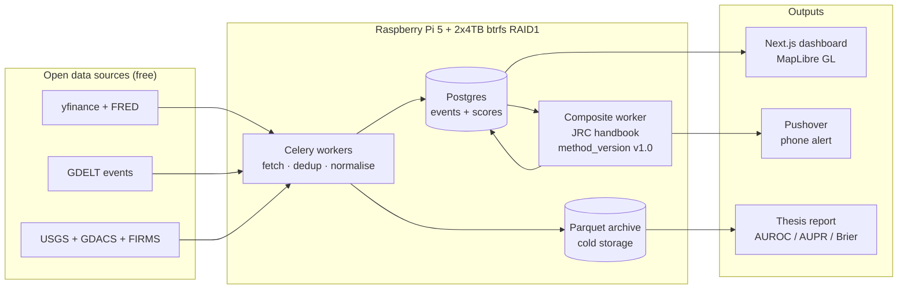
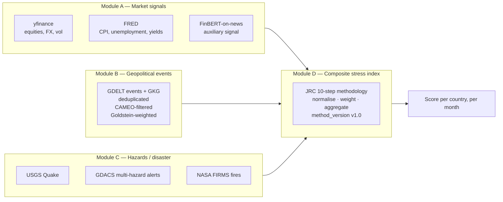
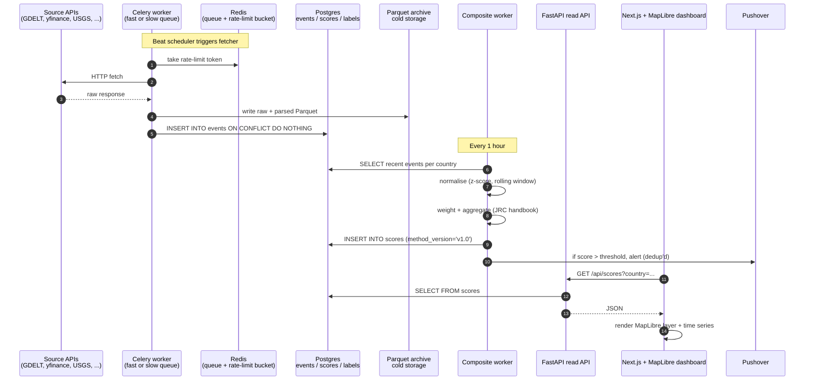
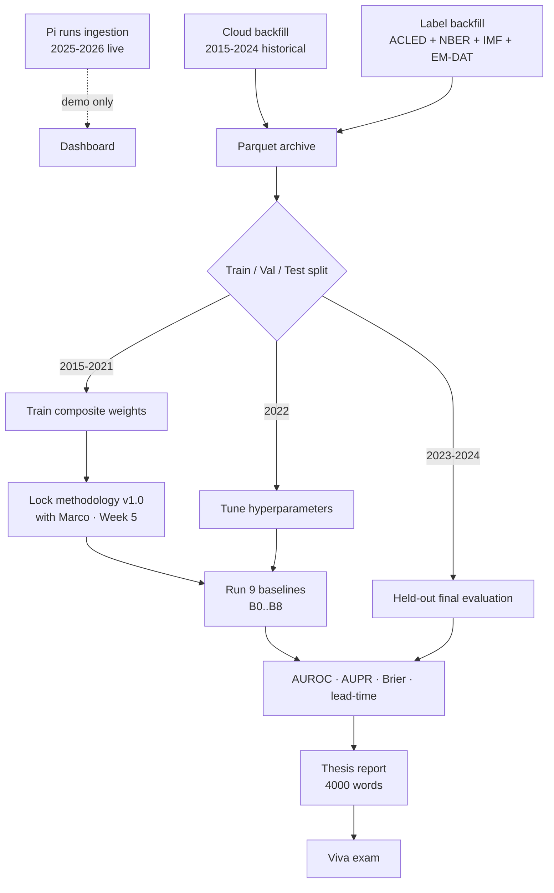

# OSINT — Multi-modal Early-Warning Dashboard

> A self-hosted dashboard plus a **composite stress index** per country, fed by three independent open-data domains (market signals, geopolitical events, hazards). MSc thesis project (PX5928, University of Aberdeen, supervised by Marco Thiel) and a personal infrastructure project meant to run for years on a Raspberry Pi.

The thesis is one specific claim: **a composite of three heterogeneous OSINT signal domains discriminates later instability events better than the best single-domain baseline.** The dashboard, the Pi, the maps — they are the system that lets that claim be measured.

## Chapters

- [Chapter 1 — Switch it on](#chapter-1--switch-it-on)
- [Chapter 2 — Can we trust the data?](#chapter-2--can-we-trust-the-data)
- [Chapter 3 — How the data gets collected](#chapter-3--how-the-data-gets-collected)
- [Chapter 4 — The brain](#chapter-4--the-brain)
- [Chapter 5 — How to read the dashboard](#chapter-5--how-to-read-the-dashboard)
- [Reference shelf](#reference-shelf) — deep architecture material

---

# Chapter 1 — Switch it on

Everything runs locally. All persistent data lives in **one folder** —
`$OSINT_DATA_DIR` (default `./data`, gitignored).

### First time only

```bash
# prerequisites: Docker Desktop, Python 3.14, Node + pnpm
python3 -m venv .venv && .venv/bin/pip install -e .
cp env.example .env                      # set POSTGRES_PASSWORD (+ any API keys)
docker compose up -d                     # stores: Postgres + Redis
.venv/bin/alembic upgrade head           # create the schema
cd osint-frontend && pnpm install && cd ..
```

### Daily driving

| Want | Command |
|------|---------|
| Everything ON (stores, worker, beat, API, dashboard, Ollama) | `make up` |
| Everything OFF, keep data | `make stop` |
| OFF + quit Docker Desktop | `make off` |
| Restart after a code change | `make stop && make up` |
| Watch the logs | `make logs` |

Dashboard: **http://localhost:3000** · API health: `curl localhost:8000/health` → `{"status":"ok"}`.

`make up` is self-healing: it opens Docker if needed, skips what already runs,
and if the Docker daemon has corrupted the compose project (the "No such
container" disease) it automatically switches to a fresh project name — your
data never moves, it lives on bind mounts.

### The analytical commands

Each one records itself in the **top-bar activity monitor** — a chip per job,
green pulsing while working (with live progress), red while idle, red
`failed` with the error in the tooltip if something breaks.

| Command | What it does |
|---------|--------------|
| `make labels` | rebuild ground-truth labels from the ACLED xlsx drop-folder |
| `make panel` | build the country-month panel (labels + composite) → `data/exports/panel.parquet` |
| `make baselines` | score the composite against the no-skill baselines → the head-to-head report |
| `make coverage` | measure who gets covered and who gets ignored → the attention-bias report |
| `make journal` | run the forward-prediction journal once (emit + grade + scoreboard) |
| `make briefing` | generate the weekly briefing — the newsletter-ready one-pager (#401) |
| `make stories` | cluster the rolling news window into stories |
| `make stories-audit` | emit the cluster hand-check sheet (threshold audit) |
| `make sensor-checks` | check story claims against physical sensors → verdict board |
| `make disagreement` | score cross-country telling divergence → most contested stories |
| `make indicator-ranking` | rank every dashboard indicator by measured predictive value |
| `make onset-eval` | run the pre-registered onset evaluation (calm-window months only) |
| `make validator` | local-LLM claim extraction over window stories (needs Ollama) |
| `make validator-audit` | emit the human-check sheet that gates validator use |
| `make validator-agreement` | publish the model-vs-human agreement rate from the filled sheet |
| `make backfill-signals` | rebuild 2015-2024 composite history (market + GDELT + hazard); resumes via checkpoints |

### The data folder

```bash
make data-size    # what is using disk
make data-prune   # run retention now
make data-reset   # ⚠️ delete ALL local data
```

Retention keeps the events table small (news ~3 d, hazards ~2 d — see `.env`);
markets/macro and everything analytical (scores, labels, stories, journal)
are kept long-term.

<details><summary>Manual mode — one process per terminal</summary>

```bash
docker compose up -d
.venv/bin/celery -A app.celery_app worker -l info
.venv/bin/celery -A app.celery_app beat   -l info
.venv/bin/uvicorn app.api:app --host 0.0.0.0 --port 8000
cd osint-frontend && pnpm dev
```
</details>

---

# Chapter 2 — Can we trust the data?

*This is the project's main scientific problem, explained from zero.*

The dashboard eats the world's open data all day: news feeds, earthquake
sensors, satellites, market prices, conflict databases. The obvious question —
the one a professor, an examiner or a customer asks first — is:

> **"How do you know any of this is true, complete, and not just one loud
> country's version of events?"**

Honest answer: **you can never fully know.** Anyone who says their data is
"unbiased" is selling something. What you *can* do is measure three things and
publish all of them. That is this chapter.

### 2.1 How data gets in (and how nothing sneaks in twice)

```text
   sensors (don't lie)             text (can lie)
 ┌──────────────────────┐      ┌──────────────────────┐
 │ USGS quakes          │      │ ~37 news feeds (RSS) │
 │ NASA FIRMS fires     │      │ GDELT world events   │
 │ GDACS disasters      │      └──────────┬───────────┘
 │ market prices        │                 │
 └──────────┬───────────┘                 │
            └────────────┬────────────────┘
                         ▼
              ┌─────────────────────┐
              │  events table       │  ← every row has a fingerprint
              │  (Postgres)         │    (source, source_event_id):
              └─────────┬───────────┘    the SAME quake fetched 100×
                        │                is still ONE row. The DB
                        ▼                enforces it, not good manners.
        scores · labels · stories · journal
        (all versioned, all append-only or
         overwrite-in-place — never duplicated)
```

Corruption guards, in one breath: files are written atomically (a crash leaves
no half-file), a failed download **raises** instead of silently writing a
partial month, and every methodology change gets a new version stamp instead
of editing history.

### 2.2 The trust triangle

We can't compute "truth", so we compute three honest proxies **per story**:

```text
                 CORROBORATION  (WS-C)
                "how many INDEPENDENT
                 tellers + does machine
                 data confirm it?"
                    ▲
                   ╱ ╲        10 copies of one Reuters wire = 1 source.
                  ╱   ╲       Story says "earthquake" → is there a
                 ╱     ╲      matching USGS row? Machines don't spin.
                ╱ trust ╲
               ╱─────────╲
   DISAGREEMENT           COVERAGE BIAS  (WS-D ✅ live)
   (WS-B)                 "who gets talked about
   "how differently do     at all?" — top-5 countries
    countries tell the     eat ~30% of all event
    same story?"           volume. Measured monthly,
                           shown on /coverage.
```

- **Corroboration (WS-C, done)** — every story cluster shows how many
  *independent owners* tell it, not just feeds: wire copies and co-owned
  outlets collapse into one teller (BBC's two feeds are one owner; RT + TASS
  are one state controller — #356). Claims are checked against sensors
  (#361): an earthquake story either has a matching USGS row or it doesn't —
  wildfire→FIRMS, disaster→GDACS, market crash→drawdown; verdicts keep their
  evidence snapshot after retention deletes the sensor row. Both fold into
  one fixed, versioned number (`corroboration-v1.0`, #363): each extra owner
  halves the remaining doubt, a sensor confirmation halves it once more —
  shown with its full evidence trail on the /stories card (#365). The
  clustering threshold under all of this was hand-audited first —
  `docs/audits/stories-threshold-audit.md`.
- **Disagreement (WS-B, done)** — same story, different countries' outlets:
  how far apart are the tellings? Every cross-country story carries a
  `disagreement-v1.0` divergence (#370), rolled up per (country-pair, month)
  (#372) — first live board: RU|US at 0.832 mean over 11 co-told stories.
  Whether divergence *predicts* instability is under a pre-registered forward
  exam (#374): divergence exposures enter the prediction journal daily and
  get graded like every other forecast — protocol frozen in
  `docs/disagreement-exam.md` before the first prediction was issued.
- **Coverage bias (WS-D, done)** — the dashboard publishes its own blind
  spots instead of hiding them.
- **Local AI checker (WS-G, running)** — a local Ollama model
  (`qwen3.5:4b-q4_K_M`, 3.4 GB, nothing leaves the machine) extracts
  structured claims per story nightly — countries, event type, casualty
  count (#378). Treated as *another fallible annotator*, never a judge:
  nothing consumes its output until its agreement with a human-checked
  sample (`make validator-audit`) is measured and published.

### 2.3 The referee system (why our numbers can't cheat)

```text
  pre-registered rules ──► evaluation runs ──► number published
  (methodology.md,          (baselines vs        (win OR lose —
   written BEFORE           composite on          the scoreboard
   any result exists)       2015-2022 only)       shows it in red)

  2023-2024 = TEST WINDOW — locked, untouched, for the final exam.
```

- **Ground truth** comes from ACLED (human-validated conflict data),
  versioned like code: labels-v1.0 → v1.1, never edited in place.
- **Forecasts are server-stamped before outcomes are known**, graded once,
  and can never be back-filled. The track record is earned or it is nothing.
- The current headline: with all three domains live, the composite scores
  **AUROC 0.502** against a per-country base rate of **0.929**. A coin flip —
  published, not hidden. The generous reading was that our index measures
  *"is this country behaving unusually vs its own past?"* while the exam asks
  *"which countries have conflict at all?"* — so a second, pre-registered
  test restricted scoring to **onset months** (calm-before-the-storm cases,
  `docs/onset-eval.md`, #380). Verdict: **coin flip there too** (0.496–0.526
  vs a 0.744 base rate) — even among countries calm for a full year, long-run
  relapse history dominates and the composite adds nothing measurable yet.
  Both negatives are published; the per-indicator decomposition
  (`make indicator-ranking`, #376) shows where recoverable signal lives —
  the magnitude of the deviation, which composite v1.1 must not discard.

### 2.4 Status board

| Workstream | What | State |
|---|---|---|
| WS-A story clustering | one row per real-world story | ✅ live, threshold audited |
| WS-D coverage bias | attention-bias table | ✅ live on /coverage |
| WS-E prediction journal | forward track record | ✅ live on /scoreboard |
| GDELT backfill | third composite domain, 2014-2024 | ✅ done — fair test ran |
| Onset exam | the composite's second pre-registered test | ✅ ran — coin flip again, honestly published (#380) |
| WS-C corroboration | independent-owner counts + sensor cross-checks | ✅ live — corroboration-v1.0 on /stories (#365) |
| WS-B disagreement index | cross-country telling divergence | ✅ live — index + pre-registered forward exam (#374) |
| WS-F indicator ranking | which dashboard number predicts best | ✅ ranked — |hazard z| leads at 0.59 (#376) |
| WS-G local AI checker | Ollama claim extraction w/ measured error rate | 🔨 machinery done (#386) — awaiting Basil's filled audit sheet |

The living log of all of this is pinned issue
[#282](https://github.com/BasilSuhail/OSINT/issues/282).

---

# Chapter 3 — How the data gets collected

*Every source, how it is downloaded, and how the disk is managed. No scraping
anywhere: official APIs, published bulk files and RSS only — if a future
source needs real scraping, its terms of service get read first or it stays
out.*

### 3.1 The live collectors (celery beat, around the clock)

Once `make up` runs, the scheduler fires these forever:

| Source | What | How it is pulled | Cadence |
|---|---|---|---|
| yfinance | country-ETF prices → market severity | Yahoo Finance API | 5 min |
| GDELT v2 | world geopolitical events | `lastupdate.txt` pointer → newest 15-min export zip | 15 min |
| USGS | earthquakes | FDSN query API (geojson) | 15 min |
| GDACS | multi-hazard alerts | official geojson feed | 15 min |
| NASA FIRMS | active fires | official CSV endpoint | hourly |
| EONET | natural events | NASA API | 30 min |
| ~37 news feeds | world/regional news | RSS (published by the outlets) | hourly, staggered |
| EM-DAT / FRED | disasters / macro series | official APIs | daily |
| ACLED | conflict events | manual drop-folder + opt-in API (see 3.3) | hourly check |
| OpenSky | aircraft states | REST API | 2 min |
| abuse.ch / Polymarket / UK Police | cyber / prediction markets / crime | official APIs | 15 min – daily |

Every fetched row gets a **fingerprint** `(source, source_event_id)` — the
database rejects the same real-world record twice no matter how often it is
re-fetched (Chapter 2.1). Per-source successes/failures land in
`ingest_health`, which is what the dataset chips in the top bar read.

### 3.2 GDELT — the two-path source

GDELT publishes a whole family of data products (Event Database 1.0/2.0,
Global Knowledge Graph, BigQuery mirrors, an Analysis Service, ngrams,
quotation/entity/frontpage graphs...). We use exactly **two** of them, both
plain static files off their CDN, and skip the rest deliberately:

| GDELT product | Use it? | Why |
|---|---|---|
| **Event DB 2.0** (15-min zips) | ✅ live | freshest event stream; `lastupdate.txt` always points at the newest file — trivially pollable, no key |
| **Event DB 1.0** (daily zips) | ✅ history | the only product covering our whole 2014-2024 window at daily grain with stable format |
| Event DB 1.0 "reduced" | ❌ | ends Feb 2014 — misses the window; its one-event-per-day collapse also destroys volume information |
| Global Knowledge Graph 1.0/2.0 | ❌ (for now) | themes/emotions/counts at ~2.5 TB per year — far beyond what the Goldstein signal needs; a *candidate* for the WS-B disagreement work later, as its own decision |
| 2.0 "mentions" table | ❌ (for now) | per-article mention records — interesting for corroboration counts someday, unnecessary for a monthly country mean |
| BigQuery mirror | ❌ | needs a Google Cloud account + billing; this project is local-first with zero cloud dependencies |
| Analysis Service | ❌ | browser/email tool for humans, GDELT 1.0 only, not automatable |
| Normalization files | ❌ | they correct for news-volume growth over time — our signal (mean Goldstein per country-month) is already volume-independent, and the rolling z-score handles drift |
| Frontpage / quotation / entity graphs, ngrams, TV/visual datasets | ❌ | different research questions entirely |

The two we use, side by side:

```text
LIVE (every 15 min)                 HISTORY (one-time, 2014-2024)
GDELT v2                            GDELT v1 daily archives
─────────────────                   ──────────────────────────
lastupdate.txt  ── points to ──►    ~4,000 files, one per day:
newest export.CSV.zip               YYYYMMDD.export.CSV.zip
   │ unzip in memory                   │ download → unzip in memory
   ▼                                   │ keep 3 columns only
events table                           │ (date, GoldsteinScale, country)
(retention ~2 days)                    ▼
                                    per-country monthly sums
                                    → one small JSON checkpoint per month
                                      in data/gdelt/ — raw file DISCARDED
```

The history run downloads ~40 GB over its lifetime but **keeps under 1 MB**:
only the monthly aggregates survive. Checkpoints are written atomically
(temp file → rename), so a killed run resumes at the next month for free and
a finished cache makes re-runs instant. Missing days (GDELT has known gaps)
are recorded in the checkpoint, not papered over; transient download errors
retry three times, then fail the whole month loudly rather than write a
partial one.

#### The exact links (verify it yourself)

There are precisely **two** GDELT URLs in the codebase:

| Path | URL | In code |
|---|---|---|
| live pointer | `http://data.gdeltproject.org/gdeltv2/lastupdate.txt` | `app/sources/gdelt_fetcher.py` |
| history pattern | `http://data.gdeltproject.org/events/YYYYMMDD.export.CSV.zip` | `app/composite/gdelt.py` |

The pointer file, fetched every 15 minutes, returns three lines — size, MD5
hash, URL — for the newest batch:

```text
54849   e2077439...  http://data.gdeltproject.org/gdeltv2/20260709103000.export.CSV.zip
71626   33a5f6da...  http://data.gdeltproject.org/gdeltv2/20260709103000.mentions.CSV.zip
4517072 d04d0311...  http://data.gdeltproject.org/gdeltv2/20260709103000.gkg.csv.zip
```

We take the `export` line only. (GDELT publishes those MD5 hashes; we do not
verify them yet — a cheap integrity upgrade on the list.)

"Pulling" is a plain HTTP GET via `httpx` with an honest User-Agent
(`OSINT-thesis-project (academic)`), a 120 s timeout, and 3 retries with
backoff on the history path — no browser, no scraping, no auth. The zip is
unzipped **in memory**, rows are split on tabs, three columns are kept, the
rest is discarded.

**Check it yourself**: paste
`http://data.gdeltproject.org/events/20220301.export.CSV.zip` into a browser.
That downloads the exact file the backfill parsed for 1 March 2022 — open it
and you are looking at the same raw rows we aggregated.

### 3.3 ACLED — deliberately manual

ACLED is registered-access and its data API rejects many valid academic
accounts, so the ground-truth labels are built from **manually downloaded
aggregate xlsx files** dropped into the data directory; `make labels`
rebuilds from whatever is there. A helper (`scripts/acled_browser_sync.py`)
can capture downloads from your own logged-in myACLED browser session — it
automates *your* clicks and bypasses nothing.

Manual is a feature, not a gap: **ground truth must never silently drift
under a running evaluation.** Label changes only happen as versioned,
pre-registered amendments (labels-v1.0 → v1.1 lives in `docs/methodology.md`).

### 3.4 The history backfills

`make backfill-signals` rebuilds the composite's 2015-2024 history from three
sources in one run — market (full ETF price history via yfinance), hazard
(all M≥4.5 quakes via USGS, yearly chunks under their 20k-row cap) and
geopolitical (the GDELT v1 path above). Everything flows through the *same
code path as live data*, rows carry `backfill: true` for provenance, and the
whole thing is idempotent — run it twice, get the same database.

### 3.5 How the disk is managed

```text
data/                        (one folder, bind-mounted, survives anything)
├── postgres/    ~2.6 GB     the database — events dominate (~2.2 GB)
├── private/     ~100 MB     ACLED drop-folder (gitignored)
├── redis/        ~20 MB     queue state, ephemeral
├── exports/       ~2 MB     panel.parquet + all reports the dashboard serves
└── gdelt/         <1 MB     132 monthly checkpoint JSONs (11 years of GDELT)
```

Retention (03:00 UTC daily + `make data-prune`): news ~3 days, hazard/GDELT
raw events ~2 days — the events table stays small because **everything
analytical is derived and kept forever** (scores, labels, stories, journal,
job runs). Backups: `make data-size` to inspect, snapshot script in
`scripts/`, and the whole folder is portable — point `OSINT_DATA_DIR` at an
external disk and move it.

---

# Chapter 4 — The brain

The system has a small local brain: a light model (`qwen2.5:1.5b-instruct-q4_K_M`,
~1 GB) that runs **only when the box has headroom** and narrates what is going on —
both the world signal and the pipeline itself.

### 4.1 Why it isn't always resident

Production is an 8 GB Raspberry Pi. A model pinned in RAM 24/7 would fight scraping
and the analytical batch and OOM the Pi. So the brain uses **adaptive keep-alive**:
warm during idle windows, **evicted the instant a heavy job starts**, reloaded when
the box goes quiet again. The eviction is wired into `job_run()` — every heavy job
passes through it, so the model always steps aside *before* the pandas parse grabs
memory. A resource gate (`app/brain/gate.py`) also refuses to load unless there is
enough free RAM and no heavy job is already running.

### 4.2 What it produces

Every ~15 minutes, when the gate allows, the brain reads a compact snapshot (top
stories, job outcomes, ingest freshness) and writes a short JSON narrative:

- **headline** — the single most important thing right now
- **world** — 2-4 sentences on the story signal
- **system** — 1-2 sentences on pipeline health
- **watch** — a few things to keep an eye on

It describes **only the numbers it is given** — same no-fabrication discipline as the
validator. It never invents facts.

### 4.3 Expected vs actual output

Expected shape (`GET /brain/narrative/latest`):

```json
{
  "present": true,
  "model": "qwen2.5:1.5b-instruct-q4_K_M",
  "created_at": "2026-07-12T12:00:00+00:00",
  "payload": {
    "headline": "Border-clash coverage is the loudest signal; pipeline healthy.",
    "world": "Seven outlets are carrying a border-clashes story across twelve members. No other cluster is close in reach.",
    "system": "All six analytical jobs completed in the last hour; ingest last checked two minutes ago.",
    "watch": ["Whether the border story keeps gaining outlets", "The failed composite job from earlier"]
  }
}
```

When the box is busy, the brain steps aside; `GET /brain/narrative/latest` simply
returns the last narrative and the **Situation card renders "brain resting"** so the
backoff is visible.

### 4.4 Running it

`make up` starts Ollama for you: if it's installed and not already running, the
start-up brings up `ollama serve`, waits for it, and pulls the light brain model on a
fresh box — so one command runs the whole app *with* its brain, and `make down`/`make
off` stops the Ollama it started (a hand-started `ollama serve` is left alone). It's
best-effort: if Ollama isn't installed the app still comes up and the brain stays
dormant. Skip the autostart with `OLLAMA_AUTOSTART=0`.

Run one pass by hand:

```bash
make brain                                 # run one narration now
```

The nightly validator keeps its own 4b model; the brain is separate and lighter.
Turn the brain off entirely with `BRAIN_ENABLED=false` in `.env`.

### 4.5 Ask the app

Beyond narrating on its own schedule, the brain answers questions on demand.
`POST /brain/ask` with `{"question": "..."}` returns `{"answer": "...",
"context_digest": "..."}`. The answer is grounded in the same live snapshot the
narrative uses, plus three headline facts (the latest composite and its
highest-stress country, the most-contested story, and the prediction scoreboard's
graded/total counts). It answers only from that context and says "I don't have data
on that" otherwise — it never invents.

Because a question is user-initiated (you're waiting for the answer), Q&A does not
back off on every running job the way the scheduled narrative does — it refuses only
when free RAM is below the floor, returning a short "brain busy" answer so the Pi
never OOMs. If Ollama is down it answers "The brain is offline right now." Nothing is
persisted; the ask box lives at the bottom of the Situation card and clears on
reload.

Example:

```
POST /brain/ask  {"question": "what is the most contested story?"}
→ {"answer": "The most contested story is the border-clashes report, with a
   divergence of 0.83 across the outlets telling it.", "context_digest": "sha256:…"}
```

### 4.6 Enriching new stories

The nightly validator gives stories full claims once a night with the heavy 4b model.
The brain adds a faster, lighter first-look: every ~20 minutes, on idle windows, the
1.5b model gives each new story a one-line **gist** plus two tags — a **category**
(`conflict`, `economy`, `disaster`, `politics`, `other`) and an **escalating** flag
(`yes`, `no`, `unclear`). It reads only the story's own headlines and invents nothing;
anything a small model returns off-vocabulary is coerced to `other` / `unclear`, so the
tags stay clean and filterable.

The pass is idle-gated (same RAM + no-heavy-job gate as the narrative) and batch-capped
(~20 stories per run), so a burst of new stories clears within an hour or two without
straining the Pi. Gists land on `/stories/top` and show as a line under each story on
the Stories card, with a small category chip (↑ marks an escalating story). Run one pass
by hand with `make enrich`. Stored 30 days, then pruned.

# Chapter 5 — How to read the dashboard

*Every number on the analytical cards, in plain language: what it is, what
good and bad look like, and what to actually do with it. No statistics
degree required.*

The right pane is a deck of six cards (swipe, or click for fullscreen):
**briefing** (the landing card, explained below), **console** (the raw event
feed as it arrives), **globe** (where things are happening), and the three
analytical cards — stories, coverage, scoreboard.

### 4.0 Briefing — "just tell me what matters today"

The deck opens with the answer instead of a hunt (a pattern carried over
from the news-intelligence-platform, this project's predecessor):

- **World stress level** in one plain word — *calm / elevated / high
  stress* — computed from the average of every country's latest composite
  score. Hover it for the honest caveat: the word describes *measured
  stress today*, not a validated forecast.
- **Most trustworthy story right now** — the highest-confidence story of
  the last 24 hours, with its owners badge and sensor ✓.
- **Most contested telling** — the story whose country blocs word it most
  differently, with who disagrees with whom.
- **Biggest stress movers** — countries whose index moved most since last
  month, ▲ rising / ▼ easing.

Everything on it is a doorway: the detail always lives on one of the three
cards below. The same idea as a weekly artifact: `make briefing` writes a
newsletter-ready one-pager (also generated automatically every Monday
morning) — the first step on the productization path tracked in issue #400.

### 4.1 Stories — "what is the world talking about, and should I believe it?"

Every row is **one real-world story**, no matter how many outlets wrote it
up. The machine groups similar headlines every 30 minutes, so "Earthquake
strikes Tokyo" and "Dozens injured as quake hits Tokyo" are one row, not two.

**The badge on the left — `7 src`** — is the number that matters. It counts
**independent tellers**, not feeds: ten copies of one Reuters wire story
count as *one*, the BBC's two feeds count as *one*, RT and TASS (both
controlled by the Russian state) count as *one*. So `7 src` means seven
genuinely separate organisations chose to tell this story.

**The badge's colour is a confidence score** (0 to 1, shown in the tooltip):

| colour | score | plain meaning |
|---|---|---|
| dim grey | 0 | one unverified teller — this is a rumour until proven otherwise |
| grey | up to 0.5 | a second independent teller exists — worth a look |
| green | 0.5–0.75 | several independent tellers — probably real |
| cyan | 0.75+ | many independent tellers, often machine-confirmed — take seriously |

The formula behind the colour is one sentence: *each additional independent
teller halves the remaining doubt; a physical-sensor confirmation halves it
once more.*

**The `✓ earthquake` / `✓ disaster` chips** are the machine check: the story
*claimed* a physical event, and a sensor that cannot spin a narrative (USGS
seismometers, NASA fire satellites, GDACS disaster feeds, market data)
**confirmed something physical actually happened there, then**. A story with
a ✓ chip is corroborated by hardware, not just by other journalists. No chip
on a physical claim means no matching sensor row was found — often because
the story is about a past event, sometimes because it's inflated.

**What to do with it:** scanning for what's real, sort by instinct — cyan
badges with ✓ chips first, dim single-teller rows last. The
`min owners` filter (set it to 2+) hides everything only one organisation
has said. The header line — *"X stories · Y told by 2+ independent owners ·
Z sensor-confirmed"* — is the day's honesty summary: how much of the news
flow is corroborated versus single-sourced.

### 4.2 Coverage — "whose stories never get told?"

This card is the dashboard admitting its own blind spots. Media attention is
wildly uneven: the top five countries absorb roughly **30 % of all recorded
event volume**. If you don't measure that, every other number quietly
inherits the bias.

| column | plain meaning |
|---|---|
| **months** | how long we've had data for this country — short history = shaky baselines |
| **events** / **events/mo** | raw attention: how much gets recorded about this country at all |
| **share** | this country's slice of *global* recorded events — the loudness ranking |
| **fatal/event** | fatalities per recorded event — the quiet-country warning: a high number means events only get recorded there when people die |

**The one comparison worth internalising:** the US logs ~0.01 fatalities per
event (everything gets reported, however minor), Afghanistan ~3 (only
catastrophe makes the record). Same planet, hundred-fold difference in what
"an event" means.

**What to do with it:** before believing any cross-country comparison on
this dashboard — including ours — check both countries here. A spike in a
high-share country is probably just loudness; a *small* spike in a country
with high fatal/event may be a big deal that barely made the record. Loud
countries are judged against their own past for exactly this reason.

### 4.3 Scoreboard — "is any of this actually predictive?"

The honesty engine. Two sections:

**Forward track record.** Every month the system writes down its forecasts
— *"country X will/won't see instability in the next 1 / 3 / 6 months"* —
**server-stamped before the outcome is knowable**, impossible to edit
afterwards, graded automatically once reality catches up. The columns:

| column | plain meaning |
|---|---|
| **source** | which instrument made the forecast — `composite` (the stress index) or `disagreement` (do countries telling the same story differently predict trouble?) |
| **k** | horizon: predicting 1, 3 or 6 months ahead |
| **issued / graded / pending** | how many forecasts made, how many reality has already marked, how many still waiting |
| **pos rate** | how often the bad outcome actually happened in the graded set |
| **mean score** | how worried the instrument claimed to be, on average |
| **Brier** | the grade: **0 = clairvoyant, 0.25 = coin flip, 1 = perfectly wrong.** Lower is better. This one number is the difference between a forecasting system and a mood ring |

**Baselines.** The composite index versus deliberately dumb rivals —
"predict randomly", "predict yesterday's weather", "predict each country's
long-run average". The published result, stated plainly: **the composite has
not yet beaten the dumb rivals** (AUROC ≈ 0.5 = coin flip, on both the
ordinary exam and the pre-registered onset exam). That negative is published
on purpose — it is what makes every other number here credible, and the
per-indicator decomposition (`make indicator-ranking`) shows where the
recoverable signal lives for the next version.

**What to do with it:** treat the dashboard as **monitoring, not prophecy**.
The stories card tells you what's happening and how corroborated it is —
that part works today. The predictive claim is *on trial in public*: watch
the Brier column accumulate; if the instruments are worth anything, it sinks
below 0.25 and stays there. Until then, nobody here will pretend otherwise.

### 4.4 The one-paragraph version

Stories = what happened, weighted by independent confirmation, machine-checked
against sensors. Coverage = which countries this whole apparatus is blind to.
Scoreboard = whether the forecasting ambition is earning its keep, graded in
public, currently honest about not winning yet. Read them in that order.

---

# Reference shelf

*The deep material — architecture, domains, pipeline, thesis protocol.*

## Project map — where everything lives

Essentials only — the files you actually open. Two apps (Python backend +
Next.js frontend) over local Postgres/Redis; all data sits in one folder.

```text
OSINT/
├── app/                      ← PYTHON BACKEND (ingest · score · serve)
│   ├── api.py                  FastAPI read-API: /events /scores /ingest-health /stream(SSE)
│   ├── celery_app.py           Celery app instance (broker = Redis)
│   ├── tasks.py                Celery tasks + beat schedule (cadence + 03:00 prune)
│   ├── fetcher_registry.py     maps source name → fetcher
│   ├── persistence.py          upsert events into Postgres (+ Redis "new rows" tick)
│   ├── events_bus.py           Redis pub/sub channel powering the live SSE stream
│   ├── housekeeping.py         retention policy (GDELT 2d / news 3d / hazard 2d)
│   ├── db.py / db_models.py    SQLAlchemy engine/session  +  table definitions
│   ├── settings.py             ALL config (reads .env): POSTGRES_*, OSINT_DATA_DIR, RETENTION_*
│   ├── models.py               canonical Event/Score pydantic shapes
│   ├── watchdog.py             ingest health monitor
│   ├── sources/                one fetcher per feed (gdelt, gdacs, nasa_firms, fred, abuse_ch…)
│   ├── cii/                    Country Instability Index scoring
│   ├── composite/              composite-score aggregation/normalisation
│   └── enrichment/             country/city geocode · NER · sentiment (+ enrichment/data/ polygons)
│
├── osint-frontend/           ← NEXT.JS DASHBOARD (reads app/api.py)
│   ├── app/                    routes: page.tsx (dashboard), layout.tsx, providers.tsx, api/
│   ├── lib/
│   │   ├── apiClient.ts          ★ all backend calls (fetchEvents/Scores/IngestHealth, SSE url)
│   │   ├── queries.ts            data hooks (windowing, filters, latest scores)
│   │   ├── realtime.ts           EventSource SSE buffer + reconnect/poll fallback
│   │   └── types.ts              EventRow / ScoreRow / IngestHealthRow types
│   ├── components/             panes: MapPane, GlobePane, DashboardSection, FilterRail, ui/
│   ├── stores/                 zustand filter store
│   └── public/                 static assets
│
├── data/        ← ALL LOCAL STORAGE (= $OSINT_DATA_DIR, gitignored)
│   ├── postgres/                Postgres data files (the actual DB)
│   └── redis/                   Redis append-only file
├── backups/     ← snapshot.py dumps (gzipped CSV per table, gitignored)
│
├── migrations/  ← Alembic schema migrations (versions/ = each change)
├── scripts/     ← one-off tools: snapshot.py (backup) · prune_now.py · backfill_*.py · enrich_*.py
├── tests/       ← pytest suite (backend);  frontend tests live in osint-frontend/__tests__ + lib/*.test.mts
│
├── docs/        ← architecture-spec.md · methodology.md · data-coverage.md · frontend/ · superpowers/(specs+plans)
│
├── docker-compose.yml   ← Postgres + Redis services (bind-mount → $OSINT_DATA_DIR)
├── Makefile             ← make data-size / data-prune / data-reset
├── alembic.ini          ← migration config
├── pyproject.toml       ← Python deps + build  (requirements.txt mirrors runtime deps)
├── env.example          ← copy → .env, then fill secrets
└── .env                 ← YOUR live config + secrets (gitignored — never commit)
```

**Quick "where is…?"**
- **My config / secrets** → `.env` (template: `env.example`); read in code via `app/settings.py`.
- **The database itself** → `data/postgres/` (change location with `OSINT_DATA_DIR`).
- **What the dashboard fetches** → `osint-frontend/lib/apiClient.ts` ↔ served by `app/api.py`.
- **Add/adjust a data source** → `app/sources/` + register in `app/fetcher_registry.py`.
- **How long data is kept** → `app/housekeeping.py` (+ `RETENTION_*` in `.env`).
- **A backup of old data** → `backups/<timestamp>/`.

---

## The thing in one diagram



Three sources in. One pipeline. Three outputs: a live dashboard you can pull up on your phone, an alert when a country crosses a threshold, and a thesis report at the end.

---

## What we are building, in plain words

| Question | Answer |
|---|---|
| **What is it?** | A small early-warning dashboard. It watches three kinds of open data — markets, geopolitical news events, and natural hazards — and combines them into a single number per country that goes up when things look stressed. |
| **Why these three?** | Marco's brief says "must not depend on a single data source." Three independent domains keep the score honest: if only one domain spikes, the composite stays calm. If multiple domains spike together, the composite goes red. |
| **What is it for?** | (a) **Thesis** — prove that this multi-modal composite is better at flagging real instability events than just watching one domain on its own. (b) **Personal** — a self-hosted situational-awareness tool that keeps running after the thesis is submitted. |
| **What is NOT it?** | Not a prediction system. Not Palantir. Not Shadowbroker. Not finance-only. Does not claim to predict specific events. Does not use private intelligence feeds. |

---

## Three input domains

The thesis defends a composite over **three domains**, not finance alone, not GDELT alone.



| Module | Domain | What goes in | Where it lives |
|---|---|---|---|
| **A** | Market / macro | yfinance, FRED, optional FinBERT-on-news | [`docs/architecture/01-overview.md`](docs/architecture/01-overview.md#module-map) |
| **B** | Geopolitical | GDELT v2 events + GKG | same |
| **C** | Hazard / earth | USGS Quake, GDACS, NASA FIRMS | same |
| **D** | Composite | JRC handbook 10-step methodology | [`docs/methodology.md`](docs/methodology.md#part-b--literature-baseline) |
| **E** | Evaluation | Pre-registered AUROC / AUPR / Brier vs ground truth | [`docs/methodology.md`](docs/methodology.md#part-a--evaluation-protocol-pre-registered) |

Layer 3 feeds (satellites, news RSS, aviation, maritime, weather, mesh) sit on the dashboard for situational awareness only. They **do not enter the composite or the thesis evaluation**. See the [feed taxonomy](docs/architecture/01-overview.md#feed-taxonomy) for the full list.

---

## Pipeline end to end



Plain version:

1. A scheduler wakes up a worker (every 5 minutes for fast feeds, every 15 minutes for slow ones).
2. Worker takes a rate-limit token from Redis so we never burn the daily allowance.
3. Worker fetches from the source, writes the raw response to disk (Parquet) and the parsed events to Postgres. Duplicates are filtered by `(source, source_event_id)`.
4. Once an hour, the composite worker reads the last 90 days of events per country, normalises and weights them per the JRC handbook, and writes a score row with a `method_version` tag.
5. If the score crosses a threshold, Pushover gets called and your phone lights up.
6. The dashboard pulls from Postgres via FastAPI and renders the country map plus per-country time series.

Everything older than 90 days moves from Postgres to Parquet archive overnight (the "hot/cold" split) so the database stays fast.

---

## Ground truth — how the system gets graded

The system is multi-modal, so the answer key is too. Five label codes, three domains:

| Code | Domain | What it means | Source |
|---|---|---|---|
| **P1** | Geopolitical | Armed conflict onset | ACLED battle events with ≥10 fatalities |
| **P2** | Geopolitical | Mass protest escalation | ACLED protest events with violent escalation in 7-day window |
| **P3** | Geopolitical | State-based violence intensification | Month-over-month doubling of ACLED state-based fatalities |
| **P4** | Market | Country-level market crisis | NBER recession; IMF currency-crisis entry; sovereign yield spike > 200bps; equity drawdown > 20%; VIX > 30 sustained |
| **P5** | Hazard | Hazard-induced societal disruption | EM-DAT disaster with ≥100 deaths or ≥100k affected, or GDACS red-alert, with sustained composite stress in following 30 days |

The primary classification target is **any-positive across P1-P5**. Per-domain subtasks are reported as secondary. Full ground-truth definition: [`docs/methodology.md`](docs/methodology.md#step-2--ground-truth-hybrid-multi-modal).

The labels live in their own database table, kept strictly separate from input events so the answer key is never accidentally treated as a feature.

---

## Thesis loop — how the claim gets proven



Nine baselines compete:

| ID | Baseline | What it is |
|---|---|---|
| B0 | Random | Sanity check, AUROC ≈ 0.5 |
| B1 | Persistence | "Same as last month" |
| B2 | Base rate | Country's historical positive rate |
| B3 | Geo only | Module B score alone |
| B4 | Market only | Module A score alone |
| B5 | Hazard only | Module C score alone |
| B6 | Composite (equal weights) | The headline thesis claim |
| B7 | Composite (PCA weights) | Alternative weighting |
| B8 | Composite (geometric mean) | Less-compensatory aggregation |

For the thesis to land its primary claim, **B6 (or B7, or B8) must beat each of B3, B4, B5** on both AUROC and AUPR on the held-out test set. If it doesn't, the thesis says so honestly — pre-registered protocols make negative results respectable.

---

## Stack

| Layer | Choice | Why |
|---|---|---|
| **Hardware** | Raspberry Pi 5 (8 GB) + 2x4TB USB3 HDDs in btrfs RAID1 | Low power, runs 24/7, RAID1 survives single-disk fail |
| **OS** | Raspberry Pi OS Lite 64-bit | Standard, well-supported |
| **Reverse proxy / TLS** | Caddy | Auto-TLS, simple config |
| **VPN access** | Tailscale | Reach the Pi from anywhere with no port-forwarding |
| **Queue** | Celery + Redis | Worker isolation, retry, rate limiting per source |
| **Hot store** | Postgres 16 | Indexed queries for dashboard + composite |
| **Cold archive** | Parquet on btrfs (Hive-partitioned) | Replayable evaluation, no DB round-trip |
| **Backup** | restic → Backblaze B2 or Cloudflare R2 | Encrypted off-site |
| **API** | FastAPI | Async Python, fits the worker stack |
| **Frontend** | Next.js + MapLibre GL | Vector map tiles, off-Pi build |
| **Alerting** | Pushover REST | Cheap, reliable, phone-native |
| **Schema migrations** | Alembic | Standard for SQLAlchemy / Postgres |

Full reasoning: [`docs/architecture/`](docs/architecture/) sections 01-07.

---

## Layer 3 — dashboard breadth (not in thesis)

Sits on the dashboard for situational awareness, **not** in the composite, **not** in the evaluation, **not** in the thesis Methods or Results chapters. Single Discussion paragraph + appendix table in the thesis. Grows freely after 28 August.

Live as of the latest source-expansion batch — **43 active fetchers**:

- **News (RSS, 25 feeds)** — BBC World, BBC UK, Reuters/Yahoo, Dawn, Guardian, Geo English, Al Jazeera, CNN, NYT, France 24, DW, NHK, RT, TASS, Times of India, The Hindu, Tribune PK, CBC, ABC AU, RNZ, Straits Times, Jerusalem Post, Haaretz, Arab News, Kyiv Independent. JSON-registry driven (#158).
- **Aviation** — OpenSky public ADS-B (#161). 2 min cadence, every aircraft broadcasting ADS-B in the last 10 s.
- **Cyber-threat** — abuse.ch URLhaus malware URLs + Feodo Tracker botnet C2 IPs (#163). 15 min cadence each.
- **Prediction markets** — Polymarket public Gamma API (#165). 30 min cadence. Severity reads as "tail-event awareness" (peaks at p = 0.5).
- **Crime** — UK Police data.police.uk monthly snapshots.
- **Hazard / geo / market (Layer 1+2)** — yfinance, FRED, GDELT, USGS, GDACS, FIRMS, EONET.

**Hard rule** ([`docs/architecture/07-risks.md`](docs/architecture/07-risks.md#schedule-risks)): no Layer 3 worker is merged after end of Week 7. Layer 3 PRs that arrive after that are closed without merge. This rule is load-bearing for the thesis grade — every Layer 3 hour after Week 7 is an hour stolen from writing or viva prep.

## Enrichment + analytics on the rows

Every news row gets the following stamped on `payload` at fetch time. See [`docs/architecture/ENRICHMENT-METHODOLOGY.md`](docs/architecture/ENRICHMENT-METHODOLOGY.md):

- VADER sentiment v1.0 (`compound ∈ [-1, 1]` + label).
- spaCy NER v1.0 (optional dep) — `entities = [{text, label}, …]`.
- News-scope classifier (`local | world | unknown`) — distinguishes a Dawn-published US story from a Karachi street-level event.
- Offline city pinpoint (Natural Earth 50m, ~1.2 k cities) — drives map lat/lon.
- Image URL (media:thumbnail / media:content / enclosure / first `` fallback).
- News-scope-aware impact ranking (NIP §3 formula) — `0.30 |sentiment| + 0.25 cluster + 0.25 sourceWeight + 0.20 recency`.

CII v1.1 country-instability scoring runs hourly across the 31 Tier-1 countries. Methodology in [`docs/architecture/CII-METHODOLOGY.md`](docs/architecture/CII-METHODOLOGY.md).

---

## Documentation index

- **[`docs/storage.md`](docs/storage.md)** — local storage & data: `OSINT_DATA_DIR`, where the live DB lives vs backups vs the config pointer, retention, move/back-up/restore/wipe
- **[`docs/requirements.md`](docs/requirements.md)** — PX5928 university spec, group context, three-layer scope analysis, deliverable checklist
- **[`docs/methodology.md`](docs/methodology.md)**
  - Part A — pre-registered evaluation protocol (ground truth, splits, baselines, metrics, sensitivity, reporting checklist)
  - Part B — literature baseline (citations, reading priority, BibTeX snippets)
- **[`docs/project-direction.md`](docs/project-direction.md)** — what the project is, who it serves, why it matters, and the long-term product / research path
- **[`docs/architecture/`](docs/architecture/)** — seven-section build spec, all sections drafted:
  - [01 overview](docs/architecture/01-overview.md) · [02 storage](docs/architecture/02-storage.md) · [03 ingestion](docs/architecture/03-ingestion.md) · [04 schema](docs/architecture/04-schema.md) · [05 originality](docs/architecture/05-originality.md) · [06 validation](docs/architecture/06-validation.md) · [07 risks](docs/architecture/07-risks.md)
  - [CII methodology](docs/architecture/CII-METHODOLOGY.md) — per-country baseline + 4-component event blend (cii.v1.1, 31 Tier-1 countries)
  - [Enrichment methodology](docs/architecture/ENRICHMENT-METHODOLOGY.md) — VADER sentiment + spaCy NER + city + news-scope classifier + impact formula

---

## Inspirations and lineage

- **Architectural inspiration only (not cited in thesis literature review)**: [Shadowbroker](https://github.com/BigBodyCobain/Shadowbroker), WorldMonitor
- **Methodology lineage (cited)**: OECD/JRC Composite Indicator Handbook (Nardo et al., 2008), ViEWS (Hegre et al., 2019), CEWS field review (Davies et al., 2023), FSI methodology (Fund for Peace), GDELT validity critiques (Wang 2025, Wallace 2014, Öberg & Yilmaz 2025), FinBERT honesty (Yang et al., 2024). Full list with reading priority in [`docs/methodology.md`](docs/methodology.md#part-b--literature-baseline).
