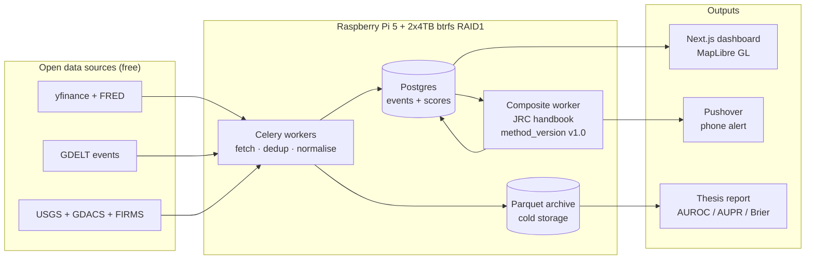
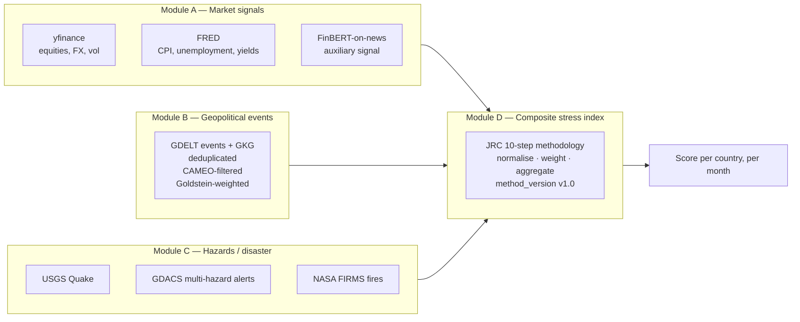
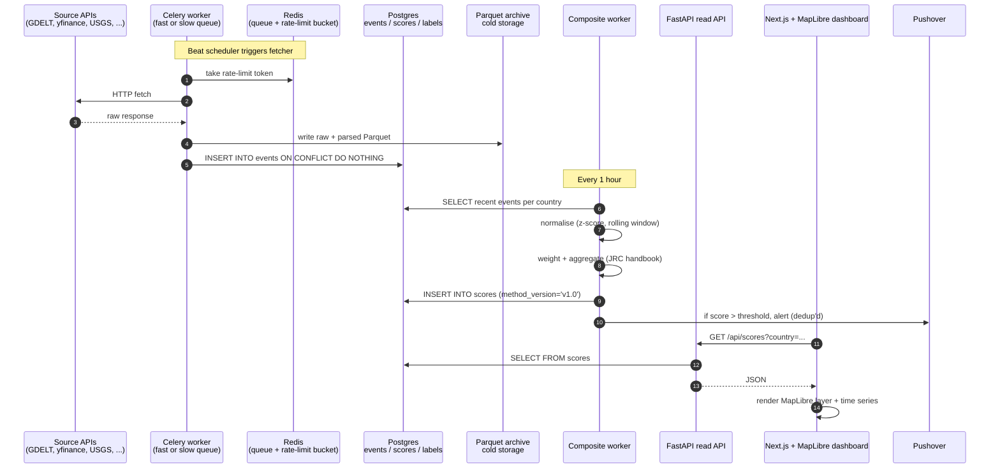
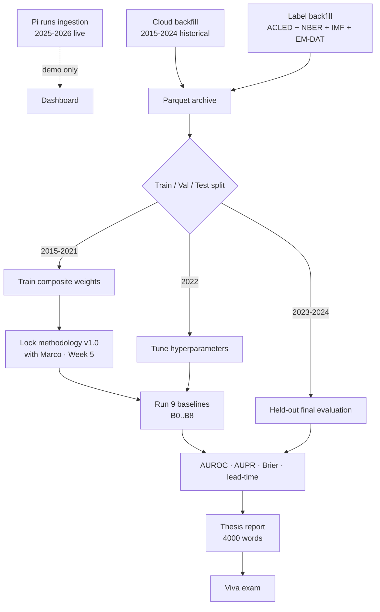
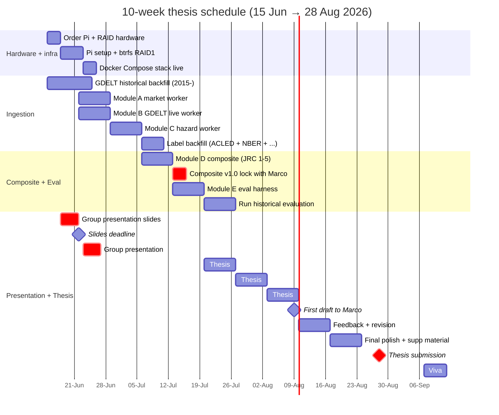
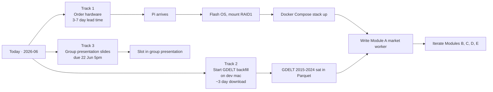

# OSINT — Multi-modal Early-Warning Dashboard

> A self-hosted dashboard plus a **composite stress index** per country, fed by three independent open-data domains (market signals, geopolitical events, hazards). MSc thesis project (PX5928, University of Aberdeen, supervised by Marco Thiel) and a personal infrastructure project meant to run for years on a Raspberry Pi.

The thesis is one specific claim: **a composite of three heterogeneous OSINT signal domains discriminates later instability events better than the best single-domain baseline.** The dashboard, the Pi, the maps — they are the system that lets that claim be measured.

## Table of contents

- [The thing in one diagram](#the-thing-in-one-diagram)
- [What we are building, in plain words](#what-we-are-building-in-plain-words)
- [Three input domains](#three-input-domains)
- [Pipeline end to end](#pipeline-end-to-end)
- [Ground truth — how the system gets graded](#ground-truth--how-the-system-gets-graded)
- [Thesis loop — how the claim gets proven](#thesis-loop--how-the-claim-gets-proven)
- [Stack](#stack)
- [Ten-week timeline](#ten-week-timeline)
- [How we get started](#how-we-get-started)
- [Layer 3 — dashboard breadth (not in thesis)](#layer-3--dashboard-breadth-not-in-thesis)
- [Documentation index](#documentation-index)
- [Inspirations and lineage](#inspirations-and-lineage)
- [Status](#status)
- [Group presentation note](#group-presentation-note)

---

## The thing in one diagram

Three sources in. One pipeline. Three outputs: a live dashboard you can pull up on your phone, an alert when a country crosses a threshold, and a thesis report at the end.

---

## What we are building, in plain words

| Question | Answer |
|---|---|
| **What is it?** | A small early-warning dashboard. It watches three kinds of open data — markets, geopolitical news events, and natural hazards — and combines them into a single number per country that goes up when things look stressed. |
| **Why these three?** | Marco's brief says "must not depend on a single data source." Three independent domains keep the score honest: if only one domain spikes, the composite stays calm. If multiple domains spike together, the composite goes red. |
| **What is it for?** | (a) **Thesis** — prove that this multi-modal composite is better at flagging real instability events than just watching one domain on its own. (b) **Personal** — a self-hosted situational-awareness tool that keeps running after the thesis is submitted. |
| **What is NOT it?** | Not a prediction system. Not Palantir. Not Shadowbroker. Not finance-only. Does not claim to predict specific events. Does not use private intelligence feeds. |

---

## Three input domains

The thesis defends a composite over **three domains**, not finance alone, not GDELT alone.

| Module | Domain | What goes in | Where it lives |
|---|---|---|---|
| **A** | Market / macro | yfinance, FRED, optional FinBERT-on-news | [`docs/architecture/01-overview.md`](docs/architecture/01-overview.md#module-map) |
| **B** | Geopolitical | GDELT v2 events + GKG | same |
| **C** | Hazard / earth | USGS Quake, GDACS, NASA FIRMS | same |
| **D** | Composite | JRC handbook 10-step methodology | [`docs/methodology.md`](docs/methodology.md#part-b--literature-baseline) |
| **E** | Evaluation | Pre-registered AUROC / AUPR / Brier vs ground truth | [`docs/methodology.md`](docs/methodology.md#part-a--evaluation-protocol-pre-registered) |

Layer 3 feeds (satellites, news RSS, aviation, maritime, weather, mesh) sit on the dashboard for situational awareness only. They **do not enter the composite or the thesis evaluation**. See the [feed taxonomy](docs/architecture/01-overview.md#feed-taxonomy) for the full list.

---

## Pipeline end to end

Plain version:

1. A scheduler wakes up a worker (every 5 minutes for fast feeds, every 15 minutes for slow ones).
2. Worker takes a rate-limit token from Redis so we never burn the daily allowance.
3. Worker fetches from the source, writes the raw response to disk (Parquet) and the parsed events to Postgres. Duplicates are filtered by `(source, source_event_id)`.
4. Once an hour, the composite worker reads the last 90 days of events per country, normalises and weights them per the JRC handbook, and writes a score row with a `method_version` tag.
5. If the score crosses a threshold, Pushover gets called and your phone lights up.
6. The dashboard pulls from Postgres via FastAPI and renders the country map plus per-country time series.

Everything older than 90 days moves from Postgres to Parquet archive overnight (the "hot/cold" split) so the database stays fast.

---

## Ground truth — how the system gets graded

The system is multi-modal, so the answer key is too. Five label codes, three domains:

| Code | Domain | What it means | Source |
|---|---|---|---|
| **P1** | Geopolitical | Armed conflict onset | ACLED battle events with ≥10 fatalities |
| **P2** | Geopolitical | Mass protest escalation | ACLED protest events with violent escalation in 7-day window |
| **P3** | Geopolitical | State-based violence intensification | Month-over-month doubling of ACLED state-based fatalities |
| **P4** | Market | Country-level market crisis | NBER recession; IMF currency-crisis entry; sovereign yield spike > 200bps; equity drawdown > 20%; VIX > 30 sustained |
| **P5** | Hazard | Hazard-induced societal disruption | EM-DAT disaster with ≥100 deaths or ≥100k affected, or GDACS red-alert, with sustained composite stress in following 30 days |

The primary classification target is **any-positive across P1-P5**. Per-domain subtasks are reported as secondary. Full ground-truth definition: [`docs/methodology.md`](docs/methodology.md#step-2--ground-truth-hybrid-multi-modal).

The labels live in their own database table, kept strictly separate from input events so the answer key is never accidentally treated as a feature.

---

## Thesis loop — how the claim gets proven

Nine baselines compete:

| ID | Baseline | What it is |
|---|---|---|
| B0 | Random | Sanity check, AUROC ≈ 0.5 |
| B1 | Persistence | "Same as last month" |
| B2 | Base rate | Country's historical positive rate |
| B3 | Geo only | Module B score alone |
| B4 | Market only | Module A score alone |
| B5 | Hazard only | Module C score alone |
| B6 | Composite (equal weights) | The headline thesis claim |
| B7 | Composite (PCA weights) | Alternative weighting |
| B8 | Composite (geometric mean) | Less-compensatory aggregation |

For the thesis to land its primary claim, **B6 (or B7, or B8) must beat each of B3, B4, B5** on both AUROC and AUPR on the held-out test set. If it doesn't, the thesis says so honestly — pre-registered protocols make negative results respectable.

---

## Stack

| Layer | Choice | Why |
|---|---|---|
| **Hardware** | Raspberry Pi 5 (8 GB) + 2x4TB USB3 HDDs in btrfs RAID1 | Low power, runs 24/7, RAID1 survives single-disk fail |
| **OS** | Raspberry Pi OS Lite 64-bit | Standard, well-supported |
| **Reverse proxy / TLS** | Caddy | Auto-TLS, simple config |
| **VPN access** | Tailscale | Reach the Pi from anywhere with no port-forwarding |
| **Queue** | Celery + Redis | Worker isolation, retry, rate limiting per source |
| **Hot store** | Postgres 16 | Indexed queries for dashboard + composite |
| **Cold archive** | Parquet on btrfs (Hive-partitioned) | Replayable evaluation, no DB round-trip |
| **Backup** | restic → Backblaze B2 or Cloudflare R2 | Encrypted off-site |
| **API** | FastAPI | Async Python, fits the worker stack |
| **Frontend** | Next.js + MapLibre GL | Vector map tiles, off-Pi build |
| **Alerting** | Pushover REST | Cheap, reliable, phone-native |
| **Schema migrations** | Alembic | Standard for SQLAlchemy / Postgres |

Full reasoning: [`docs/architecture/`](docs/architecture/) sections 01-07.

---

## Ten-week timeline

Two **hard deadlines** in the gantt: presentation slides 22 June 5pm, thesis 28 August.

---

## How we get started

Today, three things run in parallel because the slow ones cannot wait:

Concrete next moves (this week):

1. **Order**: Pi 5 8GB kit, 2x4TB USB3 HDD with UAS bridge (JMicron JMS583 or ASMedia ASM2362), self-powered enclosures, active cooler, A2 microSD or SSD boot.
2. **Backfill on dev mac**: `pip install gdelt2` (or HTTP download script), pull GDELT v2 export ZIPs for 2015-2024, store as Parquet under `~/osint-backfill/parquet/gdelt/`. Move to Pi when ready.
3. **Slides**: open a `docs/presentation/` folder, draft 5-6 markdown slides for the 2.5-min individual slot, convert to PPTX before 22 June 5pm.
4. **Email Marco**: book first supervisory meeting in Weeks 2-3 with the locked-but-draft `docs/methodology.md` attached, three slot options.

---

## Layer 3 — dashboard breadth (not in thesis)

Sits on the dashboard for situational awareness, **not** in the composite, **not** in the evaluation, **not** in the thesis Methods or Results chapters. Single Discussion paragraph + appendix table in the thesis. Grows freely after 28 August.

- Aviation tracking (OpenSky + adsb.lol) — movement signal
- Maritime tracking (AISStream) — supply-chain disruption
- Satellite tracking (CelesTrak TLE + NASA NEO + JPL SBDB)
- Space weather (NOAA SWPC)
- News RSS bundle (Reuters / AP / BBC / ISW / Bellingcat)
- Off-grid mesh (Meshtastic / APRS / KiwiSDR)

**Hard rule** ([`docs/architecture/07-risks.md`](docs/architecture/07-risks.md#schedule-risks)): no Layer 3 worker is merged after end of Week 7. Layer 3 PRs that arrive after that are closed without merge. This rule is load-bearing for the thesis grade — every Layer 3 hour after Week 7 is an hour stolen from writing or viva prep.

---

## Documentation index

- **[`docs/requirements.md`](docs/requirements.md)** — PX5928 university spec, group context, three-layer scope analysis, deliverable checklist
- **[`docs/methodology.md`](docs/methodology.md)**
  - Part A — pre-registered evaluation protocol (ground truth, splits, baselines, metrics, sensitivity, reporting checklist)
  - Part B — literature baseline (citations, reading priority, BibTeX snippets)
- **[`docs/architecture/`](docs/architecture/)** — seven-section build spec, all sections drafted:
  - [01 overview](docs/architecture/01-overview.md) · [02 storage](docs/architecture/02-storage.md) · [03 ingestion](docs/architecture/03-ingestion.md) · [04 schema](docs/architecture/04-schema.md) · [05 originality](docs/architecture/05-originality.md) · [06 validation](docs/architecture/06-validation.md) · [07 risks](docs/architecture/07-risks.md)

---

## Inspirations and lineage

- **Architectural inspiration only (not cited in thesis literature review)**: [Shadowbroker](https://github.com/BigBodyCobain/Shadowbroker), WorldMonitor
- **Methodology lineage (cited)**: OECD/JRC Composite Indicator Handbook (Nardo et al., 2008), ViEWS (Hegre et al., 2019), CEWS field review (Davies et al., 2023), FSI methodology (Fund for Peace), GDELT validity critiques (Wang 2025, Wallace 2014, Öberg & Yilmaz 2025), FinBERT honesty (Yang et al., 2024). Full list with reading priority in [`docs/methodology.md`](docs/methodology.md#part-b--literature-baseline).

---

## Status

- Architecture spec — **complete** (7 sections drafted, merged to main)
- Code — not started
- Pi hardware — not yet purchased
- GDELT backfill — not started
- Methodology v1.0 lock with Marco — pending Week 2-3 meeting
- Group presentation slides — pending (due 22 Jun 5pm)

---

## Group presentation note

Per PX5901/02 guidelines, the **thesis is individual work**; the group structure applies only to the oral presentation. The 2.5-minute individual slot frames the multi-modal composite — the same story the August thesis defends — so there is no scope expansion between June and August. Slide content lives under `docs/presentation/` when drafted.
