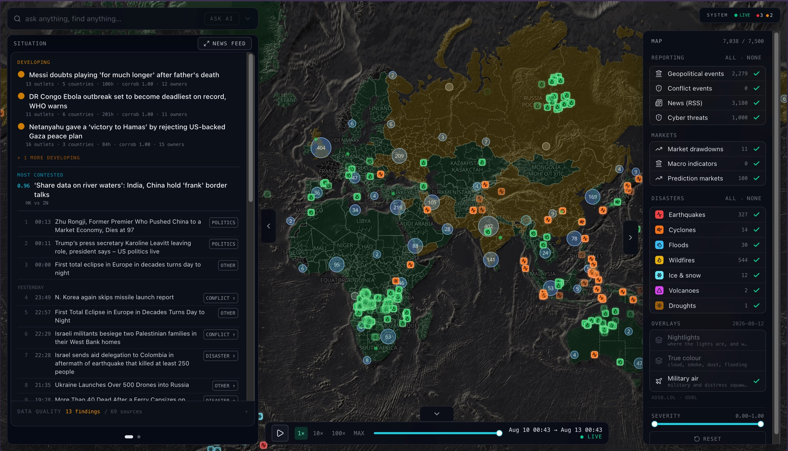

# Supplementary material

The whole system drawn once, then one chapter per stage.

Each box is a stage and one line saying what it does. A stage whose chapter is
written is a link — click it and the chapter opens below; the arrow at the foot
of the chapter brings you back. Stages still in plain text have no chapter yet.

The long version of this diagram — every box with its reasoning, thresholds and
measured counts — is kept at
[`docs/supplementary/system-diagram-detailed.md`](docs/supplementary/system-diagram-detailed.md).

Counts are read from the code on this branch, not from the design documents.
Where the two disagree, the code is right.

---

<pre>

════════════════════════════ PART I — INGEST ════════════════════════════

   ┌────────────────────────────────────────────────────────────────────────┐
   │ <a id="map-1" href="#ch-1">§1  THE CLOCK</a>                                                          │
   │    decides when every job runs — 84 timetable rows, all UTC            │
   └───────────────────────────────────┬────────────────────────────────────┘
                                       ▼
   ┌────────────────────────────────────────────────────────────────────────┐
   │ <a id="map-2" href="#ch-2">§2  THE BROKER</a>                                                         │
   │    a Redis mailbox holding jobs until a worker takes one               │
   └───────────────────────────────────┬────────────────────────────────────┘
                                       ▼
   ┌────────────────────────────────────────────────────────────────────────┐
   │ <a id="map-3" href="#ch-3">§3  THE SOURCES  —  FIND</a>                                               │
   │    67 places data comes from — 14 public APIs, 53 news sites           │
   └───────────────────────────────────┬────────────────────────────────────┘
                                       ▼
   ┌────────────────────────────────────────────────────────────────────────┐
   │ <a id="map-4" href="#ch-4">§4  THE REST GATE  —  SKIP BROKEN</a>                                      │
   │    a source that keeps failing is left alone for a while               │
   └───────────────────────────────────┬────────────────────────────────────┘
                                       ▼
   ┌────────────────────────────────────────────────────────────────────────┐
   │ <a id="map-5" href="#ch-5">§5  FETCH  —  DOWNLOAD</a>                                                 │
   │    download only — no database, no scoring, no side effects            │
   └───────────────────────────────────┬────────────────────────────────────┘
                                       ▼
   ┌────────────────────────────────────────────────────────────────────────┐
   │ <a id="map-6" href="#ch-6">§6  INLINE ENRICHMENT  —  UNDERSTAND</a>                                   │
   │    headlines get translated, placed on a map, read for tone            │
   └───────────────────────────────────┬────────────────────────────────────┘
                                       ▼
   ┌────────────────────────────────────────────────────────────────────────┐
   │ <a id="map-7" href="#ch-7">§7  PUBLICATION-TIME REPAIR  —  FIX TIME</a>                               │
   │    nothing may claim it happened in the future                         │
   └───────────────────────────────────┬────────────────────────────────────┘
                                       ▼
   ┌────────────────────────────────────────────────────────────────────────┐
   │ <a id="map-8" href="#ch-8">§8  FRESHNESS GATE  —  DROP STALE</a>                                      │
   │    rows too old for the live window are counted and dropped            │
   └───────────────────────────────────┬────────────────────────────────────┘
                                       ▼
   ┌────────────────────────────────────────────────────────────────────────┐
   │ <a id="map-9" href="#ch-9">§9  UPSERT AND DEDUP  —  SAVE</a>                                          │
   │    one row per source event — re-fetching updates, never doubles       │
   └───────────────────────────────────┬────────────────────────────────────┘
                                       ▼
   ┌────────────────────────────────────────────────────────────────────────┐
   │ <a id="map-10" href="#ch-10">§10  DID WE SEE ANYTHING?</a>                                              │
   │    a run that brings back nothing usable is recorded as such           │
   └───────────────────────────────────┬────────────────────────────────────┘
                                       ▼
   ┌────────────────────────────────────────────────────────────────────────┐
   │ <a id="map-11" href="#ch-11">§11  events  —  THE DATASET</a>                                            │
   │    the one table every source writes into, whatever it measured        │
   └───────────────────────────────────┬────────────────────────────────────┘
                                       ▼
   ┌────────────────────────────────────────────────────────────────────────┐
   │ <a id="map-12" href="#ch-12">§12  POST-INGEST ENRICHMENT  —  MAKE THE FEATURES</a>                      │
   │    hazard outlines, place names and severity added afterwards          │
   └───────────────────────────────────┬────────────────────────────────────┘
                                       ▼
   ┌────────────────────────────────────────────────────────────────────────┐
   │ <a id="map-13" href="#ch-13">§13  RETENTION AND CAP</a>                                                 │
   │    rows older than ~30 days are deleted; 30 GB hard ceiling            │
   └───────────────────────────────────┬────────────────────────────────────┘
                                       ▼

═══════════════════════════ PART II — ANALYSIS ═══════════════════════════

   ┌────────────────────────────────────────────────────────────────────────┐
   │ <a id="map-14" href="#ch-14">§14  THE COMPOSITE INDEX</a>                                               │
   │    four domains, z-scored against a country's own past, into one score │
   └───────────────────────────────────┬────────────────────────────────────┘
                                       ▼
   ┌────────────────────────────────────────────────────────────────────────┐
   │ <a id="map-15" href="#ch-15">§15  CII</a>                                                               │
   │    a same-day stress score: fixed country baseline plus today's events │
   └───────────────────────────────────┬────────────────────────────────────┘
                                       ▼
   ┌────────────────────────────────────────────────────────────────────────┐
   │ <a id="map-16" href="#ch-16">§16  STORIES</a>                                                           │
   │    headlines about the same event grouped by word overlap              │
   └───────────────────────────────────┬────────────────────────────────────┘
                                       ▼
   ┌────────────────────────────────────────────────────────────────────────┐
   │ <a id="map-17" href="#ch-17">§17  CORROBORATION + SENSOR CHECKS</a>                                     │
   │    how many independent owners tell it, and whether a sensor agrees    │
   └───────────────────────────────────┬────────────────────────────────────┘
                                       ▼
   ┌────────────────────────────────────────────────────────────────────────┐
   │ <a id="map-18" href="#ch-18">§18  DISAGREEMENT</a>                                                      │
   │    how differently countries word the same story                       │
   └───────────────────────────────────┬────────────────────────────────────┘
                                       ▼
   ┌────────────────────────────────────────────────────────────────────────┐
   │ <a id="map-19" href="#ch-19">§19  VALIDATOR</a>                                                         │
   │    a local model extracts the factual claims a story makes             │
   └───────────────────────────────────┬────────────────────────────────────┘
                                       ▼
   ┌────────────────────────────────────────────────────────────────────────┐
   │ <a id="map-20" href="#ch-20">§20  SEVERITY GRADING</a>                                                  │
   │    how much harm to people a headline reports                          │
   └───────────────────────────────────┬────────────────────────────────────┘
                                       ▼
   ┌────────────────────────────────────────────────────────────────────────┐
   │ <a id="map-21" href="#ch-21">§21  THE BRAIN</a>                                                         │
   │    a local model summarises stored rows and answers questions on them  │
   └───────────────────────────────────┬────────────────────────────────────┘
                                       ▼
   ┌────────────────────────────────────────────────────────────────────────┐
   │ <a id="map-22" href="#ch-22">§22  THE PREDICTION JOURNAL</a>                                            │
   │    forecasts written down before the outcome, never rewritten          │
   └───────────────────────────────────┬────────────────────────────────────┘
                                       ▼

═════════════════════ PART III — OFFLINE EVALUATION ═════════════════════

   ┌────────────────────────────────────────────────────────────────────────┐
   │ <a id="map-23" href="#ch-23">§23  GROUND TRUTH</a>                                                      │
   │    conflict records become the labels, in a table of their own         │
   └───────────────────────────────────┬────────────────────────────────────┘
                                       ▼
   ┌────────────────────────────────────────────────────────────────────────┐
   │ <a id="map-24" href="#ch-24">§24  THE PANEL</a>                                                         │
   │    one row per country per month — 31,637 of them                      │
   └───────────────────────────────────┬────────────────────────────────────┘
                                       ▼
   ┌────────────────────────────────────────────────────────────────────────┐
   │ <a id="map-25" href="#ch-25">§25  THE EXAMS</a>                                                         │
   │    the score against six baselines; the verdict is computed, not read  │
   └───────────────────────────────────┬────────────────────────────────────┘
                                       ▼
   ┌────────────────────────────────────────────────────────────────────────┐
   │ <a id="map-26" href="#ch-26">§26  HUMAN AUDIT SHEETS</a>                                                │
   │    a person hand-checks a sample of every model output                 │
   └───────────────────────────────────┬────────────────────────────────────┘
                                       ▼

═══════════════════════════ PART IV — SERVING ═══════════════════════════

   ┌────────────────────────────────────────────────────────────────────────┐
   │ <a id="map-27" href="#ch-27">§27  THE API</a>                                                           │
   │    31 endpoints — the only way anything leaves the database            │
   └───────────────────────────────────┬────────────────────────────────────┘
                                       ▼
   ┌────────────────────────────────────────────────────────────────────────┐
   │ <a id="map-28" href="#ch-28">§28  THE CONSOLE</a>                                                       │
   │    map, panels and a live stream of arriving rows                      │
   └───────────────────────────────────┬────────────────────────────────────┘
                                       ▼

════════════════════════ PART V — WHAT COMES OUT ════════════════════════

   ┌────────────────────────────────────────────────────────────────────────┐
   │ <a id="map-29" href="#ch-29">§29  THE ARTEFACTS</a>                                                     │
   │    the files under results/ that every published number comes from     │
   └───────────────────────────────────┬────────────────────────────────────┘
                                        
</pre>

# Chapters

One per stage of the diagram. Click a heading to open it, or click the stage
in the drawing above.

<details id="ch-1">
<summary><b>§1 &nbsp; The clock</b> &nbsp;—&nbsp; a program that watches the time and names the job that is due</summary>
<br>

**`app/tasks.py` → `beat_schedule`**

## What it is

**A custom program.** Not a file, not a cron job. It runs non-stop in its own
container, watches the clock, and when a job is due it publishes that job's
*name* to Redis for a worker to run. It does no work itself — no database, no
downloads, no scoring.

The library is **Celery**. Its three parts are all in the diagram: **beat** is
this scheduler, **broker** is Redis (§2), **worker** does the jobs (§3 onward).
`beat` means scheduler.

## The list it reads

`beat_schedule`, in `app/tasks.py`. That list is the whole schedule — nowhere
else sets a job's timing. One entry looks like this:

```python
"yfinance-5min": {                        # a name, for logs
    "task": "app.tasks.run_fetcher",      # which function
    "args": ["yfinance"],                 # what to give it
    "schedule": crontab(minute="*/5"),    # when
},
```

> **Every 5 minutes, run `run_fetcher`, and hand it the word `yfinance`.**

One entry is a **row**. A row is the only way anything gets scheduled — no row,
never runs. The 84 rows are not all written out one by one:

```
   84 rows
   ├── 31  written in the code
   │   ├── 14  data sources ─── the APIs and news feeds listed in §3
   │   └── 17  jobs that run on what those sources brought in:
   │           ├─ 3  scoring ......  the composite index · the CII ·
   │           │                     writing the day's forecasts down
   │           ├─ 5  story work ...  group headlines into stories ·
   │           │                     check a claim against a sensor ·
   │           │                     measure how differently countries
   │           │                     tell it · pull out the factual
   │           │                     claims · grade how harmful it is
   │           ├─ 2  local model ..  write the situation summary ·
   │           │                     summarise each new story
   │           ├─ 3  filling gaps .  hazard outlines · place names ·
   │           │                     article titles
   │           ├─ 3  self-checks ..  watchdog for silent sources ·
   │           │                     delete rows past 30 days ·
   │           │                     nightly audit of the data itself
   │           └─ 1  output ......   the weekly briefing
   └── 53  built from the news-site list
```

The 53 news rows are identical apart from the site name, so the code builds
them from a list of sites in `app/sources/rss_feeds.json` each time it starts.
The other 31 are all different from each other, so they are written out.

67 of those rows are sources. A **source** is one place data comes from: 14
**core** public APIs (share prices, quake magnitudes, satellite fire positions)
and 53 **RSS** news sites, RSS being the machine-readable list of latest
articles a site publishes. All 67 call the *same* function with a different
word, so adding a source needs no new code — add it to the JSON file and there
is one more row on the next restart.

## How often each row runs

```
   1 + 2 + 1 + 6 + 7 + 1 + 58 + 8  =  84
```

| Speed | Rows | What runs at that speed |
| --- | ---: | --- |
| every 5 min | 1 | Yahoo Finance share prices |
| every 15 min | 2 | the local language model writing a situation summary; the watchdog that notices a source has gone quiet |
| every 20 min | 1 | the local language model summarising new stories |
| every 15 min | 6 | USGS earthquakes · GDACS, the UN/EU **Global Disaster Alert and Coordination System** · GDELT, the **Global Database of Events, Language and Tone** · two abuse.ch cyber-threat feeds · hazard outlines for the map |
| every 30 min | 7 | grouping headlines into stories · checking a claim against a physical sensor reading · measuring how differently countries word a story · grading how harmful a headline is · resolving place names · NASA EONET, the **Earth Observatory Natural Event Tracker** · Polymarket odds |
| every 5 min | 1 | article titles for GDELT rows |
| hourly | 58 | the 53 RSS news sites · ACLED, the **Armed Conflict Location & Event Data Project** · NASA FIRMS, the **Fire Information for Resource Management System** · OpenSky aircraft positions · the **composite index** and the **CII (Country Instability Index)**, both computed here rather than downloaded |
| daily / weekly | 8 | FRED, **Federal Reserve Economic Data** · EM-DAT, the international disaster database · UK police crime records · the prediction journal · claim extraction · deleting expired rows · the nightly data check · the Monday briefing |

<details>
<summary><b>Why each speed is what it is</b></summary>
<br>

Cadence is set by how fast the **source** changes, not by how often the data
would be nice to have. Sampling faster than the source publishes adds no
information and costs a request. The code states this where it applies:

```python
# OpenSky ADS-B is aggregated to one row per country per hour (#496), and
# the hour-keyed upsert means extra polls within an hour only refresh the
# same rows. Polling every 2 min bought nothing but CPU, so: hourly.
```

</details>


<details>
<summary><b>Why the job's name travels as text, not as code</b></summary>
<br>

**The scheduler and the worker are two separate programs**, running at the same
time in different containers. Celery calls the scheduler `beat`, which is why
the container is named that:

```yaml
# docker-compose.yml
beat:    image: osint-backend:local    # the scheduler
worker:  image: osint-backend:local    # does the actual jobs
```

Two separate programs cannot hand each other Python objects. A function lives
inside one program's memory and the other cannot reach in. The only thing they
both touch is Redis, and Redis holds text.

```text
   SCHEDULER                 REDIS                    WORKER
                            (mailbox)

   09:05 — this is due
   writes a note  ──────▶  "run_fetcher"
                           "yfinance"     ──────▶  reads the note
                                                   looks up "run_fetcher"
                                                     in its own code
                                                   runs it on "yfinance"
```

The worker already has the code. Both containers are built from the same image,
so both already contain `run_fetcher`. The worker does not need to be sent the
function — only told which one, and a name is text.

Like texting someone "call the plumber": it works because they already have a
phone and know what a plumber is. You send the instruction, not the plumber.

#### Why the list lives in a file

The timetable is a `.py` file tracked in git, so changing how often a source is
sampled is a commit — a diff, an author, a date, a reason — rather than a
number typed into a server that nobody can account for six months later.

</details>

<details>
<summary><b>How the timing is written — cron, UTC, and staggering</b></summary>
<br>

`cron` describes *when* by pattern-matching the current time, rather than by
counting sleep intervals.

| Written as | Fires |
| --- | --- |
| `crontab(minute="*/5")` | every minute divisible by 5 — 288×/day |
| `crontab(minute="0,15,30,45")` | those four minutes each hour — 96×/day |
| `crontab(hour="*/1", minute=10)` | ten past every hour — 24×/day |
| `crontab(hour=7, minute=0)` | 07:00 — 1×/day |
| `crontab(day_of_week=1, hour=6, minute=30)` | Monday 06:30 — 1×/week |

The reason to prefer this over `sleep(300)` is drift. A sleep loop that spends
three seconds working per cycle slides progressively off the hour, so the
interval between observations is not the interval you declared. Cron pins the
observation to the wall clock, so **the time index stays evenly spaced** and a
per-hour or per-day aggregate is comparable to the one before it.

```python
# app/celery_app.py
app.conf.update(
    timezone="UTC",
    enable_utc=True,
)
```

**One clock for everything, so every timestamp means the same thing.**

Why not the alternatives:

| Instead | Why not |
| --- | --- |
| Local time | Daylight saving gives one night two 02:30s and another none, so a nightly job runs twice and then not at all |
| Each source's own timezone | Two sources cannot be compared without converting at every query |
| Unix epoch numbers | No daylight-saving problem either, but nobody can read a column of them |

Two entries, three minutes apart on purpose:

```python
"gdelt-15min":        crontab(minute="0,15,30,45"),
"gdelt-titles-5min":  crontab(minute="3,8,13,18,23,28,33,38,43,48,53,58"),
```

```python
#: Offset from the fetcher's :00/:15/:30/:45 so a batch of outbound
#: article requests never lands in the same minute as the export
#: download (#788).
```

The same idea, at scale, for the news feeds. The 53 RSS rows are not typed out
— they are generated:

```python
**{
    f"{slug}-hourly": {
        "task": "app.tasks.run_fetcher",
        "args": [slug],
        "schedule": crontab(hour="*/1", minute=(10 + idx * 2) % 60),
    }
    for idx, slug in enumerate(feed_cadence_map().keys())
},
```

`(10 + idx * 2) % 60` spreads the feeds two minutes apart around the hour —
feed 0 at :10, feed 1 at :12, feed 2 at :14. Without it, 53 outbound requests
leave in the same second every hour, which is a load spike aimed at other
people's servers.

</details>

<details>
<summary><b>What it costs, and what puts gaps in the data</b></summary>
<br>

**Cost.** 3,151 messages a day, from a process using 72 MB. The scheduler is
the cheapest part of the system, which is the point — one that did real work
could not be restarted casually.

**Restarts.** It records what already ran in a small file on disk, so a restart
picks up where it left off instead of re-firing everything.

**Three failures, and what each does to the data:**

| Failure | Effect on the data |
| --- | --- |
| The scheduler dies | nothing is sampled at all, and **no error appears anywhere** — no job started, so nothing failed. Silence looks exactly like health. |
| Workers die, scheduler lives | messages queue up and run late, so rows arrive bunched instead of evenly spaced |
| A job fails every run | the scheduler neither knows nor cares; the watchdog in §10 is what catches it |

Nothing sets an expiry on a queued message, so a two-day outage leaves roughly
6,300 of them to drain at once on return.

</details>

<details>
<summary><b>One problem found in this stage</b></summary>
<br>

The cadences are written down twice — once in `beat_schedule`, and again by
hand in `app/watchdog.py`. The watchdog uses its own copy to decide what "late"
means, so changing one file and not the other makes it quietly wrong about
lateness — in the one component whose whole purpose is noticing silence.

Recorded as a finding. Not changed.

</details>

---

<a href="#ch-1">▲ top of §1</a> <sub>(click the heading there to fold it)</sub> &nbsp;·&nbsp; <a href="#map-1">↑ back to §1 in the diagram</a>

</details>

<details id="ch-2">
<summary><b>§2 &nbsp; The broker</b> &nbsp;—&nbsp; the mailbox jobs wait in, and why one queue is deliberately slow</summary>
<br>

**Redis · two queues · `app/celery_app.py`**

## What it is

A **mailbox**. §1 left off with two separate programs that cannot hand each
other anything, so the scheduler drops a note here and a worker collects it
when free.

Redis is the program holding the mailbox. It keeps the notes in memory and
also writes them to disk (`--appendonly yes`), so a restart does not lose the
queue. It also carries the signal that tells the console a new row has landed,
which is what makes the map in §28 update without a reload.

Nothing decides anything here. It stores notes and hands them out in order.

## Two trays, not one

The two names in the code — `celery` and `analytics` — are labels somebody
typed, like marking two trays IN and URGENT. `celery` is simply the name the
library gives a queue when nobody picks one, which unhelpfully matches the
library's own name. Read them as **the fast tray** and **the heavy tray**.

```
   TRAY 1 — the fast one                TRAY 2 — the heavy one
   (code name: celery)                  (code name: analytics)
   ─────────────────────────────        ─────────────────────────────
   4 workers pulling from it            1 worker pulling from it
   2,595 notes/day          82%           556 notes/day          18%
   the 67 downloads, plus two           scoring, grouping headlines,
   light jobs                           running the local model
   small — mostly sitting idle          big — holds a lot of memory
   waiting for a website to reply       for as long as it runs
```

82% + 18% = 100% of the 3,151 notes a day from §1. Not a running total.

**What is in the fast tray.** Almost all of it is downloading — 67 sources,
one row each, plus two jobs light enough not to need the slow lane. What each
source actually is belongs to §3; here it is only how much traffic it makes.

| Fast-tray job | Per day | Kind of data |
| --- | ---: | --- |
| the 53 news sites, one row each | 1,272 | headlines |
| `yfinance` | 288 | market prices |
| `gdelt` | 96 | machine-coded world events |
| `usgs-quake` | 96 | earthquakes |
| `gdacs` | 96 | disaster alerts |
| `abuse-ch-urlhaus` | 96 | cyber indicators |
| `abuse-ch-feodo` | 96 | cyber indicators |
| `eonet` | 48 | natural events |
| `polymarket` | 48 | prediction-market odds |
| `acled` | 24 | conflict records |
| `nasa-firms` | 24 | satellite fire detections |
| `opensky-adsb` | 24 | aircraft positions |
| `fred` | 1 | economic series |
| `emdat` | 1 | disaster archive |
| `uk-police` | 1 | crime records |
| `enrich_gdelt_titles` | 288 | *light job* — fetch article titles |
| `ingest_watchdog` | 96 | *light job* — has a source gone quiet |
| **67 sources + 2 jobs** | **2,595** | |

Just under half of that traffic — 1,272 of 2,595 — is the news sites. None of it holds much memory: a
download is mostly a program waiting for a website to reply, which is why four
can run at once without competing for anything.

**What is in the heavy tray**, every job and how often:

| Heavy job | Per day | What it does |
| --- | ---: | --- |
| `enrich_footprints` | 96 | fetch the real outline of a hazard for the map |
| `brain_narrate` | 96 | local model writes the situation summary |
| `brain_enrich` | 72 | local model summarises each new story |
| `enrich_news_places` | 48 | work out which place a headline is about |
| `cluster_stories` | 48 | group headlines covering the same event |
| `sensor_check_stories` | 48 | check a story's claim against a sensor reading |
| `score_disagreement` | 48 | measure how differently countries word a story |
| `grade_news_severity` | 48 | grade how much harm a headline reports |
| `compute_composite` | 24 | **the composite index** — the score under test |
| `compute_cii` | 24 | **the CII** — the same-day stress score |
| `journal_daily` | 1 | write the day's forecasts down, before the outcome |
| `extract_claims` | 1 | pull the factual claims out of stories |
| `run_housekeeping` | 1 | delete rows past 30 days |
| `data_audit` | 1 | nightly check of the data against itself |
| `weekly_briefing` | 0 | Mondays only |
| **15 jobs** | **556** | |

§1 counted **17** jobs that are not downloads. Two of them are light enough to
stay in the fast tray: `enrich_gdelt_titles` (288/day, fetching article titles)
and `ingest_watchdog` (96/day, checking whether a source has gone quiet).
`17 − 2 = 15`.

## The speed limit

One worker means jobs run one after another, never side by side. So the whole
stage rests on a single question: **can the worker clear a job before the next
one arrives?**

§2's heavy tray takes 556 jobs a day, and a day is 1,440 minutes. One division,
read two ways:

```
     556 jobs  ÷  1,440 minutes   =   0.39 jobs arriving per minute
   1,440 minutes  ÷  556 jobs     =   one arriving every 2.6 minutes
```

0.39 and 2.6 are the same fact. **2.6 minutes is the worker's window.**

Now try three job durations. Every number below is worked out in the cell, so
nothing has to be taken on trust:

| If a job takes | it clears<br>**1 ÷ job time** per min | jobs arrive at<br>**556 ÷ 1440** | **arrive ÷ clear** | what that means | after 100 jobs |
| --- | ---: | ---: | ---: | --- | --- |
| 1.0 min | 1 ÷ 1.0 = **1.00** | 0.39 | 0.39 ÷ 1.00 = **0.39** | clearing faster than they arrive | queue still empty |
| 2.6 min | 1 ÷ 2.6 = **0.385** | 0.39 | 0.39 ÷ 0.385 = **1.01** | exactly on the line | empty, but no slack at all |
| 4.0 min | 1 ÷ 4.0 = **0.25** | 0.39 | 0.39 ÷ 0.25 = **1.56** | **arriving faster than they leave** | **140 minutes behind** |

That last column has to stay **below 1**. Below 1 the worker clears each job
before the next one arrives and is free to take it. Above 1 it is still busy
when the next one lands, so work stacks up and never unstacks. Nothing here
measures how long a job takes, so which side of the line this sits on is
unknown — recorded as a gap.

<details>
<summary><b>The issue we hit</b> &nbsp;—&nbsp; one tray had no worker at all (fixed)</summary>
<br>

Originally the command had no `-Q` at all:

```
celery -A app.celery_app worker
```

When `-Q` is missing, Celery falls back to a default tray — the one named
`celery`. So the worker went to tray 1 and started emptying it.

Nobody ever started a worker with `-Q analytics`.

```
   BEFORE                                AFTER

   tray 1 ──▶ worker ✅                  tray 1 ──▶ worker  (-Q celery)     ✅
   tray 2 ──▶  ???                       tray 2 ──▶ worker  (-Q analytics)  ✅
              (nobody)
```

</details>


---

<a href="#ch-2">▲ top of §2</a> <sub>(click the heading there to fold it)</sub> &nbsp;·&nbsp; <a href="#map-2">↑ back to §2 in the diagram</a>

</details>

<details id="ch-3">
<summary><b>§3 &nbsp; The sources</b> &nbsp;—&nbsp; the 67 places data comes from, and what each one feeds</summary>
<br>

**`app/fetcher_registry.py` · `app/sources/rss_feeds.json`**

## What it is

A **source** is one website or one public API this project downloads from.
There are 67, each with one row in the timetable from §1. Nothing else is
collected — if it is not in this table, the project has never seen it.

## All 67

The last column is the one that matters: **which score, if any, this source
ends up inside.**

| Source | What it gives | Where it is pulled from | Fetched | Feeds |
| --- | --- | --- | ---: | --- |
| `yfinance` | share prices, indices, currencies | `yf.Ticker(sym).history(...)` | 288/day | composite → market |
| `fred` | inflation, unemployment, yields | `fred.stlouisfed.org` API | 1/day | composite → market |
| `gdelt` | machine-coded world events | `data.gdeltproject.org/gdeltv2/lastupdate.txt` | 96/day | composite → geopolitical · CII |
| `acled` | recorded conflict events | `acleddata.com/api/acled/read`, or local `.csv`/`.xlsx` | 24/day | composite → geopolitical · **labels §23** |
| `usgs-quake` | earthquakes | `earthquake.usgs.gov/.../4.5_day.geojson` | 96/day | composite → hazard · CII |
| `gdacs` | cyclone, flood, drought alerts | `gdacs.org/xml/rss.xml` | 96/day | composite → hazard · CII |
| `eonet` | ongoing natural events | `eonet.gsfc.nasa.gov/api/v3/events` | 48/day | composite → hazard · CII |
| `emdat` | historical disaster archive | a local file, `EMDAT_CSV_PATH` | 1/day | composite → hazard |
| `nasa-firms` | satellite fire detections | `firms.modaps.eosdis.nasa.gov/api/area/csv/` | 24/day | composite → wildfire |
| `uk-police` | recorded crimes, 6 UK cities | `data.police.uk/api` | 1/day | CII only |
| 53 news sites | headlines | each site's RSS URL, one entry per site in `rss_feeds.json`:<br><br>`{`<br>&nbsp;&nbsp;`"source": "rss-bbc-world",`<br>&nbsp;&nbsp;`"url": "https://feeds.bbci.co.uk/news/world/rss.xml",`<br>&nbsp;&nbsp;`"pretty_name": "BBC World",`<br>&nbsp;&nbsp;`"cadence_min": 60,`<br>&nbsp;&nbsp;`"owner": "bbc",`<br>&nbsp;&nbsp;`"country": "GB",`<br>&nbsp;&nbsp;`"class": "mainstream"`<br>`}` | 24/day each | CII · §16 · §18 · §20 |
| `opensky-adsb` | aircraft positions | `opensky-network.org/api/states/all` | 24/day | **nothing scored** — map only |
| `abuse-ch-urlhaus` | URLs currently serving malware — from abuse.ch, a Swiss non-profit publishing free lists of known-bad internet infrastructure | `urlhaus.abuse.ch/downloads/csv_recent/` | 96/day | **nothing scored** — map only |
| `abuse-ch-feodo` | IP addresses running botnet control servers — same publisher, a blocklist of the kind a firewall loads | `feodotracker.abuse.ch/downloads/ipblocklist.csv` | 96/day | **nothing scored** — map only |
| `polymarket` | prediction-market odds | `gamma-api.polymarket.com/markets` | 48/day | **nothing scored** — map only |

Two things fall out of the last column.

**Four sources feed no score at all.** Aircraft, two cyber feeds and prediction
markets are collected, stored and drawn on the map, and no number in this
project depends on them.

**News does not enter the composite index.** News rows are stored with category
`NEWS`, and the composite only reads `market`, `geopolitical` and `hazard`. So
the 53 news sites — half of all traffic in §2's fast tray — feed the story and
disagreement work, and the CII, but **not the score that gets tested in §25.**

## What the 53 news sites are

| Property | Count | What is actually in it |
| --- | ---: | --- |
| Declared in `rss_feeds.json` | 55 | every feed the project knows about, on or off |
| Switched on | **53** | the 2 off are `rss-nhk-world` and `rss-rt-news`, parked as dead URLs |
| Publishing in English | **54 of 55** | everything except one |
| Publishing in another language | **1** | `rss-aljazeera-arabic` — Arabic |
| Countries the outlets sit in | **28** | GB×12 · US×6 · PK×4 · KE×3 · QA, FR, RU, IN, IL, NL ×2 each · then DE, JP, CA, AU, NZ, SG, SA, UA, ZA, EG, UY, MX, BR, KR, HK, ID, VN, TR with one apiece |
| Based in the UK or US | **18 of 55** | the GB×12 and US×6 above — a third of the sample from two countries |
| Distinct owners | **49** | 55 feeds, 49 owners: `bbc` and `reach` own 3 each, `aljazeera` and `russian-state` own 2 each, the other 45 own one apiece |
| By type | **4 groups** | 24 regional (Dawn, Geo, Times of India) · 16 mainstream (BBC, Reuters, Guardian) · 8 state-owned (RT, TASS, Arab News, SABC) · 7 independent (The Intercept, Middle East Eye, Antiwar.com) |

## What that costs a claim

The news sample is **almost entirely English-language**, and a third of it is
UK- or US-based. Every narrative measurement in this project is computed over
that sample.

So when §18 reports how differently countries word a story, it is in practice
reporting how differently **mostly Anglophone outlets** word it. That is a
narrower claim than "how the world reports this", and the difference is not
recoverable by weighting — a viewpoint that was never collected cannot be
re-weighted into existence.

---

<a href="#ch-3">▲ top of §3</a> <sub>(click the heading there to fold it)</sub> &nbsp;·&nbsp; <a href="#map-3">↑ back to §3 in the diagram</a>

</details>

<details id="ch-4">
<summary><b>§4 &nbsp; The rest gate</b> &nbsp;—&nbsp; a source that keeps failing is left alone for a while</summary>
<br>

**`app/ingest/quarantine.py`**

## What it is

Before any download starts, one question: **is this source resting?**

A source that has failed repeatedly is put to sleep for a while. When its turn
comes round again, the job returns immediately instead of making the request.

```
   timetable row fires
        │
        ▼
   is this source resting?
        │
        ├── yes ──▶ stop. one database query, no request made
        │
        └── no  ──▶ download (§5)
```

Without it, a feed that has been dead for a week is still asked every hour,
forever. One dead feed cost **420 requests in a week** before this existed.

## What counts as a failure worth resting for

Not everything. Only what the server actually said:

| Server replies | Meaning | Result |
| --- | --- | --- |
| `401` unauthorised | you may not have this | **permanent** rest |
| `403` forbidden | you may not have this | **permanent** rest |
| `404` not found | nothing is here | **permanent** rest — *usually, see below* |
| `410` gone | nothing is here, ever | **permanent** rest |
| `429` too many requests | slow down | **throttled** rest |
| anything else | timeout, network blip, 500 | no rest — try again next time |

## How long it rests

Each consecutive failure makes the nap longer:

| Failure | `permanent` waits | `throttled` waits |
| ---: | --- | --- |
| 1st | 1 hour | 15 minutes |
| 2nd | 6 hours | 1 hour |
| 3rd | 1 day | 6 hours |
| 4th | 3 days | 1 day |
| 5th+ | 7 days | 1 day |

Capped at **7 days**. One success wipes the record clean.

Throttled recovers faster on purpose — `429` means *later*, not *never*.

## The one exception

A `404` normally means "this is not here and will not be". That is true when a
URL names the same thing every time — `bbc.co.uk/rss.xml` is the same document
tomorrow.

**GDELT is different.** Its URL names the fifteen-minute window it covers, so
every fetch asks for a *different* file. A `404` there means **not published
yet** — a fact about this minute, not about the source.

Each fetcher declares which kind it is:

```python
stable_urls: bool = True     # same URL, same resource → 404 is permanent
```

GDELT sets it `False`. Without that flag, a `404` parked the largest feed in
the system for an hour, over a file that answered normally 200 minutes later.

`401` and `403` stay permanent either way — being forbidden is a fact about the
resource however it is addressed.

---

<a href="#ch-4">▲ top of §4</a> <sub>(click the heading there to fold it)</sub> &nbsp;·&nbsp; <a href="#map-4">↑ back to §4 in the diagram</a>

</details>

<details id="ch-5">
<summary><b>§5 &nbsp; Fetch</b> &nbsp;—&nbsp; download only, and turn 67 different shapes into one</summary>
<br>

**`app/sources/base.py` · `app/models.py`**

## What it is

Download the data, convert it, hand it back. Nothing else.

A fetcher **cannot** touch the database, Redis or the scheduler. It is a
function: URL in, list of rows out. That is enforced by the contract every
fetcher inherits:

```python
class Fetcher(ABC):
    """Pure HTTP-side fetcher. No database, no Redis, no Celery awareness."""

    name: str                      # the source slug, e.g. "gdelt"
    stable_urls: bool = True       # the §4 flag

    @abstractmethod
    def fetch(self) -> list[Event] | FetchBatch: ...
```

Why it matters: a fetcher can be run and tested with no database, no queue and
no network of its own. Fetching and storing fail separately, so a parsing bug
cannot be mistaken for a dead feed.

## The one shape everything becomes

67 sources publish 67 different formats — CSV, GeoJSON, RSS, XML, JSON. Each
source gets its own small translator, and all 67 produce the same output:

```
   USGS GeoJSON   ─┐
   BBC RSS        ─┤
   NASA CSV       ─┼──▶  67 translators  ──▶  one shape  ──▶  everything else
   ACLED xlsx     ─┤
   ...            ─┘
```

Everything after this stage only ever sees one shape:

```python
class Event(BaseModel):
    source: str            # which feed
    source_event_id: str   # that feed's own ID for this thing
    occurred_at: datetime  # when it happened
    fetched_at: datetime   # when we saw it
    category: Category     # market / geopolitical / hazard / news / cyber / ...
    severity: float | None # 0-1, and only comparable within one source
    country: str | None    # ISO code, or None
    lat / lon: float | None
    payload: dict          # the original record, kept whole
```

### Two timestamps, always

```
   occurred_at   when the world moved
   fetched_at    when this system found out
```

The gap between them is **reporting delay**. Some sources are fast — USGS
publishes an earthquake in seconds. Some are slow — UK police publish about two
months in arrears.

Store only one timestamp and that difference cannot be measured. Not reduced,
**invisible**: you cannot correct for something you never recorded. §3 already
showed the sources are not evenly fast, so this is a real bias, not a
hypothetical one.

### Two smaller ones

**Location can be empty.** `None` means *we do not know*. The alternative —
filling in the source's home country, or a country's centre point — would make
every downstream count wrong in a way nobody could see from the outside.

**The original is kept whole.** `payload` holds the source's own record, so the
translation is never the only copy. A translator bug can be fixed and the rows
re-derived without asking the source again — which for feeds that only publish
recent data would be impossible anyway.

### One warning

`severity` is **not** comparable across sources. A 0.8 earthquake and a 0.8
headline share a column name and a scale, and nothing else. §14 is where that
had to be dealt with.

## Three ways a fetch ends

```
   fetch()
     │
     ├── raises SourceMisconfiguredError  →  local setup is wrong
     │                                       (missing API key). Not a rest,
     │                                       not a retry — its own state.
     │
     ├── raises anything else             →  record failure, ask §4 whether
     │                                       this earns a rest
     │
     └── returns rows                     →  on to §6
```

## What happens when it fails

**Nothing is stored.** A failed fetch writes no rows at all — there is no half
a batch. The failure itself is recorded, and what happens next depends on what
broke:

| What broke | Recorded as | Retried? | What happens next |
| --- | --- | --- | --- |
| Local setup — missing API key, bad file path | `misconfigured` | no | a person has to fix it; the source is asked again on its next turn |
| Server said `401` `403` `404` `410` `429` | `failed`, with the error text | **no** | §4 puts the source to sleep, 1 hour to 7 days |
| Timeout, `500`, network blip | `failed`, with the error text | **yes — up to 5 times**, with a growing gap between attempts | if all five fail, the run is given up and the next scheduled turn starts fresh |

The difference between the last two rows is the point of §4. A `403` will still
be a `403` in five seconds, so retrying is five wasted requests — that is how
one dead feed spent 420 requests in a week. A timeout might not be a timeout in
five seconds, so it is worth asking again.

Two things are always true on failure:

- **No partial writes.** The database is untouched, so a later run cannot find
  half-imported data.
- **The failure is visible.** A counter goes up in `ingest_health` and the full
  error text is stored in `ingest_failures`, which is what lets §10 say *which*
  source is broken and *why* rather than just that something is quiet.

---

<a href="#ch-5">▲ top of §5</a> <sub>(click the heading there to fold it)</sub> &nbsp;·&nbsp; <a href="#map-5">↑ back to §5 in the diagram</a>

</details>

<details id="ch-6">
<summary><b>§6 &nbsp; Inline enrichment</b> &nbsp;—&nbsp; news headlines only, and the order is the point</summary>
<br>

**`app/sources/rss_news_fetcher.py` → `entry_to_event()`**

## What it is

A headline arrives as a line of text and nothing else. No country, no
coordinates, no idea how bad it is. Five steps add that, **while the row is
still being built** — before it reaches the database.

Only news rows go through this. The other 14 sources already publish structured
fields.

```
   "Blast kills 12 in Karachi market"
        │
        ├─ 1. translate   → English title, original kept in the payload
        │                   local model, only if the feed declares another language
        │
        ├─ 2. severity    → 0.0 - 1.0 plus a written reason
        │                   keyword rules — provisional, replaced later by §20
        │
        ├─ 3. locate      → country + lat/lon, or nothing at all
        │                   scored: country names and demonyms → regions →
        │                   city gazetteer → the outlet's own desk
        │
        ├─ 4. sentiment   → -1.0 to +1.0
        │                   VADER, over title + summary
        │
        └─ 5. names       → people, places, organisations
                            spaCy; empty list if the model is not installed
        │
        ▼
   one Event row, ready for §7
```

## What the severity keywords are

Step 2 is a word list, not a model. Three groups, checked hardest-first, each
with a floor the score cannot fall below:

| Group | Example words | Floor |
| --- | --- | ---: |
| **lethal** | killed · dead · died · fatal · fatalities · massacre · murdered · assassinated · executed · beheaded | **0.60** |
| **mass casualty** | the lethal words *plus* 10 or more deaths, or a massacre | **0.80** |
| **violent** | attack · explosion · blast · bomb · shooting · strike | below 0.60 |

Those floors land the row in one of five bands, which tile `[0, 1]` with no
gaps — every score belongs to exactly one:

| Band | Range | Means |
| --- | --- | --- |
| `routine` | 0.00 – 0.20 | policy, business, sport — nothing happened to anyone |
| `tension` | 0.20 – 0.40 | protest, strike, diplomatic rupture — no violence |
| `violence` | 0.40 – 0.60 | violence without confirmed death, or mass displacement |
| `grave` | 0.60 – 0.80 | confirmed deaths (1–9), or serious armed attack |
| `mass_casualty` | 0.80 – 1.00 | 10+ dead, massacre, mass-fatality disaster |

The example headline hits `kills` → lethal → floor `0.60`, and `12` deaths →
mass casualty → floor `0.80`. It lands in `mass_casualty`.

**Why a word list at all**, given §20 replaces it with a model: so no row is
ever unscored. A model needs a running local LLM and a spare few seconds; the
word list needs neither, and gives every row a defensible floor the moment it
arrives.

## What the sentiment number is

Step 4 is **VADER** — also a word list, scored and combined into one number
between `-1` and `+1` called the *compound* score.

| Compound | Label | Reading |
| --- | --- | --- |
| `≥ +0.05` | positive | |
| `-0.05` to `+0.05` | neutral | most factual headlines land here |
| `≤ -0.05` | negative | |

Two cautions, because this number is easy to over-read:

- It measures the **tone of the words**, not whether the event was good or bad.
  "Aid reaches survivors" scores positive; the event behind it is a disaster.
- The cut-offs are **VADER's own published defaults**, not tuned on this data,
  and the label exists so the console can colour a chip. Nothing scored is
  decided by it.

## Why translate first

This is the one ordering that is load-bearing, and it was learned the hard way.

Steps 2, 3 and 5 all read **English words**. The severity rules match English
keywords. The locator matches English country names and demonyms. The story
tokeniser in §16 splits English text.

Run them on an Arabic headline and every one of them finds nothing:

```
   Arabic desk, before translation was moved first:
     0 of 25 rows resolved to a country
     every row scored the same constant severity
```

A feed can therefore look perfectly healthy — rows arriving, no errors — while
contributing **nothing** to any measurement. Translation goes first so the four
steps after it have English to work with.

## Two refusals worth noting

**A story about nowhere gets no country.** The locator scores candidates; a
headline naming several countries and being about none of them resolves to
`None` rather than picking the highest score. An unknown location is recorded
as unknown.

**The severity here is provisional.** Keyword rules are a floor, not an answer —
they exist so a row is never unscored. §20 replaces the value with a model
grade, and §26 is where a person checks whether that grade is any good.

## What gets written down

Every enrichment records **which method produced it**, so a value can be traced
back to the version of the thing that made it:

```python
"enrichment_meta": {
    "sentiment_model": SENTIMENT_METHOD_VERSION,
    "ner_model":       NER_METHOD_VERSION if ner_available() else "none",
    "geo_model":       GEO_METHOD_VERSION,
}
```

`"none"` is stored honestly when a model is missing, rather than the field being
quietly absent — so a row enriched by nothing is distinguishable from a row
nothing was found in.

---

<a href="#ch-6">▲ top of §6</a> <sub>(click the heading there to fold it)</sub> &nbsp;·&nbsp; <a href="#map-6">↑ back to §6 in the diagram</a>

</details>

<details id="ch-7">
<summary><b>§7 &nbsp; Publication-time repair</b> &nbsp;—&nbsp; nothing is allowed to claim it happened in the future</summary>
<br>

**`app/ingest/publication_time.py`**

## What it is

Some feeds stamp an article with a time that has not happened yet — the feed
says `16:25` while the clock says `14:06`. Usually a timezone written wrongly:
one feed stamps local time and labels it `GMT`, so every row is exactly three
hours out.

Three things break if that reaches the database:

| | |
| --- | --- |
| **sorting** | newest-first puts future rows permanently on top; they never age out |
| **freshness** | "latest data is N minutes old" goes negative |
| **windows** | "the last 24 hours" includes things that have not happened |

## The two repairs

Worked on a real case: **four articles from one feed's front page**, read at
`14:06 UTC`. The feed says three of them were published at `16:25`, `16:17` and
`15:43` — all still in the future — and one at `13:57`, which is fine.

| | **shift** | **clamp** |
| --- | --- | --- |
| **What the word means** | move **every** row back by the **same** amount | force each future row to **now** |
| **When it is used** | 3+ rows ahead, and at least a quarter of the batch — so it looks like the feed is wrong, not one row | that test fails, so no pattern can be proved |
| **How far to move** | biggest lead is 139 min → round up to whole hours → **3 hours** | not a distance — every future row becomes `14:06` |
| **Which rows change** | **all** of them, even ones already in the past | **only** the ones dated ahead |
| **What the feed said → what gets stored** | `16:25` → `13:25`<br>`16:17` → `13:17`<br>`15:43` → `12:43`<br>`13:57` → `10:57` | `16:25` → `14:06`<br>`16:17` → `14:06`<br>`15:43` → `14:06`<br>`13:57` → `13:57` |
| **What ends up stored** | the **real publication time** — only the label was wrong | the time **we happened to look**; `occurred_at` becomes `fetched_at` |
| **PRO** | the stored time is true, so everything computed from it is too | always works, nothing has to be proved |
| **CON** | assumes the whole batch shares one offset — a feed mixing timezones would have correct rows moved wrongly | the true time is lost. A row really published `31 Jan 23:40` and clamped to `1 Feb 00:10` is counted in the wrong **month** by §14, and a row stamped *now* never looks old enough for §8 to reject |
| **What is done about the CON** | the thresholds must pass first, and the original timestamp is stored beside the corrected one, so any wrong shift is reversible | same — the original is kept, and clamps are counted separately from shifts, so a feed that is *always* clamped is identifiable as genuinely broken rather than merely mislabelled |

Nothing automatic acts on a feed that is always clamped. It is recorded so it
can be found, and that is all — noted as a gap.

## Two things worth knowing

**This is bias, not noise.** A feed three hours out is three hours out every
time. It does not average away, so it has to be corrected rather than tolerated.

**It runs before §8.** The freshness gate discards rows that are too old. Judge
a three-hour-wrong batch on its stated time and real news is thrown away to fix
a clock.

---

<a href="#ch-7">▲ top of §7</a> <sub>(click the heading there to fold it)</sub> &nbsp;·&nbsp; <a href="#map-7">↑ back to §7 in the diagram</a>

</details>

<details id="ch-8">
<summary><b>§8 &nbsp; The freshness gate</b> &nbsp;—&nbsp; how old is too old, decided per source</summary>
<br>

**`app/ingest/freshness.py`**

## What it is

Drop rows that are too old to count as current. One rule, one age limit —
except the limit is **different for each source**, and that is the only
interesting part of the stage.

## How old is too old

| Source | Typical age on arrival | Limit |
| --- | --- | --- |
| news, hazard | hours | **30 days** |
| `abuse-ch-*` | 30 days — republishes a rolling window | **45 days** |
| `yfinance`, `fred`, `emdat`, `acled`, `polymarket` | months to years | **none** |
| `uk-police` | a month, always — released monthly | **none** |

Two different reasons a source has no limit:

- **the history is the point** — a market or economic series exists to be long
- **the publisher is slow** — crime data is released monthly, so every row is
  already a month old when it becomes available

## Where the 30 comes from

Not chosen. Retention deletes rows at 30 days (§13), so the rule is: **do not
store what the next cleanup would delete anyway.**

Stricter would be worse. Legitimate news feeds routinely run 10–20 days behind,
and dropping real news leaves no trace — while the stale rows it removes are at
least visible in the data.

**Worth stating plainly:** the 30 days and the 30 GB ceiling are *settings*
(`RETENTION_*_DAYS`, `STORAGE_CAP_GB`), not limits the hardware imposes — the
machine this runs on has several times that free. So the number is a policy
choice, and this gate inherits it rather than deriving one of its own.

That matters for reading any result built on the live window. Change the
retention policy and this bound should be revisited with it, because its only
justification is *"do not store what the cleanup deletes"* — remove the cleanup
and the justification goes with it.

---

<a href="#ch-8">▲ top of §8</a> <sub>(click the heading there to fold it)</sub> &nbsp;·&nbsp; <a href="#map-8">↑ back to §8 in the diagram</a>

</details>

<details id="ch-9">
<summary><b>§9 &nbsp; Upsert and dedup</b> &nbsp;—&nbsp; one row per real event, however many times it arrives</summary>
<br>

**`app/persistence.py`**

## The two words

| Word | Short for | Means |
| --- | --- | --- |
| **upsert** | *update* + *insert* | if this row is new, insert it; if it already exists, update the one that is there |
| **dedup** | *deduplicate* | make sure the same real-world event never becomes two rows |

## Why this stage exists at all

The same event arrives **again and again**. That is normal, not a bug:

- a news feed keeps a story on its front page for hours; every hourly fetch sees it
- a hazard feed re-publishes every *active* cyclone on every 15-minute fetch
- a fetch is retried after a timeout and pulls the same batch twice

Without this stage, one cyclone becomes **96 rows a day**.

**Why that is fatal, in data terms:** §14 scores a country by counting events
per month. A duplicated event is a **fabricated observation** — the count goes
up, the z-score goes up, the score goes up, and nothing in the data reveals it.
Deduplication is not tidiness. It is the difference between counting events and
counting fetches.

## How a duplicate is recognised

Every row carries the source's **own** identifier for the thing:

```python
source            = "gdacs"
source_event_id   = "CY-1001234"     # GDACS's ID, not one we invented
```

The pair `(source, source_event_id)` is declared unique in the database. Two
rows with the same pair are, by definition, the same event.

Using **the source's own ID** matters. Anything we invented — a hash of the
title, say — would break the moment the source edited a typo in that title, and
the same event would become two.

## What happens on a repeat

```sql
INSERT ... ON CONFLICT (source, source_event_id) DO UPDATE
```

Plain English: *try to insert; if that pair already exists, update the existing
row instead.* The database does this in one operation, so there is no gap where
a second process could insert a duplicate.

But **not every column is updated**, and that split is the substance of the
stage:

| Column group | On a repeat | Why |
| --- | --- | --- |
| **identity** — `source`, `source_event_id`, `category` | **never touched** | these define which row it is; changing them would make it a different event |
| **live values** — `occurred_at`, `fetched_at`, `severity`, `confidence`, `keywords` | **replaced** | an ongoing cyclone must not freeze at its first-seen state and drop out of the live window |
| **location** — `country`, `lat`, `lon` | **news replaces, others keep** | empty from news is an *answer* — the locator re-read the text and it no longer supports that country; empty from an API is a *gap*, and §12 may fill it later. Never overwrite an answer with a gap |
| **enrichment inside `payload`** — the extras *we* added after the row landed: real map outline, place name, sentiment, entity names (22 keys, listed in `ENRICHMENT_PAYLOAD_KEYS`) | **protected** — the incoming payload is *merged over* the stored one, never replaces it | The fetcher never sends these back; it does not know they exist. Replacing the whole payload deletes them — and did: a hazard feed re-published every active event every 15 minutes and each refresh wiped the real map geometry. Silent for weeks — nothing errored, the map just showed circles instead of shapes. A test walks the key list, so a refresh that starts destroying enrichment fails the suite instead of quietly emptying the map |

### Replace, or merge

`payload` is the only column with **two writers** — the fetcher, and our own
later jobs. Replacing it lets the fetcher speak for both:

```python
stored   = {"title": "Cyclone Alpha", "footprint_geojson": {...}, "sentiment": -0.4}
incoming = {"title": "Cyclone Alpha"}      # the fetcher only knows its own half

replace = incoming                 # {"title": ...}      — geometry and sentiment gone
merge   = {**stored, **incoming}   # keeps both, and upstream still wins on `title`
```

The database does exactly that merge, one operator:

```sql
payload = events.payload || EXCLUDED.payload   -- stored first, incoming layered on top
```

Read it left to right: start from what is stored, let the incoming keys
overwrite the ones they mention, leave the rest alone. Every other column keeps
plain `= EXCLUDED.x`, because for those the source is the only writer.

<details>
<summary>The 22 protected keys, by family</summary>
<br>

Every one is written *after* the row lands, by a job the fetcher knows nothing
about. Note the shape: each enrichment stores the **value** and also **who,
when, how sure** — provenance, so a published number can be traced back to what
produced it.

| Family | Keys | What they hold |
| --- | --- | --- |
| **map shape** (3) | `footprint_geojson`, `footprint_checked_at`, `footprint_source_key` | the real hazard outline instead of a drawn circle; when we last looked, so a source with no geometry is not asked forever; which upstream document it came from |
| **verified place** (13) | `place_name`, `place_wikidata_id`, `place_description`, `place_locations`, `place_candidate_count`, `place_verified_count`, `place_rejections`, `place_rejected_count`, `place_checked_at`, `place_model`, `place_resolution`, `geo_precision`, `geo_source` | the location label plus an external ID so it is auditable; every point verified for one story; how many names the text proposed, how many survived, and the evidence for each refusal; when, by which model, at what exactness, from which authority |
| **text read** (4) | `sentiment`, `sentiment_label`, `entities`, `city` | tone as a number in −1…+1 and as a word; names pulled out of the text; city recovered from the headline |
| **bookkeeping** (2) | `news_scope`, `enrichment_meta` | local / national / international reach; which enricher and model wrote all of the above |

3 + 13 + 4 + 2 = **22**.

</details>

## Duplicates inside one batch

A single fetch can contain the same ID twice. The database cannot update the
same key twice in one statement, so duplicates are collapsed **before** the
write — keeping the newest by `fetched_at`, then `occurred_at`.

Rows with **no** ID are passed through untouched: they cannot collide with
anything, and dropping them would lose real events.

## Scale

Written **1,000 rows per statement** — 12 columns × 1,000 = 12,000 bound
parameters, well under the database's 65,535 limit, with headroom for more
columns later.

---

<a href="#ch-9">▲ top of §9</a> <sub>(click the heading there to fold it)</sub> &nbsp;·&nbsp; <a href="#map-9">↑ back to §9 in the diagram</a>

</details>

<details id="ch-10">
<summary><b>§10 &nbsp; Did we see anything?</b> &nbsp;—&nbsp; a run that brings back nothing usable is recorded as such</summary>
<br>

**`app/ingest/outcome.py`**, **`app/watchdog.py`**

The diary of whether the system was actually working. It writes one word per
run, and something else reads that diary and shouts when a source has gone
quiet.

## One fetch, 10:00

```
10:00   ask a news feed         → replies with 50 stories
        §8 checks the dates     → 8 too old, thrown away
        §9 writes the other 42  → 12 brand new, 30 already stored
```

Four numbers now exist:

```
fetched   = 50     handed to us
rejected  =  8     §8 threw away
accepted  = 42     §9 wrote
inserted  = 12     never seen before
```

Those four are **all §10 works with**. It never looks at the stories themselves.

## Step 1 — hand the numbers over

```python
result = ingest_outcome.classify(
    fetched=50, accepted=42, affected=42, inserted=12, rejected=8
)
```

## Step 2 — pick the word

```python
if accepted == 0:      state = "empty"
elif inserted > 0:     state = "new_data"
else:                  state = "unchanged"
```

Three questions in order:

| Question | Our fetch | Result |
| --- | --- | --- |
| did we write **anything**? | 42 — yes | not `empty` |
| was any of it **new**? | 12 — yes | → **`new_data`** |
| otherwise | — | `unchanged` |

A broken hour goes the other way: `fetched = 0, accepted = 0` → `accepted == 0`
→ **`empty`**. The feed replied and nothing arrived. Recording that as *empty*
rather than *success* is the entire point of the stage.

Two more words exist for cases the counts cannot describe: `misconfigured` (a
key or setting of ours is missing — never the source's fault, never a reason to
quarantine it in §4) and `failed` (the run raised: timeout, bad status,
unreadable body).

Impossible counts are refused rather than stored, so a bug upstream cannot
produce a healthy-looking row:

```python
if inserted > affected or affected > accepted:
    raise ValueError("inserted <= affected <= accepted must hold")
if accepted + rejected > fetched:
    raise ValueError("accepted and rejected rows cannot exceed fetched rows")
```

## Step 3 — write it down

```python
row.last_state   = "new_data"
row.last_checked = 10:00      # we looked
row.last_success = 10:00      # it replied
row.last_output  = 10:00      # data actually arrived
```

Three separate facts. On a good hour all three read the same time, which is why
keeping them apart looks pointless — until something breaks.

## Why three clocks

The interesting failure is the quiet one: the feed keeps replying, with nothing
inside.

| Time | Replies? | Rows | `last_checked` | `last_success` | `last_output` |
| --- | --- | --- | --- | --- | --- |
| 10:00 | yes | 42 | 10:00 | 10:00 | **10:00** |
| 11:00 | yes | 0 | 11:00 | 11:00 | 10:00 |
| 12:00 | yes | 0 | 12:00 | 12:00 | 10:00 |
| 13:00 | yes | 0 | 13:00 | 13:00 | 10:00 |

The last column is frozen while the other two look perfectly fresh.

- watching `last_success` → *"replied a minute ago, all good"* — the lie
- watching `last_output` → *"no data for three hours"* — the truth

The alarm reads the frozen one. Two static archives are the exception, judged on
`last_success`, because they genuinely publish nothing most days.

## How long before shouting

```python
threshold = cadence_min * 6
is_stale  = (now - last_output) > threshold
```

A fixed number of minutes cannot work — sources run at different speeds:

| Source runs every | Silent for | Shout? |
| --- | --- | --- |
| 15 min | 90 min (6 × 15) | yes |
| 60 min | 6 hours | yes |
| once a day | 6 days | yes |

Six and not one: a single missed run is normal — a slow response, a restart. Six
in a row is not. Give it six chances before crying wolf.

Each crash also stores one row of evidence — error class, message, request URL,
response body — so a gap can be explained later instead of guessed at.

## Why any of this matters

Months later something reads:

```
country X, March:  0 events
```

| The diary says | The zero means |
| --- | --- |
| `new_data` all month | we were watching, nothing happened — a **real** zero |
| `empty` all month | we were not watching — a **fake** zero |

Same number, opposite meaning, and nothing inside the events table separates
them. §14 counts events per country per month, so the fake zero is published as
*that country was calm*.

**A bias, not noise:** a broken feed is not spread evenly. One feed covers one
region, so when it breaks that region alone loses events and the index reads
"improving".

<details>
<summary><b>Issue</b> &nbsp;—&nbsp; a table nothing writes</summary>
<br>

`dead_letter_queue` is created by the first migration and described in the
architecture notes: after five failed retries a job was to be parked there and
re-enqueued hourly. Nothing writes to it, and no such worker exists.

It is a leftover from an **event-driven** design, where a failed message is lost
work that has to be stored and replayed. Here the scheduler (§1) fires the same
source again in 5, 15 or 60 minutes anyway — the next run does the same job, so
there is nothing to replay. The problem that turned out to be real was the
opposite one, a broken source being hammered five times a run forever, and that
is what quarantine (§4) solved.

</details>

---

<a href="#ch-10">▲ top of §10</a> <sub>(click the heading there to fold it)</sub> &nbsp;·&nbsp; <a href="#map-10">↑ back to §10 in the diagram</a>

</details>

<details id="ch-11">
<summary><b>§11 &nbsp; events</b> &nbsp;—&nbsp; the one table every source writes into, whatever it measured</summary>
<br>

**`app/db_models.py`**, **`app/models.py`**

Everything before this chapter was collection. This is **the dataset** — the
thing every later number is computed from.

## The problem

An earthquake, a share price, a headline and a malware address have nothing in
common. Give each its own table and §14 — *how many events in this country last
month* — has to join 67 tables with 67 date columns and 67 ideas of location.
Every new source rewrites every query downstream.

So there is one table, and all 67 conform to it.

## The 12 columns

| Column | Holds | Note |
| --- | --- | --- |
| `source` | who reported it | `gdacs`, `rss-bbc` |
| `source_event_id` | their own id for it | with `source`, unique — §9's key |
| `occurred_at` | when it **happened** | |
| `fetched_at` | when **we pulled it** | a different fact, kept separate |
| `updated_at` | when the row last changed | |
| `category` | which of ten kinds | `hazard`, `market`, `news`, `cyber`, … |
| `severity` | how bad, **0…1** | nullable |
| `confidence` | how sure, **0…1** | nullable |
| `keywords` | tags the fetcher attaches | not free text — a short fixed list per source: `["usgs", "earthquake", "m6"]`, `["^VIX", "etf", "drawdown"]`. Search matches on list overlap, so they are filters, not description |
| `country` | the country **code**, two letters | `GB`, `US`, `SD` — the ISO 3166-1 standard, uppercase enforced. A code and not a name because *UK*, *United Kingdom* and *Britain* would group as three different countries. Nullable |
| `lat`, `lon` | where | nullable |
| `payload` | the original record, untouched | JSON. The receipt: everything the source sent, so nothing is lost in flattening and a row can be re-read later. Also where §12's enrichment is stored — the 22 protected keys of §9 |

## The same shape, three different worlds

```
earthquake   source="usgs-quake"  category="hazard"  severity=0.62
                                  payload={"magnitude": 6.1, "depth_km": 10}

market move  source="yfinance"    category="market"  severity=0.30
                                  payload={"ticker": "^VIX", "close": 24.1}

headline     source="rss-bbc"     category="news"    severity=0.45
                                  payload={"title": "…", "url": "…"}
```

Nothing downstream asks what kind of thing a row is. It asks *how many rows,
this country, this month, severity above this* — and the question is written
once for all 67 sources.

This is **tidy data**: one row is one observation, one column is one variable,
and a variable means the same thing in every row.

## Two kinds of storage in one row

```
┌──────────────────────────────────────────┬────────────────────┐
│  11 fixed columns  —  relational         │  payload  —  JSON  │
│  the analysis view, same for everyone    │  the raw receipt   │
│  indexed, constrained, groupable         │  source-specific   │
└──────────────────────────────────────────┴────────────────────┘
```

| | Relational columns | JSON bag |
| --- | --- | --- |
| shape | fixed, every row identical | free-form, every source different |
| good at | filtering, grouping, counting | holding whatever arrived |
| enforced | `severity BETWEEN 0 AND 1` | nothing |

One rule decides which side a field lands on:

> **anything you filter, group or count by is a real column. Everything else
> goes in the bag.**

`country`, `occurred_at`, `category` and `severity` are columns because §14
groups by them. `magnitude` and `ticker` are in the bag because nothing does.

## Two choices a reader should push on

| Choice | What it buys | What it costs |
| --- | --- | --- |
| **`severity` forced onto 0…1** for every category | a quake and a volatility spike become addable — *sum the severity for this country* is only legal because of it | the mapping is a modelling choice, not a measurement. §20 is where it is made, and where it should be challenged |
| **geography allowed to be empty** | a market event has no country, and inventing one would be fabricating data | *events in country X* silently excludes every unplaced row — a country total counts **located** events, not all of them |

## Enforced by the database, not by trust

```sql
UNIQUE (source, source_event_id)      -- §9's dedup
CHECK  (severity   BETWEEN 0 AND 1)   -- the scale cannot drift
CHECK  (confidence BETWEEN 0 AND 1)
```

---

<a href="#ch-11">▲ top of §11</a> <sub>(click the heading there to fold it)</sub> &nbsp;·&nbsp; <a href="#map-11">↑ back to §11 in the diagram</a>

</details>

<details id="ch-12">
<summary><b>§12 &nbsp; Post-ingest enrichment</b> &nbsp;—&nbsp; hazard outlines, place names and severity added afterwards</summary>
<br>

**`app/enrichment/`**, **`app/tasks.py`**

Raw data is never what an analysis eats. A source hands over a headline; the
analysis needs a number. Turning *"50 killed in a market bombing"* into
`severity = 0.85`, or a headline into `country = SD`, is **feature
engineering** — building the variables that will actually be counted. This is
where most of this project's features are made.

## Why they are not made during the fetch

A fetch has seconds, and must not make an extra network call per row.

| Feature | Needs | Cost per row |
| --- | --- | --- |
| real hazard outline | a second download from upstream | one HTTP call |
| verified place name | a lookup against an external knowledge base | one HTTP call |
| severity of a headline | a local language model reading the text | seconds of compute |
| story gist and embedding | another model pass | seconds of compute |

Inline, one slow lookup would stall a whole batch. So the row lands
**incomplete** and scheduled jobs come back for it.

## Every job, the same five steps

```
1. ask the database which rows are still missing this field
2. take a batch — a limit, never everything
3. fetch or compute the value
4. merge it into payload      (never replace — §9's protected keys)
5. one row fails → leave it, take it again next run
```

| Job | Runs at | Fills |
| --- | --- | --- |
| `enrich_footprints` | :11 :26 :41 :56 | real hazard geometry; without it the map draws a circle |
| `enrich_news_places` | :13 :43 | verified place name and an external id for it |
| `enrich_gdelt_titles` | every 5 min | article titles the feed does not ship |
| `grade_news_severity` | :14 :44 | severity 0–1 for a headline, by local model |
| `brain_enrich` | every 20 min | story summaries and embeddings |

The minute offsets are deliberate: none of them land in the same minute as the
fetchers that feed them.

## What this does to the data

**A feature made late is a feature that is partly missing.** Every enriched
column has a coverage rate below 100%, and blank means *not looked at yet* — not
*zero*. Reading an ungraded headline as severity 0 is the §10 mistake one level
up.

**Coverage can correlate with what is being measured.** Each job takes a limited
batch, so anything beyond capacity waits. If busy days overflow, the busiest
days end up the least enriched — the feature is weakest exactly when the world
is loudest. That is why the severity job is sized against arrivals rather than
left to drift: roughly 2,400 headlines a day of capacity against roughly 863
arriving, so a backlog drains instead of growing.

**Some columns are estimates wearing the same clothes as observations.**

| Column | Where it comes from | Status |
| --- | --- | --- |
| `occurred_at` | the source stated it | observation |
| `lat`, `lon` on a hazard | the source stated it | observation |
| `severity` of a headline | a model judged it | **estimate, with error** |
| `country` of a headline | a locator inferred it | **estimate, with error** |

Nothing in the schema marks which is which. An estimated feature needs an
accuracy claim attached to it, which is what §20 and §26 are for.

**A feature can expire.** A cyclone's stored outline was true when fetched and
wrong a day later — GDACS publishes a moving hazard as a numbered series, each
episode at its own URL, so the stored shape is a photograph of where the storm
was when first seen. Comparing the stored source key with the event's current
one costs a single string comparison and refetches only what actually moved.

---

<a href="#ch-12">▲ top of §12</a> <sub>(click the heading there to fold it)</sub> &nbsp;·&nbsp; <a href="#map-12">↑ back to §12 in the diagram</a>

</details>

<details id="ch-13">
<summary><b>§13 &nbsp; Retention and the cap</b> &nbsp;—&nbsp; old rows are deleted, so the dataset is a window and not an archive</summary>
<br>

**`app/housekeeping.py`**

Every stage before this one adds rows. This one deletes them — which makes the
dataset **a rolling window of the last 30 days**, not everything ever collected.

One job, nightly at 03:00 UTC, two rules:

```python
delete_rows_older_than(30, "days")        # rule 1 — age
if db_size > 30_GB:                       # rule 2 — size
    delete_oldest_whole_days_until_it_fits()
```

## What is kept, and for how long

| Data | Kept | Why |
| --- | --- | --- |
| news, GDELT, hazard, cyber, aviation, live markets | 30 days | a feed — a deleted row comes back on the next poll |
| FRED macro, EM-DAT disasters | **forever** | history — a deleted year does not come back |

## What that does to your numbers

| | |
| --- | --- |
| **Short memory** | *"how did this change over the past year?"* cannot be answered from `events`. The year is not in there — which is why Part III builds its own tables (§23, §24) |
| **Deleting a row deletes its labels** | a severity score (§12) is stored inside the row it describes, so a batch graded by hand today is gone in a month |
| **A falling count may be a delete** | not a quieter world. `housekeeping_runs` records what each night removed |

## It is a setting, not a fact

30 days and 30 GB are configuration (`RETENTION_*_DAYS`, `STORAGE_CAP_GB`),
picked for a small disk. **The deployment that runs all the time is not using
them** — it is set to a much longer window, so it is building a real long-term
series rather than a rolling month. Same code, two different datasets.

So **every count in this document is a count inside a 30-day window** unless it
says otherwise.

---

<a href="#ch-13">▲ top of §13</a> <sub>(click the heading there to fold it)</sub> &nbsp;·&nbsp; <a href="#map-13">↑ back to §13 in the diagram</a>

</details>

<details id="ch-14">
<summary><b>§14 &nbsp; The composite index</b> &nbsp;—&nbsp; four topics, scored against a country's own past, into one number</summary>
<br>

**`app/composite/`**

One number per country per month, 0 to 1: **how unusual is this country this
month, compared with its own past?**

## First, where this actually runs

The formula needs **12 months** of a country's past. The live table keeps
**30 days** (§13). So live it has nothing to compare against, and returns 0.5
for every country.

Where it does work is `app/composite/backfill.py`, which builds 2015→2024
history **in memory** — the rows never touch the events table, so retention
cannot eat them — and then runs the exact same pipeline. That is what feeds
`results/data/panel.csv` and the exams in Part III.

So the composite is an **offline evaluation instrument, not a live dashboard
number.**

## Step 1 — one number per month

Forget everything else. Pick one country. Count how much bad stuff happened,
each month:

```
Jan Feb Mar Apr May Jun Jul Aug Sep Oct Nov Dec  |  NOW
 17  24  15  21  28  16  23  12  25  19  26  14  |   35
```

Two numbers come out of that row, and **neither is chosen — both are
calculated from the row itself.**

**Its normal** — the average:

```
17+24+15+21+28+16+23+12+25+19+26+14 = 240
240 ÷ 12 = 20                       ← normal
```

**Its wobble** — how far a typical month sits away from 20:

```
distances from 20:  3  4  5  1  8  4  3  8  5  1  6  6
54 ÷ 12 = 4.5                       ← wobble, call it 5
```

So this country's normal month is **20**, and it usually swings about **5**
either way. This month is **35**.

<table><tr><td>

**Basis** Twelve months is convention — a year covers a full cycle of seasons.<br>
**Strength** Long enough that one busy month cannot become the new normal.<br>
**Weakness** Never tested against 6 or 24. The choice is inherited, not measured.<br>
**Instead** Re-run the panel at several window lengths and report whether the ranking moves.

</td></tr></table>

Two upstream choices decide what the monthly count even is. For the discrete
topics the month takes its **worst** event, not its average — measured, because
a month holding one severe US hazard reads 0.095 as a mean and 1.000 as a max.
Conflict is counted as `log10(1 + count)` rather than by graded severity —
also measured: the grades barely moved (sd 0.05) while the counts did (sd 0.80).

<table><tr><td>

**Basis** Both **measured**, each against the alternative it replaced.<br>
**Strength** Neither is a guess, and both quote the number that settled it.<br>
**Weakness** Worst-of-month lets one mislabelled row decide the month; a log makes 10 versus 100 events read closer than they are.<br>
**Instead** The month's 90th percentile instead of its max; raw counts instead of the log, letting the z-score handle scale.

</td></tr></table>

## Step 2 — the z-score = "how many wobbles above normal?"

```
z = (this month − normal) ÷ wobble
z = (35        − 20    ) ÷ 5
z = 15 ÷ 5
z = 3
```

`35 − 20 = 15` — fifteen above normal. A typical swing is only 5, so fifteen is
**three typical swings**.

Three wobbles above its own normal. That's it. That's the whole z-score.

- `z = 0` → totally normal month
- `z = 1` → a bit high
- `z = 3` → very unusual
- `z = −2` → unusually quiet

> **The wobble** is the standard deviation. The textbook recipe squares the
> distances before averaging and square-roots at the end — 5.02 for the row
> above — but *"how far a typical month sits from normal"* is the right picture
> and lands in the same place.

**Why divide by the wobble at all?** Because "15 above normal" means nothing on
its own. Another country could also be 15 above normal, but if *its* typical
swing is 15, that is a Tuesday — `z = 1`. Same gap, completely different
meaning. Dividing asks *is this big **for them***.


<table><tr><td>

**Basis** Z-scoring against a country's own past is standard practice for composite indicators.<br>
**Strength** Makes four unlike things addable, and asks *unusual **for them***, so a loud country is not permanently top.<br>
**Weakness** Needs a long history — exactly what retention (§13) deletes, which is why the live score is 0.5 for everyone.<br>
**Instead** Rank inside the country's own history: coarser, but survives on a few months of data.

</td></tr></table>

## Step 3 — four scores → one score

You do that same sum four times — markets, conflict, disasters, fires. You get
four z-scores. Then just average them:

```
markets   z = 0
conflict  z = 3
disasters z = 1
fires     z = 0

average = (0 + 3 + 1 + 0) ÷ 4 = 1
```

The `0.25 ×` in the code is the ÷ 4. Each of the four counts equally.

<table><tr><td>

**Basis** Declared before the results were looked at.<br>
**Strength** Pre-registered — it was not tuned until it looked good.<br>
**Weakness** Equal weights assume the four topics are equally informative, which nobody has shown.<br>
**Instead** Derive weights from the data — PCA or an entropy weighting — and compare the two rankings.

</td></tr></table>

## Step 4 — squash it into 0–1

Average z can be anything — could be −6, could be +9. Ugly to display. So
divide **1** by **(1 + e^−z)**. That is the whole thing.

`e` is a fixed constant, 2.718…, like π — nothing to choose. All you need to
know is `e^−z` **shrinks fast** as z grows:

```
z = 0     e^-0 = 1.00     1 ÷ (1 + 1.00) = 1 ÷ 2.00  = 0.50
z = 1     e^-1 = 0.37     1 ÷ (1 + 0.37) = 1 ÷ 1.37  = 0.73
z = 2     e^-2 = 0.14     1 ÷ (1 + 0.14) = 1 ÷ 1.14  = 0.88
z = 3     e^-3 = 0.05     1 ÷ (1 + 0.05) = 1 ÷ 1.05  = 0.95
z = -1    e^1  = 2.72     1 ÷ (1 + 2.72) = 1 ÷ 3.72  = 0.27
```

Normal month → **0.5**. Bad month → toward **1**. Quiet month → toward **0**.
Our example: average z = 1 → score **0.73**.

It can never leave 0–1: the bottom of the fraction is always more than 1, so
the answer is always under 1.


<table><tr><td>

**Basis** Reasoned: the average z is unbounded and needs a display scale.<br>
**Strength** Bounded by construction — no clipping, and 0.5 always means normal.<br>
**Weakness** Flattens past about z = 3, so a bad month and a far worse one both read ~0.95.<br>
**Instead** Clip z at ±3 and rescale straight: keeps the extremes apart, loses the smooth middle.

</td></tr></table>

**One catch.** By z = 3 the shrinking number is already 0.05; at z = 5 it is
0.007. Both are nearly nothing, so the scores land at 0.95 and 0.99. A disaster
and a much worse disaster look the same. That is the price of a tidy 0-to-1
number.

## Whole thing in one breath

> Take a country's last 12 months. Work out its normal and its wobble. Ask how
> many wobbles off normal this month is. Do that for four topics, average the
> four, squash to 0–1.

---

<a href="#ch-14">▲ top of §14</a> <sub>(click the heading there to fold it)</sub> &nbsp;·&nbsp; <a href="#map-14">↑ back to §14 in the diagram</a>

</details>

<details id="ch-15">
<summary><b>§15 &nbsp; CII</b> &nbsp;—&nbsp; a same-day stress score: fixed country baseline plus today's events</summary>
<br>

**`app/cii/`** — CII is the **Country Instability Index**.

One number per country per day, 0 to 1: **how stressed is this country
today?** It reads the last 24 hours and runs every hour.

Unlike §14, it needs no historical series. It is **backend-live but
frontend-disconnected**.

## What kind of model is it?

CII is a **rule-based scoring pipeline**, not a trained machine-learning model.
No target variable is predicted and no parameters are fitted from examples.
The code counts events, transforms those counts, applies fixed weights, then
adds a fixed country starting value.

| Data-science term | Meaning here |
|---|---|
| observation | one country during one rolling 24-hour window |
| features | seven event counts from that window |
| feature engineering | turning those counts into four 0–100 sub-scores |
| parameters | hand-set baselines, multipliers, ceilings and weights |
| output | one score between 0 and 1 |

```text
raw event rows
      │
      ▼
keep last 24 hours
      │
      ▼
group by country ──► count seven features
      │
      ▼
transform counts ──► four sub-scores, each 0–100
      │
      ▼
weighted average ──► event_score, 0–100
      │
      ▼
add fixed baseline ──► divide by 100 ──► CII, 0–1 ──► dashboard
```

The complete calculation is:

```python
event_score = (
    0.25 * unrest
    + 0.30 * conflict
    + 0.20 * security
    + 0.25 * information
)

CII = (0.40 * baseline + 0.60 * event_score) / 100
```

The first set of weights totals 1. The second set also totals 1. Read the last
line as **40% fixed country starting value + 60% today's events**.

## Stage 1 — build one feature row

For each country, the worker turns the last 24 hours into seven counts:

| feature | what gets counted | example |
|---|---|---:|
| `unrest_signals` | news and UK Police rows with `severity ≥ 0.6` | 18 |
| `unrest_fatalities` | protest and riot fatalities stored in those rows | 4 |
| `conflict_events` | GDELT rows with CAMEO root code 18, 19 or 20 | 52 |
| `quake_m5_plus` | USGS earthquakes of magnitude 5+ | 0 |
| `hazard_orange_red` | GDACS orange or red alerts | 1 |
| `eonet_events` | active EONET hazards | 3 |
| `news_volume` | all news and UK Police rows | 140 |

In ordinary data-science notation, that country-day is one feature vector:

```python
x = {
    "unrest_signals": 18,
    "unrest_fatalities": 4,
    "conflict_events": 52,
    "quake_m5_plus": 0,
    "hazard_orange_red": 1,
    "eonet_events": 3,
    "news_volume": 140,
}
```

Nothing here is a probability. These are counts from the event table.

## Stage 2 — look up two country constants

Each country has a `baseline` and a `multiplier`:

```python
CII_BASELINES = {
    "UA": CiiBaseline(baseline=46.0, multiplier=1.25),
    "SY": CiiBaseline(baseline=48.0, multiplier=1.30),
    "US": CiiBaseline(baseline=18.0, multiplier=0.60),
    "GB": CiiBaseline(baseline=14.0, multiplier=0.65),
    ...                              # 31 countries
}
DEFAULT_CII_BASELINE = CiiBaseline(15.0, 1.0)   # anywhere else
```

| constant | role | changes during scoring? |
|---|---|---|
| `baseline` | starting level before today's events | no |
| `multiplier` | makes event counts count more or less | no |

For Ukraine, the lookup always returns `baseline=46` and `multiplier=1.25`.

<table><tr><td>

**Basis** **None recorded.** Not fitted, not cited, not elicited — these values first appear in the code that implemented the formula, and the outside index this formula follows publishes different ones.<br>
**Strength** None. This is the largest unsupported term in the score.<br>
**Weakness** The baseline carries 40% of every score, and the multiplier decides by hand that the same event load means more in one country than another.<br>
**Instead** Derive the baseline from something countable — years of recorded conflict or hazard rows per country — and replace the multiplier with the §14 approach, comparing a country against its own past.

</td></tr></table>

For a country missing from the table, it returns `15` and `1.0`.

## Stage 3 — transform counts into four sub-scores

Raw counts use different scales. Four earthquakes and 140 headlines cannot be
averaged directly. CII first maps each topic onto the same 0–100 range.

Three topics use a logarithm:

```python
def log_score(count, multiplier, ceiling):
    scaled_count = count * multiplier
    score = log(1 + scaled_count) / log(1 + ceiling) * 100
    return min(100, score)
```

`ceiling` means **the hand-set count that becomes 100**.

<table><tr><td>

**Basis** The three ceilings — 60, 400 and 300 — are typed in as *this reads as fully saturated*.<br>
**Strength** Explicit, and all three sit in one place.<br>
**Weakness** Where a ceiling sits decides the whole curve, and none of the three was measured.<br>
**Instead** Set each from the observed distribution — for example the 95th percentile of that source's daily counts.

</td></tr></table>

 The logarithm gives
large gains to early events and smaller gains to later events:

```
rows      plain %     log %
   0         0%         0
  10         3%        42%    ← ten headlines already means something
  50        17%        69%
 175        58%        91%
 300       100%       100%    ← the ceiling
600       200%       100%    ← capped, cannot go past full
```

The `1 +` makes a zero count valid because `log(1) = 0`. The final `min`
clips every sub-score at 100.

The scoring code, shortened without changing its logic, is:

```python
unrest = min(
    100,
    log_score(unrest_signals, multiplier, ceiling=60)
    + min(30, sqrt(unrest_fatalities) * 6),
)

conflict = log_score(conflict_events, multiplier, ceiling=400)

security = min(
    100,
    (
        min(60, quake_m5_plus * 6)
        + min(60, hazard_orange_red * 12)
        + min(40, eonet_events * 4)
    ) * multiplier,
)

information = log_score(news_volume, multiplier, ceiling=300)
```

Using the example feature row and Ukraine's multiplier:

| sub-score | short calculation | result |
|---|---|---:|
| unrest | log-scaled 18 signals + fatality bump for 4 deaths | 88.8 |
| conflict | log-scaled 52 events | 69.9 |
| security | `(0×6 + 1×12 + 3×4) × 1.25` | 30.0 |
| information | log-scaled 140 rows | 90.6 |

For example, the information score is:

```text
140 rows × 1.25 = 175 scaled rows
log(1 + 175) / log(1 + 300) × 100 = 90.6
```

## Stage 4 — combine the four sub-scores

This is a weighted average. Conflict receives the largest weight:

| sub-score | value | weight | contribution |
|---|---:|---:|---:|
| unrest | 88.8 | 0.25 | 22.20 |
| conflict | 69.9 | 0.30 | 20.97 |
| security | 30.0 | 0.20 | 6.00 |
| information | 90.6 | 0.25 | 22.65 |
| **event score** | | **1.00** | **71.82** |

```
0.25(88.8) + 0.30(69.9) + 0.20(30.0) + 0.25(90.6) = 71.82   ← event_score
```

<table><tr><td>

**Basis** **Copied** from an outside published index and checked against it — these four match.<br>
**Strength** A real source, not an invention.<br>
**Weakness** Near-equal weights assume the four parts are equally informative, which the source does not show either.<br>
**Instead** Weight by how much each part actually varies, or report the four parts unweighted alongside.

</td></tr></table>

## Stage 5 — add the baseline

Now blend the fixed baseline with today's event score:

```
40% of 46     = 18.40
60% of 71.82  = 43.09
                -----
                61.49   →   ÷ 100   →   0.61                ← total
```

The dashboard shows `0.61`. This means **0.61 under this scoring recipe**. It
does not mean a 61% probability of instability.

<table><tr><td>

**Basis** **Copied** from the same outside index — the 40/60 split matches it exactly.<br>
**Strength** A real source, not an invention.<br>
**Weakness** The source gives no derivation either, so this is a citation, not evidence.<br>
**Instead** Report the score at several splits, so a reader sees how much rests on this one.

</td></tr></table>


## One complete output row

```json
{
  "baseline": 46.0,
  "multiplier": 1.25,
  "unrest": 88.8,
  "conflict": 69.9,
  "security": 30.0,
  "information": 90.6,
  "event_score": 71.82,
  "total": 0.61,
  "method_version": "cii.v1.2"
}
```

## Whole thing in one breath

> Count seven kinds of event for one country over 24 hours. Convert them into
> four 0–100 sub-scores. Take their weighted average. Mix 60% of that result
> with a 40% fixed country baseline. Divide by 100.

## §14 and §15 side by side

| data-science question | §14 composite | §15 CII |
|---|---|---|
| what does it ask? | unusual **for this country**? | high under fixed rules **today**? |
| one observation | country-month | country-day |
| input window | 1 month | rolling 24 hours |
| reference | country's previous 12 months | fixed baseline and thresholds |
| main method | z-score, average, logistic transform | counts, log transforms, weighted average |
| parameters estimated from data? | mean and standard deviation | no |
| runs live? | no | yes |
| appears on dashboard? | no | **yes** |

## Limitations

Written down as found, not fixed.

| problem | evidence in this implementation | consequence | data-science name |
|---|---|---|---|
| **1. 40% is hand-set.** | Ukraine is 46, the UK 14 and an unlisted country 15. The values were not fitted from data, cited to a source or elicited from experts. | A large part of the result is assumed rather than measured. | **unvalidated prior** |
| **2. The baseline creates a floor.** | With zero events, Ukraine still scores `0.40 × 46 ÷ 100 = 0.184`. | The score cannot fall below its country-specific starting level. | **floor artefact** |
| **3. Rankings are partly pre-decided.** | With identical zero-event inputs, Ukraine scores 0.184 and the UK 0.056. | One country can outrank another before today's data arrives. | **constant-driven comparison** |
| **4. The attribution does not match the numbers.** | The 40/60 and 25/30/20/25 weights match the outside published index. Six checked country values were all different. Its multiplier also runs in the opposite direction: below 1 for fragile countries there, but above 1 here. | Readers may believe the source supports values that it does not contain. | **miscitation** |
| **5. The score is not validated.** | CII appears in no panel, journal, ranking or results file. It has no reported accuracy or calibration measure. | Software tests can show that the formula runs correctly; they cannot show that the score measures real instability. | **no validation** |

The first three problems can be seen with one empty feature row:

```python
no_events = CiiInputs()

compute_cii("UA", no_events).total  # 0.184
compute_cii("GB", no_events).total  # 0.056
compute_cii("ZZ", no_events).total  # 0.060: default baseline
```

That is the key contrast. §14 estimates a country's normal level from data but
cannot run live. CII runs live every hour, but its displayed score has not been
validated against an external outcome.

---

<a href="#ch-15">▲ top of §15</a> <sub>(click the heading there to fold it)</sub> &nbsp;·&nbsp; <a href="#map-15">↑ back to §15 in the diagram</a>

</details>

<details id="ch-16">
<summary><b>§16 &nbsp; Stories</b> &nbsp;—&nbsp; headlines about the same event put into one group</summary>
<br>

**`app/stories/` → `stories-v1.0`**

## What it is

Many outlets can report one event with different headlines. §16 decides which
headlines belong together.

In data-science terms, this is **unsupervised text clustering**:

| term | meaning here |
|---|---|
| observation | one headline |
| features | the useful words in it |
| vector | those words turned into numbers |
| cluster | one group of matching headlines |
| centroid | the average vector of the group |

There are no labelled answers, no training set and no LLM. Fixed rules run
every 30 minutes over the latest **72 hours** of news.

## Step 1 — turn the headline into tokens

A **token** is one word or number.

The tokeniser makes the headline lowercase, then removes:

- glue words such as `the`, `and` and `for`;
- words shorter than three characters;
- headline formulas such as `what we know about`;
- dates and publication-slot words.

The last two rules came from real failures.

“What we know so far” was rare in one 6,561-headline window. TF-IDF therefore
treated its words as important, and explainers about unrelated events matched.

A dated daily bulletin caused the same problem. Its editions became one
94-filing “story”. After cleanup:

```text
Latest news bulletin | August 12th, 2026 – Evening
                         ↓
                       news
```

One token is too little, so the headline is left out.

## Step 2 — turn tokens into a vector

Each token gets a **TF-IDF** weight:

```text
TF  = how often it appears in this headline
IDF = how rare it is across the 72-hour window
```

Common token → low weight. Rare token → high weight.

The weighted tokens form a **vector**: a small bag of words with numbers
attached.

## Step 3 — compare vectors

**Cosine similarity** compares the direction of two vectors. It runs from 0 to
1:

| worked example | rough score |
|---|---:|
| unrelated | 0.0–0.1 |
| same story, different angle | about 0.4 |
| close paraphrase | 0.6 or more |

These are examples, not universal score bands.

Cosine ignores headline length. A short headline can still match a long one.


<table><tr><td>

**Basis** tf-idf with cosine similarity is standard text-clustering practice, decades old.<br>
**Strength** Cheap, deterministic, and needs no training data or model.<br>
**Weakness** It matches words, not meaning — two reports of one event that share no vocabulary stay apart.<br>
**Instead** Sentence embeddings, at the cost of a model to run and a result you cannot check by eye.

</td></tr></table>

## Step 4 — make the groups

Articles are processed in `(occurred_at, event_id)` order.

For each article:

1. compare it with every story's centroid;
2. choose the highest score;
3. join when the score is at least **0.35** and the guards pass;
4. otherwise start a new story.

When a headline joins, the centroid — the group's average — moves slightly.

Two trade-offs matter:

- **Nothing is moved later.** A wrong early join stays wrong.
- **Order matters.** A different processing order can make different groups.

## Three guards

Cosine alone made bad joins. Three rules now sit in front of it:

| guard | value | simple rule |
|---|---:|---|
| minimum content | 2 | A headline needs two distinct useful tokens. |
| minimum shared content | 2 | The headline and story must share two distinct tokens. |
| country subject share | 30% | A country must be named by 30% of the story members that name any country before it defines the story's place. |

The country rule stops obvious mistakes. For example, a story about an
earthquake in Japan should not accept a similar headline about an earthquake
in Colombia. If a headline names no country, the system makes no guess.

These guards were added after a newsletter title and an unrelated market
article formed one false six-day story.

## What gets written

The database saves each story and which news rows belong to it.

A small audit checked 30 groups. Twenty-eight made sense. Two joined separate
updates from the same continuing topic.

## Why this matters

§17 and §18 analyse these groups. Joining unrelated headlines creates fake
support. Splitting one story hides real support.

---

<a href="#ch-16">▲ top of §16</a> <sub>(click the heading there to fold it)</sub> &nbsp;·&nbsp; <a href="#map-16">↑ back to §16 in the diagram</a>

</details>

<details id="ch-17">
<summary><b>§17 &nbsp; Corroboration</b> &nbsp;—&nbsp; how many independent owners tell a story, and whether a sensor agrees</summary>
<br>

**`app/stories/independence.py` + `app/corroboration/`**

## What it is

Every current story from §16 gets a **corroboration score**. It starts at 0
and can move towards 1, but never reaches 1.

The score asks two questions:

1. How many independent owners tell the story?
2. Did a sensor or market-data feed confirm a checkable claim?

In data-science terms, this is a **rule-based score**, not a trained model:

| term | meaning here |
|---|---|
| observation | one story |
| features | owner count and sensor flag |
| parameters | fixed formula and sensor rules |
| output | one score between 0 and 1 |
| training labels | none |

It is not a probability of truth. A score of `0.75` does not mean “75% likely
to be true”. It only means `0.75` under this recipe.

## Step 1 — count owners, not outlets

Several outlets may belong to one owner or repeat one wire report. They are not
independent tellers, so §17 counts distinct **recorded owners**.

The rule is:

> **Independence must be recorded. It is never guessed from missing data.**

A source with no ownership record adds zero to `owner_count`. It is still
ingested, stored and shown; it simply does not raise the score.

The old code treated every unknown source as its own owner. Ten unknown blogs
could therefore produce `owner_count = 10` and a score of `0.998`. The current
rule gives those ten sources `owner_count = 0` until their ownership is known.

<table><tr><td>

**Basis** Reasoned, after that failure was found in the code.<br>
**Strength** Independence has to be established, so a missing record can no longer inflate confidence.<br>
**Weakness** A single outlet with a genuine scoop scores the same as an empty rumour.<br>
**Instead** Let a recorded per-outlet reliability prior lift a trusted lone source — the plan names one, it was never built.

</td></tr></table>

### Where the owner facts are kept

Two places, and neither is a model.

**The registry** — `app/sources/rss_feeds.json`, one entry per feed. 55 feeds
today, 49 distinct owners, none missing:

```json
{"source": "rss-bbc-world",     "owner": "bbc",   "syndication": null}
{"source": "rss-bbc-uk",        "owner": "bbc",   "syndication": null}
{"source": "rss-reuters-world", "owner": "yahoo", "syndication": "reuters"}
```

`syndication` beats `owner`: the third feed is Yahoo-hosted but carries
Reuters wire, so the owner of the *words* is `reuters`. And the two BBC feeds
resolve to one owner, so a story carrying both counts them once.

**The story row** — `stories.owner_count`, a plain integer column written by
the clustering job (§16) and recomputed from the story's members every run. It
sits beside two other counts, and the three are deliberately different:

```
member_count  8   ← eight articles
outlet_count  5   ← from five feeds
owner_count   2   ← belonging to two owners
```

The scorer reads that column, tallies the story's sensor verdicts, and writes
to its own table — `story_corroboration` — where the score is stored together
with the inputs that produced it:

```json
{"owner_count": 3, "sensor_confirmed": true, "confirmed_claims": 1,
 "unconfirmed_claims": 0, "claims_checked": 1,
 "method_version": "corroboration-v1.0"}
```

That is why a line in the report can read *3 owners, 0.875*: the evidence
travels with the number, and `method_version` records which recipe produced
it.

## Step 2 — check claims against data

The worker searches all member headlines for fixed keywords. Word boundaries
stop a short keyword from firing inside a different word.

| detected claim | checked against |
|---|---|
| earthquake | `usgs-quake` rows |
| wildfire | `nasa-firms` fire rows |
| flood, cyclone, tsunami, volcano or landslide | `gdacs` disaster rows |
| market crash | `yfinance` rows with severity at least `0.5` |

A match needs the correct feed, the correct country and the correct time:

```text
story begins − 72 hours  →  sensor row  →  story ends + 6 hours
```

The lookback allows the physical event to happen before the news. The small
lookahead allows for clock differences and slow sensor feeds.

<table><tr><td>

**Basis** The **direction** is reasoned; the **size** is not measured.<br>
**Strength** The asymmetry is right — a quake happens before it is reported, never long after.<br>
**Weakness** 72 h is wide enough to admit a coincidence, and it is the same 72 h as the clustering window, which is nowhere stated as deliberate.<br>
**Instead** Measure the real gap between sensor row and first headline across the confirmed matches, then set the window from that.

</td></tr></table>


Geography is required. A quake somewhere in the world cannot confirm a quake
story somewhere else. If the story has no country, its claim is marked
`unconfirmed`.

No detected claim means no sensor-check row. The story still receives an
owner-only score.

## Step 3 — calculate the score

```text
effective owners = max(owner_count, 1)
sensor flag      = 1 if any claim is confirmed, otherwise 0

doubt = 2 ^ -(effective owners - 1 + sensor flag)
score = 1 - doubt
```

Plain version: **each extra owner halves the doubt. One machine confirmation
halves it once more.**

<table><tr><td>

**Basis** Declared in writing **before** any score was looked at, then version-stamped.<br>
**Strength** Pre-registered — it cannot have been tuned until the numbers looked good.<br>
**Weakness** Never checked against outcomes: nobody has shown 0.875 stories are truer than 0.5 ones.<br>
**Instead** Fit the shape on stories with known outcomes, or carry a per-outlet reliability prior — the plan names one, it was never built.

</td></tr></table>


| owners | sensor confirmed? | doubt | score |
|---:|:---:|---:|---:|
| 0 or 1 | no | 1.000 | 0.000 |
| 2 | no | 0.500 | 0.500 |
| 3 | no | 0.250 | 0.750 |
| 4 | no | 0.125 | 0.875 |
| 2 | yes | 0.250 | 0.750 |

Three choices matter:

- **One teller is the starting point.** It scores `0.0` without a sensor.
- **The sensor is a flag, not a count.** Two confirmed claims do not add two
  bonuses.
- **Unconfirmed does not lower the score.** Sensor coverage is incomplete, so
  no match is not evidence that the story is false.

A confirmed verdict is never downgraded. The evidence snapshot stays after an
old sensor row is removed by retention.

## What the saved run found

`results/reports/sensor-checks-report.md` records a real run:

```text
30 stories with checkable claims
30 claims checked
 0 new confirmations
28 unconfirmed
 2 earlier confirmations kept
1905 stories scored
```

`unconfirmed` has a narrow meaning: **no matching sensor row was found**. It
does not mean “probably false”. A real event may be missing from the available
feeds, the story may have no country, or a keyword may describe something the
rule cannot understand.

Those verdicts and the score are shown in the story interface, so the reader
sees the evidence behind the number rather than a bare verdict.

## Why this matters

Ten outlets can look like ten independent witnesses when they are really one
owner repeated ten times. A global sensor feed can also create false support
when time matches but place does not.

§17 blocks both shortcuts. It measures **independent telling plus machine
support**. It does not decide truth.

---

<a href="#ch-17">▲ top of §17</a> <sub>(click the heading there to fold it)</sub> &nbsp;·&nbsp; <a href="#map-17">↑ back to §17 in the diagram</a>

</details>

<details id="ch-18">
<summary><b>§18 &nbsp; Disagreement</b> &nbsp;—&nbsp; how differently countries word the same story</summary>
<br>

**`app/disagreement/`**

## The idea, before any maths

One event. Three outlets, in three countries:

```text
GB outlet:  "US launches strikes on Iranian nuclear sites"
RU outlet:  "Washington attacks Iran in violation of international law"
IN outlet:  "US strikes Iran; oil prices surge"
```

Throw away the glue words (`on`, `in`, `of`) and look at what is left:

```text
GB:  us  launches  strikes  iranian  nuclear  sites
RU:  washington  attacks  iran  violation  international  law
IN:  us  strikes  iran  oil  prices  surge
```

Now count the shared words, pair by pair:

```text
GB vs RU:  0 shared    ← "us" vs "washington", "strikes" vs "attacks"
GB vs IN:  2 shared    ← us, strikes
RU vs IN:  1 shared    ← iran
```

**GB and RU reported the same event without using one word in common.** That
is the thing this chapter measures.

Turn each pair into a distance — 0 = identical wording, 1 = nothing shared —
and average them:

```text
GB vs RU:  0.95
GB vs IN:  0.55
RU vs IN:  0.80
             ----
average  =  0.77     ← this story's divergence
```

That average is the whole output: **one number per story, 0 to 1.**

## What it is for

| the number says | what that usually means |
|---|---|
| **low**, near 0.1 | everyone used nearly the same words — usually one wire report republished many times |
| **high**, near 0.8 | each country wrote its own words for the same event |

So the question is: **is this one story told many times, or many stories about
one event?** §17 counts *how many* tell it; §18 asks whether they tell it the
same way.

## The maths behind "shared words"

Same idea, done properly:

1. **Weight the words** — rare words count more than common ones (`kramatorsk`
   over `iran`). That is tf-idf, the same vectorizer §16 clusters with.
2. **One vector per country** — average a country's headlines into one
   **centroid**: "how Britain worded this story".
3. **Distance per pair** — cosine gives similarity, so `1 - cosine` is
   distance. Average the pairs.

```python
centroids = {country: mean_vector(headlines) for country, headlines in groups.items()}

pair_distances = {
    f"{a}|{b}": 1.0 - cosine(centroids[a], centroids[b])
    for a, b in combinations(sorted(centroids), 2)
}
divergence = sum(pair_distances.values()) / len(pair_distances)
```

Each pair's own distance is kept, not just the average — the monthly roll-up
feeds on those. It is §16's cosine read backwards: similarity to group
headlines, distance to separate tellings.

<table><tr><td>

**Basis** Standard practice — cosine distance between group centroids.<br>
**Strength** Free: the vectors already exist from clustering, and it is reproducible.<br>
**Weakness** Compares **words, not meaning**. "Washington attacks Iran" and "US strikes Iran" share nothing, so part of any high score is just synonyms.<br>
**Instead** A stance or sentiment model per country group — at the cost of a result nobody can check by eye.

</td></tr></table>

## Where it runs

| | |
|---|---|
| groups by | the **outlet's** home country from the feed registry — `rss-bbc-world` is GB |
| when | every 30 min, at :22 and :52, offset from the sensor checks |
| reads | stories in the same 72-hour window §16 clusters in |
| writes | `story_disagreement` per story, then `disagreement_pairs` per (country A, country B, month) |

A feed with no recorded country is left out rather than guessed, and a story
with fewer than two countries gets **no row at all**.

<table><tr><td>

**Basis** Reasoned, consistent with §17: a fact nobody recorded is not assumed.<br>
**Strength** An outlet of unknown origin cannot invent a country's point of view.<br>
**Weakness** A group can be one headline — `RU:1` means one article stands for Russia.<br>
**Instead** Require a minimum group size, and score even fewer stories.

</td></tr></table>

## What the real run found

```text
1992 stories in window · 185 scored · 1807 single-country · 83 roll-up rows
```

**Only 9% get a score** — the rest were told by one country's outlets. Correct
refusal, but it means the measure only ever sees internationally covered news.

```text
0.872  CA:1 FR:1 GB:4 IN:1 PK:1 RU:4 UY:1   Ceasefire with Iran no longer in effect
0.853  IN:1 PK:1                            ICC seeks explanation from ECB over Stokes video
```

The first is what it was built for. The second is the honest counter-example —
a cricket-administration row scoring almost as high. **A high number is not
evidence of contested politics**, only of different wording.

## Where the number goes

Each pair's monthly mean becomes a per-country exposure, logged as a
prediction and used raw — it is already in [0, 1], so there is no calibration
step. Divergence data exists only from the RSS era, so unlike §14 there is
**no historical backtest**: it is a forward exam, graded when the window
matures.

---

<a href="#ch-18">▲ top of §18</a> <sub>(click the heading there to fold it)</sub> &nbsp;·&nbsp; <a href="#map-18">↑ back to §18 in the diagram</a>

</details>

<details id="ch-19">
<summary><b>§19 &nbsp; Validator</b> &nbsp;—&nbsp; a local model extracts the factual claims a story makes</summary>
<br>

**`app/validator/`**

## What the model is for

Everything before this chapter **counts**. This one **reads** — it turns words
into fields:

```text
"Magnitude 6.1 quake strikes eastern Turkey, 12 dead"
                        ↓
which country?   TR           ← in the prose, not in any column
what happened?   earthquake   ← keywords guess; the model reads
how many died?   12           ← a number inside a sentence
```

That is the whole job. Three fields, nothing else. `event_type` must be one of
five words — `earthquake`, `wildfire`, `disaster`, `market_crash`, `none` —
and `none` is a real answer, not a failure.

Why not keyword rules? A real row from §17's saved run shows what they do:
*"Whoopi Goldberg stranded in Italy amid volcano eruption"* fires the
`volcano` keyword and is sent to a disaster sensor to be checked. A model
reading the sentence says it is not a disaster story.

The model runs **on the same machine**, called over plain HTTP on localhost —
no key, no cost per row, and nothing leaving the house. The trade is quality:
a 3-billion-parameter model is weak beside a hosted one, which is exactly why
the gate at the end of this chapter exists.

## The one rule that matters

> The model's answer is checked for **shape**, never for **truth**.

The parser asks: is that a valid two-letter country code, is `event_type` one
of the five, is `casualties` a non-negative whole number. It never fixes a
wrong answer.

A story about Greece labelled `TR` is well-formed, wrong, and **stored exactly
as it came out** — because how often that happens is the number this chapter
exists to produce.

<table><tr><td>

**Basis** Reasoned: a corrected output cannot be measured.<br>
**Strength** The stored rows are a clean sample of the model's real behaviour.<br>
**Weakness** Wrong claims sit in the database looking exactly like right ones.<br>
**Instead** Correct on the way in, and give up any ability to state an error rate.

</td></tr></table>

## How it is set up

| setting | value | why |
|---|---|---|
| `temperature` | **0** | no randomness — the same headlines give the same JSON. Without it you could not tell a model error from a dice roll |
| `format` | `json` | the reply must parse. Otherwise the model writes *"Sure! Here's the JSON:"* and the parser dies |
| `think` | `false` | some models reason in a separate channel. Left on, the answer goes there and the reply comes back empty |
| `num_ctx` | 2048 | the model reserves memory for the whole window whether it uses it or not. The prompt is a few hundred tokens, so the reservation stays small |
| `keep_alive` | 5m | loaded through one nightly batch, then unloaded — the machine is not holding a model idle all day |
| when | nightly | in the quiet window, after the journal |

Note what `format: json` does and does not buy: the reply is guaranteed
**parseable**, never **correct**.

### Which model — and why the code does not say

Four jobs in the system need a model. This chapter owns the first:

```
OLLAMA_MODEL     §19 — extract the claims a story makes
SEVERITY_MODEL   §20 — how much harm a headline reports
BRAIN_MODEL      writes the situation summary
QA_MODEL         answers questions in the Ask panel
```

On a laptop each can point at whichever model suits it. On an 8 GB board the
arithmetic decides instead — Ollama keeps one copy resident per model *name*:

```
two model names, both resident    5.4 GB of 7.9 GB   → the board locked up
one name, all four jobs           3.4 GB             → fits
```

So a small board points every job at one 3b model.

The obvious escape — go smaller still — was tried and rejected. The 1b
**fabricated**: asked what was happening, it invented the evidence. For a
system whose whole claim is that it shows its sources, a model that makes them
up is worse than none, so that model is now refused outright.

<table><tr><td>

**Basis** **Measured** on the board itself — resident size, and the 1b's fabrication.<br>
**Strength** The choice is recorded together with the numbers that forced it.<br>
**Weakness** The version stamp on each row is a fixed string naming the laptop model, so rows written by the 3b claim to be the 4b's ([#1032](https://github.com/BasilSuhail/OSINT/issues/1032)).<br>
**Instead** Build the stamp from the model actually in use, so the field records what produced the row.

</td></tr></table>

## Second pass — is this even one story?

The same model is asked a second question, this time about §16's grouping
rather than the facts:

```json
{"one_story": true, "contradiction": true, "kind": "facts",
 "note": "one headline says 12 dead, another says 30"}
```

| field | asks |
|---|---|
| `one_story` | did the clusterer group one event, or fuse two? |
| `contradiction` | do any two headlines assert incompatible things? |
| `kind` | is the disagreement about **facts** or only **framing**? |

`kind` is the judgement §18 cannot make. §18 measures *that* the wording
differs; this asks *whether the difference is about what happened*:

```
"12 dead"  vs  "30 dead"        → facts
"strikes"  vs  "attacks"        → framing
```

Both produce a high divergence score in §18. They mean completely different
things.

## The gate — why nothing downstream uses any of this

The rule was written before the extractor was:

> These rows feed nothing until a human sample has been filled in and an
> agreement rate published.

The machinery is finished. 50 stories sampled with a reproducible seed, a
sheet with three columns per row for a person to write `ok` or the correction,
and a scorer that turns the filled sheet into per-field agreement rates.

**The sheet is empty.** Every human column is blank and no agreement file
exists. So §19 runs nightly, writes its rows, and nothing reads them.

<table><tr><td>

**Basis** Declared as a rule before the extractor was built.<br>
**Strength** An unmeasured model output cannot quietly become evidence.<br>
**Weakness** The gate has held since the day it was written, so the extractor produces rows nobody has ever used.<br>
**Instead** Fill the fifty rows. That is the whole distance between this chapter and a published error rate.

</td></tr></table>

## Why this matters

§15 puts an unmeasured number on the dashboard. §19 refuses to let an
unmeasured output leave the table it was written into. Same missing
measurement, opposite handling — and this is the one to point at.

---

<a href="#ch-19">▲ top of §19</a> <sub>(click the heading there to fold it)</sub> &nbsp;·&nbsp; <a href="#map-19">↑ back to §19 in the diagram</a>

</details>

<details id="ch-20">
<summary><b>§20 &nbsp; Severity grading</b> &nbsp;—&nbsp; how much harm to people a headline reports</summary>
<br>

**`app/severity/`**

## What it does

One headline in, one number between 0 and 1 out, plus the reason for it:

```text
"Magnitude 6.1 quake strikes eastern Turkey, 12 dead"
                        ↓
{"band": "mass_casualty", "rationale": "12 people were killed by an earthquake"}
```

`severity` is the column §14 z-scores, §15 counts as unrest, and §12 attaches
to the row. This chapter is where the number comes from.

## The scale is bands, not a slider

Five bands, each a **floor** rather than a target:

| band | range | meaning |
|---|---|---|
| routine | 0.00 – 0.20 | policy, business, sport — nothing happened to anyone |
| tension | 0.20 – 0.40 | protest, strike, diplomatic rupture — no violence |
| violence | 0.40 – 0.60 | violence without confirmed death, or mass displacement |
| **grave** | **0.60** – 0.80 | confirmed deaths (1–9), or a serious armed attack |
| **mass_casualty** | **0.80** – 1.00 | 10+ dead, massacre, mass-fatality disaster |

Two of those numbers do the work. **0.60 is the lethal floor**: any confirmed
death sits at or above it, so a score below 0.60 is the scale claiming nobody
died. **0.80** is where ten deaths floor.

The model is asked for a **band name**, not a number. Naming a band is a
judgement a small model can make; picking 0.63 over 0.58 is not.

<table><tr><td>

**Basis** **Measured** — grading everything harshly was tried, and 55% of hazard country-months pinned at 0.90, which separates events no better than a floor of zeros.<br>
**Strength** Floors refuse to soften real harm while routine news still lands low, so the scale keeps the ability to tell them apart.<br>
**Weakness** Five bands is coarse: everything from one death to nine reads the same.<br>
**Instead** Ask for a number directly, and lose the reliability that made band-asking work.

</td></tr></table>

## Every score must state its reason

A `Verdict` **cannot be constructed without a rationale**. That is enforced in
the type, not by convention.

The reason: four separate defects in this project were numbers nobody could
interrogate — plausible at every layer except the one that used them. A score
with no stated reason is the failure this module exists to prevent.

Two guards then check the rationale itself, and either one rejects the verdict:

| guard | rejects | why |
|---|---|---|
| invented figures | a rationale citing a number the headline does not contain | the model inventing a death toll |
| euphemism | *"incident"*, *"situation"* for something at or above 0.60 | softening a lethal event out of the data |

The euphemism guard only applies at or above the lethal floor — *"a routine
incident"* is the correct description of a routine incident.

## When the model cannot run

The ingest path needs a grade immediately, and the model is a nightly batch.
So there is a keyword fallback — but a **graded** one: it separates fatal from
violent from disruptive rather than flattening all three onto one value, and
it states its reason too. Even the fallback is interrogable.

Two protocols, one guard function, deliberately shared: a guard that exists on
one path and not the other is how the same defect ships twice.

## The gate — and this one was opened

Same rule as §19: the model's grades feed nothing until a human says how often
they are right. Unlike §19, **someone filled the sheet**:

```text
50 graded rows, 50 with a band on both sides

band agreement          0.860
floor violations        0        ← human says a death, model scored below 0.60
rationale judged honest 0.780
mean absolute error     0.148
```

Read the second line first. **Zero floor violations** — the model never scored
a confirmed death as routine. That is the failure that matters, and one of
them would outweigh ten near-miss band disagreements.

Exact match is the wrong test for a number: a human writing 0.62 against the
model's 0.60 agrees with it. So band agreement is the headline metric, and the
raw error is reported beside it.

<table><tr><td>

**Basis** **Measured** — 50 hand-checked rows, published as a rate.<br>
**Strength** The one model output in this project with a real error rate attached, so downstream use of it is defensible.<br>
**Weakness** 50 rows, one window, one model. `rationale judged honest 0.780` means roughly one rationale in five did not convince the reader.<br>
**Instead** Re-audit per model version — the rate describes the model that was graded, not whichever one runs tonight.

</td></tr></table>

## Why this matters

§19 and §20 are the same design: a small local model, a versioned prompt, a
human sample, a gate. §19's gate is still shut. §20's was opened, which is why
`severity` is allowed to reach §12, §14 and §15 — and why every number those
chapters build on it inherits **0.860**, not certainty.

---

<a href="#ch-20">▲ top of §20</a> <sub>(click the heading there to fold it)</sub> &nbsp;·&nbsp; <a href="#map-20">↑ back to §20 in the diagram</a>

</details>

<details id="ch-21">
<summary><b>§21 &nbsp; The brain</b> &nbsp;—&nbsp; a local model summarises stored rows and answers questions on them</summary>
<br>

**`app/brain/`**

## What it does

Two jobs, same model:

1. **Narrate** — write a short account of what is happening right now.
2. **Answer** — take a typed question and answer it from the stored rows.

§19 and §20 point a model at *one headline*. This one points it at **the whole
database**. That is a different problem, and it creates a different risk: a
model asked a broad question will happily invent the answer.

## The model never sees raw rows

The prompt is built from **pre-digested numbers**, not from the table:

```text
snapshot = top 5 stories of the last 24 h
         + job outcomes of the last 6 h
         + ingest freshness
         + latest composite, highest-stress country
         + most-contested story, prediction scoreboard counts
```

Everything §14 to §20 computed arrives here as a handful of figures.

Two reasons, and only one of them is about quality. The prompt has to fit
`num_ctx 2048` on a small board, so raw rows are impossible. And a model given
a digest can only summarise the digest — it cannot quietly reinterpret the
underlying data.

## Answering a question

Asking is not a single model call. Three steps:

```text
question → embed it → rank stored stories by cosine → hand top matches to the model
```

Each story was embedded once during the enrichment beat — its title, gist and
top keywords turned into a vector by a small local embedding model. At ask
time the question becomes a vector too, and the closest stories are retrieved.

No vector database. Candidates are at most 120 rows, so the maths runs
in-process.

<table><tr><td>

**Basis** Standard retrieval-then-generate: fetch relevant context first, let the model write only from it.<br>
**Strength** The model answers about stories that exist, and each one is numbered so the answer can point at it.<br>
**Weakness** Cosine retrieval fails the same way §18 does — it matches words, so a story that describes the question's subject in different vocabulary is never retrieved and the model never learns it exists.<br>
**Instead** Retrieve more candidates and let the model filter, at the cost of context the small board does not have.

</td></tr></table>

## The rule that holds it together

**A claim must cite the story it rests on**, by number, in brackets. An answer
that cites nothing is rejected outright — the code raises rather than
returning it.

The answer has a fixed three-part shape:

| part | what it must be |
|---|---|
| what happened | the event in plain terms, **cited** |
| why it matters | who is involved, what is at stake, **cited** |
| what to watch | the model's own reasoning, explicitly *not* reporting |

Splitting the third part out is the honest move: it is the only part allowed
to go beyond the sources, and it is labelled as such.

If the retrieved stories only partly answer the question, the instruction is
to **say what they show** rather than refuse — and to refuse rather than
present an unrelated story as if it were relevant.

## How well it works — this one was measured

Six questions, scored by a **deterministic rubric** — seven dimensions,
checked by code, not by another model. An answer passes only if every
dimension passes:

```text
relevance · citation · uncertainty · contested · refusal · usefulness · echo
```

Two models were run against it:

| model | answered | passed the full rubric | median latency | invalid citations |
|---|---|---|---|---|
| 1.5b | **0 / 6** | 0 / 6 | — | 0 |
| 4b | 4 / 6 | **2 / 6** | 7.1 s | 0 |

The 1.5b scored zero because it could not produce a cited answer at all — the
code rejected every one. The 4b answered four of six and passed the whole
rubric on two.

<table><tr><td>

**Basis** **Measured** — a fixed question set, a rubric evaluated in code, both models run against it.<br>
**Strength** Deterministic scoring: no model judging another model, and the failure reasons are per-dimension.<br>
**Weakness** Six questions is a smoke test, not an evaluation. Two of six is the honest headline, and it is low.<br>
**Instead** More questions and more models — the harness already accepts both.

</td></tr></table>

## When it is allowed to run

The brain is the heaviest thing on the machine, so it asks permission first:

| check | refuses when |
|---|---|
| RAM headroom | not enough free memory to load the model |
| heavy job in flight | another analytical job is running with a fresh heartbeat |

A job whose heartbeat is older than 90 seconds counts as dead, not busy. And
the brain's own jobs are excluded from the second check — otherwise the job it
just opened would block itself.

## Why this matters

Everything before this chapter produces numbers. This chapter is where a
person asks a question in words and gets words back — the only place the whole
system is legible without reading a table.

That makes it the easiest place to fabricate, which is why the citation rule
is enforced in code rather than requested in a prompt: **an uncited answer is
an error, not a bad answer.**

---

<a href="#ch-21">▲ top of §21</a> <sub>(click the heading there to fold it)</sub> &nbsp;·&nbsp; <a href="#map-21">↑ back to §21 in the diagram</a>

</details>

<details id="ch-22">
<summary><b>§22 &nbsp; The prediction journal</b> &nbsp;—&nbsp; forecasts written down before the outcome, never rewritten</summary>
<br>

**`app/journal/`**

## What it is

A score is only a claim. This chapter turns claims into a **track record**.

Every month, each country's score is written down as a bet about the future,
before anyone can know the answer. Later, when the answer is knowable, the bet
is marked right or wrong. Nothing else in this project can say *how often it
was right* — this is the machinery that makes that sentence possible.

In data-science terms: **forward evaluation**. Not a backtest on old data,
where you already know what happened, but predictions logged in advance and
graded when time catches up.

## Step 1 — turn a score into bets

One score becomes three predictions, one per horizon:

```python
HORIZONS = (1, 3, 6)     # months ahead
```

Ukraine scores 0.73 in March, so three rows are written:

| country | month | horizon | score | outcome |
|---|---|---|---|---|
| UA | March | 1 | 0.73 | *not yet* |
| UA | March | 3 | 0.73 | *not yet* |
| UA | March | 6 | 0.73 | *not yet* |

Each row means: *"something bad happens in Ukraine within the next k months,
and I am 0.73 confident."*

Two sources issue these — the composite (§14) and disagreement (§18).

## Step 2 — the row can never be changed

The insert is `ON CONFLICT DO NOTHING`. Once a prediction exists, a rerun
cannot overwrite it — not even if the composite is recomputed with better
data.

That single line is the chapter's integrity claim. A forecast you can edit
after the fact is not a forecast.

<table><tr><td>

**Basis** Standard pre-registration discipline, enforced by the database rather than by care.<br>
**Strength** The track record cannot be improved by rewriting history, and `issued_at` is stamped by the server, not the caller.<br>
**Weakness** A genuinely broken prediction — wrong input, buggy run — is also permanent, and shows up as a real miss.<br>
**Instead** Allow corrections under a new method version, so both versions stay visible and neither is edited.

</td></tr></table>

## Step 3 — grading, exactly once

A prediction is graded only when **both** of these hold:

```text
1. the whole window [month+1 … month+k] is in the past
2. that window sits inside the country's label coverage
```

The outcome is binary — did a qualifying event happen in any month of the
window?

```python
outcome = 1 if any(month has a label for this country) else 0
```

The labels are the ground truth: country-month flags built from an external
conflict dataset, not from anything this project measured.

Condition 2 is the careful one. If the window has passed but the label data
does not cover that country and period, the prediction stays **pending
forever** rather than being graded against a guess.

<table><tr><td>

**Basis** Reasoned: grading against unknowable truth would corrupt the record.<br>
**Strength** An ungraded prediction is honest; a wrongly graded one is a lie that never announces itself.<br>
**Weakness** Coverage gaps mean some predictions can never be graded at all, and they are invisible in a pass rate — they simply never appear.<br>
**Instead** Publish the pending count beside every rate, which the scoreboard does.

</td></tr></table>

## Step 4 — the scoreboard

Graded rows are grouped by (source, method version, horizon) and three numbers
come out. The one that matters is the **Brier score**:

```python
brier = mean((score - outcome) ** 2)
```

Baby version: **square how far the bet was from the truth, then average.**

```text
said 0.90, it happened (1)    (0.90 - 1)² = 0.01   ← confident and right
said 0.90, it did not (0)     (0.90 - 0)² = 0.81   ← confident and wrong, punished hard
said 0.50, either way          (0.50 - x)² = 0.25   ← the fence-sitter's score
```

**Lower is better.** And the number to beat is **0.25** — what you score by
saying 0.5 to everything. A model that cannot beat 0.25 has told you nothing.

Grouping by `method_version` matters: change the formula, and the new version
starts its own record rather than inheriting the old one's.

## What the journal actually says today

```text
546 predictions on record · 0 newly issued · 0 newly graded

source         version              k    issued  graded  pending  Brier
composite      v1.0                 1       158       0      158    n/a
composite      v1.0                 3       158       0      158    n/a
composite      v1.0                 6       158       0      158    n/a
disagreement   disagreement-v1.0    1        24       0       24    n/a
disagreement   disagreement-v1.0    3        24       0       24    n/a
disagreement   disagreement-v1.0    6        24       0       24    n/a
```

**546 issued, 0 graded.** Every Brier column reads `n/a`.

Nothing is broken. The machinery works and is running; the windows have not
matured, and the label coverage has not caught up. But it has to be said in
those words: **this project currently has a prediction journal and no accuracy
number.**

That is the correct state for a forward evaluation that has just started, and
it is also the reason no accuracy claim appears anywhere in this document.

## Why this matters

§14 through §21 each produce a number. Any of them can be argued about.

This chapter is the only one that can ever settle an argument — and it will,
once the pending column starts falling. Until then, the honest summary of the
whole system is: **it makes forecasts, they are written down where they cannot
be edited, and none of them has come due yet.**

---

<a href="#ch-22">▲ top of §22</a> <sub>(click the heading there to fold it)</sub> &nbsp;·&nbsp; <a href="#map-22">↑ back to §22 in the diagram</a>

</details>

<details id="ch-23">
<summary><b>§23 &nbsp; Ground truth</b> &nbsp;—&nbsp; conflict records become the labels, in a table of their own</summary>
<br>

**`app/labels/`**

## What it is

Every accuracy claim needs an **answer key**.

§14 says Ukraine scored 0.73 that month. §22 wrote that down as a bet. But
right or wrong against *what*? Something outside this project has to say
whether anything bad actually happened. That is this chapter.

In data-science terms: the **labels**, `y`. Everything else in Part III is
comparing a prediction against them.

## Where they come from

Public weekly exports of a conflict-event dataset — one row per week ×
country × region × event type, with event counts and fatalities. Downloaded
as spreadsheets, read directly.

The important detail is at the join: country names map to ISO2 codes through
a shared table, and **an unmapped name is counted and skipped, never guessed.**
A wrong country in the answer key is worse than a missing one.

## Three rules turn events into labels

Each rule produces a yes/no flag on a (country, month):

| rule | fires when | meaning |
|---|---|---|
| **P1** | weekly battle fatalities **≥ 10** | armed conflict onset |
| **P2** | weekly demonstrations **≥ 20** *and* riots **≥ 5** | mass escalation |
| **P3** | political-violence fatalities **≥ 2×** the previous month, floor **25** | sharp deterioration |

`label_any` = 1 if any of the three fired.

P3's floor is the guard worth noticing. Without it, one death becoming two is
a doubling, and fires. The floor of 25 stops arithmetic noise reading as
escalation.

## How often they fire

Measured over the 31,637 country-months in the panel (§24):

```text
label_p1     5,309    16.8%
label_p2     2,445     7.7%
label_p3     1,417     4.5%
label_any    7,088    22.4%
```

Roughly one country-month in five carries a label. That number sets the bar
for everything in §25: a model that always says *yes* is right 22.4% of the
time without knowing anything.

## The threshold that had to be raised

P2 originally fired at 5 demonstrations and 1 riot. That labelled **33% of
all country-months** as mass escalation — which is not escalation, it is
ordinary politics. A label that fires a third of the time cannot discriminate.

It was raised to 20 and 5, bringing the rate to 9.9%. And the rule under which
it was raised is the part that matters:

> chosen from marginal label rates only, **before any model evaluation**

The threshold was set by looking at **how often the label fires**, never at
**how well the model scores against it**.

<table><tr><td>

**Basis** Pre-registration: the answer key was fixed before any score was compared against it.<br>
**Strength** Tuning the answer key against your own model's performance is how a good result gets manufactured. This rules it out by sequence, not by promise.<br>
**Weakness** The thresholds are still judgement — 10 deaths and 20 demonstrations were chosen, not derived.<br>
**Instead** Report results at several thresholds, so the reader sees how much the verdict depends on where the line sits.

</td></tr></table>

Changing any threshold requires a new `RULES_VERSION` — currently
`labels-v1.1`. Never an in-place edit, the same lock the composite's method
version carries.

## Coverage — and why §22 has nothing graded

Labels exist only for the countries and periods the source dataset covers.
That is not a defect of this project; it is the shape of the data.

It has a direct consequence upstream. §22 refuses to grade a prediction whose
window falls outside coverage, so those predictions stay pending **forever**
rather than being marked against nothing. That refusal, plus windows that have
not matured, is why the journal reads 546 issued and 0 graded.

## Why this matters

This is the only chapter in the document whose numbers this project did not
produce. That is the point of it — an answer key you wrote yourself is not an
answer key.

Everything in Part III rests on these labels being independent, so what they
are, where they stop, and when their thresholds were fixed all belong on the
page rather than in a footnote.

---

<a href="#ch-23">▲ top of §23</a> <sub>(click the heading there to fold it)</sub> &nbsp;·&nbsp; <a href="#map-23">↑ back to §23 in the diagram</a>

</details>

<details id="ch-24">
<summary><b>§24 &nbsp; The panel</b> &nbsp;—&nbsp; one row per country per month, 31,637 of them</summary>
<br>

**`app/panel/`**

## What it is

One table. One row per country per month. Labels on the left, scores on the
right:

```text
country  month     label_p1 label_p2 label_p3 label_any  signal_*  composite_score
UA       2022-03          1        0        1         1     ...              0.91
GB       2022-03          0        0        0         0     ...              0.12
```

That shape has a name: a **panel** — the same units observed repeatedly over
time. It is the dataset every exam in §25 reads, and the reason those exams
can be re-run by anyone.

```text
31,637 rows · 200 countries · 1996-12 → 2026-06
```

## The one rule that makes it honest

A model is judged on how well it separates the yes rows from the no rows. So
what counts as a **no** decides the whole result.

The rule:

> A month before a country's first observed record is **unknown**, not a
> negative. It never enters the panel.

Without it you could add decades of quiet, unobserved country-months, every
one of them a free correct answer, and any model would look excellent.

Each country therefore gets its own coverage window — first observed month to
last — and only months inside it become rows.

<table><tr><td>

**Basis** Reasoned: absence of a record is not evidence of calm.<br>
**Strength** The negative class contains only months somebody actually observed, so a high score cannot be manufactured with empty rows.<br>
**Weakness** Countries enter at different dates, so the panel is unbalanced — some contribute 100 months, others 300.<br>
**Instead** Restrict every country to a common window, and throw away most of the data to get it.

</td></tr></table>

## How a row is built

Three pieces joined on `(country, month)`:

```python
spine   = every month inside that country's coverage window
labels  = P1 / P2 / P3 from §23
scores  = the composite from §14, where it exists
```

Missing values stay **missing** — written as empty, never as 0. A month with
no score is not a month that scored zero, and §25 has to be able to tell the
difference.

Rows outside the spine are dropped rather than added: the labels and scores
join **onto** coverage, they cannot extend it.

## What is actually in it

| | count | share |
|---|---|---|
| rows | 31,637 | |
| carrying `label_any` | 7,088 | **22.4%** |
| carrying a composite score | 17,367 | **54.9%** |
| both scored and labelled | 4,299 | |

Two numbers to hold on to.

**22.4%** is the base rate — always answering *yes* is right that often, so it
is the floor every exam in §25 must clear.

**54.9%** is the honest limit of this dataset. The composite is only
computable back to 2015, because that is where the input signals start, while
the labels reach back to 1996. Nearly half the panel has an answer key and
nothing to test against it.

## Why it is a file, not a query

The panel is exported to CSV and parquet with a `panel-meta.json` beside it
recording exactly what that build contained — row count, country count, span,
label counts, method versions.

The database is the source of truth; the export is reproducible from it. But
the exams run against the file, so a result can be checked months later
against the exact table that produced it, rather than against a database that
has moved on.

<table><tr><td>

**Basis** Standard practice — freeze the evaluation dataset, evaluate against the frozen copy.<br>
**Strength** An exam result and the data that produced it stay together, and 30-day retention (§13) cannot quietly change what a published number was computed on.<br>
**Weakness** A stale export silently evaluates yesterday's data, and only the metadata's timestamp says so.<br>
**Instead** Rebuild before every exam run, and lose the ability to reproduce an older result exactly.

</td></tr></table>

## Why this matters

§23 supplied the answer key. §14 supplied the answers. This chapter is where
they are put in the same table, on the same rows — which is the step that
makes an accuracy number arithmetically possible.

Nothing here is a model. It is a join, done carefully, and the care is
entirely about what is allowed to count as a negative.

---

<a href="#ch-24">▲ top of §24</a> <sub>(click the heading there to fold it)</sub> &nbsp;·&nbsp; <a href="#map-24">↑ back to §24 in the diagram</a>

</details>

<details id="ch-25">
<summary><b>§25 &nbsp; The exams</b> &nbsp;—&nbsp; the score against six baselines; the verdict is computed, not read</summary>
<br>

**`app/baselines/`**

## The claim under test

> A composite of market, geopolitical and hazard signals discriminates later
> instability better than the best single domain.

That sentence is the whole project's claim. This chapter tests it against the
panel (§24) and prints the answer.

**It fails. Six comparisons out of six.** The rest of this chapter is how that
was established, because a failure that was measured carefully is worth more
than a pass that was not.

## Who is in the race

Seven contenders. Each turns a country-month into a number, and each is scored
against the same labels (§23).

**The no-skill floor** — beat these or you know nothing:

| | what it predicts |
|---|---|
| **B0** random | seeded noise. Scores ≈ 0.5 by construction — the sanity check |
| **B1** persistence | *"next months look like this month"* |
| **B2** base rate | how often this country has been labelled so far |

**The real rivals** — the claim is about these:

| | |
|---|---|
| **B3** | the geopolitical signal, alone |
| **B4** | the market signal, alone |
| **B5** | the hazard signal, alone |
| **B6** | the composite (§14) |

## How each one is marked

| metric | plain reading | good |
|---|---|---|
| **AUROC** | pick one labelled month and one unlabelled month at random — how often is the labelled one scored higher? | 1.0 is perfect, **0.5 is a coin flip** |
| **AUPR** | the same idea, but only rewards catching the rare positives | higher |
| **Brier** | mean squared distance from the truth (§22) | lower |

AUPR matters because positives are rare — about a fifth of rows (§24). A model
can look strong on AUROC while catching almost none of them.

## The verdict is computed, not read

The rule was written in the README **before** the exams ran:

> the composite must beat **each** single-domain baseline on **both** AUROC
> and AUPR

and the code applies it and prints the word. The reason, from the module
itself: *stating a rule and leaving a reader to apply it across a dozen
numbers is how a rule stops being one.*

Two outcomes are kept deliberately separate:

```text
FAIL       measured, and the bar was not cleared
UNDECIDED  a rival was never scored, or a metric could not be computed
```

Collapsing them would let a missing measurement read as a passed test.

<table><tr><td>

**Basis** Pre-registered: the bar was written down before any score was compared against it, and it is applied in code.<br>
**Strength** The reader cannot be handed a dozen numbers and left to conclude something kinder than the rule allows.<br>
**Weakness** The report states that the held-out window was opened to scoring before the methodology was locked, so the test numbers are **not** a clean pre-registered read.<br>
**Instead** Lock the methodology first and re-open the test window once, which is the only way that particular claim can be made properly.

</td></tr></table>

## The result

```text
train+validation 2015-01 → 2022-12     k=1  FAIL     k=3  FAIL     k=6  FAIL
held-out test    2023-01 → 2024-12     k=1  FAIL     k=3  FAIL     k=6  FAIL
```

Every cell reads the same: *the composite does not beat B3 geopolitical only,
B4 market only, B5 hazard only.*

The numbers behind it, at k = 1 on common support:

```text
                    AUROC    AUPR    Brier
B0 random           0.504   0.262   0.330
B3 geopolitical     0.503   0.262   2.089
B4 market           0.493   0.293   0.398
B5 hazard           0.479   0.276   0.628
B6 composite        0.502   0.274   0.261
B2 base rate        0.929   0.835   0.096
```

Read the AUROC column. **Every signal-based predictor sits at 0.5.** The
composite is 0.502 — a coin flip. Combining three signals that do not
discriminate produces a fourth that does not discriminate.

## The finding that is bigger than the verdict

**B2 scores 0.929.** It knows nothing about markets, conflict or hazards. It
knows only how often this country has been labelled before.

Country identity is enormously predictive of country instability, and none of
the signals in this system add anything on top of it. That is a harder result
than "the composite failed", and it is the one worth carrying forward: any
future model has to beat 0.929, not 0.5.

## One detail that keeps the comparison fair

The head-to-head runs on **common support** — only rows every contender can
score, 12,618 of 12,785 at k = 1.

The contenders drop out on different months. Scoring each on its own available
rows would compare **the difficulty of those rows** rather than the quality of
the forecasts.

<table><tr><td>

**Basis** Standard practice, and necessary here because coverage differs per predictor.<br>
**Strength** Every contender is marked on the same exam paper.<br>
**Weakness** It discards rows, and a predictor with wider coverage gets no credit for it.<br>
**Instead** Report both — restricted for the head-to-head, full panel beside it, which the report already does.

</td></tr></table>

## Why this matters

A project that grades itself and publishes six failures is doing the thing
correctly. The value of §22 to §25 is not that they produced a good number; it
is that they could have produced a bad one, and did, and printed it.

Every claim made anywhere else in this document should be read against this
chapter: **the composite, as it stands, does not beat a single-domain
baseline, and does not beat knowing which country you are looking at.**

---

<a href="#ch-25">▲ top of §25</a> <sub>(click the heading there to fold it)</sub> &nbsp;·&nbsp; <a href="#map-25">↑ back to §25 in the diagram</a>

</details>

<details id="ch-26">
<summary><b>§26 &nbsp; Human audit sheets</b> &nbsp;—&nbsp; a person hand-checks a sample of every model output</summary>
<br>

**`app/severity/audit.py` · `app/validator/audit.py` · `app/stories/audit.py`**

## What it is

A model's output is only a claim until someone checks it. This chapter is the
checking: draw a sample, print it as a markdown table with blank columns, and
have a person fill them in.

The filled sheet becomes an **error rate**. Nothing else in this project can
produce one.

## The sheet

Real rows from `data/exports/severity-audit-sheet.md`:

```text
| headline                                   | model severity | model band | human band | rationale ok |
|--------------------------------------------|----------------|------------|------------|--------------|
| 100 years on, Paris mosque remains a symbol | 0.0            | routine    | routine    | ok           |
| Queensland government buried a report from  | 0.0            | routine    | routine    | ok           |
| domestic violence survivors                 |                |            |            |              |
```

Three rules printed on the sheet itself:

- judge the **headline**, not the model's answer
- `rationale ok` is `no` if the reason is wrong, softened, or cites something
  the headline does not say
- **a blank row is dropped, never counted as agreement**

That last rule is the one that keeps the rate honest. A tired reviewer who
skips ten rows lowers the sample size; they do not raise the score.

## How the sample is drawn

Fixed seed, so the same sample comes back every run:

```python
SAMPLE_SIZE:  int = 50
SAMPLE_SEED:  int = 591
```

Roughly:

```sql
SELECT headline, severity, band, rationale
FROM   graded_news
ORDER  BY hash(id, 591)     -- deterministic shuffle, not random()
LIMIT  50;
```

`random()` would give a different sheet every time and no way to re-draw the
one a published rate came from.

## Why the sample is stratified

News is mostly not fatal, so a plain random 50 contains almost no deaths — and
deaths are exactly what the scale must never get wrong.

The published *"zero missed deaths"* figure originally rested on **four
headlines**. So the sheet now draws two blocks and labels each row with the one
it came from:

| stratum | size | purpose |
|---|---|---|
| `random` | 50 | unbiased — this is what the agreement rate is computed on |
| `lethal` | 30 | headlines that look fatal — this is what the floor check is computed on |

<table><tr><td>

**Basis** **Measured** — the claim that mattered most was resting on four rows.<br>
**Strength** The rare, high-cost case gets enough rows to say anything about, without asking a person to grade hundreds.<br>
**Weakness** The two blocks answer different questions, so mixing them would inflate the headline rate.<br>
**Instead** Keep them labelled in the sheet and reported separately, which is what the stratum column is for.

</td></tr></table>

## The three sheets, and their state

| sheet | sample | filled? | result |
|---|---|---|---|
| **severity** (§20) | 50 + 30 | **yes** | band agreement **0.860**, floor violations **0** |
| **validator** (§19) | 50 | **no** | every human column blank; no rate exists |
| **stories** (§16) | 30 clusters | **yes** | 28 coherent, 2 over-merged, 0 unrelated merges |

Two of three were done. The one that was not is why §19's output feeds
nothing.

## Why this matters

Every number in Part III compares a model against labels. This chapter is the
only place a **person** looks at what the model actually said.

It is also the cheapest unfinished work in the project: fifty rows of someone's
afternoon is the entire distance between §19 producing rows nobody uses and
§19 having a published error rate.

---

<a href="#ch-26">▲ top of §26</a> <sub>(click the heading there to fold it)</sub> &nbsp;·&nbsp; <a href="#map-26">↑ back to §26 in the diagram</a>

</details>

<details id="ch-27">
<summary><b>§27 &nbsp; The API</b> &nbsp;—&nbsp; 31 endpoints, the only way anything leaves the database</summary>
<br>

**`app/api.py` · `app/api_auth.py`**

## What it is

One FastAPI service, **read-only**, over the local Postgres.

Nothing here writes. Every write in this system is a scheduled job (§1), so
the worst an API bug can do is show the wrong thing or cost too much — never
corrupt a row.

## The 31 endpoints are this document's table of contents

| group | reads what | from |
|---|---|---|
| events | `/events` `/search` `/events/stats` `/geo/place` | §11 |
| stories | `/stories/top` `/stories/developing` `/stories/{id}/detail` | §16 |
| analysis | `/scores` `/composite/movers` `/disagreement/top` | §14 §15 §18 |
| the model | `/brain/narrative/latest` `/brain/ask` | §21 |
| evaluation | `/journal/scoreboard` `/analytics/baselines` | §22 §25 |
| health | `/health` `/ingest-health` `/jobs/recent` `/audit/latest` | §10 |
| live | `/stream` — server-sent events | §28 |

Every chapter that produced a number has an endpoint here. That is the whole
design: **the database is not reachable, this is.**

## One token, no accounts

Authentication is a shared secret in `.env`, checked in one dependency. The
reasoning, from the code:

> The system serves one operator. An account model would be building for a
> user who does not exist, and every extra moving part in an auth path is
> somewhere for a mistake to hide.

**No token configured means open** — deliberately, because requiring one would
break a working setup on upgrade and teach whoever hit it to switch the check
off. Instead the startup log says which state it is in, every single time:

```text
WARNING  API is UNAUTHENTICATED: every endpoint, including /brain/ask, answers
```

## The finding that forced it

The API was listening on every interface and answering anything that could
reach the port:

```text
com.docke *:8000     API, every interface
com.docke *:5432     Postgres, every interface
```

One of those endpoints, `/brain/ask`, **spends a local model generation per
call** (§21). On a shared network that is an open compute endpoint — anyone
reachable can run the machine's model until it stops answering.

So that one path also carries a rate limit, and only that one:

```python
def limit_inference(request: Request) -> None:
    """Guard the one endpoint that costs a generation."""
    if not ask_limiter.check(client_key(request)):
        raise HTTPException(status_code=429, detail="too many inference requests")
```

<table><tr><td>

**Basis** **Measured** — the open ports were observed, not assumed.<br>
**Strength** The expensive endpoint is guarded, and the unguarded state announces itself at every startup rather than sitting silent.<br>
**Weakness** This is an honest posture, not a strong one: with no token set, every read endpoint still answers anyone on the network.<br>
**Instead** Bind to localhost by default and require the token for anything else, at the cost of breaking the setup people already run.

</td></tr></table>

## Why this matters

Everything in Parts I to III happens where nobody can see it. This chapter is
the seam where it becomes visible — and the only seam, which is what makes it
worth one page of attention.

---

<a href="#ch-27">▲ top of §27</a> <sub>(click the heading there to fold it)</sub> &nbsp;·&nbsp; <a href="#map-27">↑ back to §27 in the diagram</a>

</details>

<details id="ch-28">
<summary><b>§28 &nbsp; The console</b> &nbsp;—&nbsp; map, panels and a live stream of arriving rows</summary>
<br>

**`osint-frontend/`**

## What it is

One screen. It reads §27's API and nothing else — no database access of its
own.



```text
┌──────────────┬───────────────────────────────┬──────────────┐
│  stories     │            MAP                │  panels      │
│  live feed   │  events, hazard footprints    │  CII · trust │
│  §16 §17     │  §11 §12                      │  §15 §22     │
└──────────────┴───────────────────────────────┴──────────────┘
```

## What each region reads

| region | shows | from |
|---|---|---|
| map | every event with coordinates, hazard outlines | §11 §12 |
| story feed | clusters, owner counts, sensor verdicts | §16 §17 |
| CII leaderboard | 14 countries, sparkline, 7-day delta | §15 |
| scoreboard | issued / graded / pending | §22 |
| situation · briefing | the model's written summary and answers | §21 |

## The live stream degrades instead of dying

```text
connecting → connected → (error) → reconnecting → polling
```

Three failed reconnects and it falls back to polling every 30 s, so a broken
stream shows stale-but-real data rather than an empty screen. Arrivals are
coalesced into one re-render.

One browser constraint, stated in the code: `EventSource` cannot send headers,
so the stream carries its token in the URL.

## The map never claims precision it does not have

Every event carries a `location_precision`, and the interface says it in
words:

```ts
export const PRECISION_LABEL = {
  exact:   "verified location",
  city:    "somewhere in this city",
  area:    "somewhere in this area",
  country: "somewhere in this country",
  unknown: "location not established",
}
```

A missing verdict defaults to `unknown`, for the reason written beside it: *a
marker that cannot say how precise it is must not imply that it is precise.*

It is drawn, not just labelled — radius and opacity vary by precision, so a
country-level guess is a wide faint blob and an exact fix is a tight solid
dot.

<table><tr><td>

**Basis** Reasoned: a map is read as a claim about where something happened.<br>
**Strength** The uncertainty is in the geometry, so it cannot be missed by someone who does not hover.<br>
**Weakness** A wide faint blob is still a blob somewhere — a reader may take its centre as the location.<br>
**Instead** Refuse to plot anything below city precision, and lose most hazard and news rows from the map.

</td></tr></table>

## What is not measured here

There is no browser automation and no DOM test infrastructure in this project.
So unlike §20's **0.860** or §25's **FAIL**, nothing on this screen carries a
measured correctness claim. It is verified by looking at it.

Worth stating plainly, because this screen is what most people would judge the
whole system by — and it is the least evaluated part of it.

## Why this matters

The CII leaderboard (§15) is the most prominent thing on the page, and it is
the number with no accuracy figure behind it. The scoreboard (§22), which
would supply one, currently reads all pending.

The interface is honest about **where** an event was. It is not yet able to be
honest about **how good** the scores it displays are.

---

<a href="#ch-28">▲ top of §28</a> <sub>(click the heading there to fold it)</sub> &nbsp;·&nbsp; <a href="#map-28">↑ back to §28 in the diagram</a>

</details>

<details id="ch-29">
<summary><b>§29 &nbsp; The artefacts</b> &nbsp;—&nbsp; the files under <code>results/</code> that every published number comes from</summary>
<br>

**`results/`**

## What it is

Every number quoted in this document comes from a file here. This chapter is
the index of those files.

```text
results/
├── data/           2.3 MB   the dataset
├── reports/        136 KB   nine evaluations, each .md + .json
└── audit-sheets/    44 KB   what a person filled in
```

## The dataset

| file | what |
|---|---|
| `panel.csv` | 31,637 rows — the table §25 is scored on |
| `panel-meta.json` | row count, country count, span, label counts, method version |
| `coverage-bias.csv` | events per country, and each country's share of the global total |

`panel-meta.json` is 321 bytes and does the load-bearing work: it states
exactly what a given build contained, so a result can be matched to the table
that produced it.

## The reports

Every one is written twice from the same run — `.md` for a person, `.json` for
a machine. Nothing is retyped from a chart into prose.

| report | chapter | headline |
|---|---|---|
| `baselines-report` | §25 | FAIL, six of six |
| `prediction-journal` | §22 | 546 issued, 0 graded |
| `disagreement-report` | §18 | 185 of 1,992 scored |
| `sensor-checks-report` | §17 | 30 claims, 0 newly confirmed |
| `stories-report` | §16 | clusters this window |
| `validator-report` | §19 | 6 extracted, gate shut |
| `onset-eval-report` | **—** | composite 0.496 on onset months |
| `within-country-eval` | **—** | composite concordance 0.489 |
| `indicator-ranking` | **—** | composite ranks **5th of 6** |

## Three evaluations this document does not have a chapter for

The last three rows are pre-registered exams with protocols fixed before they
ran, and no chapter covers them. That is a gap in this document, not in the
work. Their results, briefly:

**Onset evaluation** — the harder version of §25. Only months whose preceding
year was calm, so the model must call a beginning rather than recognise an
ongoing war. Positives fall to 1.7% of rows.

```text
k=1   B0 random 0.467 · B6 composite 0.496 · B2 base rate 0.744  (AUROC)
```

**Within-country evaluation** — does the score rank months correctly *inside*
one country? Concordance: random 0.449, persistence 0.502, composite 0.489.

**Indicator ranking** — every individual signal sits the exam the composite
sat:

```text
k=1  1. signal_hazard |z|          0.593
     2. signal_market |z|          0.553
     3. signal_geopolitical |z|    0.507
     5. composite_score            0.502
```

**The composite scores below the raw signals it is built from.** Combining
them did not add information; it averaged some away. That is a stronger
statement than §25's verdict, and it is sitting in a file no chapter reads.

## The audit sheets

The four sheets from §26, kept in the repository rather than in someone's
downloads folder, so **0.860** can be traced to the exact 50 rows that
produced it.

## Why this matters

Each artefact is regenerated by one command — `make panel`, `make baselines`,
`make journal`. The claim is therefore not *trust these numbers* but **run
this and get these numbers**, which is the only thing that makes Part III
checkable rather than assertable.

<table><tr><td>

**Basis** Standard practice — publish the artefact, not just the conclusion.<br>
**Strength** Every figure in this document can be traced to a file, and every file to a command.<br>
**Weakness** A frozen artefact is reproducible and also stale: the panel inside these files was built in July, and only the metadata says so.<br>
**Instead** Regenerate before each read, and lose the ability to reproduce an earlier result exactly.

</td></tr></table>

---

<a href="#ch-29">▲ top of §29</a> <sub>(click the heading there to fold it)</sub> &nbsp;·&nbsp; <a href="#map-29">↑ back to §29 in the diagram</a>

</details>
