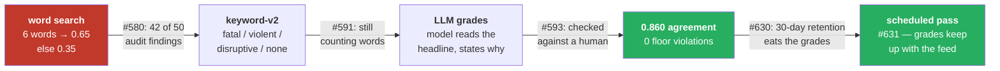
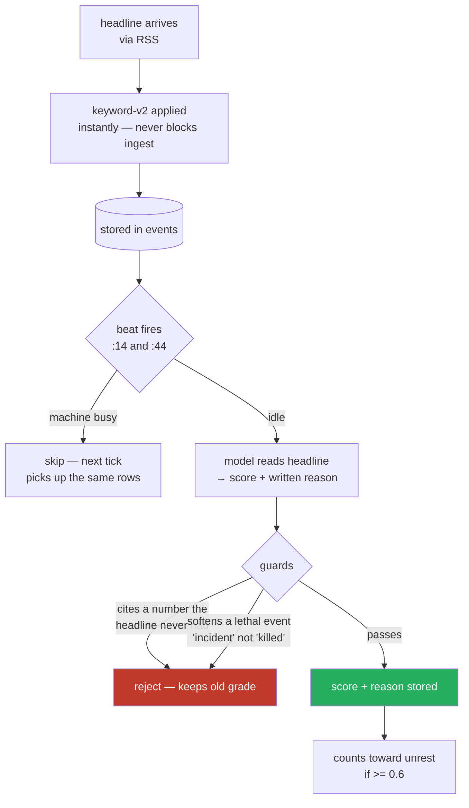

# How news severity gets graded

*What decides how bad a headline is, which model does it, why that model, and what was measured against the alternatives. Written for someone who has not read the issues.*

Last measured 2026-07-27.

---

## The one-paragraph version

Every news headline in the database carries a number from 0 to 1 saying how much harm it describes. That number feeds the country stress score, so if it is wrong the stress score is wrong. It used to be set by searching the headline for six words, which meant a pay strike and a massacre scored identically. It is now set by a small AI model running on the machine itself, which reads each headline and states in writing why it chose what it chose. That model is `qwen3.5:4b-q4_K_M`. It agrees with a human 86% of the time. Five smaller models were tested against the same human and none of them matched it.

---

## Why there is a number at all

`app/cii/scoring.py` builds a country stress index. One of its inputs is *unrest*: how many news events in this country crossed a harm threshold. It counts any headline scoring **0.6 or above**.

So the severity number is not decoration. It decides what counts as unrest, which moves a published score.

---

## How we got here

**The word search** returned 0.65 if the headline contained one of six words and 0.35 otherwise. `Workers strike over pay` and `50 killed in market bombing` scored the same. `crash` matched a car, a share index and an aircraft alike. That single function produced 42 of the 50 findings in the #580 source audit.

**keyword-v2** (#591) split the rule into fatal / violent / disruptive / nothing, which discriminates better and is still a word search. It survives as the fallback applied the instant a headline arrives, so a model outage can never stall ingestion.

**LLM grading** (#591, #593) replaced the judgement itself. The model reads the headline and returns a score *and a written reason*. The reason is the point: a number nobody can interrogate is the failure `app/severity/scale.py` exists to prevent.

**The scheduled pass** (#631) is what keeps it true. News is deleted after 30 days, so a one-off regrade decays to nothing — #597 graded 85 rows by hand and 30 survived to the following month. A beat now grades new headlines twice an hour, in-app, and backs off when the machine is busy.

---

## What runs in production

| | |
|---|---|
| **Model** | `qwen3.5:4b-q4_K_M` — 4 billion parameters, 3.4 GB, running locally via Ollama |
| **Where** | On the machine. Nothing is sent to any company's servers; no per-call cost |
| **Setting** | `settings.severity_model` |
| **Input** | The headline text, and nothing else. No article body, no summary |
| **Protocol** | Asks for a **number** 0–1 plus a one-sentence reason (`app/severity/news.py`) |
| **Schedule** | `severity-grade` beat, twice hourly, 50 headlines a batch (`app/severity/task.py`) |
| **Capacity** | ~2,400 headlines/day against ~1,400 arriving — it keeps up and then idles |

### The scale it grades on

| band | range | meaning |
|---|---|---|
| `routine` | 0.00–0.20 | policy, business, sport — nothing happened to anyone |
| `tension` | 0.20–0.40 | protest, strike, diplomatic rupture — no violence |
| `violence` | 0.40–0.60 | violence without confirmed death, or mass displacement |
| `grave` | 0.60–0.80 | confirmed deaths (1–9), or a serious armed attack |
| `mass_casualty` | 0.80–1.00 | 10+ dead, massacre, mass-fatality disaster |

Two rules the model may not go under, called **floors**: anyone confirmed killed is **at least 0.60**; ten or more killed is **at least 0.80**. A massacre cannot be scored as mild.

### What happens to each headline

**The guards exist because something already went wrong.** #514/#553 found 138 stored summaries citing figures their sources never contained. So a rationale mentioning a number absent from the headline is thrown away, and so is one that describes a lethal event with a vague word. A rejected verdict keeps whatever grade it already had — a known-mediocre number is never replaced by a suspect one.

---

## Why this model and not a smaller one

The honest answer is that smaller ones were tested and lost. Twice.

### Test 1 — five smaller models, same protocol (#646)

Each model graded the same 50 headlines a human had already graded by hand, through the unchanged prompt and unchanged guards.

| model | size | agrees with human | missed deaths | verdict |
|---|---:|---:|---:|---|
| **`qwen3.5:4b-q4_K_M`** | 3.4 GB | **0.860** | **0** | **in production** |
| `llama3.2:3b` | 2.0 GB | 0.760 | 0 | rejected |
| `phi4-mini` | 2.5 GB | 0.720 | 4 | rejected |
| `qwen3:1.7b` | 1.4 GB | 0.609 | 0 | rejected |
| `gemma3:1b` | 815 MB | 0.146 | 0 | rejected |
| `qwen2.5:1.5b-instruct` | 986 MB | 0.023 | 0 | rejected |

The bar: **zero missed deaths, and agreement no worse than the 0.860 already published.** Nothing cleared it.

Read the `0` in the missed-deaths column carefully. It looks like safety and is the opposite. The small models did not miss deaths because they scored **almost everything** as a death:

> `qwen2.5:1.5b` on a fusion-reactor story: `{"severity": 0.6, "rationale": "The headline mentions the development of 25 systems, which is a routine policy or business matter."}`

It says *routine* and scores **0.6**, which is the confirmed-deaths band. The classification is right; the number is unrelated to it. That is #580's pinning failure returning — a scale that says `grave` for a car modification discriminates as badly as the word rule it replaced.

### Test 2 — ask for the band's name instead of a number (#649)

If small models classify correctly in prose and then emit an unrelated float, then stop asking for a float. Ask for `routine`/`tension`/`violence`/`grave`/`mass_casualty` and map the label to a value in code, where it cannot be got wrong.

| model | number protocol | band protocol | missed deaths (number → band) |
|---|---:|---:|---:|
| `qwen3.5:4b-q4_K_M` | **0.860** | 0.760 | **0 → 4** |
| `llama3.2:3b` | 0.760 | 0.760 | 0 → 1 |
| `qwen3:1.7b` | 0.609 | 0.680 | 0 → 4 |
| `phi4-mini` | 0.720 | 0.653 | 4 → 4 |
| `qwen2.5:1.5b-instruct` | 0.023 | **0.562** | 0 → 2 |
| `gemma3:1b` | 0.146 | 0.184 | 0 → 4 |

**The idea worked on the model it was written about and broke the one in production.** `qwen2.5:1.5b` improved 24-fold on nothing but the change of question. The 4b lost a tenth of its agreement and missed every lethal headline in the sheet:

| headline | human said | model said |
|---|---|---|
| US Launches Attacks on Iran for Sixth Consecutive Night | `grave` | `tension` |
| US attacks Iran for 11th consecutive night | `grave` | `tension` |
| 'Five Star Chef' winner Dom Taylor dies at 44 | `grave` | **`routine`** |
| UK man charged with murder of ex-MP Ann Widdecombe | `grave` | `tension` |

Both prompts carry the same instruction. Numerically — *"the score is AT LEAST 0.60. Never lower"* — it is obeyed. Verbally — *"the band is AT LEAST grave. Never lower"* — it is not. **A numeric floor anchors this model in a way the word does not.** That is a fact about instruction-following, worth carrying anywhere else instructions are given in words.

The band protocol ships as a measured alternative (`bench --protocols band`). It is not the default and grades nothing in production.

---

## The limitation, stated plainly

**The human sheet contains four lethal headlines.**

Every missed-deaths figure quoted anywhere in this project — including the **0** in #593 that the whole gate rests on — is measured on a sample of four. It reads like a safety property and it is four coin flips.

Band agreement is sounder: it rests on all 50 rows. But the floor metric needs a stratified sample of lethal headlines before it is cited as evidence again. That is the most valuable open piece of work in this area, ahead of any further model or prompt experiment.

---

## What none of this claims

Making an input honest does not make the system predictive. The four pre-registered negative results in #573 stand untouched: the composite does not beat a coin flip at forecasting onset. Severity grading decides what "unrest" means; it does not decide whether unrest predicts anything.

---

## Re-measuring

Any change to the model **or** the prompt invalidates the published number, because that number describes one model reading one prompt. The contract is: re-measure first, publish the new figure, then change what runs.

| command | what it does |
|---|---|
| `make severity-audit` | emit a fresh 50-row sheet for a human to grade by hand |
| `make severity-agreement` | score the filled sheet → band agreement, missed deaths, error |
| `make severity-bench` | replay the graded sheet through candidate models |
| `make severity-bench --protocols number,band` | both protocols, read side by side |
| `make severity-grade` | grade ungraded rows by hand; the beat does this automatically |

Artifacts land in `data/exports/`.

---

## Where the code is

| file | what it holds |
|---|---|
| `app/severity/scale.py` | the bands, the floors, `Verdict` — which refuses to exist without a reason |
| `app/severity/news.py` | both prompts, both parsers, the shared guards, the keyword fallback |
| `app/severity/grade_run.py` | the manual/backlog pass |
| `app/severity/task.py` | the scheduled pass that keeps grades from decaying |
| `app/severity/audit.py` | emits the human sheet |
| `app/severity/agreement.py` | scores the filled sheet |
| `app/severity/bench.py` | replays the sheet through candidate models |
| `app/cii/scoring.py` | the consumer — counts `>= 0.6` as unrest |

## Issue trail

#580 (the audit that found the word rule) · #591 (the scale) · #593 (the human check) · #597 (the first full regrade) · #630 (the run log and the decay finding) · #631 (the scheduled pass) · #646 (the model bench) · #649 (the band protocol) · #573 (the negative results none of this changes)
